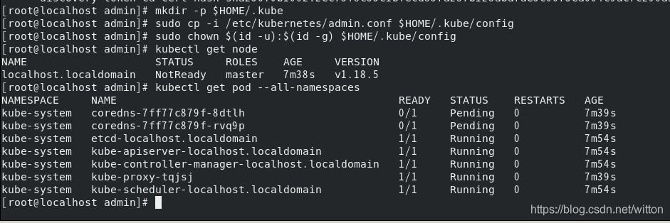
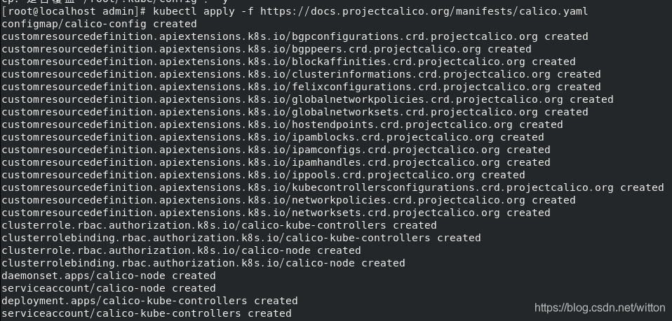

# K8s集群搭建


首先列出虚拟机的配置，安装搭建涉及到的所有版本，截至2021-05-22，为最新版本

一个main，两个node，配置如下

- 操作系统镜像
  CentOS Stream 8  - 4.18.0


- 容器 runtime 版本
  docker://20.10.6


- kubelet 版本
  v1.21.1


- kube-proxy 版本
  v1.21.1


- 操作系统

  linux

  

- 架构

  amd64


## 准备


### 关闭交换区

~~~shell
sudo sed -i 's/.*swap.*/#&/' /etc/fstab
~~~


### 禁用selinux

~~~shell
sudo sed -i "s/^SELINUX=enforcing/SELINUX=disabled/g" /etc/selinux/config
~~~


### 关闭防火墙

~~~shell
sudo systemctl stop firewalld.service
sudo systemctl disable firewalld.service
~~~


## 基本安装

由于是CentOS Stream 8，这里用7也无妨

~~~shell
[kubernetes]
name=Kubernetes
baseurl=https://mirrors.aliyun.com/kubernetes/yum/repos/kubernetes-el7-x86_64/
enabled=1
gpgcheck=1
repo_gpgcheck=1
gpgkey=https://mirrors.aliyun.com/kubernetes/yum/doc/yum-key.gpg https://mirrors.aliyun.com/kubernetes/yum/doc/rpm-package-key.gpg
~~~

安装docker，kubectl、kubelet、kubeadm

~~~shell
sudo yum install -y kubectl kubelet kubeadm
sudo systemctl enable kubelet
sudo systemctl start kubelet
~~~


## 搭建过程

注意，严格按照次序，无直接指出均为对 main 节点的单独操作

按照流程一般可以成功，出现问题百度


### 初始化

~~~shell
kubeadm init --apiserver-advertise-address=192.168.43.205 --image-repository registry.cn-hangzhou.aliyuncs.com/google_containers  --service-cidr=10.1.0.0/16 --pod-network-cidr=10.244.0.0/16  --kubernetes-version=v1.21.0
~~~


此时界面会出现一些列提示命令，注意kubeadm join 这条，后续node节点用该命令加入main节点


~~~shell
mkdir -p $HOME/.kube
sudo cp -i /etc/kubernetes/admin.conf $HOME/.kube/config
sudo chown $(id -u):$(id -g) $HOME/.kube/config
~~~


~~~shell
kubectl get node
kubectl get pod --all-namespaces
~~~





node节点为NotReady，因为coredns pod没有启动，缺少网络pod


### 安装calico网络

~~~shell
kubectl apply -f https://docs.projectcalico.org/manifests/calico.yaml
~~~




### 安装kubernetes-dashboard

~~~shell
wget https://raw.githubusercontent.com/kubernetes/dashboard/master/aio/deploy/recommended.yaml
~~~


添加如下的配置

~~~shell
kind: Service
apiVersion: v1
metadata:
  labels:
    k8s-app: kubernetes-dashboard
  name: kubernetes-dashboard
  namespace: kubernetes-dashboard
spec:
  type: NodePort #添加这行
  ports:
    - port: 443
      targetPort: 8443
      nodePort: 30000    #添加这行
  selector:
    k8s-app: kubernetes-dashboard
~~~


然后创建POD，并查看kubernetes-dashboard

~~~shell
kubectl create -f recommended.yaml
kubectl get svc -n kubernetes-dashboard
~~~


此时直接访问https://ip:30000/#/login，其中的IP是本机的IP。


### 登录

这里使用Token登录


### 创建token

```bash
kubectl create sa dashboard-admin -n kube-system
```


### 授权token 访问权限

```bash
kubectl create clusterrolebinding dashboard-admin --clusterrole=cluster-admin --serviceaccount=kube-system:dashboard-admin
```


###  获取token

~~~bash
ADMIN_SECRET=$(kubectl get secrets -n kube-system | grep dashboard-admin | awk '{print $1}')
DASHBOARD_LOGIN_TOKEN=$(kubectl describe secret -n kube-system ${ADMIN_SECRET} | grep -E '^token' | awk '{print $2}')
echo ${DASHBOARD_LOGIN_TOKEN}
~~~


## 常用Token命令：

- 查看Token

```bash
kubeadm token list
```

- 创建Token

```bash
kubeadm token create
```

- 删除 Token

```bash
kubeadm token delete TokenXXX
```

- 初始化master节点时，node节点加入集群命令

```bash
kubeadm token create --print-join-command
```

或者：

```bash
token=$(kubeadm token generate)
kubeadm token create $token --print-join-command --ttl=0
```


## 可能出现的问题

重启解决

~~~bash
kubeadm reset
systemctl restart kubelet
~~~


注意重启一定要删除

~~~bash
rm -rf $HOME/.kube
~~~


kubectl get pods错误

~~~bash
echo "export KUBECONFIG=/etc/kubernetes/admin.conf" >> ~/.bash_profile
source ~/.bash_profile
~~~

