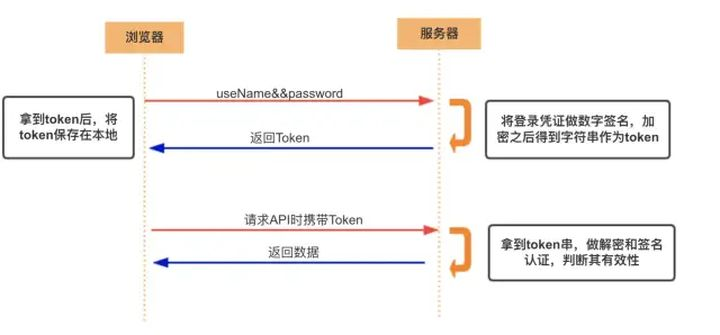

# Cookie，Session和Token

[TOC]

## Cookie

Cookie 是服务器发送到用户浏览器并**保存在本地**的一小块数据（key-value格式）。cookie由服务器生成，发送给浏览器，它会在浏览器之后向同一服务器再次发起请求时被携带上，用于告知服务端两个请求是否来自同一浏览器。浏览器把cookie以kv形式保存到某个目录下的文本文件内，下一次请求同一网站时会把该cookie发送给服务器。由于cookie是存在客户端上的，所以浏览器加入了一些限制确保cookie不会被恶意使用，同时不会占据太多磁盘空间，所以每个域的cookie数量是有限的。

**cookie 是不可跨域的：** 每个 cookie 都会绑定单一的域名，无法在别的域名下获取使用，**一级域名和二级域名之间是允许共享使用的**（**靠的是 domain）**。

### cookie属性

Domain 标识指定了哪些主机可以接受 Cookie。如果不指定，默认为当前文档的主机（不包含子域名）。如果指定了 Domain，则一般包含子域名。例如，如果设置 Domain=mozilla.org，则 Cookie 也包含在子域名中（如 developer.mozilla.org）。

Path 标识指定了主机下的哪些路径可以接受 Cookie（该 URL 路径必须存在于请求 URL 中）。以字符 %x2F ("/") 作为路径分隔符，子路径也会被匹配。例如，设置 Path=/docs，则以下地址都会匹配：

- /docs
- /docs/Web/
- /docs/Web/HTTP

### 问题

- 因为存储在客户端，容易被客户端篡改，使用前需要验证合法性
- 不要存储敏感数据，比如用户密码，账户余额
- 使用 httpOnly 在一定程度上提高安全性
- 尽量减少 cookie 的体积，能存储的数据量不能超过 4kb
- 设置正确的 domain 和 path，减少数据传输
- **cookie 无法跨域**
- 一个浏览器针对一个网站最多存 20 个Cookie，浏览器一般只允许存放 300 个Cookie
- **移动端对 cookie 的支持不是很好，而 session 需要基于 cookie 实现，所以移动端常用的是 token**

## Session

- **session 是另一种记录服务器和客户端会话状态的机制**
- **session 是基于 cookie 实现的，session 存储在服务器端，sessionId 会被存储到客户端的cookie 中**

**Session 认证流程：**

- 用户第一次请求服务器的时候，服务器根据用户提交的相关信息，创建对应的 Session
- 请求返回时将此 Session 的唯一标识信息 SessionID 返回给浏览器
- 浏览器接收到服务器返回的 SessionID 信息后，会将此信息存入到 Cookie 中，同时 Cookie 记录此 SessionID 属于哪个域名
- 当用户第二次访问服务器的时候，请求会自动判断此域名下是否存在 Cookie 信息，如果存在自动将 Cookie 信息也发送给服务端，服务端会**从 Cookie 中获取 SessionID**，再根据 SessionID 查找对应的 Session 信息，如果没有找到说明用户没有登录或者登录失效，如果找到 Session 证明用户已经登录可执行后面操作。

**Session 维护用户登录状态流程**：

- 用户进行登录时，用户提交包含用户名和密码的表单，放入 HTTP 请求报文中；
- 服务器验证该用户名和密码，如果正确则把用户信息存储到 Redis 中，它在 Redis 中的 Key 称为 Session ID；
- 服务器返回的响应报文的 Set-Cookie 首部字段包含了这个 Session ID，客户端收到响应报文之后将该 Cookie 值存入浏览器中；
- 客户端之后对同一个服务器进行请求时会包含该 Cookie 值，服务器收到之后提取出 Session ID，从 Redis 中取出用户信息，继续之前的业务操作。

**SessionID 是连接 Cookie 和 Session 的一道桥梁**

### 问题

- 将 session 存储在服务器里面，当用户同时在线量比较多时，这些 session 会占据较多的内存，需要在服务端定期的去清理过期的 session
- 当网站采用**集群部署**的时候，会遇到多台 web 服务器之间如何做 session 共享的问题。因为 session 是由单个服务器创建的，但是处理用户请求的服务器不一定是那个创建 session 的服务器，那么该服务器就无法拿到之前已经放入到 session 中的登录凭证之类的信息了。
- 当多个应用要共享 session 时，除了以上问题，还会遇到跨域问题，因为不同的应用可能部署的主机不一样，需要在各个应用做好 cookie 跨域的处理。
- **sessionId 是存储在 cookie 中的，假如浏览器禁止 cookie 或不支持 cookie 怎么办？** 一般会把 sessionId 跟在 url 参数后面即重写 url，所以 session 不一定非得需要靠 cookie 实现
- **移动端对 cookie 的支持不是很好，而 session 需要基于 cookie 实现，所以移动端常用的是 token**

## Token

### Acesss Token

**访问资源接口（API）时所需要的资源凭证**

**简单 token 的组成：** uid(用户唯一的身份标识)、time(当前时间的时间戳)、sign（签名，token 的前几位以哈希算法压缩成的一定长度的十六进制字符串）

**特点：**

- **服务端无状态化、可扩展性好**
- **支持移动端设备**
- 安全
- 支持跨程序调用

**token 的身份验证流程：**

客户端使用用户名跟密码请求登录

服务端收到请求，去验证用户名与密码

验证成功后，服务端会签发一个 token 并把这个 token 发送给客户端

客户端收到 token 以后，会把它存储起来，比如放在 cookie 里或者 localStorage 里

客户端每次向服务端请求资源的时候**需要带着服务端签发的 token**

服务端收到请求，然后去验证客户端请求里面带着的 token ，如果验证成功，就向客户端返回请求的数据

**每一次请求都需要携带 token，需要把 token 放到 HTTP 的 Header 里**

**基于 token 的用户认证是一种服务端无状态的认证方式，服务端不用存放 token 数据。用解析 token 的计算时间换取 session 的存储空间，从而减轻服务器的压力，减少频繁的查询数据库**

**token 完全由应用管理，所以它可以避开同源策略**

### Refresh Token

- 另外一种 token——refresh token
- refresh token 是专用于刷新 access token 的 token。如果没有 refresh token，也可以刷新 access token，但每次刷新都要用户输入登录用户名与密码，会很麻烦。有了 refresh token，可以减少这个麻烦，客户端直接用 refresh token 去更新 access token，无需用户进行额外的操作。

- Access Token 的有效期比较短，当 Acesss Token 由于过期而失效时，使用 Refresh Token 就可以获取到新的 Token，如果 Refresh Token 也失效了，用户就只能重新登录了。
- Refresh Token 及过期时间是存储在服务器的数据库中，只有在申请新的 Acesss Token 时才会验证，不会对业务接口响应时间造成影响，也不需要向 Session 一样一直保持在内存中以应对大量的请求。

### 问题

- 如果你认为用数据库来存储 token 会导致查询时间太长，可以选择放在内存当中。比如 redis 很适合你对 token 查询的需求。
- **token 完全由应用管理，所以它可以避开同源策略**
- **token 可以避免 CSRF 攻击(因为不需要 cookie 了)**
- **移动端对 cookie 的支持不是很好，而 session 需要基于 cookie 实现，所以移动端常用的是 token**

## Cookie和Session的区别

- **安全性：** Session 比 Cookie 安全，Session 是存储在服务器端的，Cookie 是存储在客户端的。
- **存取值的类型不同**：Cookie 只支持存字符串数据，想要设置其他类型的数据，需要将其转换成字符串，Session 可以存任意数据类型。
- **有效期不同：** Cookie 可设置为长时间保持，比如我们经常使用的默认登录功能，Session 一般失效时间较短，客户端关闭（默认情况下）或者 Session 超时都会失效。
- **存储大小不同：** 单个 Cookie 保存的数据不能超过 4K，Session 可存储数据远高于 Cookie，但是当访问量过多，会占用过多的服务器资源。

### 选择

- Cookie 只能存储 ASCII 码字符串，而 Session 则可以存储任何类型的数据，因此在考虑数据复杂性时首选 Session；
- Cookie 存储在浏览器中，容易被恶意查看。如果非要将一些隐私数据存在 Cookie 中，可以将 Cookie 值进行加密，然后在服务器进行解密；
- 对于大型网站，如果用户所有的信息都存储在 Session 中，那么开销是非常大的，因此不建议将所有的用户信息都存储到 Session 中。

## Session和Token的区别

Session 是一种**记录服务器和客户端会话状态的机制，使服务端有状态化，可以记录会话信息**。

而 Token 是**令牌**，**访问资源接口（API）时所需要的资源凭证**。Token **使服务端无状态化，不会存储会话信息。**

Session 和 Token 并不矛盾，作为身份认证 Token 安全性比 Session 好，因为每一个请求都有签名还能防止监听以及重放攻击，而 Session 就必须依赖链路层来保障通讯安全了。**如果你需要实现有状态的会话，仍然可以增加 Session 来在服务器端保存一些状态。**

所谓 Session 认证只是简单的把 User 信息存储到 Session 里，因为 SessionID 的不可预测性，暂且认为是安全的。而 Token ，如果指的是 OAuth Token 或类似的机制的话，提供的是 认证 和 授权 ，认证是针对用户，授权是针对 App 。其目的是让某 App 有权利访问某用户的信息。这里的 Token 是唯一的。不可以转移到其它 App上，也不可以转到其它用户上。Session 只提供一种简单的认证，即只要有此 SessionID ，即认为有此 User 的全部权利。是需要严格保密的，这个数据应该只保存在站方，不应该共享给其它网站或者第三方 App。所以简单来说：**如果用户数据可能需要和第三方共享，或者允许第三方调用 API 接口，用 Token 。如果永远只是自己的网站，自己的 App，用什么就无所谓了。**