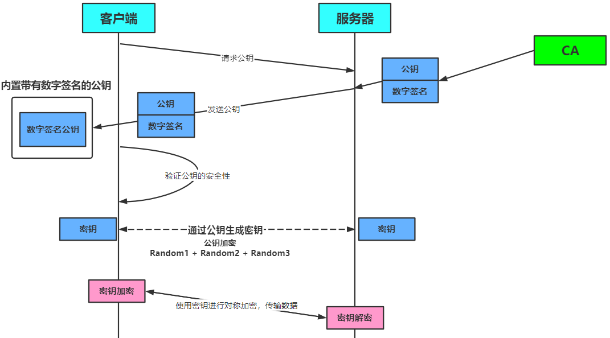
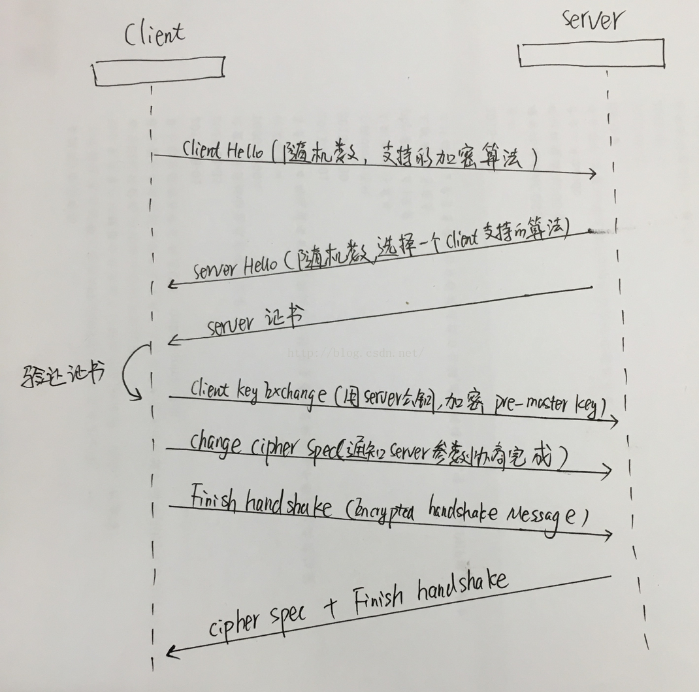

# Https详解

[TOC]

|              HTTP              |                  HTTPS                   |
| :----------------------------: | :--------------------------------------: |
|           默认端口80           |           HTTPS默认使用端口443           |
| 明文传输、数据未加密、安全性差 |       传输过程ssl加密、安全性较好        |
|     响应速度快、消耗资源少     | 响应速度较慢、消耗资源多、需要用到CA证书 |

## HTTPS链接建立的过程：

> 一个HTTPS请求实际上包含了两次HTTP传输

 1.首先客户端先给服务器发送一个HTTPS请求，连接到443端口

 2.服务器发送一个SSL证书给客户端，内容包括：证书的发布机构、有效期、所有者、签名以及公钥

 3.客户端对发来的公钥进行真伪校验，校验为真则使用公钥对对称加密算法以及对称密钥进行加密

 4.服务器端使用私钥进行解密并使用对称密钥加密确认信息发送给客户端

 5.随后客户端和服务端就使用对称密钥进行信息传输

 **对称加密算法：**

 密钥只有一个，加密解密为同一个密码，且加解密速度快，典型的对称加密算法有DES、AES等；

这种方式存在的最大问题就是密钥发送问题，即如何安全地将密钥发给对方,对称加密所使用的密钥我们可以通过非对称加密的方式发送出去。

 **非对称加密算法：**

密钥成对出现（且根据公钥无法推知私钥，根据私钥也无法推知公钥），加密解密使用不同密钥（公钥加密需要私钥解密，私钥加密需要公钥解密），相对对称加密速度较慢，典型的非对称加密算法有RSA、DSA等。

## Https加密方式

1. 浏览器使用Https的URL访问服务器，建立SSL链接。

2. 服务器收到SSL链接，发送非对称加密的公钥A返回给浏览器

3. 浏览器生成随机数，作为对称加密的密钥B

4. 浏览器使用公钥A，对自己生成的密钥B进行加密，得到密钥C

5. 浏览器将密钥C，发送给服务器。

6. 服务器用私钥D对接受的密钥C进行解密，得到对称加密钥B。

7. 浏览器和服务器之间可以用密钥B作为对称加密密钥进行通信。

这样浏览器和服务器就共享一个对称加密密钥B，重要的是不会被拦截到。只在传输密钥B的时候进行了一次非对称加密，之后就用对称加密进行传送数据。

## SSL握手过程

