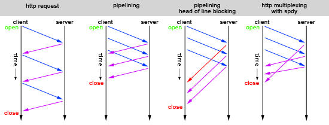
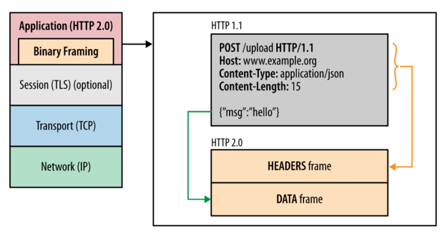

# Http演变

[TOC]

|                |           HTTP1.0           |                HTTP1.1                 | HTTP2.0  |
| :------------: | :-------------------------: | :------------------------------------: | :------: |
|     Host头     |              ✗              |                   ✔                    |    ✔     |
|    Range头     |              ✗              |                   ✔                    |    ✔     |
|     长连接     |              ✗              |                   ✔                    |    ✔     |
| request method |        GET HEAD POST        | 以上+ OPTIONS PUT DELETE TRACE CONNECT | 以上全部 |
|     cache      | Expire Last-Modefied Pragma |        以上+ETag Cache-Control         | 以上全部 |
|   header压缩   |              ✗              |                   ✗                    |    ✔     |
|    多路复用    |              ✗              |                   ✗                    |    ✔     |
|   服务器推送   |              ✗              |                   ✗                    |    ✔     |

## Http1.0

默认使用短链接，CS之间每进行一次Http操作，就建立一次TCP连接，任务结束就中断连接，服务器不跟踪每个客户也不记录过去的请求。

每个TCP连接只能发送一个请求，发送数据完毕，连接就关闭，解决此问题在请求时用一个非标准的Connection字段：Connection: keep-alive，但是，这不是标准字段，不同实现的行为可能不一致，因此不是根本的解决办法。

## 1.0问题

最大的问题是 **连接无法复用** 和 **队列头阻塞**

 **HTTP1.0：**服务器处理完成后立即断开TCP连接（**无连接**），服务器不跟踪每个客户端也不记录过去的请求（**无状态**）

### 队列头阻塞

- 图中第一种请求方式，就是单次发送request请求，收到response后再进行下一次请求，显示是很低效的。
- 于是http1.1提出了**管线化(pipelining)技术**，就是如图中第二中请求方式，**一次性发送多个request**请求。
- 然而pipelining在接收response返回时，也必须依顺序接收，如果前一个请求遇到了阻塞，后面的请求即使已经处理完毕了，仍然需要等待阻塞的请求处理完毕。这种情况就如图中第三种，第一个请求阻塞后，**后面的请求都需要等待**，这也就是队头阻塞(Head of line blocking)。
- 为了解决上述阻塞问题，http2中提出了**多路复用**(Multiplexing)技术，Multiplexing是通信和计算机网络领域的专业名词。http2中**将多个请求复用同一个tcp链接中**，将一个TCP连接分为若干个流（Stream），每个流中可以传输若干消息（Message），每个消息由若干最小的二进制帧（Frame）组成。也就是将每个request-response拆分为了细小的二进制帧Frame，这样即使一个请求被阻塞了，也不会影响其他请求，如图中第四种情况所示。

## Http1.1

 **HTTP1.1**：KeepAlived长连接避免了连接建立和释放的开销；通过Content-Length来判断当前请求数据是否已经全部接受（**有状态**）

HTTP 1.1支持长连接（PersistentConnection）和请求的流水线（Pipelining）处理

1.1中支持持久连接（1.1默认使用带流水线的持久连接），在**一个TCP连接上可以传送多个http请求和响应**，减少了建立和关闭连接的消耗和延迟

同时允许客户端**不用等待上一次请求结果返回，就可以发出下一次请求**，但是服务器必须按照**接受客户端请求的先后顺序**依次回送响应结果

cs端都是默认对方支持**长连接**，可以配置后台服务器的长连接的时间，超时无内容传输才会断开连接，从而，在一定时间内的浏览器的请求可以使用同一个TCP连接或者几个TCP连接，减少了握手带来的时间损耗

### 缺点

1.1仍然会存在队列头阻塞问题

### 1.1与1.0区别

1、缓存处理：1.1添加更多的缓存控制策略（如：Entity tag，If-Match）

2、网络连接的优化：1.1支持断点续传 

3、错误状态码的增多：1.1新增了24个错误状态响应码，丰富的错误码更加明确各个状态 

4、Host头处理：支持Host头域，不在以IP为请求方标志

5、**长连接**：减少了建立和关闭连接的消耗和延迟。

## Http2.0

HTTP2.0使用了多路复用的技术，做到同一个连接并发处理多个请求，而且并发请求的数量比HTTP1.1大了好几个数量级。

以chrome为例，每个页面，浏览器最多允许建立6个TCP连接，发起请求->服务端处理->响应请求 这样算是完成了一个浏览器请求。但是如果一个页面同时发起几百个请求，其中前几个请求又比较耗时，则会把这6个TCP连接全部占用，同时阻塞了后面的请求，这样整体请求都会慢下来了。

HTTP2采用多路复用是指，在同一个域名下，开启一个TCP的connection，每个请求以stream的方式传输，每个stream有唯一标识，connection一旦建立，后续的请求都可以复用这个connection并且可以同时发送，server端可以根据stream的唯一标识来相应对应的请求。这样上面请求阻塞的问题就可以得到解决。

2.0中非常重要的概念就是 **帧（frame） 和 流 （stream）**

帧是最小的数据单位，每个帧会标识出该帧属于哪个流，流是多个帧组成的数据流。
所谓多路复用，即在一个TCP连接中存在多个流，即可以同时发送多个请求，对端可以通过帧中的表示知道该帧属于哪个请求。在客户端，这些帧乱序发送，到对端后再根据每个帧首部的流标识符重新组装。通过该技术，可以避免HTTP旧版本的队头阻塞问题，极大提高传输性能

### 2.0与1.x区别

- 2.0采用二进制格式传输数据，而非1.x的文本格式

- 2.0对消息头采用 HPACK进行压缩传输，能够节省消息头占用的网络流量，而1.x每次请求，都会携带大量冗余头信息，浪费了很多带宽资源

- 多路复用，1.x虽然通过 pipline 也能并发请求，但是多个请求之间的响应会被阻塞，2.0真正做到了并发请求，同时，流还支持优先级和流量控制

- 二进制分帧，2.0在应用层和传输层（TCP，UDP）之间增加一个二进制分帧层，在不改变1.x的语义情况下，解决1.1的性能限制，2.0会将所有传输的信息分割为更小的消息和帧，并对它们采用二进制格式的编码，其中 1.x 的首部信息会被封装到 HEADER frame，而相应的 Request Body 则封装到 DATA frame 里面

- 2.0通信都在一个连接上完成，这个连接可以承载任意数量的双向数据流。

- 服务端推送（Server Push）

- 安全性加强