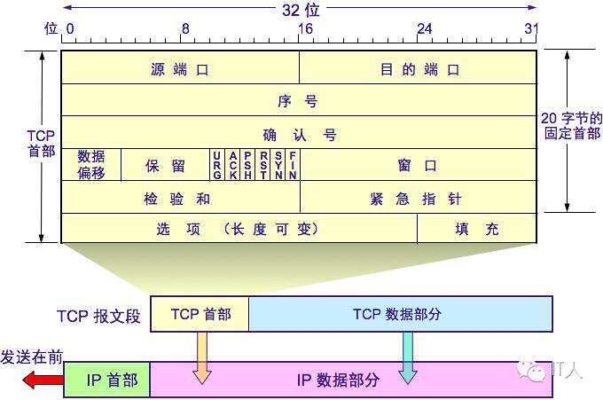
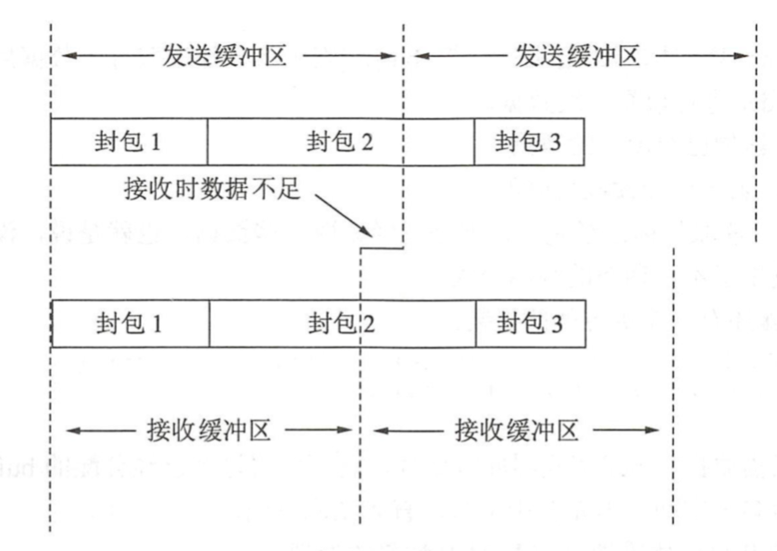

# TCP/UDP

[TOC]

## 区别

| 特点                       | 类型 | 性能                   | 应用场景       | 首部字节 |
| :------------------------: | ---- | :--------------------: | :--------------: | -------- |
| 面向连接、可靠、面向字节流   | TCP  | 传输效率慢、所需资源多 | 文件、邮件传输   | 20-60    |
| 无连接、不可靠、面向数据报文段 | UDP  | 传输效率快、所需资源少 | 语音、视频、直播 | 8个字节  |

 **基于TCP的协议：**HTTP、FTP、SMTP

 **基于UDP的协议：**RIP、DNS、SNMP

---

TCP与UDP区别总结：
1、TCP面向连接（如打电话要先拨号建立连接）;UDP是无连接的，即发送数据之前不需要建立连接
2、TCP提供可靠的服务。也就是说，通过TCP连接传送的数据，无差错，不丢失，不重复，且按序到达;UDP尽最大努力交付，即不保  证可靠交付
3、TCP面向字节流，实际上是TCP把数据看成一连串无结构的字节流;UDP是面向报文的
 UDP没有拥塞控制，因此网络出现拥塞不会使源主机的发送速率降低（对实时应用很有用，如IP电话，实时视频会议等）
4、每一条TCP连接只能是点到点的;UDP支持一对一，一对多，多对一和多对多的交互通信
5、TCP首部开销20字节;UDP的首部开销小，只有8个字节
6、TCP的逻辑通信信道是全双工的可靠信道，UDP则是不可靠信道

> TCP比UDP慢多少
>
> -> 少了三次握手和四次挥手的连接，首部长度也小12字节

## TCP拥塞控制

拥塞控制就是为了防止过多的数据注入到网络中，这样就可以使网络中的路由器或链路不致过载。拥塞控制是一个全局性的过程，涉及到所有的主机，所有的路由器，以及与降低网络传输性能有关的所有因素。相反，流量控制往往是点对点通信量的控制，是个端到端的问题。流量控制所要做到的就是抑制发送端发送数据的速率，以便使接收端来得及接收。若**出现拥塞而不进行控制**，整个网络的**吞吐量将随输入负荷的增大而下降**。

**四种拥塞控制算法：慢开始、拥塞避免、快重传、快恢复**

## TCP粘包

发送方发送的若干包数据到接收方接收时粘成一包

### 原因

**发送方原因** ： TCP默认使用Nagle算法（主要作用：减少网络中报文段的数量）：

 收集多个**小分组**，在一个确认到来时**一起发送**、导致发送方可能会出现粘包问题

**接收方原因**：  TCP将接收到的数据包保存在接收缓存里，如果TCP接收数据包到缓存的速度大于应用程序从缓存中读取数据包的速度，多个包就会被缓存，应用程序就有可能读取到**多个首尾相接粘到一起的包**。

### 解决

**不是所有的粘包现象都需要处理**，若传输的数据为不带结构的连续流数据（如文件传输），则不必把粘连的包分开（简称分包）。但在实际工程应用中，传输的数据一般为带结构的数据，这时就需要做分包处理。分包一般难度较大,所以尽量避免粘包

最本质原因在与接收对等方无法分辨消息与消息之间的边界在哪，通过使用某种方案给出边界，例如：

- **发送定长包**。每个消息的大小都是一样的，接收方只要累计接收数据，直到数据等于一个定长的数值就将它作为一个消息。
- **包尾加上\r\n标记**。FTP协议正是这么做的。但问题在于如果数据正文中也含有\r\n，则会误判为消息的边界。
- **包头加上包体长度**。包头是定长的4个字节，说明了包体的长度。接收对等方先接收包体长度，依据包体长度来接收包体。

## 长连接与短连接

 长连接，指在一个TCP连接上可以连续发送多个数据包，在TCP连接保持期间，如果没有数据包发送，需要双方发检测包以维持此连接，一般需要自己做在线维持，此种方式常用于P2P通信  **连接→数据传输→保持连接(心跳)→数据传输→保持连接(心跳)→……→关闭连接** 

短连接是指通信双方有数据交互时，就建立一个TCP连接，数据发送完成后，则断开此TCP连接 **连接→数据传输→关闭连接**

