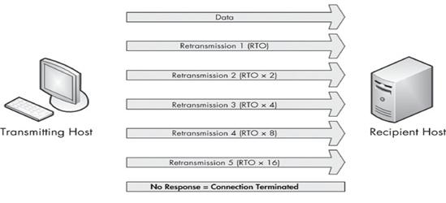
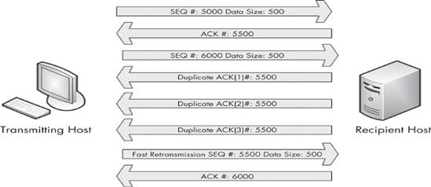

# TCP/UDP

[TOC]

## 区别

| 特点                       | 类型 | 性能                   | 应用场景       | 首部字节 |
| :------------------------: | ---- | :--------------------: | :--------------: | -------- |
| 面向连接、可靠、面向字节流   | TCP  | 传输效率慢、所需资源多 | 文件、邮件传输   | 20-60    |
| 无连接、不可靠、面向数据报文段 | UDP  | 传输效率快、所需资源少 | 语音、视频、直播 | 8个字节  |

 **基于TCP的协议：**HTTP、FTP、SMTP

 **基于UDP的协议：**RIP、DNS、SNMP

---

TCP与UDP区别总结：
1、TCP面向连接（如打电话要先拨号建立连接）;UDP是无连接的，即发送数据之前不需要建立连接
2、TCP提供可靠的服务。也就是说，通过TCP连接传送的数据，无差错，不丢失，不重复，且按序到达;UDP尽最大努力交付，即不保  证可靠交付
3、TCP面向**字节流**，实际上是TCP把数据看成一连串无结构的字节流;UDP是面向**报文**的
 UDP没有拥塞控制，因此网络出现拥塞不会使源主机的发送速率降低（对实时应用很有用，如IP电话，实时视频会议等）
4、每一条TCP连接**只能是点到点的**;UDP支持一对一，一对多，多对一和多对多的交互通信
5、**TCP首部开销20字节;UDP的首部开销小，只有8个字节**
6、TCP的逻辑通信信道是全双工的可靠信道，UDP则是不可靠信道

> TCP比UDP慢多少
>
> -> 少了三次握手和四次挥手的连接，首部长度也小12字节

## TCP拥塞控制

拥塞控制就是为了防止过多的数据注入到网络中，这样就可以使网络中的路由器或链路不致过载。拥塞控制是一个全局性的过程，涉及到所有的主机，所有的路由器，以及与降低网络传输性能有关的所有因素。相反，流量控制往往是点对点通信量的控制，是个端到端的问题。流量控制所要做到的就是抑制发送端发送数据的速率，以便使接收端来得及接收。若**出现拥塞而不进行控制**，整个网络的**吞吐量将随输入负荷的增大而下降**。

**四种拥塞控制算法：慢开始、拥塞避免、快重传、快恢复**

## TCP流量控制

双方在通信的时候，发送方的速率与接收方的速率是不一定相等，如果发送方的发送速率太快，会导致接收方处理不过来，这时候接收方只能把处理不过来的数据存在缓存区里（失序的数据包也会被存放在缓存区里）。

如果缓存区满了发送方还在疯狂着发送数据，接收方只能把收到的数据包丢掉，大量的丢包会极大着浪费网络资源，因此，我们需要控制发送方的发送速率，让接收方与发送方处于一种动态平衡才好。

**滑动窗口(Sliding window )**是一种流量控制技术。

## TCP重传机制

报文重传是TCP最基本的错误恢复功能，它的目的是防止报文丢失。
　　报文丢失的可能因素有很多种，包括应用故障，路由设备过载，或暂时的服务宕机。报文级别速度是很高的，而通常报文丢失是暂时的，因此TCP能够发现和恢复报文丢失显得尤为重要。

　　重传机制在实现数据可靠传输功能的同时，也引起了相应的性能问题：何时进行数据重传？如何保证较高的传输效率？
　　重传时间过短：在网络因为拥塞引起丢包时，频繁的重传会进一步加剧网络拥塞，引起丢包，恶化网络传输性能。
　　重传时间过长：接收方长时间无法完成数据接收，引起长时间占用连接线路造成资源损耗、传输效率较低等问题。
　　针对上述问题，TCP中设计了超时重传机制。该机制规定当发送方A向B发送数据包P1时，开启时长为RTO（Retransmission Timeout）的重传定时器，如果A在RTO内未收到B对P1的确认报文，则认为P1在网络中丢失，此时重新发送P1。由此，引出RTO大小的设定问题。

　　决定报文是否有必要重传的主要机制是重传计时器（retransmission timer），它的主要功能是维护重传超时（RTO）值。当报文使用TCP传输时，重传计时器启动，收到ACK时计时器停止。报文发送至接收到ACK的时间称为往返时间（RTT）。对若干次时间取平均值，该值用于确定最终RTO值。在最终RTO值确定之前，确定每一次报文传输是否有丢包发生使用重传计时器，下图说明了TCP重传过程。

当报文发送之后，但接收方尚未发送TCP ACK报文，发送方假设源报文丢失并将其重传。重传之后，RTO值加倍；如果在2倍RTO值到达之前还是没有收到ACK报文，就再次重传。如果仍然没有收到ACK，那么RTO值再次加倍。如此持续下去，每次重传RTO都翻倍，直到收到ACK报文或发送方达到配置的最大重传次数。
　　最大重传次数取决于发送操作系统的配置值。默认情况下，Windows主机默认重传5次。大多数Linux系统默认最大15次。两种操作系统都可配置。

**1）超时重传**
　　超时重传机制用来保证TCP传输的可靠性。每次发送数据包时，发送的数据报都有seq号，接收端收到数据后，会回复ack进行确认，表示某一seq号数据已经收到。发送方在发送了某个seq包后，等待一段时间，如果没有收到对应的ack回复，就会认为报文丢失，会重传这个数据包。
**2）快速重传**
　　接受数据一方发现有数据包丢掉了（并不是所期望的值。这意味着报文在传送中丢失。接收端注意到报文乱序，并且在第三个报文中发送重复ACK）。就会发送重复ACK报文告诉发送端重传丢失的报文。
　　当重传主机从发送端接收到3个重复ACK时，它会假设此报文确实在传送中丢失，并且立即发送一个快速重传。一旦触发了快速重传，所有正在传输的其他报文都被放入队列中，直到快速重传报文发送为止。过程如下图所示：

　　比较超时重传和快速重传，可以发现超时重传是发送端在傻等超时，然后触发重传；而快速重传则是接收端主动告诉发送端数据没收到，然后触发发送端重传。
　　由此可看出，快速重传机制在一定程度上弥补了超时重传机制，使得重传更加及时。

## TCP粘包

发送方发送的若干包数据到接收方接收时粘成一包

### 原因

**发送方原因** ： TCP默认使用Nagle算法（主要作用：减少网络中报文段的数量）：

 收集多个**小分组**，在一个确认到来时**一起发送**、导致发送方可能会出现粘包问题

**接收方原因**：  TCP将接收到的数据包保存在接收缓存里，如果TCP接收数据包到缓存的速度大于应用程序从缓存中读取数据包的速度，**多个包就会被缓存**，应用程序就有可能读取到**多个首尾相接粘到一起的包**。

### 解决

**不是所有的粘包现象都需要处理**，若传输的数据为不带结构的连续流数据（如文件传输），则不必把粘连的包分开（简称分包）。但在实际工程应用中，传输的数据一般为带结构的数据，这时就需要做分包处理。分包一般难度较大,所以尽量避免粘包

最本质原因在与接收对等方无法分辨消息与消息之间的边界在哪，通过使用某种方案给出边界，例如：

- **发送定长包**。每个消息的大小都是一样的，接收方只要累计接收数据，直到数据等于一个定长的数值就将它作为一个消息。
- **包尾加上\r\n标记**。FTP协议正是这么做的。但问题在于如果数据正文中也含有\r\n，则会误判为消息的边界。
- **包头加上包体长度**。包头是定长的4个字节，说明了包体的长度。接收对等方先接收包体长度，依据包体长度来接收包体。

## 长连接与短连接

 长连接，指在一个TCP连接上可以连续发送多个数据包，在TCP连接保持期间，如果没有数据包发送，需要双方发检测包以维持此连接，一般需要自己做在线维持，此种方式常用于P2P通信  **连接→数据传输→保持连接(心跳)→数据传输→保持连接(心跳)→……→关闭连接** 

短连接是指通信双方有数据交互时，就建立一个TCP连接，数据发送完成后，则断开此TCP连接 **连接→数据传输→关闭连接**

