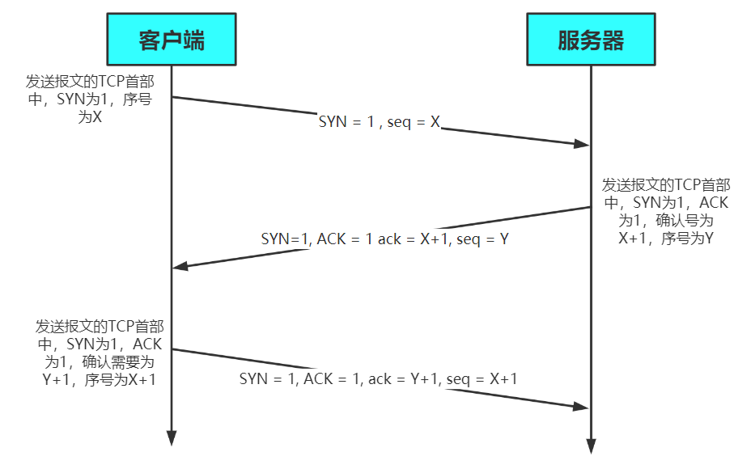
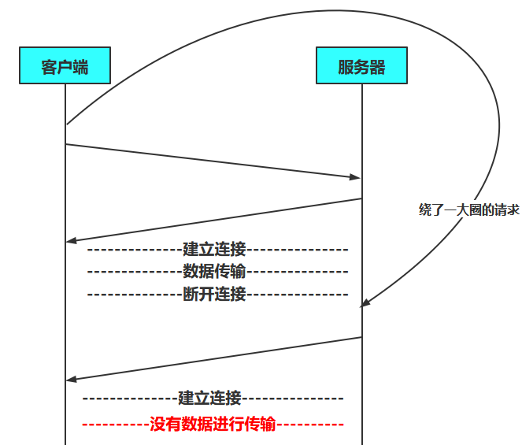
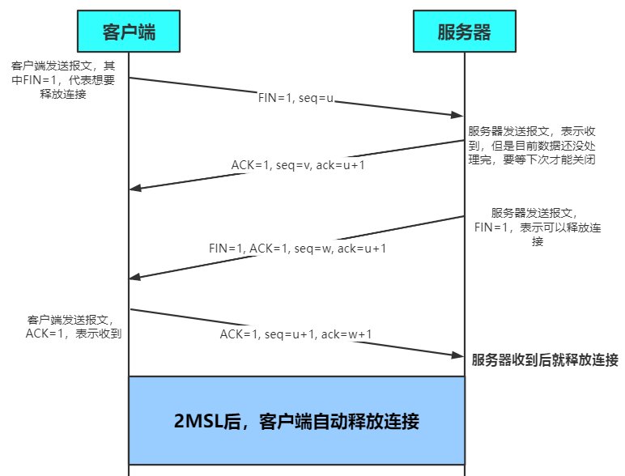
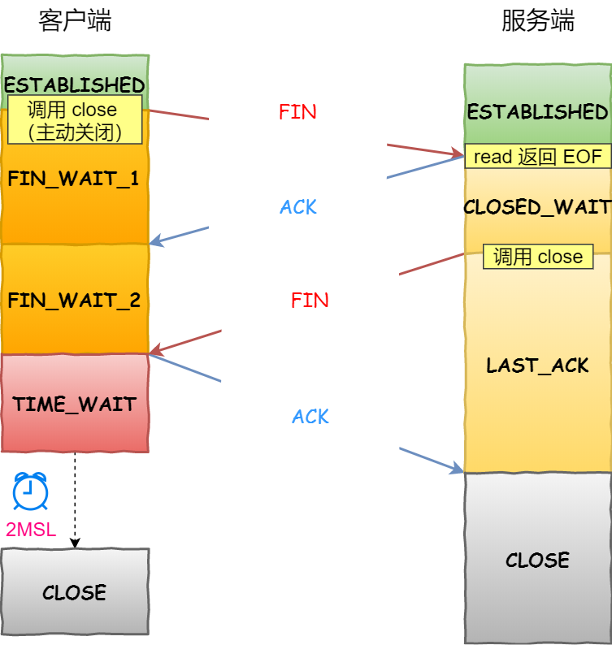

# 三握四挥

[TOC]

> SYN(synchronous建立联机)
>
>  ACK(acknowledgement 确认) 
>
> PSH(push传送) 
>
> FIN(finish结束) 
>
> RST(reset重置) 
>
> URG(urgent紧急)
>
> Sequence number(顺序号码) 
>
> Acknowledge number(确认号码)

## 三次握手过程

客户端——发出连接请求（SYN=1），同时选择一个初始化序列号（seq=x）——服务端 **一次握手** ，客户端进入syn_sent（同步已发送）状态（TCP规定，SYN不能携带数据，但需要消耗掉一个序号）

 服务端——收到请求，同意则发送确认报文（ACK=1，SYN=1，ack=x+1，seq=y）——客户端 **二次握手** 服务端进入syn_rcvd（同步收到）状态

 客户端——向服务器给出确认（ACK=1，seq=x+1，ack=y+1）——服务端 **三次握手** 连接就进入Established（已建立连接）状态（TCP规定，ACK可以携带数据，但是不携带则不消耗序号）

## 四次挥手过程

客户端——主动关闭（FIN=1，seq=u）——服务端，关闭与服务端的连接 ，客户端进入FIN-WAIT-1状态（终止等待1）

服务端——发送确认报文（ACK=1，ack=u+1，seq=v）——服务端就进入了CLOSE-WAIT状态（关闭等待）此时客户端处于半关闭状态，如果服务器发送数据，客户端依然要接受

 服务端——（FIN=1，ACK=1，seq=w，ack=u+1）——客户端，关闭与客户端的连接，客户端就进入FIN-WAIT-2状态（终止等待2），服务器进入LAST-ACK（最后确认）状态，等待客户端确认

客户端收到这个 FIN，发回 ACK 报⽂确认，并将确认序号设置为收到序号加1（ACK=1，seq=u+1，ack=w+1），TIME-WAIT（时间等待）状态，注意此时TCP连接还没有释放，必须经过2*MSL（最长报文段寿命）时间后，当客户端撤销响应的TCB后，才进入CLOSED（关闭）状态

服务端只要收到了客户端发出的确认，立即进入CLOSED状态，无需等待，同样撤销TCB后，结束此次TCP连接

主动断开的一方

>  ①首先发送FIN告诉对方我要关闭连接，自己进入到状态FIN_WAIT_1此时开始不再处理和发送应用层用户的数据。 
> ③收到对方对FIN的ACK后自己进入到FIN_WAIT_2，这个时候依然可以接收对方的数据。如果收不到对方的ACK会再次发送之前包含FIN在内的消息。进入FIN_WAIT_2后就等待对方关闭，因为已经确认到对方收到自己的FIN了。 
> ⑤收到对方的FIN说明被断开的一方也要没有数据发送并关闭连接了，此时ACK对方的FIN进入TIME_WAIT。然后等2msl连接关闭。 
> – 需要注意的是，对方ACK自己的FIN后，并不会立即发送FIN而是在应用层关闭连接后才会发送FIN

被动断开的一方

> ②收到网络中传来的FIN，自己ACK这个FIN然后进入到CLOSE_WAIT状态。 
> ④通知应用层要关闭连接(从这个角度上理解**为什么断开比建立连接多了一次**handshake,因为被断开一方还有余下的数据要发送，发送FIN后还可以接受数据)这个时候等待用户来回应CLOSE，在发送FIN之前可以发送自己余下的数据。发送FIN后进入LAST_ACK。 
> ⑧等待对方ACK自己的FIN**完成关闭。如果对方没确认会再次发送**FIN。

补充几点

- 谁发送FIN就表示谁不再发送数据了
- 发送ACK时，ack的值是收到的seq的值+1
- 发送的seq，是对方发过来的ack
- 被断开的一方收到FIN后，给对方发送ACK表示收到，自己状态为CLOSE_WAIT。此时TCP连接处于半关闭状态。被断开的一方仍然可以发送数据。这时候由上一层协议应用层来决定是否要发送余下的数据。

---

**以下是常见问题**

## 为什么是三次握手

两次握手只能保证单向连接是畅通的。只有经过第三次握手，才能**确保双向都可以接收到对方的发送的 数据**。两次握手接收方这里不能确定自己的的发送是正常的，发送方的接收是正常的。如果第三次握手迟迟不来，服务器就可以认为之间的SYN是无效的，**三次握手的目的是建立可靠的通信信道**

### 为什么不是两次握手

这是为了**避免服务器建立无用连接**（客户端服务器建立连接后，却不传输数据）

如果只进行两次握手，如果客户端向服务器第一次发送的建立连接的请求因为某原因，**兜兜转转绕了一大圈才到达服务器**。这期间客户端因为未收到服务器的响应，就会再次发送连接请求，这时服务器收到了，向客户端发送连接请求后，连接便建立了。然后数据传输完毕后，释放连接。**这时刚刚兜兜转转一大圈的建立连接的请求到了服务器**，服务器收到后再次向客户端发送请求，发送后又建立了连接，但是建立连接后客户端没有再理会服务器，客户端与服务器之间没有传输数据，此时服务器的资源就会被浪费

### 为什么四次握手

**因为通信不可能100%可靠**（红军蓝军约定）， 而上面的三次握手已经做好了通信的准备工作， **再增加握手， 并不能显著提高可靠性**，所以只需要三次握手就足够了

## 为什么是四次挥手

- 建立连接的时候， 服务器在LISTEN状态下，收到建立连接请求的SYN报文后，**把ACK和SYN放在一个报文里发送给客户端**

- 关闭连接时，服务器收到对方的FIN报文时，**仅仅表示对方不再发送数据了但是还能接收数据**，而自己也未必全部数据都发送给对方了，所以己方可以立即关闭，也可以发送一些数据给对方后，再发送FIN报文给对方来表示同意现在关闭连接，因此，**己方ACK和FIN一般都会分开发送，从而导致多了一次，也就是，不能一次性将确认报文和FIN报文发送给客户端**

## 为什么客户端最后还要等待2MSL

**确保第四次挥手服务器能够收到，同时使失效的连接请求从网络中消失**

- **Time-wait存在的意义– 保证客户端发送的最后一个ACK报文能够到达服务器**，因为这个ACK报文可能丢失。站在服务器的角度看来，我已经发送了FIN+ACK报文请求断开了，客户端还没有给我回应，应该是我发送的请求断开报文它没有收到，**于是服务器又会重新发送一次，一去一回就是2MSL**，而客户端就能在这个2MSL时间段内收到这个重传的报文，接着给出回应报文，并且会**重启2MSL计时器**

- 防止类似与三次握手中提到了的**已经失效的连接请求报文段**出现在本连接中。客户端发送完最后一个确认报文后，在这个2MSL时间中，就可以**使本连接持续的时间内所产生的所有报文段都从网络中消失**（最长生存MSL）。**这样新的连接中不会出现旧连接的请求报文**

**相关参数的文档地址**

https://www.kernel.org/doc/Documentation/networking/ip-sysctl.txt

## 客户端第一个SYN包丢了，怎么办

客户端第一个发的就是SYN报文，然后进入到 SYN_SENT状态，如果报文丢了、传不到服务器收不到syn和ack，触发超时重传机制

在 Linux 里，客户端的 SYN 报文最大重传次数由 tcp_syn_retries 内核参数控制，这个参数是可以自定义的，**默认值是 6。**

通常，第一次超时重传是在 1 秒后，第二次超时重传是在 2 秒，第三次超时重传是在 4 秒后，第四次超时重传是在 8 秒后，第五次是在超时重传 16 秒后。**每次超时的时间是上一次的 2 倍**。

当第五次超时重传后，会继续等待 32 秒，如果服务端仍然没有回应 ACK，客户端就不再发送 SYN 包，然后断开 TCP 连接。

所以，总耗时是 1+2+4+8+16+32+64=127 （2^6 - 1）秒，超过 2 分钟左右。

## 服务端收到的SYN并回复的[SYN，ACK]包丢了，怎么办

第二次握手丢失了，客户端和服务端都会重传

- 客户端会重传 SYN 报文，也就是第一次握手，最大重传次数由tcp_syn_retries内核参数决定。

- 服务端会重传 SYN，ACK报文，也就是第二次握手，最大重传次数由 

  **tcp_synack_retries** 内核参数决定，默认是 5 。

## 客户端最后一次回复的[ACK]包丢了，怎么办

客户端收到服务端的 SYN-ACK 报文后，就会给服务端回一个 ACK 报文，也就是第三次握手，此时客户端状态进入到 ESTABLISH 状态。

因为这个第三次握手的 ACK 是对第二次握手的 SYN 的确认报文，所以当第三次握手丢失了，如果服务端那一方迟迟收不到这个确认报文，就会触发超时重传机制，重传 SYN-ACK 报文，直到收到第三次握手，或者达到最大重传次数。

注意，**ACK 报文是不会有重传的，当 ACK 丢失了，就由对方重传对应的报文**。

## SYN泛洪攻击

利用TCP三次握手机制的缺陷，主要发生在OSI的第四层（也就是运输层），第二次握手服务器返回给客户端ACK后，此时客户端不再进行确认，连接就处在一个挂起的状态（半连接），服务器因为收不到再确认的消息，会重复发送ACK给客户端，如果此时大量非法的这种TCP连接发来，每一个都无法完成握手的机制，就会消耗服务器的内存最后导致服务器死机

**解决**：1.降低SYN timeout时间，使得主机尽快释放半连接的占用

2.采用SYN cookie设置，如果短时间内收到了某个IP的重复SYN请求，我们就认为受到了攻击，原理是，在TCP服务器收到TCP SYN包并返回TCP SYN+ACK包时，不分配一个专门的数据区，而是根据这个SYN包计算出一个cookie值。在收到TCP ACK包时，TCP服务器在根据那个cookie值检查这个TCP ACK包的合法性。如果合法，再分配专门的数据区进行处理未来的TCP连接

> **Linux**中的`/proc/sys/net/ipv4/tcp_syncookies`是内核中的`SYN Cookies`开关,`0`表示关闭`SYN Cookies`；`1`表示在新连接压力比较大时启用`SYN Cookies` **默认是 1**
>
> `2`表示始终使用`SYN Cookies`。

3.合理的采用防火墙设置等外部网络也可以进行拦截

---

## 第一次挥手丢失的问题

也就是客户端迟迟收不到服务端的ACK，触发超时重传机制，重传 FIN 报文，重发次数由 tcp_orphan_retries 参数控制  **默认值是 8  ** 

当客户端重传 FIN 报文的次数超过 tcp_orphan_retries 后，就不再发送 FIN 报文，直接进入到 close 状态。

## 第二次挥手丢失的问题

当服务端收到客户端的第一次挥手后，就会先回一个 ACK 确认报文，此时服务端的连接进入到 CLOSE_WAIT 状态。

在前面我们也提了，**ACK 报文是不会重传的，**所以如果服务端的第二次挥手丢失了，客户端就会触发超时重传机制，**重传 FIN 报文**，直到收到服务端的第二次挥手，或者达到最大的重传次数。

当客户端收到第二次挥手，也就是收到服务端发送的 ACK 报文后，客户端就会处于 FIN_WAIT2 状态，在这个状态需要等服务端发送第三次挥手，也就是**等待服务端的 FIN 报文**。

对于 close 函数关闭的连接，由于无法再发送和接收数据，所以F**IN_WAIT2 状态不可以持续太久，而 tcp_fin_timeout 控制了这个状态下连接的持续时长，默认值是 60 秒**。

这意味着对于调用 close 关闭的连接，如果在 60 秒后还没有收到 FIN 报文，客户端（主动关闭方）的连接就会直接关闭。

## 第三次挥手丢失的问题

回顾一下，当服务端（被动关闭方）收到客户端（主动关闭方）的 FIN 报文后，内核会自动回复 ACK，同时连接处于 CLOSE_WAIT 状态，顾名思义，它表示等待应用进程调用 close 函数关闭连接。

服务端处于 CLOSE_WAIT 状态时，调用了 close 函数，**内核就会发出 FIN 报文，同时连接进入 LAST_ACK 状态，等待客户端返回 ACK 来确认连接关闭**。

如果迟迟收不到这个 ACK，服务端就会重发 FIN 报文，重发次数仍然由 tcp_orphan_retries 参数控制，这与客户端重发 FIN 报文的重传次数控制方式是一样的。

## 第四次挥手丢失的问题

当客户端收到服务端的第三次挥手的 FIN 报文后，就会回 ACK 报文，也就是第四次挥手，此时客户端连接进入 TIME_WAIT 状态。

在 Linux 系统，**TIME_WAIT 状态会持续 60 秒  == 2MSL 后才会进入关闭状态**。

然后，服务端（被动关闭方）**没有收到 ACK 报文前，还是处于 LAST_ACK 状态**。

如果第四次挥手的 ACK 报文没有到达服务端，**服务端就会重发 FIN 报文**，重发次数仍然 tcp_orphan_retries 参数控制。

## TCP传输时什么时候会收到RST报文段

1.连接请求到达时，**目的端口不存在**。

2.向一个**已经关闭**的连接发送数据。

3.向一个**已经崩溃**的对端发送数据。

4.请求超时。 接收端在接收数据**超时**时，会发送RST包。

5.关闭socket时，直接丢弃接收缓冲区未读取的数据，并给对方发一个RST。

6.TCP收到了一个根本不存在的连接上的报文。

7.处理半打开连接时。一方关闭了连接，另一方却由于网络故障等原因没有收到结束报文，还维持着原来的连接，这种状态就叫做半打开连接。此时另一方往处于半打开状态的连接写数据的话，对方就会回应RST。

**TCP表现**

1.TCP socket在任何状态下，只要收到RST包，即可进入**CLOSED**初始状态。

2.RST报文段不会导致另一端产生任何响应，另一端根本**不进行确认**。收到RST的一方将终止该连接。

1.**阻塞**模型下，内核无法主动通知应用层出错，只有应用层主动调用read()或者write()这样的IO系统调用时，内核才会利用出错来通知应用层对端RST。

2.**非阻塞**模型下，select或者epoll会返回sockfd可读，应用层对其进行读取时，read()会报错RST。

