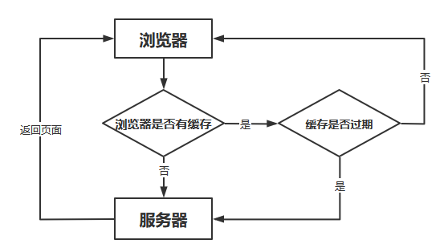

# 从输入url到浏览器显示页面过程

[TOC]

## 简要概括性回答

过程大概为：

DNS解析 - TCP连接 - 发送HTTP请求 - 服务器处理请求并返回HTTP报文 - 浏览器渲染 

|                                                              |                       |
| :----------------------------------------------------------: | :-------------------: |
|                             过程                             |      使用的协议       |
| 1、浏览器查找域名DNS的IP地址 DNS查找过程（浏览器缓存、路由器缓存、DNS缓存） | DNS：获取域名对应的ip |
|                     2、根据ip建立TCP连接                     | TCP：与服务器建立连接 |
|                3、浏览器向服务器发送HTTP请求                 |    HTTP：发送请求     |
|                    4、服务器响应HTTP响应                     |         HTTP          |
|                      5、浏览器进行渲染                       |                       |

## 详解

### 1.URL解析

浏览器会根据你的输入来判断该输入是一条合法的URL，还是需要被搜索的关键词。并且根据你输入的内容进行自动完成、字符编码等操作

目前大部分浏览器都会**强制客户端使用HTTPS协议**以保证信息传输的安全性。同时还会进行一些额外的操作，比如安全检查、访问限制等。

**缓存检查**： 浏览器会先检测是否缓存了目标URL的页面，如果有且缓存未过期，则直接展示缓存页面，无需再向服务器进行请求。

### 2.DNS解析

**DNS解析是寻找所需要的资源的IP地址的过程**。因为互联网中每一台连网的机器都有**唯一IP作为标识**，但是它是一串数字，记忆太过困难。所以就需要将网址和IP地址进行转换，也就是DNS解析。其具体步骤如下。

#### 查询缓存

我们的浏览器、操作系统、路由器都会缓存一些URL对应的IP地址，统称为**DNS高速缓存**。这是为了加快DNS解析速度，使得不必每次都到根域名服务器中去查询。

#### 递归解析

输入`www.baidu.com`网址后，首先在高速缓存中查找，没找到去根域名服务器查找，没有再去`com`顶级域名服务器查找，依次类推，直到找到IP地址，然后把它记录在本地告诉缓存中，供下次使用。

大致过程就是`.`-> `.com` ->`baidu.com.` -> `www.baidu.com.`

其中`.`代表根域名服务器

#### DNS负载均衡

访问`baidu.com`的时候，每次响应的可能并非是同一个服务器（IP地址不同），一般大公司都有成百上千台服务器来支撑访问，DNS可以返回一个**合适的机器的IP**给用户，例如可以**根据每台机器的负载量，该机器离用户地理位置的距离**等等，这种过程就是DNS负载均衡

### 3.建立TCP连接

经过DNS解析之后，知道了服务器的IP地址，就可以和服务器正式建立连接了，此时，浏览器会开始构建一个HTTP报文，包括 **请求报头和请求主体**

HTTP就基于TCP的，所以需要跟服务器建立 TCP 连接，也就是三次握手，TCP协议为传输报文提供可靠的字节流服务。它为了方便传输，将大块的数据分割成以报文段为单位的数据包进行管理，并为它们编号，方便服务器接收时能准确地还原报文信息

### 4.网络层IP协议查询MAC地址

IP协议的作用是把TCP分割好的各种数据包传送给接收方。而要保证确实能传到接收方还需要接收方的MAC地址，也就是物理地址，为打包好的`数据+TCP首部+IP首部`寻找传输路线（**将数据段打包，并加入源及目标的IP地址，并且负责寻找传输路线**），**找到IP对应的物理机**

利用**ARP协议**，地址解析协议，用于实现从IP地址到MAC地址的映射，当通信的双方不在同一个局域网时，需要多次中转才能到达最终的目标，在中转的过程中需要通过下一个中转站的MAC地址来搜索下一个中转目标

ARP协议通过**一问一答**实现交互，但是问和答都有讲究，**问是通过广播形式实现，答是通过单播形式。**

### 5.数据到达链路层

根据以太网协议将数据分为以“帧”为单位的数据包，每一帧分为两个部分：

- 标头：数据包的发送者、接受者、数据类型
- 数据：数据包具体内容

在找到对方的MAC地址后，就将数据发送到数据链路层传输。这时，客户端发送请求的阶段结束

### 6.服务器接受数据

接收端的服务器在链路层接收到数据包，再层层向上直到应用层。这过程中包括在运输层通过TCP协议讲分段的数据包重新组成原来的HTTP请求报文。

### 7.服务器响应请求

服务接收到客户端发送的HTTP请求后，查找客户端请求的资源，并返回响应报文，响应报文中包括一个重要的信息——状态码。状态码由三位数字组成，其中比较常见的是200 OK表示请求成功。301表示永久重定向，即请求的资源已经永久转移到新的位置。在返回301状态码的同时，响应报文也会附带重定向的url，客户端接收到后将http请求的url做相应的改变再重新发送。404 not found 表示客户端请求的资源找不到。

请求成功后，会返回相应的HTML文件