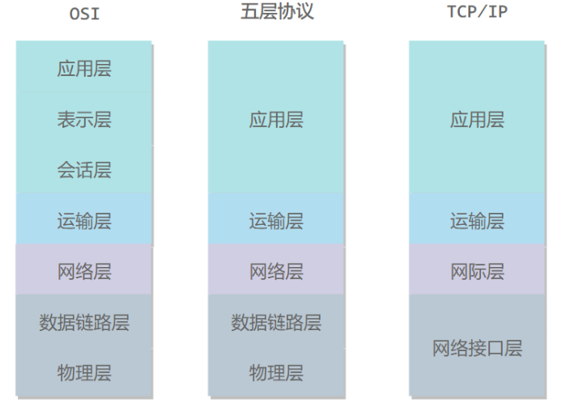

# 计网基础

[TOC]

## 体系结构

### OSI

- **表示层** ：数据压缩、加密以及数据描述，这使得应用程序不必关心在各台主机中数据内部格式不同的问题。
- **会话层** ：建立及管理会话。

五层协议没有表示层和会话层，而是将这些功能留给应用程序开发者处理。

|  OSI中的层   |                  功能                  |             网络协议             |
| :----------: | :------------------------------------: | :------------------------------: |
|   7 应用层   | 文件传输，电子邮件，文件服务，虚拟终端 | TFTP，HTTP，SNMP，FTP，SMTP，NFS |
|   6 表示层   |     数据格式化，代码转换，数据加密     |           Telnet，SNMP           |
|   5 会话层   |       解除或建立与别的接点的联系       |               DNS                |
|   4 运输层   |            提供端对端的接口            |          TCP，UDP，SRTP          |
|   3 网络层   |            为数据包选择路由            |   IP，ICMP，OSPF，EIGRP，IGMP    |
| 2 数据链路层 |     传输有地址的帧以及错误检测功能     |             ARP，PPP             |
|   1 物理层   |  以二进制数据形式在物理媒体上传输数据  |   ISO2110，IEEE802，IEEE802.2    |

- 1.物理层：
  - 主要定义物理设备标准，如网线的接口类型、光纤的接口类型、各种传输介质的传输速率等。它的主要作用是传输比特流（就是由1、0转化为电流强弱来进行传输,到达目的地后在转化为1、0）。这一层的数据叫做比特。     
- 2.数据链路层：
  - 主要将从物理层接收的数据进行MAC地址（网卡的地址）的封装与解封装。常把这一层的数据叫做帧。在这一层工作的设备是交换机，数据通过交换机来传输。
    - 数据链路层是负责接收 IP 数据包并通过网络发送，或者从网络上接收物理帧，抽出 IP 数据包，交给 IP 层。
    - ARP 是正向地址解析协议，通过已知的 IP，寻找对应主机的 MAC 地址。
    - RARP 是反向地址解析协议，通过 MAC 地址确定 IP 地址。比如无盘工作站还有 DHCP 服务。
    - 常见的接口层协议有：Ethernet 802.3、Token Ring 802.5、X.25、Frame relay、HDLC、PPP ATM等。
- 3.网络层：
  - 主要将从下层接收到的数据进行IP地址（例192.168.0.1)的封装与解封装。在这一层工作的设备是路由器，常把这一层的数据叫做数据包。
    - 负责相邻计算机之间的通信。其功能包括三方面。
      - 1. 处理来自传输层的分组发送请求，收到请求后，将分组装入 IP 数据报，填充报头，选择去往信宿机的路径，然后将数据报发往适当的网络接口。
      - 2. 处理输入数据报：首先检查其合法性，然后进行寻径--假如该数据报已到达信宿机，则去掉报头，将剩下部分交给适当的传输协议；假如该数据报尚未到达信宿，则转发该数据报。
      - 3. 处理路径、流控、拥塞等问题。
    - 网络层包括：IP(Internet Protocol) 协议、ICMP(Internet Control Message Protocol)
    - 控制报文协议、ARP(Address Resolution Protocol) 地址转换协议、RARP(Reverse ARP) 反向地址转换协议。
    - IP 是网络层的核心，通过路由选择将下一条IP封装后交给接口层。IP数据报是无连接服务。
    - ICMP 是网络层的补充，可以回送报文。用来检测网络是否通畅。
    - Ping 命令就是发送 ICMP 的 echo 包，通过回送的 echo relay 进行网络测试。
- 4.传输层：
  - 定义了一些传输数据的协议和端口号（WWW端口80等），如：TCP（传输控制协议，传输效率低，可靠性强，用于传输可靠性要求高，数据量大的数据），UDP（用户数据报协议，与TCP特性恰恰相反，用于传输可靠性要求不高，数据量小的数据，如QQ聊天数据就是通过这种方式传输的）.主要是将从下层接收的数据进行分段和传输，到达目的地址后再进行重组。常常把这一层数据叫做段。
    - 提供应用程序间的通信。其功能包括：一、格式化信息流；二、提供可靠传输。为实现后者，传输层协议规定接收端必须发回确认，并且假如分组丢失，必须重新发送，即耳熟能详的“三次握手”过程，从而提供可靠的数据传输。
    - 传输层协议主要是：传输控制协议 TCP(Transmission Control Protocol) 和用户数据报协议 UDP(User Datagram protocol)。
- 5.会话层：通过传输层（端口号：传输端口与接收端口）建立数据传输的通路。
  - 主要在你的系统之间发起会话或者接受会话请求（设备之间需要互相认识可以是IP也可以是MAC或者是主机名）
- 6.表示层：主要是进行对接收的数据进行解释、加密与解密、压缩与解压缩等（也就是把计算机能够识别的东西转换成人能够能识别的东西（如图片、声音等）。
- 7.应用层： 
  - 主要是一些终端的应用，比如说FTP（各种文件下载），WEB（IE浏览），QQ之类的（可以把它理解成我们在电脑屏幕上可以看到的东西．就是终端应用）。
    - 向用户提供一组常用的应用程序，比如电子邮件、文件传输访问、远程登录等。远程登录 TELNET 使用 TELNET 协议提供在网络其它主机上注册的接口。TELNET 会话提供了基于字符的虚拟终端。文件传输访问 FTP 使用 FTP 协议来提供网络内机器间的文件拷贝功能。
    - 应用层协议主要包括如下几个：FTP、TELNET、DNS、SMTP、NFS、HTTP。
    - FTP(File Transfer Protocol）是文件传输协议，一般上传下载用FTP服务，数据端口是 20H，控制端口是 21H。
    - Telnet 服务是用户远程登录服务，使用 23H 端口，使用明码传送，保密性差、简单方便。
    - DNS(Domain Name Service）是域名解析服务，提供域名到 IP 地址之间的转换，使用端口 53。
    - SMTP(Simple Mail Transfer Protocol）是简单邮件传输协议，用来控制信件的发送、中转，使用端口 25。
    - NFS（Network File System）是网络文件系统，用于网络中不同主机间的文件共享。
    - HTTP(Hypertext Transfer Protocol）是超文本传输协议，用于实现互联网中的 WWW 服务，使用端口 80。

### 五层协议

- **应用层** ：网络应用程序及它们的应用层协议存留的地方（HTTP、SMTP、FTP和DNS）报文（message）
- **运输层** ：在应用程序端点之间传送应用层报文（TCP－＞一个端系统到了一个端系统的可靠交付、UDP）报文段（segment），为进程提供通用数据传输服务。由于应用层协议很多，定义通用的传输层协议就可以支持不断增多的应用层协议。运输层包括两种协议：传输控制协议 TCP，提供面向连接、可靠的数据传输服务，数据单位为报文段；用户数据报协议 UDP，提供无连接、尽最大努力的数据传输服务，数据单位为用户数据报。TCP 主要提供完整性服务，UDP 主要提供及时性服务。
- **网络层** ：将数据报（datagram）的网络层分组从一台主机移动到另一台主机（IP，路由选择协议）
- **数据链路层** ：将分组从一个节点移动到路径上的另一个节点，取决特定链路层协议；DOCSIS协议；链路层分组（帧frame）将整个帧从一个网络元素移动到邻近的网络元素
- **物理层** ：将帧中一个个比特从一个节点移动到下一个节点；协议仍是链路相关的，并且进一步与该链路的实际传输媒体有关

### TCP/IP

只有四层，相当于五层协议中数据链路层和物理层合并为网络接口层。

TCP/IP 体系结构不严格遵循 OSI 分层概念，应用层可能会直接使用 IP 层或者网络接口层。

> 数据在各层之间的传递过程

在向下的过程中，需要**添加**下层协议所需要的首部或者尾部，而在向上的过程中不断**拆开**首部和尾部。

路由器只有下面三层协议，因为路由器位于网络核心中，不需要为进程或者应用程序提供服务，因此也就不需要传输层和应用层。

## 基础概念

### 交换机

- 在计算机网络系统中，交换机是针对共享工作模式的弱点而推出的。交换机拥有一条高带宽的背部总线和内部交换矩阵。交换机的所有的端口都挂接在这条背部总线上，当控制电路收到数据包以后，处理端口会查找内存中的地址对照表以确定目的MAC（网卡的硬件地址）的NIC（网卡）挂接在哪个端口上，通过内部交换矩阵迅速将数据包传送到目的端口。目的MAC若不存在，交换机才广播到所有的端口，接收端口回应后交换机会“学习”新的地址，并把它添加入内部地址表 中。
- 交换机工作于OSI参考模型的第二层，即数据链路层。交换机内部的CPU会在每个端口成功连接时，通过ARP协议学习它的MAC地址，保存成一张 ARP表。在今后的通讯中，发往该MAC地址的数据包将仅送往其对应的端口，而不是所有的端口。因此，交换机可用于划分数据链路层广播，即冲突域；但它不能划分网络层广播，即广播域。

### 路由器

- 路由器（Router）是一种计算机网络设备，提供了路由与转送两种重要机制，可以决定数据包从来源端到目的端所经过的路由路径（host到host之间的传输路径），这个过程称为路由；将路由器输入端的数据包移送至适当的路由器输出端(在路由器内部进行)，这称为转送。路由工作在OSI模型的第三层——即网络层，例如网际协议。
- 路由器的一个作用是连通不同的网络，另一个作用是选择信息传送的线路。 路由器与交换器的差别，路由器是属于OSI第三层的产品，交换器是OSI第二层的产品(这里特指二层交换机)。
- 常见的路由选择协议，以及它们的区别?
  - 常见的路由选择协议有：RIP协议、OSPF协议。
  - RIP协议：底层是贝尔曼福特算法，它选择路由的度量标准（metric)是跳数，最大跳数是15跳，如果大于15跳，它就会丢弃数据包。
  - OSPF协议：底层是迪杰斯特拉算法，是链路状态路由选择协议，它选择路由的度量标准是带宽，延迟。

### 网关

- 网关（Gateway），网关是连接两个网络的设备，
- 在传统TCP/IP术语中，网络设备只分成两种，一种为网关（gateway），另一种为主机（host）。网关能在网络间转递数据包，但主机不能转送数据包。在主机中，数据包需经过TCP/IP四层协议处理，但是在网关只需要到达网际层，决定路径之后就可以转送。
- 在现代网络术语中，网关（gateway）与路由器（router）的定义不同。网关（gateway）能在不同协议间移动数据，而路由器（router）是在不同网络间移动数据.
- 对于以太网中的网关只能转发三层以上数据包，这一点和路由是一样的。而不同的是网关中并没有路由表，他只能按照预先设定的不同网段来进行转发。网关最重要的一点就是端口映射，子网内用户在外网看来只是外网的IP地址对应着不同的端口，这样看来就会保护子网内的用户。

## 网络分层的优点

1、各层之间相互独立,即不需要知道低层的结构,只要知道是通过层间接口所提供的服务。
2、灵活性好,是指只要接口不变就不会因层的变化(甚至是取消该层)而变化。
3、各层采用最合适的技术实现而不影响其他层。
4、有利于促进标准化