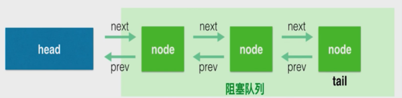

# AQS

[TOC]

## 简介

AbstractQueuedSynchronizer，抽象的队列式的同步器，是⼀个⽤来构建锁和同步器的框架，使⽤AQS能简单且⾼效地构造出应⽤⼴泛的⼤量的同步器，

不仅是ReentrantLock，Semaphore，包括CountDownLatch，ReentrantReadWriterLock都有这样类似的协作功能

底层都用了一个共同的基类AQS

所以在很多工作类似的基础之上抽象提取出一个工具类 -> AQS

---

AQS最核心的三大部分：
     **state** (The synchronization state)     private volatile int state;

​     **控制线程抢锁和配合的FIFO队列**（先进先出）

​     **期望协作工具类去实现的获取/释放等重要方法**

---

 AQS核⼼思想是，如果被请求的共享资源空闲，则将当前请求资源的线程设置为**有效的⼯作线程**，并且将共享资源设置为**锁定状态**。

如果被请求的共享资源被占⽤，那么就需要⼀套线程阻塞等待以及被唤醒时锁分配的机制，这个机制AQS是⽤**CLH（虚拟的双向队列）**队列锁实现的，即将暂时获取不到锁的线程加⼊到队列中。

## state

state -> 具体含义会根据实现类的不同而不同，比如在Semaphore表示**剩余的许可证的数量**、在CountDownLatch表**示还需要倒数的数量**

 被volatile修饰，会被并发地修改，所以所有修改state的方法都需要**保证线程安全**(依赖于juc下的atomic包的支持CAS)

 在ReentrantLock中，state表示锁的占有情况，**包括可重入计数**，0的时候则表示该Lock不被任何线程所占有

## FIFO队列

 这些队列用来**存放 等待的线程**  AQS就是排队管理器，当多个线程争用同一把锁时，必须有排队机制将那些**没能拿到锁的线程串在一起**， 锁释放时，锁管理器就会挑选一个合适的线程来占有这个刚刚释放的锁

 AQS会维护一个等待的线程队列，把线程都放在这个双向队列里

CountDownLatch为例

~~~java
private void doAcquireSharedInterruptibly(int arg)
    throws InterruptedException {
    // 线程包装成一个node
    final Node node = addWaiter(Node.SHARED);
    try {
        for (;;) {
            final Node p = node.predecessor();
            if (p == head) {
                int r = tryAcquireShared(arg);
                if (r >= 0) {
                    setHeadAndPropagate(node, r);
                    p.next = null; // help GC
                    return;
                }
            }
            if (shouldParkAfterFailedAcquire(p, node) &&
                parkAndCheckInterrupt())
                throw new InterruptedException();
        }
    } catch (Throwable t) {
        cancelAcquire(node);
        throw t;
    }
}

private final boolean parkAndCheckInterrupt() {
    // native方法，将线程挂起，陷入阻塞状态
    LockSupport.park(this);
    return Thread.interrupted();
}

protected int tryAcquireShared(int acquires) {
    // ==0就放行，为-1就进入队列陷入阻塞
    return (getState() == 0) ? 1 : -1;
}

public final void acquireSharedInterruptibly(int arg)
    throws InterruptedException {
    if (Thread.interrupted())
        throw new InterruptedException();
    if (tryAcquireShared(arg) < 0)
        // 排队队列
        doAcquireSharedInterruptibly(arg);
}
~~~

~~~java
protected boolean tryReleaseShared(int releases) {
    // Decrement count; signal when transition to zero
    // cas自旋
    for (;;) {
        int c = getState();
        if (c == 0)
            return false;
        int nextc = c-1;
        if (compareAndSetState(c, nextc))
            // 1 -> 0，闸门就打开
            return nextc == 0;
    }
}

public final boolean releaseShared(int arg) {
    if (tryReleaseShared(arg)) {
        doReleaseShared();
        return true;
    }
    return false;
}
~~~

## 获取释放方法

由协作类自己去实现，并且含义各不相同   （比如acquire，release）

 获取方法 -> 依赖于state变量，经常会阻塞（比如获取不到锁的时候）

