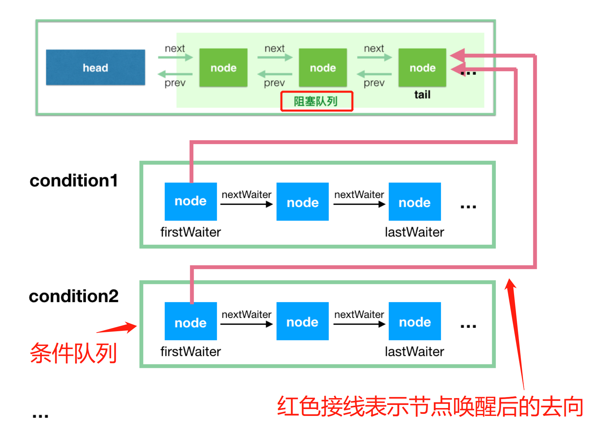
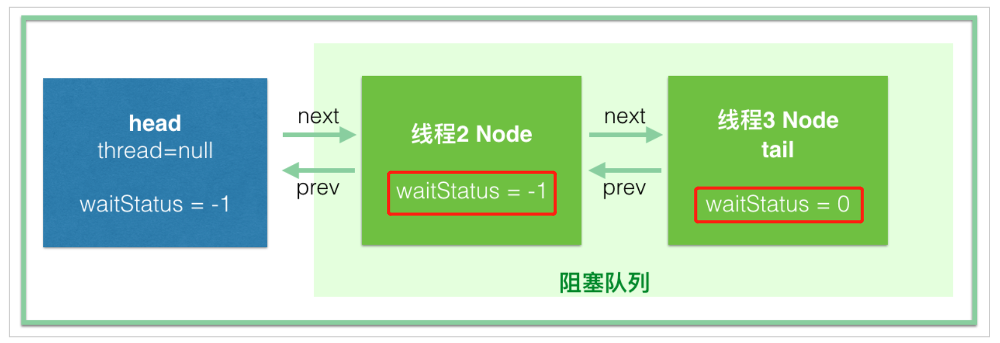

# AQS

[TOC]

## 简介

AbstractQueuedSynchronizer，抽象的队列式的同步器，是⼀个⽤来构建锁和同步器的框架，使⽤AQS能简单且⾼效地构造出应⽤⼴泛的⼤量的同步器，

不仅是ReentrantLock，Semaphore，包括CountDownLatch，ReentrantReadWriterLock都有这样类似的协作功能

底层都用了一个共同的基类AQS

所以在很多工作类似的基础之上抽象提取出一个工具类 -> AQS

---

AQS最核心的三大部分：
     **state** (The synchronization state)     private volatile int state;

​     **控制线程抢锁和配合的FIFO队列**（先进先出）

​     **期望协作工具类去实现的获取/释放等重要方法**

---

 AQS核⼼思想是，如果被请求的共享资源空闲，则将当前请求资源的线程设置为**有效的⼯作线程**，并且将共享资源设置为**锁定状态**。

如果被请求的共享资源被占⽤，那么就需要⼀套线程阻塞等待以及被唤醒时锁分配的机制，这个机制AQS是⽤**CLH（虚拟的双向队列）**队列锁实现的，即将暂时获取不到锁的线程加⼊到队列中。

## 核心

1. 使用volatile修饰的statue变量表示共享资源的状态。如果被请求的共享资源空闲，则将当前请求资源的线程设置为有效的工作线程，并且将共享资源设置为锁定状态。
2. 如果被请求的共享资源被占用，那么就需要一套线程阻塞等待以及被唤醒时锁分配的机制，这个机制 AQS 是用 CLH 队列锁实现的，即将暂时获取不到锁的线程加入到队列中。
3. CLH(Craig,Landin,and Hagersten)队列是一个虚拟的双向队列（虚拟的双向队列即不存在队列实例，仅存在结点之间的关联关系）
4. 通过自旋+CAS获取共享资源，如果获取失败则调用调用native方法 进入park 状态

## state

state -> 具体含义会根据实现类的不同而不同，比如在Semaphore表示**剩余的许可证的数量**、在CountDownLatch表**示还需要倒数的数量**

 被volatile修饰，会被并发地修改，所以所有修改state的方法都需要**保证线程安全**(依赖于juc下的atomic包的支持CAS)

 在ReentrantLock中，state表示锁的占有情况，**包括可重入计数**，0的时候则表示该Lock不被任何线程所占有

## FIFO队列

每个Node结点维护一个prev引用和next引用，分别指向自己的前驱和后继结点。AQS维护两个指针，分别指向队列头部head和尾部tail。

当线程获取资源失败（比如tryAcquire时试图设置state状态失败），会被构造成一个结点加入CLH队列中，同时当前线程会被阻塞在队列中（通过LockSupport.park实现，其实是等待态）。当持有同步状态的线程释放同步状态时，会唤醒后继结点，然后此结点线程继续加入到对同步状态的争夺中。

 这些队列用来**存放 等待的线程**  AQS就是排队管理器，当多个线程争用同一把锁时，必须有排队机制将那些**没能拿到锁的线程串在一起**， 锁释放时，锁管理器就会挑选一个合适的线程来占有这个刚刚释放的锁

 AQS会维护一个等待的线程队列，把线程都放在这个双向队列里

CountDownLatch为例

~~~java
private void doAcquireSharedInterruptibly(int arg)
    throws InterruptedException {
    // 线程包装成一个node
    final Node node = addWaiter(Node.SHARED);
    try {
        for (;;) {
            final Node p = node.predecessor();
            if (p == head) {
                int r = tryAcquireShared(arg);
                if (r >= 0) {
                    setHeadAndPropagate(node, r);
                    p.next = null; // help GC
                    return;
                }
            }
            if (shouldParkAfterFailedAcquire(p, node) &&
                parkAndCheckInterrupt())
                throw new InterruptedException();
        }
    } catch (Throwable t) {
        cancelAcquire(node);
        throw t;
    }
}

private final boolean parkAndCheckInterrupt() {
    // native方法，将线程挂起，陷入阻塞状态
    LockSupport.park(this);
    return Thread.interrupted();
}

protected int tryAcquireShared(int acquires) {
    // ==0就放行，为-1就进入队列陷入阻塞
    return (getState() == 0) ? 1 : -1;
}

public final void acquireSharedInterruptibly(int arg)
    throws InterruptedException {
    if (Thread.interrupted())
        throw new InterruptedException();
    if (tryAcquireShared(arg) < 0)
        // 排队队列
        doAcquireSharedInterruptibly(arg);
}
~~~

~~~java
protected boolean tryReleaseShared(int releases) {
    // Decrement count; signal when transition to zero
    // cas自旋
    for (;;) {
        int c = getState();
        if (c == 0)
            return false;
        int nextc = c-1;
        if (compareAndSetState(c, nextc))
            // 1 -> 0，闸门就打开
            return nextc == 0;
    }
}

public final boolean releaseShared(int arg) {
    if (tryReleaseShared(arg)) {
        doReleaseShared();
        return true;
    }
    return false;
}
~~~

## 获取与释放

### 获取

~~~java
 // 尝试获取锁
 public final void acquire(int arg) {
     // tryAcquire 需重写   acquireQueued、addWaiter为默认方法
    if (!tryAcquire(arg) &&
        acquireQueued(addWaiter(Node.EXCLUSIVE), arg))
        selfInterrupt();
 }
~~~

addWaiter ：用于添加节点到队尾

- 如果队尾节点存在直接CAS添加
- 如果队尾节点不存在，使用for自旋先**添加空的头节点**，再添加当前线程的队尾节点

~~~java
final boolean acquireQueued(final Node node, int arg) {
    boolean failed = true;
    try {
        boolean interrupted = false;
        for (;;) {
            final Node p = node.predecessor();
            // 前驱节点就是头结点直接尝试获得锁。
            // 在正常的锁释放唤醒场景，默认唤醒头结点后的第一个节点，就是在这边获取锁。
            if (p == head && tryAcquire(arg)) {
                setHead(node);
                p.next = null; // help GC
                failed = false;
                return interrupted;
            }
            // 常规尾结点添加 修改前驱节点状态以及进入挂起状态
            // 如果前驱节点为取消状态，需调整队列，将取消节点排除在外
            if (shouldParkAfterFailedAcquire(p, node) &&
                parkAndCheckInterrupt())
                interrupted = true;
        }
    } finally {
        // 自定义的tryAcquire 抛出异常则执行释放逻辑 
        if (failed)
            cancelAcquire(node);
    }
~~~

acquireQueued ：CLH节点休眠与被唤醒后的主要处理逻辑

- 进入一段自旋
- 节点正常添加到队尾后，如果当前节点的前驱为头节点，使用CAS尝试获取。获取成功后设置当前节点为头结点。之前的头节点让GC回收
- 获取失败，则进入shouldParkAfterFailedAcquire方法。

shouldParkAfterFailedAcquire方法：

- 正常的尾节点添加，需要使用CAS先把前驱节点的状态变成signal，通过acquireQueued的自旋，再进入到挂起的状态。
- 若前驱节点声明为取消CANCELLED状态，则需要找到非CANCELLED的前驱节点并连接上，取消的节点排除在双链表外。

parkAndCheckInterrupt方法：正常尾结点添加完成之后，进入到挂起的逻辑。

### 释放

~~~java
// 释放锁
public final boolean release(int arg) {
    // tryRelease 需重写
    if (tryRelease(arg)) {
        Node h = head;
        if (h != null && h.waitStatus != 0)
            unparkSuccessor(h);
        return true;
    }
    return false;
}
~~~

tryRelease方法：需要自定义，正常这步已经把锁给释放了，即修改状态为0，资源当前线程为null

unparkSuccessor：资源释放后的队列抢资源逻辑

- 定位到头结点，CAS修改状态为0
- 从尾到头寻找最早一个需要唤醒的线程节点，独占锁模式正常定位到头结点的下一个节点。
- 执行唤醒逻辑，线程重新进入到acquireQueued

## 公平锁与非公平锁

公平锁和非公平锁只有两处不同：

1. 非公平锁在调用 lock 后，首先就会调用 CAS 进行一次**抢锁**，如果这个时候恰巧锁没有被占用，那么直接就获取到锁返回了。
2. 非公平锁在 CAS 失败后，和公平锁一样都会进入到 AQS 的acquire 方法，AQS的acquire方法会调用tryAcquire，tryAcquire被ReentrantLock重写（==注意：公平锁和非公平锁的tryAcquire实现不同==），在 tryAcquire 方法中，如果发现锁这个时候被释放了（state == 0），**非公平锁会直接 CAS 抢锁**，**但是公平锁会判断等待队列是否有线程处于等待状态，如果有则不去抢锁，乖乖排到后面。**
3. 在进入队列后，阻塞前，两种锁都会判断自己是否是首节点，如果是的话，还会再抢一次锁，又失败了，才会挂起线程

公平锁和非公平锁就这两点区别，前两次 CAS 都不成功，那么后面非公平锁和公平锁是一样的，都要进入到阻塞队列等待唤醒。

ReentrantLock内有两个内部类，NonFairSync和FairSync。两个都重写了lock方法和tryAcquire方法。非公平的在lock中会抢一次锁再调用acquire。然后在NonFairTryRequire中进入队列后，阻塞前，如果释放了锁还会抢一次，而公平锁的tryRequire中，会同时判断是否释放以及链表中有无节点。

> 也就是说，对于非公平锁，lock中抢一次，tryAcquire中再抢一次，然后进入阻塞与公平锁一样，按顺序被唤醒
>
> 而对于公平锁，则检查AQS队列中是否有前驱节点，没有才去竞争

~~~java
// ReentrantLock内非公平锁的实现
final boolean nonfairTryAcquire(int acquires) {
    final Thread current = Thread.currentThread();
    int c = getState();
    if (c == 0) {
      // 进入队列之后，不管是否有前驱，再抢一次。
      // 进入队列的代码在AQS中
      // tryAcquire返回false的话，在AQS中这个线程就会被进入阻塞态了
        if (compareAndSetState(0, acquires)) {
            setExclusiveOwnerThread(current);
            return true;
        }
    }
    else if (current == getExclusiveOwnerThread()) {
        int nextc = c + acquires;
        if (nextc < 0) // overflow
            throw new Error("Maximum lock count exceeded");
        setState(nextc);
        return true;
    }
    return false;
}
static final class NonfairSync extends Sync {
    private static final long serialVersionUID = 7316153563782823691L;

    /**
      * Performs lock.  Try immediate barge, backing up to normal
      * acquire on failure.
      */
    final void lock() {
      // 调用lock的时候就会先抢一次！
        if (compareAndSetState(0, 1))
            setExclusiveOwnerThread(Thread.currentThread());
        else
            acquire(1);
    }

    protected final boolean tryAcquire(int acquires) {
        return nonfairTryAcquire(acquires);
    }
}
~~~

~~~java
// 公平锁的实现
static final class FairSync extends Sync {
    private static final long serialVersionUID = -3000897897090466540L;

    final void lock() {
      // 调用lock直接进入acquire！
        acquire(1);
    }

    /**
      * Fair version of tryAcquire.  Don't grant access unless
      * recursive call or no waiters or is first.
      */
    protected final boolean tryAcquire(int acquires) {
        final Thread current = Thread.currentThread();
        int c = getState();
        if (c == 0) {
          // 这里的第一个判断非公平锁没有，就是判断队列中有无前驱
            if (!hasQueuedPredecessors() &&
                compareAndSetState(0, acquires)) {
                setExclusiveOwnerThread(current);
                return true;
            }
        }
        else if (current == getExclusiveOwnerThread()) {
            int nextc = c + acquires;
            if (nextc < 0)
                throw new Error("Maximum lock count exceeded");
            setState(nextc);
            return true;
        }
        return false;
    }
}
~~~

