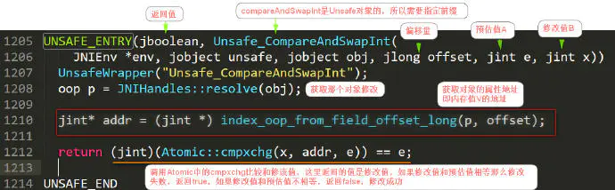

# CAS

[TOC]

## 简介

Compare and Swap，比较并交换，**不使用锁机制实现线程间的同步**，**使用CAS线程是不会被阻塞的，所以又称为非阻塞同步**，当多个线程尝试使用CAS同时更新同一个变量时，只有其中一个线程能更新变量的值，而其它线程都失败，失败的线程并不会被挂起，而是被告知这次竞争中失败，并可以再次尝试。　　　

CAS 操作中包含三个操作数 

1. 需要读写的内存位置（V）
2. 进行比较的预期原值（旧值）（A）
3. 拟写入的新值(B)

如果**内存位置V的值与预期原值A相匹配**，那么处理器会自动将该位置值更新为新值B。否则处理器不做任何操作。无论哪种情况，它都会在 CAS 指令之前返回该位置的值。(在 CAS 的一些特殊情况下将仅返回 CAS 是否成功，而不提取当前值。)

也即` 我认为位置 V 应该包含值 A；如果包含该值，则将 B 放到这个位置；否则，不要更改该位置，只告诉我这个位置现在的值即可`

**注意，在JDK中，1.5之前都是靠synchronized保持同步的，1.5中新增JUC就是建立在CAS之上的**

## CAS底层原理

~~~java
public class AtomicInteger extends Number implements java.io.Serializable {
    private volatile int value;

    public final int get() {
        return value;
    }

    public final int getAndIncrement() {
        for (;;) {
            int current = get();
            int next = current + 1;
            if (compareAndSet(current, next))
                return current;
        }
    }

    public final boolean compareAndSet(int expect, int update) {
        return unsafe.compareAndSwapInt(this, valueOffset, expect, update);
    }
}

// Object o：代表是对那个对象/进行操作 long offset：代表偏移量 通过偏移量是可以获取到内存值：V
// int expected：预估值 A  int x: 修改值：B
@HotSpotIntrinsicCandidate
public final native boolean compareAndSetInt(Object o, long offset,
                                             int expected,
                                             int x);
~~~

getAndIncrement采用CAS操作，每次从内存中读取数据然后将此数据和 + 1 后的结构进行 compareAndSet（CAS），成功就返回结果，否则重试直到成功为止

其中，compareAndSet 利用 JNI （Java Native Interface Java本地接口）

unsafe.compareAndSwapInt(this, valueOffset, expect, update);类似如下逻辑：

~~~java
if (this == expect) {
    this = update
        return true;
} else {
    return false;
} // 比较this == expect，替换this = update
~~~

CAS通过调用JNI的代码实现的。而compareAndSwapInt就是借助C来调用CPU底层指令实现的。

compareAndSetInt该native的C++代码如下

~~~cpp
#define LOCK_IF_MP(mp) __asm cmp mp, 0  \
                       __asm je L0      \
                       __asm _emit 0xF0 \
                       __asm L0:

inline jint     Atomic::cmpxchg    (jint     exchange_value, volatile jint*     dest, jint     compare_value) {
  // alternative for InterlockedCompareExchange
  int mp = os::is_MP();
  __asm {
    mov edx, dest
    mov ecx, exchange_value
    mov eax, compare_value
    LOCK_IF_MP(mp)
    cmpxchg dword ptr [edx], ecx
  }
}
~~~

~~~markdown
1、这个汇编的意思是isMultiprocessor，是否多核处理器，只有多处理器下才会出现问题，单核不会出现数据不一致问题的。
2、_asm:代表汇编开始
3、LOCK_IF_MP()是一个函数，根据mp如果是多核处理器，则会添加一个lock前缀(其实这个就是内存屏障)。
4、cmpxchg是一个汇编指令，比较并交换操作数：
简单解释cmpxchg指令：
写法：cmpxchg r/m 
r是第一个操作数，m为第二个操作数 
cmpxchg会将eax/rax等寄存器中的数和第一个操作数比较，如果相等，则会将第二个操作数的值存放到第一个操作数中，如果不相等，会将第一个操作数的值存放到eax/rax等寄存器中。
// 将eax寄存器也就是A的值和edx寄存器也就是V的值进行比较，如果相等，edx中存放ecx的值，也就是在edx寄存器中存入的是修改之后的值
~~~

程序会根据当前处理器的类型来决定是否为cmpxchg指令添加lock前缀。如果程序是在多处理器上运行，就为cmpxchg指令加上lock前缀（lock cmpxchg）。反之，如果程序是在单处理器上运行，就省略lock前缀（单处理器自身会维护单处理器内的顺序一致性，不需要lock前缀提供的内存屏障效果）。

**Lock的作用**

- 在执行cmpxchg期间，锁住内存地址[edx]的地址，其他处理器不能访问，保证原子性
- 将本处理器写缓存全部强制写回到主存中，实现`写屏障`，保证每个线程的工作内存数据于主存一致
- 禁止cmpxchg 的前后重排序

**CAS操作和volatile作用是一致的，可以保证数据可见性，不一样的地方在于底层通过JNI声明`#Lock信号`，保证数据原子性**

> 多处理器访问内存数据，某个处理器在使用某个共享数据时，当前处理器增加一个`#lock`信号，当一个处理器在总线上输出此信号时，其他处理器的请求将被阻塞住,那么该处理器可以独占使用共享内存
>
> 使用总线锁，导致开销特别大，使用缓存锁(缓存锁定)：就是如果缓存在处理器缓存行中内存区域在LOCK操作期间被锁定，当它执行锁操作回写内存时，处理器不在总线上声言#LOCK信号，而是修改内部的内存地址，并允许它的缓存一致性机制来保证操作的原子性，因为缓存一致性机制会阻止同时修改被两个以上处理器缓存的内存区域数据，当其他处理器回写已被锁定的缓存行的数据时会起缓存行无效。

## CAS存在的问题

- 只能保证一个变量的原子操作，如果有多个变量这个时候cas就有点无能为力了

> 1.通过加锁的方式解决，但是效率就会降低
>
> 2.通过java.util.concurrent.atomic.AtomicReference构建一个基于atomic原子的对象引用出来，将多个值作为AtomicReference的成员，通过cas操作一个对象

- 如果一个值原来是A，然后改为B，在改为A。是用cas时检查值没有发生改变，其实已经改变了，这就是**ABA问题**。

> 1.通过追加版本号/时间戳去实现，比如将A->B->A 转换为1A->2B->3A
>
> 2.通过java.util.concurrent.atomic. AtomicStampedReference，该类的compareAndSet方法会首先检查当前引用是否等于预期引用，并且当前标志是否等于预期标志，如果全部相等，则以原子方式将该引用和该标志的值设置为给定的更新值。
>
> ~~~java
> public boolean compareAndSet(
>             V      expectedReference,//预期引用
> 
>             V      newReference,//更新后的引用
> 
>            int    expectedStamp, //预期标志
> 
>            int    newStamp //更新后的标志
> )
> ~~~

- 在循环里一直在尝试修改，如果长时间不成功，那么就会导致**CPU开销过大**

> 让jvm支持多处理器下的pause指令，在一定程度上可以增加CPU的执行效率
>
> pause指令有两个作用，第一它可以延迟流水线执行指令（de-pipeline）,使CPU不会消耗过多的执行资源，延迟的时间取决于具体实现的版本，在一些处理器上延迟时间是零。第二它可以避免在退出循环的时候因内存顺序冲突（memory order violation）而引起CPU流水线被清空（CPU pipeline flush），从而提高CPU的执行效率。

