# JMM

[TOC]

## 区别

### Java内存模型（JMM）

和Java的**并发编程**有关

 -> 实际上是**一组规范**，需要各个JVM的实现来遵守JMM规范，以便于开发者可以利用这些规范，更方便地开发多线程程序

-> JMM是工具类和关键字的**原理**，volatile、synchronized、lock等原理都是JMM

-> 没有JMM，就需要自己指定什么时候用内存栅栏（如工作内存和主内存之间的拷贝与同步），例如不同处理器对关键字的理解处理不一样，即便用了关键字，也无法保证并发安全

-> 如果没有这样的一个JMM内存模型来规范，那么很可能经过了不同的JVM的不同规则的重排序之后，导致不同的虚拟机上运行的结果不一样

JMM中最重要的就是三个概念，**重排序（有序性），可见性，原子性**

### JVM内存模型

和**Java虚拟机**的运行时区域有关

Class文件 -> 类加载器 -> 运行时数据区(方法区，堆 | Java栈，本地方法栈，程序计数器) -> 执行引擎  -> 本地接口  -> 本地库

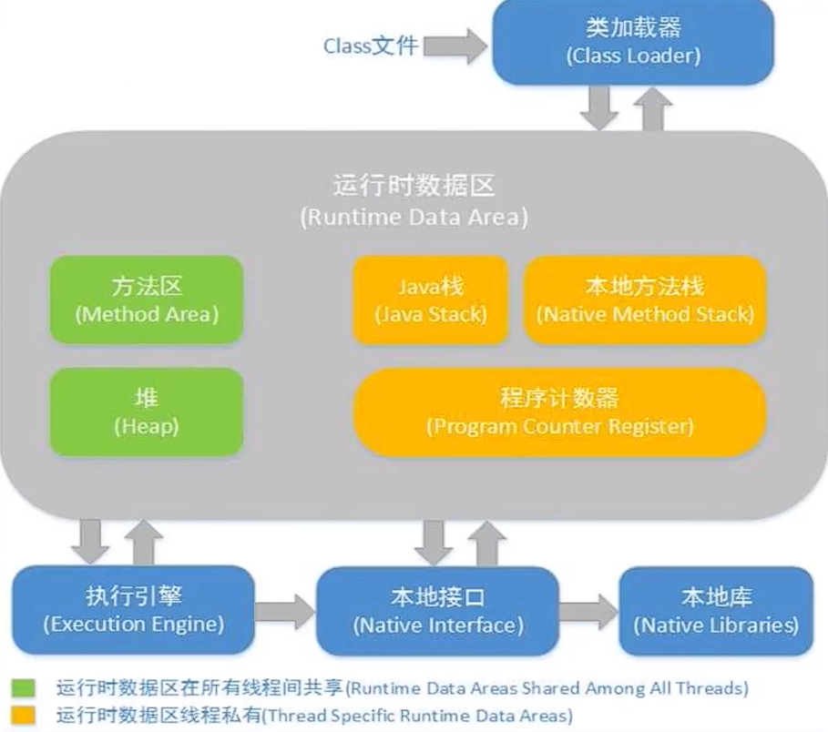

### Java对象模型

和Java**对象**在虚拟机中的表现形式有关

Java对象自身的存储模型

 -> 栈，堆，方法区

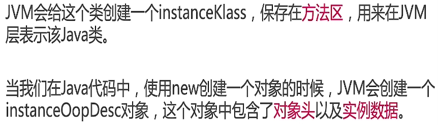

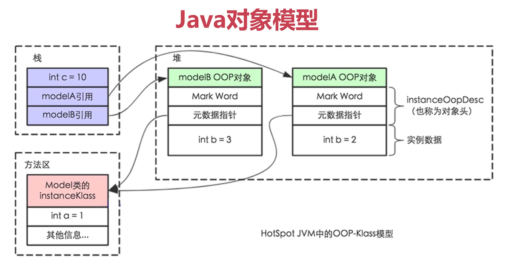

## 重排序

重排序通常是编译器或运行时环境为了**优化程序性能**而采取的对指令进行重新排序执行的一种手段

重排序分为两类：编译器重排序（编译时）和运行期重排序（运行时）

代码实际执行的顺序和代码在Java文件中的顺序不一致，也即代码指令并不是严格按照代码语句顺序执行的

三种情况：

**1.编译器优化** （包括JVM，JI编译器等）
**2.CPU指令重排 **
**3.内存的重排序** （可见性的问题，线程A 的修改 B却看不到）

### 为什么指令重排序能提高效率

CPU一般采用**流水线**来执行指令。一个指令的执行被分成：取指、译码、访存、执行、写回、等若干个阶段

然后，多条指令可以同时存在于流水线中，同时被执行。指令流水线**并不是串行**，并不会因为一个耗时很长的指令在“执行”阶段呆很长时间，而导致后续的指令都卡在“执行”之前的阶段上。

相反，流水线是并行的，**多个指令可以同时处于同一个阶段**，只要CPU内部相应的处理部件未被占满即可。比如：CPU有一个加法器和一个除法器，那么一条加法指令和一条除法指令就可能同时处于“执行”阶段，而两条加法指令在“执行”阶段就只能串行工作。

## 可见性

### 为什么

从下到上，容量逐渐减小，但是速度逐渐增加

1. CPU有多级缓存，导致读的数据过期，线程间的对于共享变量的可见性问题**不是直接由多核**引起的，而是由**多缓存**引起的，如果所有核心都只使用一个缓存，那么也就不存在内存可见性问题
2. 每个核心都会将在自己需要的数据读到独占缓存中，数据修改后也是写入到缓存中，然后等待刷入到主存中，所以会导致有些核心读取的值是一个过期的值

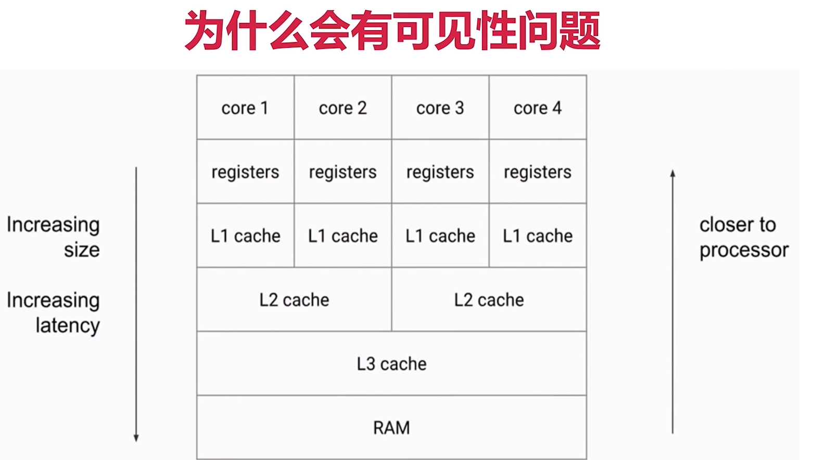

### 主内存和本地内存的区别

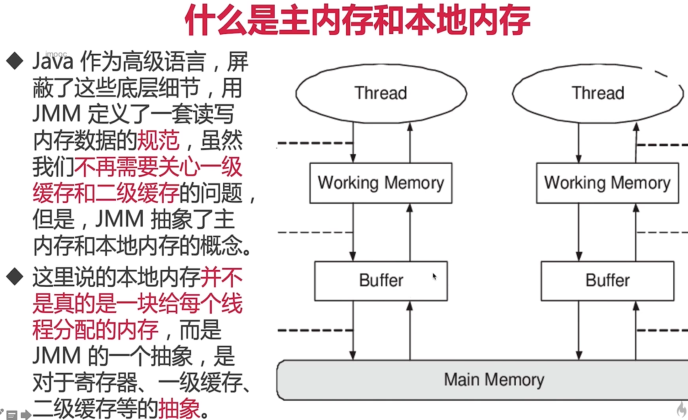

Java屏蔽了这些底层细节，JMM定义了一套读写内存数据的规范，JMM抽象了主内存和本地内存的概念

其中，本地内存并不是真的是一块给每个线程分配的内存，而是JMM的一个抽象，是对于寄存器、一级缓存、二级缓存等的抽象

**主内存和本地内存的关系**
  -> **所有变量都存储在主内存**中，同时每个线程也有自己独立的工作内存，工作内存中的变量内容是主内存中的**拷贝**

  -> 线程**不能直接读写主内存中的变量**，而是只能❗操作自己工作内存中的变量，然后**再同步**到主内存中

  -> 主内存是多个线程共享的，但线程间不共享工作内存，如果线程间需要通信，必须**借助主内存中转❗来完成**

  **所有的共享变量存在于主内存中，每个线程有自己的本地内存，而且线程读写共享数据也是通过本地内存交换的，所有才导致了可见性问题**

### happens-before

用来**描述和解决可见性相关问题**：如果第一个操作 happens-before 第二个操作，那么我们就说第一个操作对于第二个操作是可见的，**也就是happens-before规则也像volatile一样保证了可见性，如synchronized，Lock，并发集合，Thread.join(),Thread.start() 等都可以保证可见性**

**规则如下**

#### 1.单线程规则

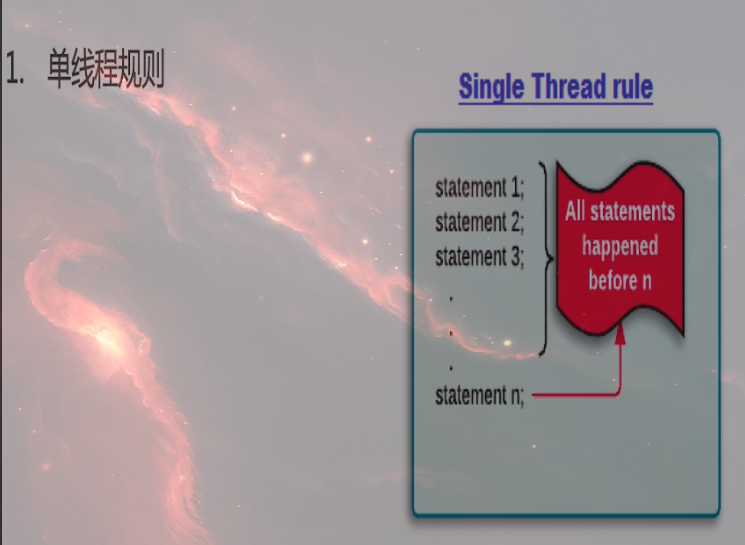

#### 2.锁操作（synchronized和lock）

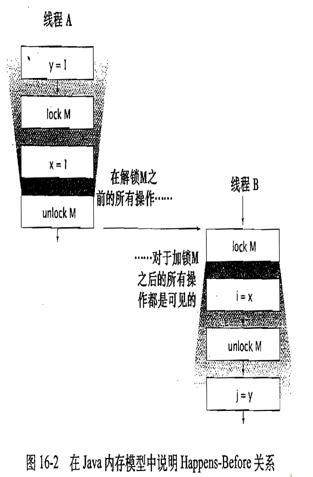

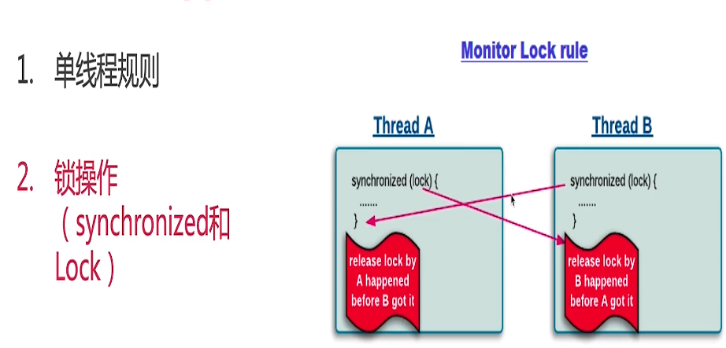

#### 3.volatile变量

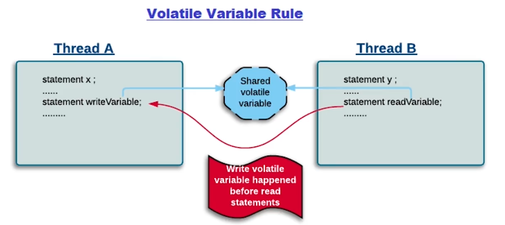

#### 4.线程启动

也就是子线程执行的所有语句都能看到主线程之前所有语句的结果

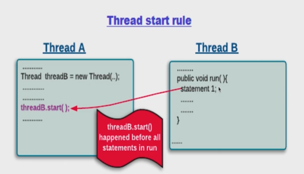

#### 5.线程join

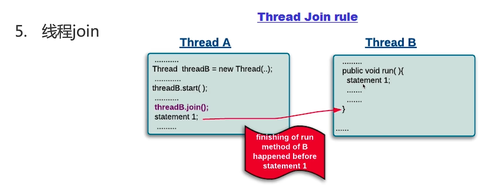

#### 6.传递性

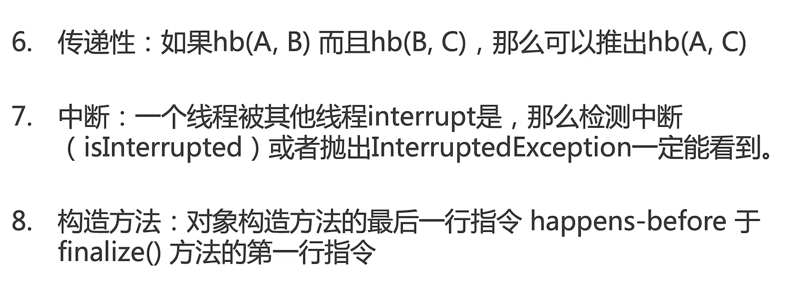

#### 7.中断

#### 8.构造方法

#### 9.工具类的happens-before规则

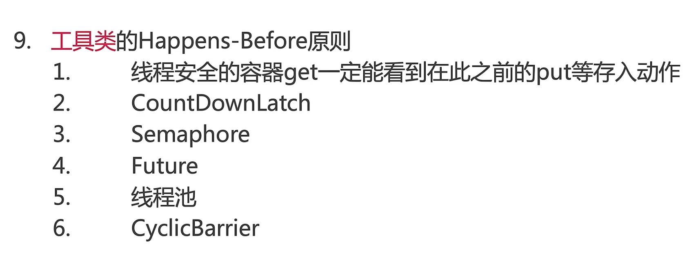

## 原子性

**生成对象的过程不是原子性**

1. 新建一个空的Persion对象
2. 把这个对象的地址指向p
3. 执行Person的构造函数

—

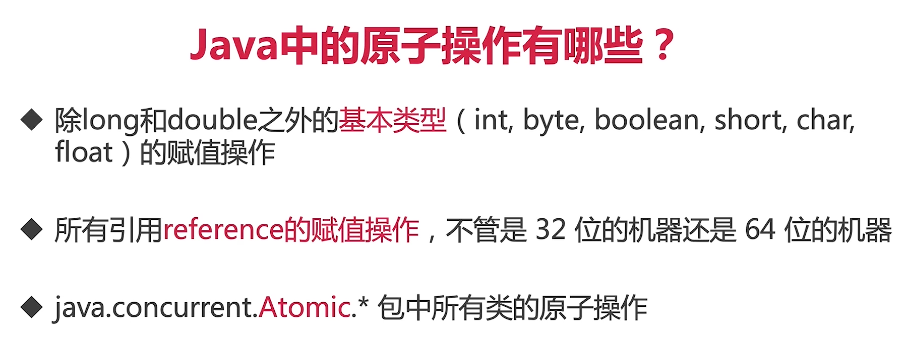

- Volatile能使得long和double的赋值是原子的

**为什么排除了long和double**

在32位上的JVM中，long和double的操作不是原子的，但是64位上的JVM是原子的

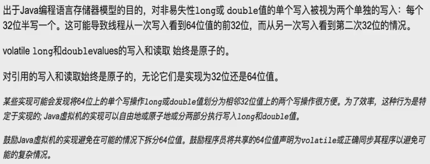

### 注意

