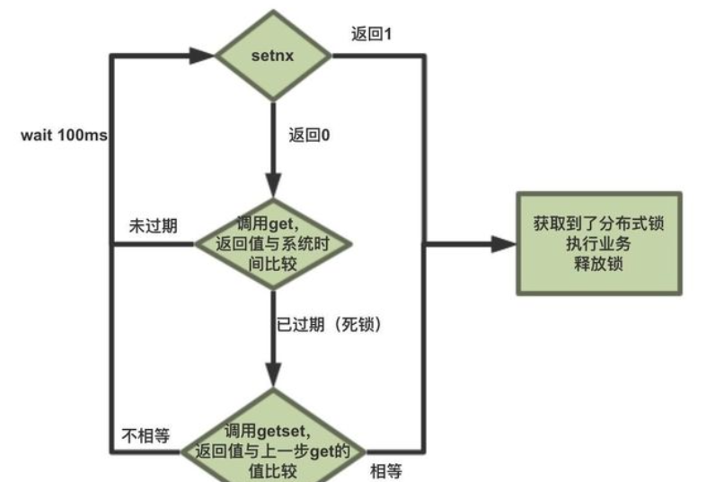
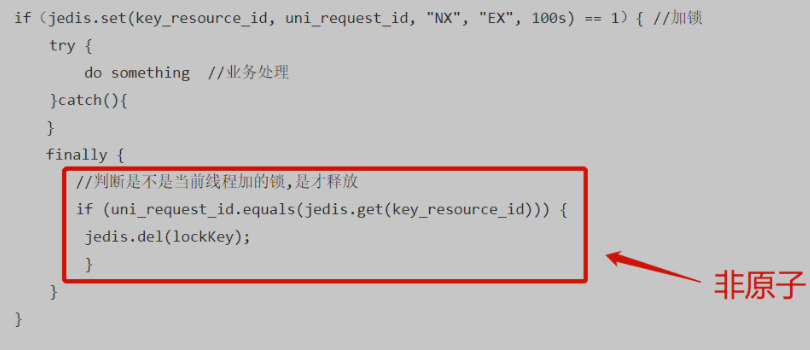
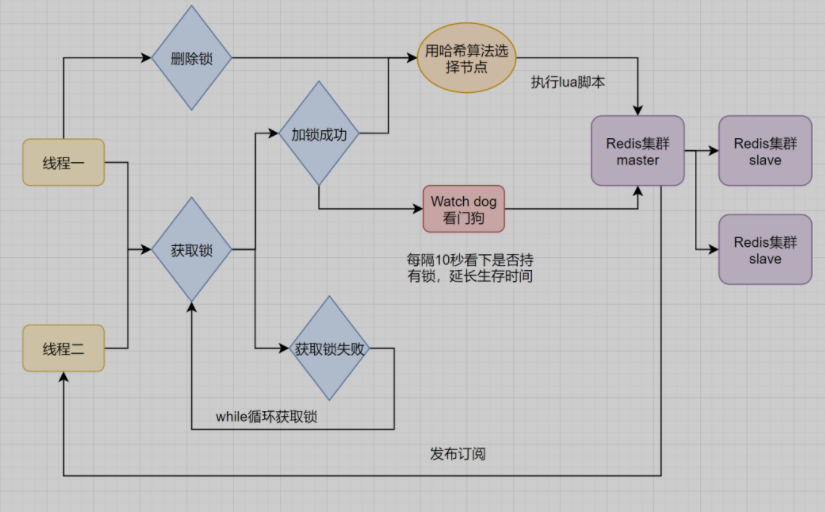
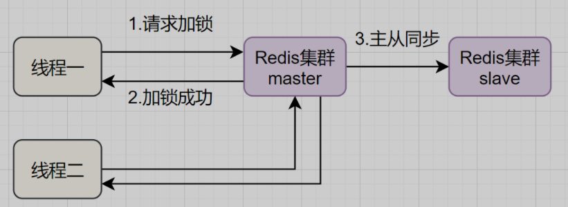
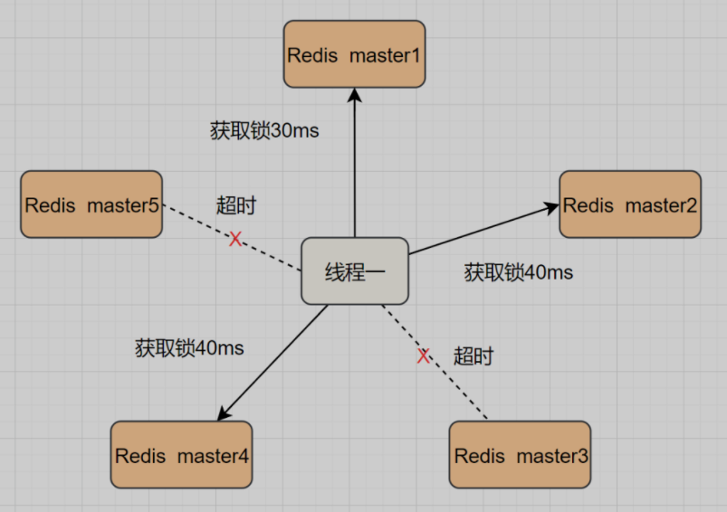
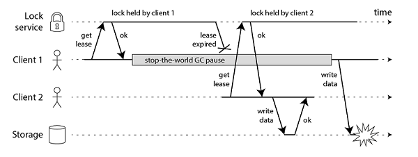
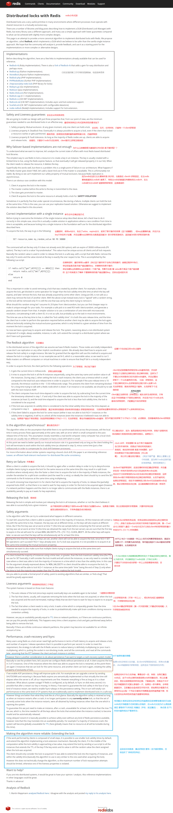

# Redis分布式锁

[TOC]

> 分布式锁，是控制分布式系统之间同步访问共享资源的一种方式

如果是本地加锁，在分布式情况下会带来数据不一致的问题

分布式锁就是，控制分布式系统不同进程共同访问共享资源的一种锁的实现，如果不同的系统或同一个系统的不同主机之间共享了某个临界资源，往往需要互斥要防止彼此干扰，以保证一致性

故此，分布锁一般有以下几个特性

- 互斥性  - 任意时刻，**只有一个客户端能持有锁**

- 锁超时释放，**不会发生死锁**  -  持有锁超时，可以释放，防止死锁，保证即使有一个客户端在持有锁的期间崩溃而没有主动解锁，也能保证后续其他客户端能加锁

- 可重入性  -  一个线程获取了锁之后，可以再次对其请求加速

- 三高  -  开销尽可能的低，高可用，具有容错性，只要大部分的Redis节点正常运行，客户端就可以加锁和解锁

- 安全性  -  锁只能被持有的客户端删除，不能被其他客户端删除，也就是解铃还须系铃人，加锁和解锁必须是同一个客户端，客户端不能把别人加的锁给解了

  

## 实现原理

实现的时候要注意

- 锁的信息**必须是会过期超时**的，不能让一个线程长期占有一个锁而导致死锁
- **同一时刻只能有一个线程获取到锁**

> setnx(key, value)：“set if not exits”，若该key-value不存在，则成功加入缓存并且返回1，否则返回0。
>
> get(key)：获得key对应的value值，若不存在则返回nil。
>
> getset(key, value)：先获取key对应的value值，若不存在则返回nil，然后将旧的value更新为新的value。
>
> expire(key, seconds)：设置key-value的有效期为seconds秒。

> 注意三个核心：**加锁，解锁，锁超时**

### 方案一 setnx + expire

setnx 是『SET if Not eXists』(如果不存在，则 SET)的简写。

 命令格式：SETNX key value；

使用：只在键 key 不存在的情况下，将键 key 的值设置为 value 。若键 key 已经存在， 则 SETNX 命令不做任何动作。返回值：命令在设置成功时返回 1 ，设置失败时返回 0 。

但是setnx， expire命令分开，**不是原子操作**，如果执行完了setnx加锁，正要执行expire时，进程crash，那么别的线程将永远无法获取到锁、

~~~java
public static void wrongGetLock1(Jedis jedis, String lockKey, String requestId, int expireTime) {
 
    Long result = jedis.setnx(lockKey, requestId);
    if (result == 1) {
        // 若在这里程序突然崩溃，则无法设置过期时间，将发生死锁
        jedis.expire(lockKey, expireTime);
    }
}
~~~

### 方案二 setnx + value(系统时间+过期时间)

该方案要求分布式环境下，每个客户端的时间必须是同步的，且该锁没有保存持有者的唯一标识，可能被别的客户端释放或解锁，当锁过期的时候，如果多个客户端同时执行`jedis.getSet()`方法，那么虽然最终只有一个客户端可以加锁，但是这个客户端的锁的过期时间可能被其他客户端覆盖

~~~java
public static boolean wrongGetLock2(Jedis jedis, String lockKey, int expireTime) {
 
    long expires = System.currentTimeMillis() + expireTime;
    String expiresStr = String.valueOf(expires);
 
    // 如果当前锁不存在，返回加锁成功
    if (jedis.setnx(lockKey, expiresStr) == 1) {
        return true;
    }
 
    // 如果锁存在，获取锁的过期时间
    String currentValueStr = jedis.get(lockKey);
    if (currentValueStr != null && Long.parseLong(currentValueStr) < System.currentTimeMillis()) {
        // 锁已过期，获取上一个锁的过期时间，并设置现在锁的过期时间
        String oldValueStr = jedis.getSet(lockKey, expiresStr);
        if (oldValueStr != null && oldValueStr.equals(currentValueStr)) {
            // 考虑多线程并发的情况，只有一个线程的设置值和当前值相同，它才有权利加锁
            return true;
        }
    }
        
    // 其他情况，一律返回加锁失败
    return false;
 
}
~~~

### 方案三  SET的扩展命令（SET EX PX NX）

（`SET key value[EX seconds][PX milliseconds][NX|XX]`），原子性

~~~markdown
SET key value[EX seconds][PX milliseconds][NX|XX]

NX :表示key不存在的时候，才能set成功，也即保证只有第一个客户端请求才能获得锁，而其他客户端请求只能等其释放锁，才能获取。
EX seconds :设定key的过期时间，时间单位是秒。
PX milliseconds: 设定key的过期时间，单位为毫秒
XX: 仅当key存在时设置值
~~~

- 问题一：**「锁过期释放了，业务还没执行完」**。假设线程a获取锁成功，一直在执行临界区的代码。但是100s过去后，它还没执行完。但是，这时候锁已经过期了，此时线程b又请求过来。显然线程b就可以获得锁成功，也开始执行临界区的代码。那么问题就来了，临界区的业务代码都不是严格串行执行的啦。
- 问题二：**「锁被别的线程误删」**。假设线程a执行完后，去释放锁。但是它不知道当前的锁可能是线程b持有的（线程a去释放锁时，有可能过期时间已经到了，此时线程b进来占有了锁）。那线程a就把线程b的锁释放掉了，但是线程b临界区业务代码可能都还没执行完呢。

### 方案四  SET EX PX NX  + 校验唯一随机值,再删除

给value值设置一个标记当前线程唯一的随机数，在删除的时候，校验一下

lua保证原子

~~~lua
if redis.call('get',KEYS[1]) == ARGV[1] then 
   return redis.call('del',KEYS[1]) 
else
   return 0
end;
~~~

### 解锁的错误情况

~~~java
// 情况1 不先判断锁的拥有者而直接解锁的方式，会导致任何客户端都可以随时进行解锁，即使这把锁不是它的
public static void wrongReleaseLock1(Jedis jedis, String lockKey) {
    jedis.del(lockKey);
}

// 情况2
// A申请成功拿到锁之后，由于某些原因，A一直在执行,并且在达到超时时间之后，都没有发送释放锁的命令，锁自动到期后，其他服务如B拿到该锁，此时，若A服务执行完之后，会直接把B服务的锁删除
// 解决：客户端在发送set命令时，将键值设置为一个唯一的随机值，并且只有它自己知道，删除的时候执行lua脚本
public static void wrongReleaseLock2(Jedis jedis, String lockKey, String requestId) {
        
    // 判断加锁与解锁是不是同一个客户端
    if (requestId.equals(jedis.get(lockKey))) {
        // 若在此时，这把锁突然不是这个客户端的，则会误解锁
        jedis.del(lockKey);
    }
}
~~~

### 总结上面单机版的实现

> 出现的问题

1. setnx与expire的非原子性

2. 锁误解除

3. 超时解锁导致并发（如果线程 A 成功获取锁并设置过期时间 30 秒，但线程 A 执行时间超过了 30 秒，锁过期自动释放，此时线程 B 获取到了锁，线程 A 和线程 B 并发执行。）

   > - 将过期时间设置足够长，确保代码逻辑在锁释放之前能够执行完成。
   > - 为获取锁的线程增加守护线程，为将要过期但未释放的锁增加有效时间

4. 不可重入

5. 无法的等待锁释放（上述命令执行都是立即返回的，如果客户端可以等待锁释放就无法使用）

   > - 可以通过客户端轮询的方式解决该问题，当未获取到锁时，等待一段时间重新获取锁，直到成功获取锁或等待超时。这种方式比较消耗服务器资源，当并发量比较大时，会影响服务器的效率。
   > - 另一种方式是使用 Redis 的发布订阅功能，当获取锁失败时，订阅锁释放消息，获取锁成功后释放时，发送锁释放消息。

- 第一个为key，使用key来当锁，因为key是唯一的。
- 第二个为value，传的是requestId，为什么还要用到value？原因就是在上面讲到可靠性时，分布式锁要满足第四个条件**解铃还须系铃人**，通过给value赋值为requestId，我们就知道这把锁是哪个请求加的了，在解锁的时候就可以有依据。requestId可以使用`UUID.randomUUID().toString()`方法生成。**键值应为随机数**，保证只有知道随机值的客户端才能释放锁
- 第三个为nxxx，这个参数我们填的是NX，意思是SET IF NOT EXIST，即当key不存在时，我们进行set操作；若key已经存在，则不做任何操作；
- 第四个为expx，这个参数传的是PX，意思是要给这个key加一个过期的设置，具体时间由第五个参数决定。
- 第五个为time，与第四个参数相呼应，代表key的过期时间。

~~~java
// 加锁
private static final String LOCK_SUCCESS = "OK";
    private static final String SET_IF_NOT_EXIST = "NX";
    private static final String SET_WITH_EXPIRE_TIME = "PX";
 
    /**
     * 尝试获取分布式锁
     * @param jedis Redis客户端
     * @param lockKey 锁
     * @param requestId 请求标识
     * @param expireTime 超期时间
     * @return 是否获取成功
     */
    public static boolean tryGetDistributedLock(Jedis jedis, String lockKey, String requestId, int expireTime) {

		/**
		执行上面的set()方法就只会导致两种结果：1. 当前没有锁（key不存在），那么就进行加锁操作，并对锁设置个有效期，同时value表示加锁的客户端。2. 已有锁存在，不做任何操作。
		*/
        String result = jedis.set(lockKey, requestId, SET_IF_NOT_EXIST, SET_WITH_EXPIRE_TIME, expireTime);
 
        if (LOCK_SUCCESS.equals(result)) {
            return true;
        }
        return false;
 
    }

// 解锁
private static final Long RELEASE_SUCCESS = 1L;
 
    /**
     * 释放分布式锁
     * @param jedis Redis客户端
     * @param lockKey 锁
     * @param requestId 请求标识
     * @return 是否释放成功
     */
    public static boolean releaseDistributedLock(Jedis jedis, String lockKey, String requestId) {
 
        String script = "if redis.call('get', KEYS[1]) == ARGV[1] then return redis.call('del', KEYS[1]) else return 0 end";
        Object result = jedis.eval(script, Collections.singletonList(lockKey), Collections.singletonList(requestId));
 
        if (RELEASE_SUCCESS.equals(result)) {
            return true;
        }
        return false;
 
    }
~~~

### 方案五 Redisson框架

只要线程一加锁成功，就会启动一个`watch dog`看门狗，它是一个后台线程，会每隔10秒检查一下，如果线程1还持有锁，那么就会不断的延长锁key的生存时间。因此，Redisson就是使用Redisson解决了**「锁过期释放，业务没执行完」**问题。

也就是用该机制保证锁时间大于业务执行时间，由该守护线程给锁进行无限续期，当锁不存在时就跳过，存在就续期，作为守护线程的原因是：守护线程**依赖于主线程**，当主线程挂了之后，守护线程也会挂掉！这样能**避免程序宕机之后，续期的线程依旧续期，造成死锁**

### 方案六 多机实现的分布式锁Redlock+Redisson

如果线程一在Redis的master节点上拿到了锁，但是加锁的key还没同步到slave节点。恰好这时，master节点发生故障，一个slave节点就会升级为master节点，但是，此时所进行的主从复制是异步的，也就是重新选举出来的主节点不一定有锁的信息，导致线程二就可以获取同个key的锁，但线程一也已经拿到锁了，锁的安全性就没了。

为了解决这个问题，Redis作者 antirez提出一种高级的分布式锁算法：**Redlock**。Redlock核心思想是这样的：

> **多个Redis master部署**，以保证它们不会同时宕掉。并且这些master节点是完全相互独立的，相互之间不存在数据同步。同时，需要确保在这多个master实例上，是与在Redis单实例，使用相同方法来获取和释放锁。

> - 1.获取当前时间，以毫秒为单位。
> - 2.按顺序向5个master节点请求加锁。客户端设置网络连接和响应超时时间，并且**超时时间要小于锁的失效时间**。（假设锁自动失效时间为10秒，则超时时间一般在5-50毫秒之间,假设超时时间是50ms）。如果超时，跳过该master节点，尽快去尝试下一个master节点。
> - 3.客户端使用当前时间减去开始获取锁时间（即步骤1记录的时间），得到获取锁使用的时间。当且**仅当超过一半**（N/2+1，这里是5/2+1=3个节点）的Redis master节点都获得锁，并且**使用的时间小于锁失效时间**，锁**才算**获取成功。（如上图，10s> 30ms+40ms+50ms+4m0s+50ms）
> - 如果取到了锁，key的真正有效时间就变了，需要减去获取锁所使用的时间。
> - 如果获取锁失败（没有在至少N/2+1个master实例取到锁，有或者获取锁时间已经超过了有效时间），客户端要在所有的master节点上解锁（即便有些master节点根本就没有加锁成功，也需要解锁，以防止有些漏网之鱼）。

简化下步骤就是：

- 按顺序向5个master节点请求加锁
- 根据设置的超时时间来判断，是不是要跳过该master节点。
- 如果大于等于3个节点加锁成功，并且使用的时间小于锁的有效期，即可认定加锁成功啦。
- 如果获取锁失败，解锁！
- 没有获取成功后，该服务会向所有Master节点发送释放锁的命令，并随机延迟时间后再请求获得锁

## 存在的问题 

- n次加锁带来的性能问题，可以使用多路复用技术来优化

- 所有Master节点全部重启导致锁信息丢失，可以激活AOF持久化

- 实时刷盘带来的性能问题，可以根据业务的重要性进行权衡

### 客户端长时间阻塞导致锁失效问题

客户端1得到了锁，因为网络问题或者GC等原因导致长时间阻塞，然后业务程序还没执行完锁就过期了，这时候客户端2也能正常拿到锁，可能会导致线程安全的问题。

**解决**

>  计算时间内异步启动另外一个线程去检查的问题，这个key是否超时，当锁超时时间快到期且逻辑未执行完，延长锁超时时间。

### redis服务器时钟漂移问题

如果redis服务器的机器时钟发生了向前跳跃，就会导致这个key过早超时失效，比如说客户端1拿到锁后，key的过期时间是12:02分，但redis服务器本身的时钟比客户端快了2分钟，导致key在12:00的时候就失效了，这时候，如果客户端1还没有释放锁的话，就可能导致多个客户端同时持有同一把锁的问题。

### 单点实例故障，锁未及时同步导致丢失

如果redis是单master模式的，当这台机宕机的时候，那么所有的客户端都获取不到锁了，为了提高可用性，可能就会给这个master加一个slave，但是因为redis的主从同步是异步进行的，可能会出现客户端1设置完锁后，master挂掉，slave提升为master，因为**异步复制**的特性（**不能保证互斥性**），客户端1设置的锁丢失了，这时候客户端2设置锁也能够成功，导致客户端1和客户端2同时拥有锁。

master挂掉之后，如果该加锁的Key还没有同步到slave节点，则会导致锁丢失

为了解决Redis单点问题，redis的作者提出了**RedLock**算法。

## RedLock

几大特点：

- 互斥访问：即永远只有一个 client 能拿到锁
- 避免死锁：最终 client 都可能拿到锁，不会出现死锁的情况，即使锁定资源的服务崩溃或者分区，仍然能释放锁。
- 容错性：只要大部分 Redis 节点存活（一半以上），就可以正常提供服务

## RedLock算法下，如果各有一半的锁分别被两个客户端获取了，怎么处理

**Redlock :**

一个Client想要获得一个锁需要以下几个操作：

1、得到本地时间

2、Client使用相同的key和随机数,按照顺序在每个Master实例中尝试获得锁。在获得锁的过程中，为每一个锁操作设置一个快速失败时间(如果想要获得一个10秒的锁，那么每一个锁操作的失败时间设为5-50ms)。这样可以避免客户端与一个已经故障的Master通信占用太长时间，通过快速失败的方式尽快的与集群中的其他节点完成锁操作。

3、客户端计算出与master获得锁操作过程中消耗的时间，**当且仅当Client获得锁消耗的时间小于锁的存活时间，并且在一半以上（N/2+1）的master节点中获得锁**。才认为client成功的获得了锁。

4、如果已经获得了锁，**Client执行任务的时间窗口是锁的存活时间减去获得锁消耗的时间。**

5、如果Client获得锁的数量不足一半以上，或获得锁的时间超时，那么认为获得锁失败。客户端**需要尝试在所有的master节点中释放锁， 即使在第二步中没有成功获得该Master节点中的锁，仍要进行释放操作。**

---

>客户端一段时间内获取不到大部分锁的话，会释放已经获得的锁，这样子最终两个客户端都会释放各自的一半锁，然后根据业务逻辑重试获取分布式锁，或者抛出异常

