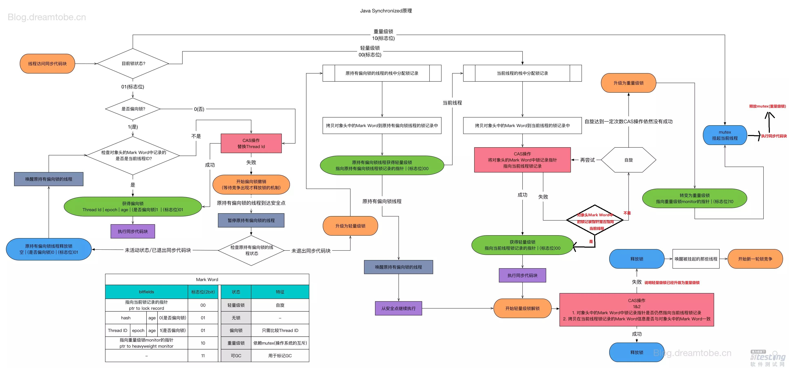
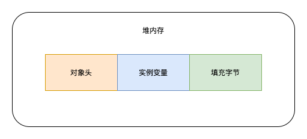
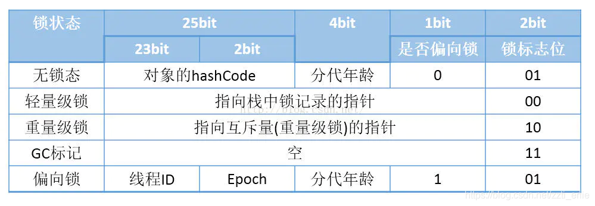
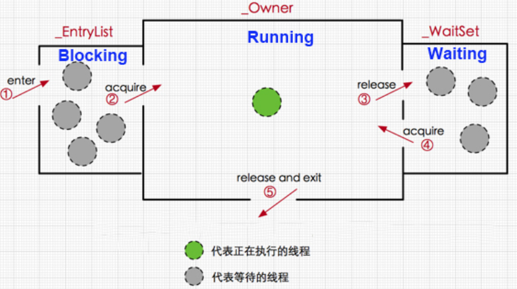
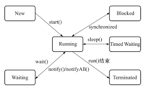
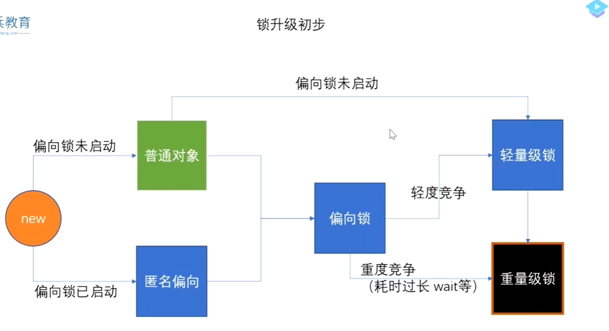
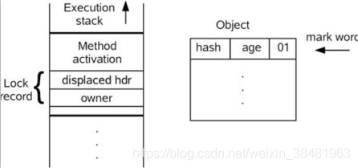
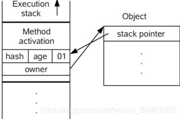
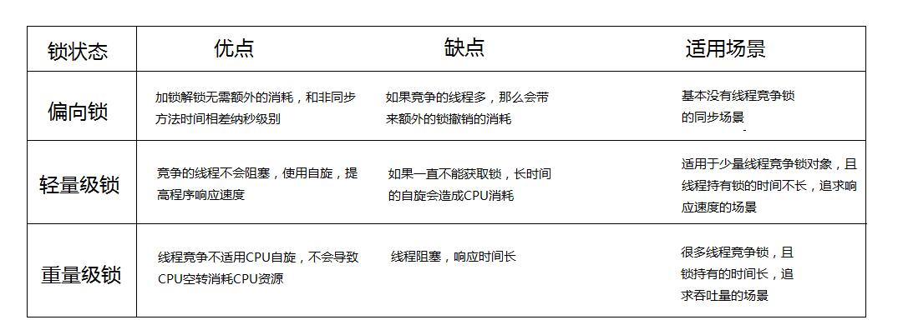

# Synchronized锁升级过程

[TOC]

## 非公平锁

>  *synchronized* 是非*公平锁*,可以重入

1)公平锁：指多个线程按照申请锁的顺序来获取锁，类似于日常的排队

(2)非公平锁：多个线程获取锁的顺序并不是按照申请锁的顺序来，通俗来说就是插队

## 作用范围

synchronized能同时保证可见性，原子性，有序性，注意不同于volatile只能保证可见性，有序性，**不能保证原子性**

synchronized可以用在如下地方，也即**三种主要的使用方式**

1. 修饰实例方法，对当前实例对象this加锁，进入同步代码前要获得当前对象实例的锁
2. 修饰静态方法，对当前类的Class对象加锁，会作用于类的所有对象实例，因为静态成员不属于任何一个实例对象，是类成员
3. 修饰代码块，指定加锁对象，对给定对象加锁，进⼊同步代码前要获得给定对象的锁。

 **总结：synchronized锁住的资源只有两类：一个是对象**，一个是**类**。

~~~java
public class SynchronizedDemo {
    public synchronized void methodOne() {}
}

public class SynchronizedDemo {
    public static synchronized void methodTwo() {}
}

public class SynchronizedDemo {
    public void methodThree() {
    	// 对当前实例对象this加锁
        synchronized (this) {
        }
    }

    public void methodFour() {
    	// 对class对象加锁
        synchronized (SynchronizedDemo.class) {
        }
    }
}
~~~

## 实现原理

> JVM基于进入和退出Monitor对象来实现方法同步和代码块同步
>
> 使用一种monitor机制，在进入锁时候先执行monitorenter指令。退出的时候执行monitorexit指令

### Java对象组成

对象是放在堆内存中的，对象大致可以分为三个部分，分别是**对象头，实例变量和填充字节**

**对象头是实现synchronized锁的基础，synchronized申请锁、上锁、释放锁都与对象头有关**

- 对象头，**主要包括两部分1. Mark Word （标记字段），2.Klass Pointer（类型指针）**。Klass Point 是对象指向它的类元数据的指针，虚拟机通过这个指针来确定这个对象是哪个类的实例（**即指向方法区类的模版信息**）。Mark Word用于存储对象**自身的运行时数据**，**`Mark Word`存储对象的hashCode、锁信息或分代年龄或GC标记等信息**。
- 实例变量，存放类的属性数据信息，包括父类的属性信息，这部分内存按4字节对齐
- 填充数据，由于虚拟机要求对象起始地址必须是8字节的整数倍。**填充数据不是必须存在的，仅仅是为了字节对齐**
-  同步代码块是利用 monitorenter 和 monitorexit 指令实现的，而同步方法则是利用 flags 实现的。

**例如**

~~~java
public class Test {
    int a = 100;
}
~~~

填充数据主要是为了方便内存管理，如你想要10字节的内存，但是会给你分配16字节的内存，多出来的字节就是填充数据

synchronized不论是修饰方法还是代码块，**都是通过持有修饰对象的锁来实现同步**，那么synchronized锁对象是存在哪里的呢？答案是**存在锁对象的对象头Mark Word**

由于对象头的信息是与对象自身定义的数据没有关系的额外存储成本，因此考虑到JVM的空间效率，Mark Word 被设计成为一个非固定的数据结构，以便存储更多有效的数据，它会根据对象本身的状态复用自己的存储空间，也就是说，Mark Word会随着程序的运行发生变化，变化状态如下 (32位虚拟机)：

其中轻量级锁和偏向锁是Java 6 对 synchronized 锁进行优化后新增加的

重量级锁也就是通常说synchronized的对象锁，锁标识位为10，其中指针指向的是monitor对象（也称为**管程或监视器锁**）的起始地址。每个对象都存在着一个 monitor 与之关联。在Java虚拟机(HotSpot)中，monitor是由ObjectMonitor实现的，其主要数据结构如下（位于HotSpot虚拟机源码ObjectMonitor.hpp文件，C++实现的），省略部分属性

~~~cpp
ObjectMonitor() {
    _count        = 0; //记录数
    _recursions   = 0; //锁的重入次数
    _owner        = NULL; //指向持有ObjectMonitor对象的线程 
    _WaitSet      = NULL; //调用wait后，线程会被加入到_WaitSet
    _EntryList    = NULL ; //等待获取锁的线程，会被加入到该列表
}
~~~

结合线程状态解释一下执行过程

1. 新建（New），新建后尚未启动的线程
2. 运行（Runable），Runnable包括了操作系统线程状态中的Running和Ready
3. 无限期等待（Waiting），不会被分配CPU执行时间，要等待被其他线程显式的唤醒。例如调用没有设置Timeout参数的Object.wait()方法
4. 限期等待（Timed Waiting），不会被分配CPU执行时间，不过无需等待其他线程显示的唤醒，在一定时间之后会由系统自动唤醒。例如调用Thread.sleep()方法
5. 阻塞（Blocked），线程被阻塞了，“阻塞状态”与“等待状态”的区别是：“阻塞状态”在**等待获取着一个排他锁**，这个事件**将在另外一个线程放弃这个锁的时候发生**，而“等待状态”则是在**等待一段时间，或者唤醒动作的发生**。在程序等待进入同步区域的时候，线程将进入这种状态
6. 结束（Terminated）：线程结束执行

对于一个synchronized修饰的方法(代码块)来说：

1. 当多个线程同时访问该方法，那么这些线程会先被**放进_EntryList队列**，此时线程处于blocked状态
2. 当一个线程获取到了对象的monitor后，那么就可以进入running状态，执行方法，此时，ObjectMonitor对象的 _ owner指向当前线程，_count加1 表示当前对象锁被一个线程获取
3. 当running状态的线程调用wait()方法，那么当前线程释放monitor对象，进入waiting状态，ObjectMonitor对象的 _ owner变为null，_ count减1  同时线程进入 _ WaitSet队列，直到有线程调用notify()方法唤醒该线程，则该线程进入           _ EntryList队列，竞争到锁再进入_Owner区
4. 如果当前线程执行完毕，那么也释放monitor对象，ObjectMonitor对象的_owner变为null， _count减1

注意

- synchronized是可重入的，所以不会自己把自己锁死
- synchronized锁一旦被一个线程持有，其他试图获取该锁的线程将被阻塞。

由此看来，monitor对象存在于每个Java对象的对象头中(存储的是指针)，synchronized锁便是通过这种方式获取锁的，也是**为什么Java中任意对象可以作为锁的原因，同时也是notify/notifyAll/wait等方法存在于顶级对象Object中的原因**

## synchronized如何获取monitor对象

### synchronized修饰代码块

~~~java
public class SyncCodeBlock {
    public int count = 0;
    public void addOne() {
        synchronized (this) {
            count++;
        }
    }
}
~~~

反编译之后代码如下

~~~java
  public void addOne();
    descriptor: ()V
    flags: ACC_PUBLIC
    Code:
      stack=3, locals=3, args_size=1
         0: aload_0
         1: dup
         2: astore_1
         3: monitorenter // 进入同步方法
         4: aload_0
         5: dup
         6: getfield      #2                  // Field count:I
         9: iconst_1
        10: iadd
        11: putfield      #2                  // Field count:I
        14: aload_1
        15: monitorexit // 退出同步方法
        16: goto          24
        19: astore_2
        20: aload_1
        21: monitorexit // 退出同步方法
        22: aload_2
        23: athrow
        24: return
      Exception table:
~~~

可以看到进入同步代码块，执行monitorenter指令，退出同步代码块，执行monitorexit指令，可以看到有2个monitorexit指令，第一个是正常退出执行的，第二个是当异常发生时执行的

代码块的同步是利用monitorenter和monitorexit这两个字节码指令。它们分别位于同步代码块的开始和结束位置。当jvm执行到monitorenter指令时，**当前线程试图获取monitor对象的所有权**，如果未加锁或者已经被当前线程所持有，就把锁的计数器+1；当执行monitorexit指令时，锁计数器-1；当锁计数器为0时，该锁就被释放了。如果获取monitor对象失败，该线程则会进入阻塞状态，直到其他线程释放锁。

### synchronized修饰方法

~~~java
public class SyncMethod {
    public int count = 0;
    public synchronized void addOne() {
        count++;
    }
}
~~~

反编译之后代码如下

~~~java
  public synchronized void addOne();
    descriptor: ()V
    // 方法标识ACC_PUBLIC代表public修饰，ACC_SYNCHRONIZED指明该方法为同步方法
    flags: ACC_PUBLIC, ACC_SYNCHRONIZED
    Code:
      stack=3, locals=1, args_size=1
         0: aload_0
         1: dup
         2: getfield      #2                  // Field count:I
         5: iconst_1
         6: iadd
         7: putfield      #2                  // Field count:I
        10: return
      LineNumberTable:
~~~

并没有看到monitorenter和monitorexit指令，那是怎么来实现同步的呢？
可以看到方法被标识为ACC_SYNCHRONIZED，表明这是一个同步方法

方法级的同步是隐式，即无需通过字节码指令来控制的，它实现在方法调用和返回操作之中。JVM可以从方法常量池中的方法表结构(method_info Structure) 中的 ACC_SYNCHRONIZED 访问标志区分一个方法是否同步方法。当方法调用时，调用指令将会 检查方法的 ACC_SYNCHRONIZED 访问标志是否被设置，如果设置了，**执行线程将先持有monitor（虚拟机规范中用的是管程一词）， 然后再执行方法，最后再方法完成(无论是正常完成还是非正常完成)时释放monitor。**

## 锁升级

普通对象和匿名偏向的区别：因为JVM启动4s之后才会启动偏向锁，(利用4s钟的时间判断 需不需要启动偏向锁，如果JVM能确定会有多个线程争抢某些对象 则不需要启动偏向锁)

　　所以在程序前4s new出来的对象是普通对象

　　4s之后new出现的对象是匿名偏向(没有偏向任何人）

> 上面谈到了，Synchronized是通过对象内部的一个叫做监视器锁（monitor）来实现的，监视器锁本质又是依赖于底层的操作系统的 Mutex Lock (互斥锁) 来实现的，而操作系统实现线程之间的切换需要从用户态转换为内核态，成本高，需要较长的时间，因此，这种依赖于操作系统Mutex Lock所实现的锁我们称之为“重量级锁”。

在Java早期版本中，synchronized属于重量级锁，效率低下，因为操作系统实现线程之间的切换时需要从用户态转换到核心态，这个状态之间的转换需要相对比较长的时间，时间成本相对较高。

庆幸的是在jdk1.6之后Java官方对从JVM层面对synchronized较大优化，所以现在的synchronized锁效率也优化得很不错了，Jdk1.6之后，为了减少获得锁和释放锁所带来的性能消耗，引入了偏向锁和轻量级锁，简单介绍一下

synchronized锁有四种状态，无锁，偏向锁，轻量级锁，重量级锁，这几个状态会随着竞争状态逐渐升级，**锁可以升级但不能降级，但是偏向锁状态可以被重置为无锁状态**

### 偏向锁

> 1.6中引入，目的是消除数据在无竞争情况下的同步原语，进一步提高程序的运行性能

经过HotSpot的作者大量的研究发现，大多数时候是不存在锁竞争的，常常是**一个线程多次获得同一个锁**，因此如果每次都要竞争锁会增大很多没有必要付出的代价，为了降低获取锁的代价，才引入的偏向锁，因为释放锁的过程是需要从用户态转换到内核态的，消耗大，**没有必要主动释放锁**

1. 判断是否为可偏向状态
2. 如果为可偏向状态，则判断线程ID是否是当前线程，如果是进入同步块；
3. 如果线程ID并未指向当前线程，利用CAS操作竞争锁，如果竞争成功，将Mark Word中线程ID更新为当前线程ID，进入同步块
4. 如果竞争失败，等待全局安全点，准备撤销偏向锁，根据线程是否处于活动状态，决定是转换为无锁状态还是升级为轻量级锁。

当线程1访问代码块并获取锁对象时，会在java对象头和栈帧中记录偏向的锁的threadID，因为**偏向锁不会主动释放锁**，因此以后线程1再次获取锁的时候，需要**比较当前线程的threadID和Java对象头中的threadID是否一致**，如果一致（还是线程1获取锁对象），则无需使用CAS来加锁、解锁；如果不一致（其他线程，如线程2要竞争锁对象，而偏向锁不会主动释放因此还是存储的线程1的threadID），那么**需要查看Java对象头中记录的线程1是否存活**，如果没有存活，那么锁对象**被重置为无锁状态**，其它线程（线程2）可以**竞争将其设置为偏向锁**；如果存活，那么立刻**查找该线程（线程1）的栈帧信息，如果还是需要继续持有这个锁对象**，那么**暂停当前线程1，撤销偏向锁，升级为轻量级锁**，如果线程1 不再使用该锁对象，那么将锁对象状态**设为无锁状态，重新偏向新的线程**

### 轻量级锁

轻量级锁考虑的是竞争锁对象的线程不多，而且线程持有锁的时间也不长的情景，减少传统的重量级锁使用操作系统互斥量产生的性能消耗。因为阻塞线程需要CPU从用户态转到内核态，代价较大，如果刚刚阻塞不久这个锁就被释放了，那这个代价就有点得不偿失了，因此这个时候就干脆不阻塞这个线程，**让它自旋这等待锁释放**。

在代码进入同步块的时候，如果此对象没有被锁定（锁标志位为“01”状态），虚拟机首先在当前线程的栈帧中建立一个名为**锁记录**（Lock Record）的空间，用于存储**对象目前Mark Word的拷贝**（官方把这份拷贝加了一个Displaced前缀，即Displaced Mark Word）。然后虚拟机使用CAS操作尝试将对象的Mark Word**更新为指向锁记录（Lock Record）的指针**。

如果更新成功，那么这个线程就拥有了该对象的锁，并且对象的Mark Word标志位转变为“00”，即表示此对象处于轻量级锁定状态；如果更新失败，虚拟机首先会检查对象的Mark Word**是否指向当前线程的栈帧**，如果指向说明当前线程**已经拥有了这个对象的锁**，那就可以直接进入同步块中执行，否则说明这个锁对象已经被其他线程占有了。如果有两条以上的线程竞争同一个锁，那轻量级锁不再有效，要膨胀为重量级锁，锁标志变为“10”，Mark Word中存储的就是指向重量级锁的指针，而后面等待的线程也要进入阻塞状态。

但是如果自旋的时间太长也不行，因为自旋是要消耗CPU的，因此自旋的次数是有限制的，比如10次或者100次，**如果自旋次数到了线程1还没有释放锁，或者线程1还在执行，线程2还在自旋等待，这时又有一个线程3过来竞争这个锁对象，那么这个时候轻量级锁就会膨胀为重量级锁。重量级锁把除了拥有锁的线程都阻塞，防止CPU空转。**

**JDK1.6之前：在某一个线程自旋次数超过十次就会升级成重量级锁**，默认是10，参数是-XXPreBlockSpin

**JDK1.6之后：自适应自旋，JDK根据线程运行情况自己判断**

