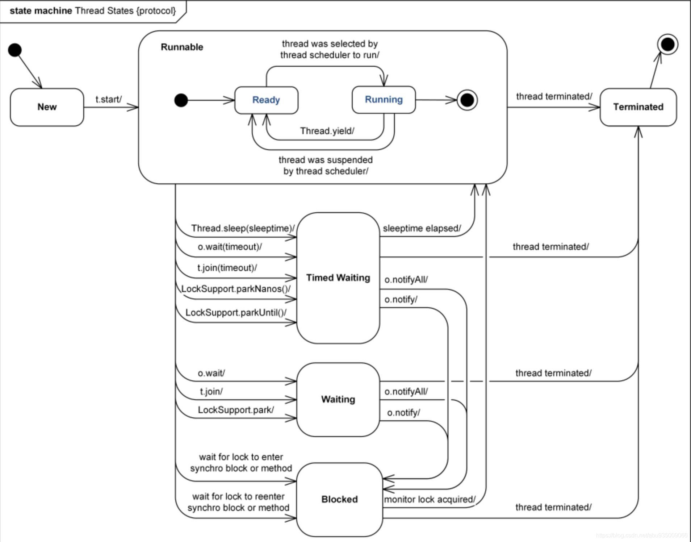

## 线程

[TOC]

## 五大生命周期

精准唤醒指定线程 **condition**

## 六大状态

- BLOCKED状态只有在synchronized代码块或者synchronized方法里面才可能会出现

### sleep和wait的区别

- 所属的类不同。sleep是Thread 类，wait是Object 类
- sleep导致程序暂停执行指定的时间，但是监控状态依然保持
- sleep线程**不会释放对象锁**，会自动唤醒，如果时间不到，使用interrupt方法强行打断
- wait **会释放**对象锁，进入等待池等待，且必须调用 notify / notifyAll 唤醒，才会进入就绪队列
- 使用的**位置不同**：对于wait来说使用之前要获取到锁的存在，所以必须放在同步代码，或者同步中进行执行， 但是 sleep来说可以放在任何的地方执行 。
- sleep需要**捕获异常** 。wait notify 等不需要这些。

**相同点**

- 都会让出CPU
- 线程都会进入 **等待状态 WAITING/TIMED_WAITING**

### start和run区别

- start启动线程。这时无需等待 run 方法体代码执行完毕，可以直接继续执行下面的代码。

  

