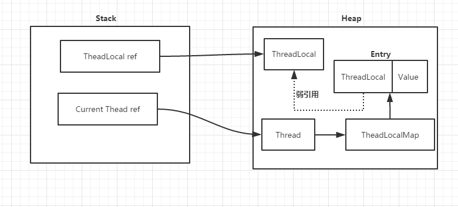
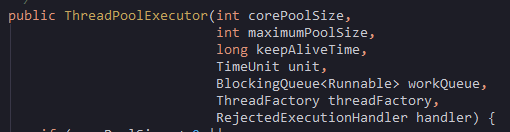

# ThreadLocal

[TOC]

ThreadLocal可以理解为TreadLocalMap的封装，ThreadLocal中存了ThreadLocalMap

> 和HashMap的不同点：
>
> hash计算方式不同，另外ThreadLocalMap解决冲突的方法是**开放地址法**。

其中key是ThreadLocal对象引用，value是当前线程存储值

ThreadLocal在父子线程之间是**不可以被继承**的

ThreadLocalMap是一个Entry数组。**Entry内是一个弱引用key和强引用value**

~~~java
public void set(T value) {
    Thread t = Thread.currentThread();
    ThreadLocalMap map = getMap(t);
    if (map != null)
        map.set(this, value);
    else
        createMap(t, value);
}

ThreadLocalMap getMap(Thread t) {
    return t.threadLocals;
}

void createMap(Thread t, T firstValue) {
    t.threadLocals = new ThreadLocalMap(this, firstValue);
}

// 静态内部类
static class ThreadLocalMap {
    static class Entry extends WeakReference<ThreadLocal<?>> {
        /** The value associated with this ThreadLocal. */
        Object value;

        Entry(ThreadLocal<?> k, Object v) {
            super(k);
            value = v;
        }
    }

    ThreadLocalMap(ThreadLocal<?> firstKey, Object firstValue) {
        table = new Entry[INITIAL_CAPACITY];
        int i = firstKey.threadLocalHashCode & (INITIAL_CAPACITY - 1);
        table[i] = new Entry(firstKey, firstValue);
        size = 1;
        setThreshold(INITIAL_CAPACITY);
    }
}
~~~

ThreadLocal为每个使用该变量的线程提供独立的变量副本，所以每一个线程都可以独立地改变自己的副本，而不会影响其它线程所对应的副本。

## ThreadLocal的key为什么用弱引用

如果 Key使用强引用：也就是上述说的情况，引用ThreadLocal的对象被回收了，ThreadLocal的引用ThreadLocalMap的Key为强引用并没有被回收，**如果不手动回收的话，ThreadLocal将不会回收那么将导致内存泄漏**。

Key使用弱引用：引用的ThreadLocal的对象被回收了，ThreadLocal的引用ThreadLocalMap的Key为弱引用，如果内存回收，那么将ThreadLocalMap的Key将会被回收，ThreadLocal也将被回收。value在ThreadLocalMap调用get、set、remove的时候就会被清除。

## 在threadLocalMap调用get方法时，发生了gc，弱引用对象threadLocal是否会因为被回收掉，而get不到

不会，因为堆中有一个强引用在，只有在不在用threadLocal了，把这个强引用设为null后，ThreadLocalMap中的弱引用才会被回收

## 内存泄漏问题

> 不再会被使用的对象或者变量占用的内存不能被回收，就是内存泄露。

首先来说，如果把ThreadLocal置为null，那么意味着Heap中的ThreadLocal实例不在有强引用指向，只有弱引用存在，因此GC是可以回收这部分空间的，也就是key是可以回收的。但是**value却存在一条从Current Thread过来的强引用链**。因此只有当**Current Thread销毁时，value才能得到释放**

因此，只要这个线程对象被gc回收，就不会出现内存泄露，**但在threadLocal设为null和线程结束这段时间内不会被回收的**，比如key为null时，就没有办法访问这些key为null的Entry的value，如果当前线程再迟迟不结束的话，这些key为null的Entry的value就会一直存在一条强引用链：Thread Ref -> Thread -> ThreaLocalMap -> Entry -> value永远无法回收，造成内存泄漏。

> 如何避免内存泄漏

每次使用完ThreadLocal，都调用它的remove()方法，清除数据。

## remove

~~~java
private void remove(ThreadLocal<?> key) {
    // 使用hash方式，计算当前ThreadLocal变量所在table数组位置
    Entry[] tab = table;
    int len = tab.length;
    int i = key.threadLocalHashCode & (len-1);
    // 再次循环判断是否在为ThreadLocal变量所在table数组位置
    for (Entry e = tab[i];
         e != null;
         e = tab[i = nextIndex(i, len)]) {
        if (e.get() == key) {
            // 调用WeakReference的clear方法清除对ThreadLocal的弱引用
            // 将entry的对threadlocal的引用赋值为null
            e.clear();
            // 清理key为null的元素
            // 将 entry的value赋值为null
            expungeStaleEntry(i);
            return;
        }
    }
}
~~~

~~~java
private int expungeStaleEntry(int staleSlot) {
    Entry[] tab = table;
    int len = tab.length;

    // 根据强引用的取消强引用关联规则，将value显式地设置成null，去除引用
    tab[staleSlot].value = null;
    tab[staleSlot] = null;
    size--;

    // 重新hash，并对table中key为null进行处理
    Entry e;
    int i;
    for (i = nextIndex(staleSlot, len);
         (e = tab[i]) != null;
         i = nextIndex(i, len)) {
        ThreadLocal<?> k = e.get();
        // 对table中key为null进行处理,将value设置为null，清除value的引用
        if (k == null) {
            e.value = null;
            tab[i] = null;
            size--;
        } else {
            int h = k.threadLocalHashCode & (len - 1);
            if (h != i) {
                tab[i] = null;
                while (tab[h] != null)
                    h = nextIndex(h, len);
                tab[h] = e;
            }
        }
    }
    return i;
}
~~~

## 七大参数

### 1.corePoolSize 线程池核心线程大小

线程池中会维护一个最小的线程数量，即使这些线程处理空闲状态，他们也不会被销毁，除非设置了allowCoreThreadTimeOut。这里的最小线程数量即是corePoolSize。

### 2.maximumPoolSize 线程池最大线程数量

一个任务被提交到线程池以后，首先会找有没有空闲存活线程，如果有则直接将任务交给这个空闲线程来执行，如果没有（也就是corePoolsize的线程没有空闲的）则会**缓存到工作队列中**，如果工作队列满了（且corePoolsize小于maximumPoolSize ），才会创建一个新线程，然后从**工作队列的头部**取出一个任务交由新线程来处理，而将**刚提交的任务放入工作队列尾部**，新建的线程会直接执行刚刚提交的任务。线程执行完工作后才去队列头部找有没有工作。线程池不会无限制的去创建新线程，它会有一个最大线程数量的限制，这个数量即由maximunPoolSize的数量减去corePoolSize的数量来确定，最多能达到maximunPoolSize即最大线程池线程数量

### 3.keepAliveTime 空闲线程存活时间

一个线程如果处于空闲状态，并且当前的线程数量大于corePoolSize，那么在指定时间后，这个空闲线程会被销毁，这里的指定时间由keepAliveTime来设定

### 4.unit 空闲线程存活时间单位

keepAliveTime的计量单位

### 5.workQueue 工作队列

新任务被提交后，会先进入到此工作队列中，任务调度时再从队列中取出任务。jdk中提供了四种工作队列：

①ArrayBlockingQueue

基于数组的有界阻塞队列，按FIFO排序。新任务进来后，会放到该队列的队尾，有界的数组可以防止资源耗尽问题。当线程池中线程数量达到corePoolSize后，再有新任务进来，则会将任务放入该队列的队尾，等待被调度。如果队列已经是满的，则创建一个新线程，如果线程数量已经达到maxPoolSize，则会执行拒绝策略。

②LinkedBlockingQuene

基于链表的无界阻塞队列（其实最大容量为Interger.MAX），按照FIFO排序。由于该队列的近似无界性，当线程池中线程数量达到corePoolSize后，再有新任务进来，会一直存入该队列，而不会去创建新线程直到maxPoolSize，因此使用该工作队列时，参数maxPoolSize其实是不起作用的。

③SynchronousQuene

一个不缓存任务的阻塞队列，生产者放入一个任务必须等到消费者取出这个任务。也就是说新任务进来时，不会缓存，而是直接被调度执行该任务，如果没有可用线程，则创建新线程，如果线程数量达到maxPoolSize，则执行拒绝策略。

④PriorityBlockingQueue

具有优先级的无界阻塞队列，优先级通过参数Comparator实现。

### 6.threadFactory 线程工厂

创建一个新线程时使用的工厂，可以用来设定线程名、是否为daemon线程等等

### 7.handler 拒绝策略

当工作队列中的任务已到达最大限制，并且线程池中的线程数量也达到最大限制，这时如果有新任务提交进来，该如何处理呢。这里的拒绝策略，就是解决这个问题的，jdk中提供了4中拒绝策略：

①CallerRunsPolicy

该策略下，在调用者线程中**直接执行被拒绝任务的run方法**，除非线程池已经shutdown，则直接抛弃任务。

②AbortPolicy

该策略下，直接丢弃任务，并抛出RejectedExecutionException异常。

③DiscardPolicy

该策略下，直接丢弃任务，什么都不做。

④DiscardOldestPolicy

该策略下，抛弃进入队列最早的那个任务，然后尝试把这次拒绝的任务放入队列
