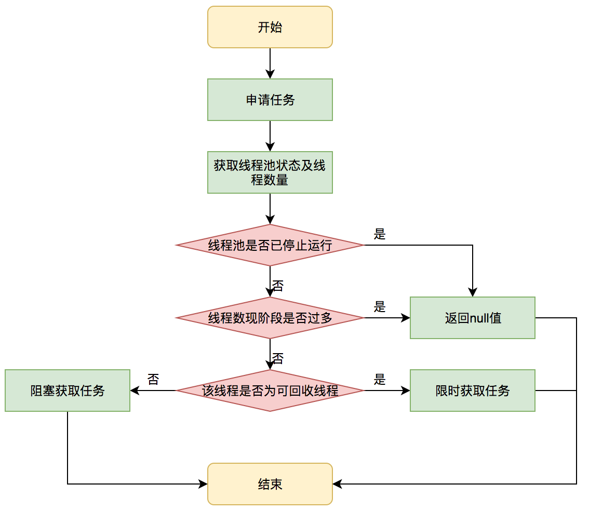
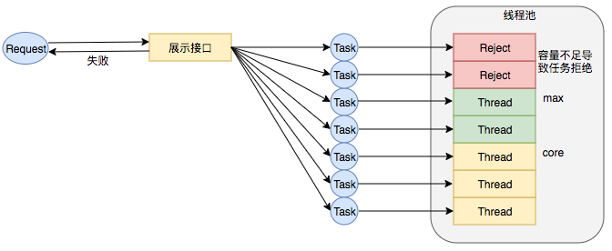
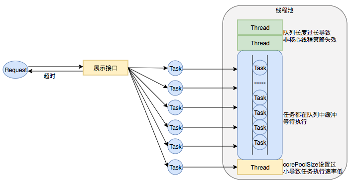

# 线程池问与答

[TOC]

## 线程池解决的问题

- **降低资源消耗**：通过池化技术重复利用已创建的线程，降低线程创建和销毁造成的损耗。
- **提高响应速度**：任务到达时，无需等待线程创建即可立即执行。
- **提高线程的可管理性**：线程是稀缺资源，如果无限制创建，不仅会消耗系统资源，还会因为线程的不合理分布导致资源调度失衡，降低系统的稳定性。使用线程池可以进行统一的分配、调优和监控。
- **提供更多更强大的功能**：线程池具备可拓展性，允许开发人员向其中增加更多的功能。比如延时定时线程池ScheduledThreadPoolExecutor，就允许任务延期执行或定期执行。


线程池解决的核心问题就是**资源管理问题**，在并发环境下，系统不能确定在任意时刻中，有多少任务需要执行，有多少资源需要投入。线程池采用 **池化** 思想，为了**最大化收益并最小化风险，而将资源统一在一起管理的思想**


## 核心设计与实现

线程池核心实现类是**ThreadPoolExecutor**


顶层接口Executor提供了一种思想：将任务提交和任务执行进行解耦，由Executor框架完成线程的调配和任务的执行部分


线程池在内部实际上构建了一个**生产者消费者模型**，将**线程和任务两者解耦**，并不直接关联，从而良好的缓冲任务，**复用线程的原理**。

线程池的运行主要分成两部分：**任务管理、线程管理**。

任务管理部分充当生产者的角色，当任务提交后，线程池会判断该任务后续的流转：（1）直接申请线程执行该任务；（2）缓冲到队列中等待线程执行；（3）拒绝该任务。

线程管理部分是消费者，它们被统一维护在线程池内，根据任务请求进行线程的分配，当线程执行完任务后则会继续获取新的任务去执行，最终当线程获取不到任务的时候，线程就会被回收。

程池内部使用一个变量维护两个值：**运行状态(runState)和线程数量 (workerCount)。**并且这两个参数放在了一起   `private final AtomicInteger ctl = new AtomicInteger(ctlOf(RUNNING, 0));`

高3位保存runState，低29位保存workerCount，两个变量之间互不干扰。用一个变量去存储两个值，可避免在做相关决策时，出现不一致的情况，不必为了维护两者的一致，而占用锁资源


ThreadPoolExecutor的运行状态有5种


## 任务执行机制

### 任务调度

所有任务的调度都是由execute方法完成，**检查现在线程池的运行状态、运行线程数、运行策略，决定接下来的执行流程（比如直接申请线程执行，或者缓存到队列中执行，或者直接拒绝该任务）**

1. 首先检测线程池运行状态，如果不是RUNNING，则直接拒绝，线程池要保证在RUNNING的状态下执行任务。
2. 如果workerCount < corePoolSize，则**创建并启动一个线程**来执行新提交的任务。
3. 如果workerCount >= corePoolSize，且线程池内的阻塞队列未满，则将任务添加到该阻塞队列中。
4. 如果workerCount >= corePoolSize && workerCount < maximumPoolSize，且线程池内的阻塞队列已满，则创建并启动一个线程来执行新提交的任务。
5. 如果workerCount >= maximumPoolSize，并且线程池内的阻塞队列已满, 则根据拒绝策略来处理该任务, 默认的处理方式是直接抛异常。


### 任务缓冲

主要是通过**阻塞队列**来实现  **任务  和   线程  两者的解耦**

线程池中是以生产者消费者模式，通过一个阻塞队列来实现的。阻塞队列缓存任务，工作线程从阻塞队列中获取任务


### 任务申请

**由getTask方法实现**

任务的执行一般两种可能：

- 直接由创建的线程执行（仅出现在线程初始创建的时候）
- 从阻塞队列中获取任务执行，执行完任务的空闲线程会再次去从队列中申请任务再去执行（线程获取任务绝大多数的情况）




getTask这部分进行了多次判断，为的是控制线程的数量，使其符合线程池的状态。如果线程池现在不应该持有那么多线程，则会返回null值。工作线程Worker会不断接收新任务去执行，而当工作线程Worker接收不到任务的时候，就会开始被回收。


### 任务拒绝

**线程池的保护部分**，拒绝策略


## Worker线程管理

### 管理线程状态与生命周期

Worker用于  线程池去掌握   **线程的状态 并   维护线程的生命周期**

~~~java
// 继承AQS 实现Runnable接口
private final class Worker extends AbstractQueuedSynchronizer implements Runnable{
    final Thread thread;// Worker持有的线程
    Runnable firstTask;// 初始化的任务，可以为null
}
~~~


所谓管理生命周期，线程池使用一张Hash表，去持有线程的引用，**通过添加引用、移除引用，来控制线程的生命周期**


为了反应线程现在的执行状态，用AQS来实现独占锁这种不可重入的特性

- lock方法一旦获取了独占锁，**表示当前线程正在执行任务中**
- 如果正在执行任务，则不应该中断线程
- 如果该线程现在不是独占锁的状态，也就是空闲的状态，说明它没有在处理任务，**这时可以对该线程进行中断**
- 线程池在执行shutdown方法或tryTerminate方法时会调用interruptIdleWorkers方法来**中断空闲的线程**，interruptIdleWorkers方法会使用tryLock方法来判断线程池中的线程是否是空闲状态；如果线程是空闲状态则可以安全回收


> 尝试获取锁成功，说明空闲状态，进入回收


### Worker线程增加

**addWorker方法**

该方法不考虑线程池是在哪个阶段增加的该线程，这个分配线程的策略是在上个步骤完成的，该步骤仅仅完成增加线程，并使它运行，最后返回是否成功这个结果。


### Worker线程回收

依赖JVM自动的回收，线程池的这张所维护的Hash表，防止存在线程引用的这部分线程被JVM回收，当线程池决定哪些线程需要回收时，只需要将其引用消除即可

Worker被创建出来后，就会**不断地进行轮询**，然后**获取任务去执行**

核心线程可以无限等待获取任务，非核心线程要限时获取任务

当Worker无法获取到任务，也就是获取的任务为空时，循环会结束，Worker会主动消除自身在线程池内的引用

```Java
try {
  while (task != null || (task = getTask()) != null) {
    //执行任务
  }
} finally {
  processWorkerExit(w, completedAbruptly);//获取不到任务时，主动回收自己
}
```

线程回收的工作是在processWorkerExit方法完成的


将线程引用移出线程池就已经结束了线程销毁的部分。但由于引起线程销毁的可能性有很多，线程池还要判断是什么引发了这次销毁，是否要改变线程池的现阶段状态，是否要根据新状态，重新分配线程。


### Worker线程执行任务

**runWorker方法**

- while循环不断地通过getTask()方法获取任务
- getTask()方法从阻塞队列中取任务
- 如果线程池正在停止，那么要保证当前线程是中断状态，否则要保证当前线程不是中断状态
- 执行任务
- 如果getTask结果为null则跳出循环，执行processWorkerExit()方法，销毁线程


## 参数的配置

配置不好出现问题的场景

> 线程数核心设置过小引发RejectExecutionException




> 线程池队列长度设置过长、corePoolSize设置过小导致任务执行速度低




1. **简化配置，关注核心参数**

   三大核心参数： **corePoolSize、maximumPoolSize，workQueue**

   最大程度地决定了线程池的任务分配和线程分配策略

2. **动态配置**

   将参数从代码中迁移到分布式配置中心上，实现动态配置和即时生效

3. **增加线程池监控**

   在线程池执行任务的生命周期添加监控能力

   

   

   


