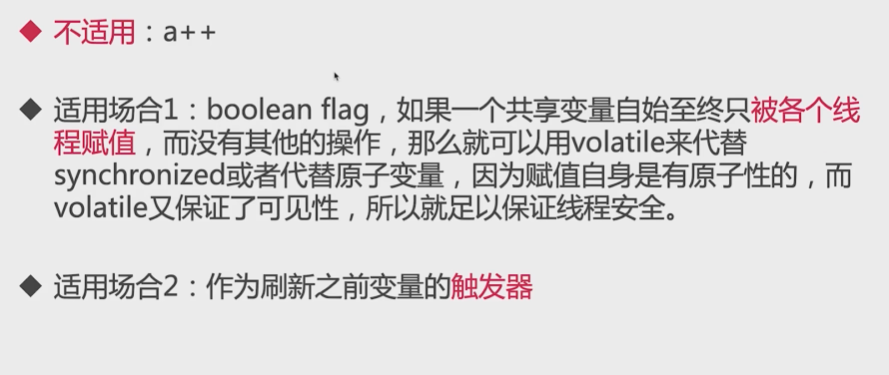

# Volatile

[TOC]

## 简介

Volatile是一种同步机制，比synchronized或者Lock相关类更轻量，因为使用Volatile并**不会发生上下文切换等开销很大的行为**

   如果一个变量被修饰Volatile，JVM就知道这个变量可能被并发修改

   注意❗ Volatile做不到synchronized那样的原子保护，仅在很有限的场景下才能发挥作用

## 适用场景

~~~java
volatile int a;
// 用原子整形统计正确的数
AtomicInteger realA = new AtomicInteger();

public static void main(String[] args) throws InterruptedException {
    NoVolatileOne noVolatileOne = new NoVolatileOne();
    Thread thread1 = new Thread(noVolatileOne);
    Thread thread2 = new Thread(noVolatileOne);
    thread1.start();
    thread2.start();
    thread1.join();
    thread2.join();
    System.out.println(noVolatileOne.a);// <20000
    System.out.println(noVolatileOne.realA.get());
}

@Override
public void run() {
    for (int i = 0; i < 10000; i++) {
        // a++是组合操作，b
        a++;
        realA.incrementAndGet();
    }
}
~~~

## 作用

**保证数据的可见性**： 被volatile修饰的变量能够保证每个线程能够获取该变量的最新值，从而避免出现数据脏读的现象，读一个volatile变量之前，**需要先使相应的本地缓存失效，这样就必须到主内存读取最新值**，写一个Volatile属性会**立即刷入到主内存**，任何一个线程对其的修改立马对其他线程可见，Volatile属性不会被线程缓存，始终从主存中读取

**禁止指令重排序**： 在多线程操作情况下，指令重排会导致计算结果不一致，**解决单例双重锁乱序问题**

**Volatile提供了happens-before保证，此外，Volatile能使得long和double的赋值是原子的**

## 和synchronized关系

-> volatile属性的**读写操作都是无锁的**，不能代替synchronized，因为它**没有提供原子性和互斥性**

如果一个共享变量自始自终**只被各个线程赋值**，而没有其他操作，那么就可以用volatile来代替synchronized或者代替原子变量，因为**赋值自身是有原子性的，而volatile又保证了可见性**，所以就足以保证线程安全

   也正因为无锁，不需要花费时间在获取锁和释放锁上，所以说它是低成本的
  并且，**Volatile只能修饰属性**，不像synchronized还可以修饰方法

## 底层实现

观察加入volatile关键字和没有加入volatile关键字时所生成的汇编代码发现，加入volatile关键字时，**会多出一个lock前缀指令**，也就是原理为被volatile修饰的变量会存在一个lock的前缀

~~~c
// 例如volatile定义的一个变量的自增，分为如下3步：
mov    0xc(%r10),%r8d ; Load
inc    %r8d           ; Increment
mov    %r8d,0xc(%r10) ; Store
lock addl $0x0,(%rsp) ;  Barrier //这一步不要忽略！
~~~

1、读取volatile变量到本地内存区；

2、在本地内存区实现volatile变量的自增；

3、将本地内存区的变量回写到主内存；

最后，插入内存屏障（memory barrier）。**插入一个内存屏障，就相当于告诉CPU与编译器，先于这个指令的代码必须优先执行，后于这个指令的代码必须后执行；内存屏障另一个作用是强制更新一次不同CPU的缓存**

　　lock前缀指令实际上相当于一个**内存屏障**（也成内存栅栏），内存屏障会提供3个功能：

　　1）它确保指令重排序时不会把其后面的指令排到内存屏障之前的位置，也不会把前面的指令排到内存屏障的后面（**禁止指令重排序**）

　　2）它会**强制将对缓存的修改操作立即写入主存**；

　　3）如果是**写操作，它会导致其他CPU中对应的缓存行无效**，从而重新从主存中加载最新的数据

## 有序性原理

volatile有序性的保证就是通过禁止指令重排序来实现的。指令重排序包括编译器和处理器重排序，JMM会分别限制这两种指令重排序。

那么禁止指令重排序又是如何实现的呢？答案是加内存屏障。JMM为volatile加内存屏障有以下4种情况：

在每个volatile写操作的前面插入一个StoreStore屏障，防止写volatile与后面的写操作重排序。
在每个volatile写操作的后面插入一个StoreLoad屏障，防止写volatile与后面的读操作重排序。
在每个volatile读操作的后面插入一个LoadLoad屏障，防止读volatile与后面的读操作重排序。
在每个volatile读操作的后面插入一个LoadStore屏障，防止读volatile与后面的写操作重排序。
上述内存屏障的插入策略是非常保守的，比如一个volatile的写操作后面需要加上StoreStore和StoreLoad屏障，但这个写volatile后面可能并没有读操作，因此理论上只加上StoreStore屏障就可以，的确，有的处理器就是这么做的。但JMM这种保守的内存屏障插入策略能够保证在任意的处理器平台，volatile变量都是有序的。

