# Zookeeper分布式锁等场景

> 分布式锁，是控制分布式系统之间同步访问共享资源的一种方式。在分布式系统中，常常需要协调他们的动作。如果不同的系统或是同一个系统的不同主机之间共享了一个或一组资源，那么访问这些资源的时候，往往需要互斥来防止彼此干扰来保证一致性，在这种情况下，便需要使用到分布式锁。

## 实现

### 获取锁

在Zookeeper当中创建一个持久节点ParentLock。当第一个客户端想要获得锁时，需要在ParentLock这个节点下面创建一个**临时顺序节点** Lock1。

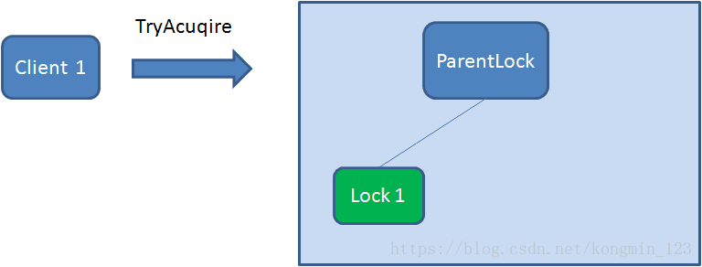

### 获得锁

之后，Client1查找ParentLock下面**所有的临时顺序节点并排序**，判断自己所创建的节点Lock1是不是顺序最靠前的一个。**如果是第一个节点，则成功获得锁**。 

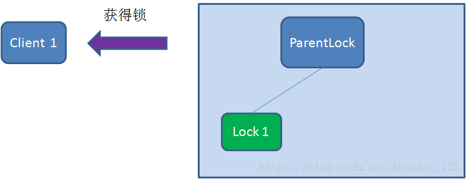

### 等待锁

这时候，如果再有一个客户端 Client2 前来获取锁，则在ParentLock下载再创建一个临时顺序节点Lock2。 

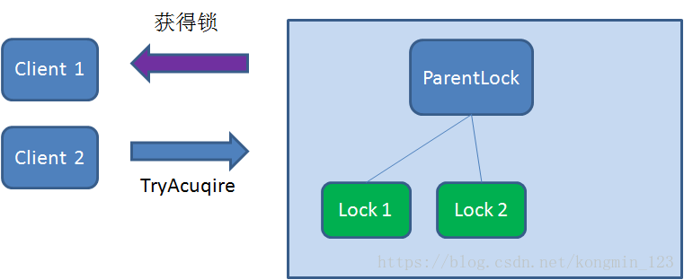

Client2查找ParentLock下面所有的临时顺序节点并排序，判断自己所创建的节点Lock2是不是顺序最靠前的一个，结果发现节点Lock2并不是最小的。

于是，Client2向排序仅比它靠前的节点Lock1注册**Watcher**，用于**监听Lock1节点是否存在**。这意味着**Client2抢锁失败，进入了等待状态**。

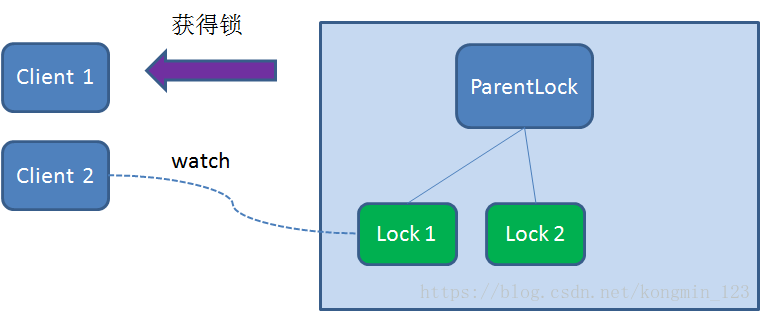

这时候，如果又有一个客户端Client3前来获取锁，则在ParentLock下载**再创建一个临时顺序节点**Lock3。 

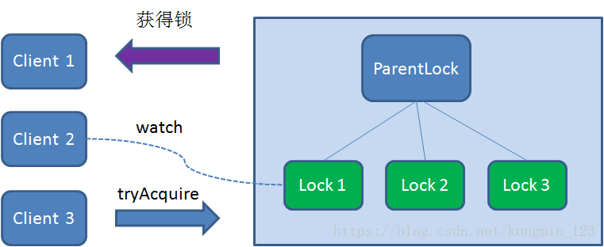

Client3查找ParentLock下面所有的临时顺序节点并排序，判断自己所创建的节点Lock3是不是顺序最靠前的一个，结果同样发现节点Lock3并不是最小的。

于是，Client3向排序仅比它靠前的节点**Lock2**注册Watcher，用于监听Lock2节点是否存在。这意味着**Client3同样抢锁失败，进入了等待状态**。 

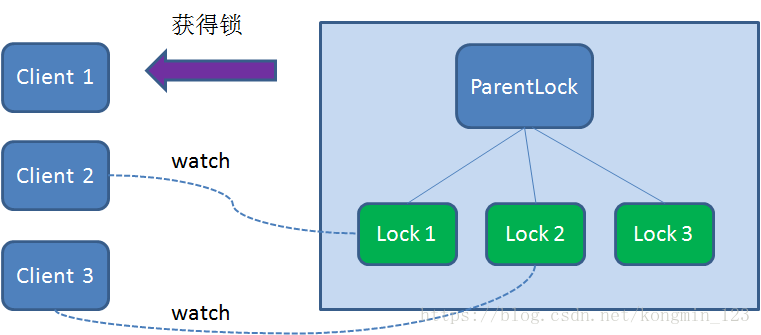

这样一来，Client1得到了锁，Client2监听了Lock1，Client3监听了Lock2。这恰恰形成了一个**等待队列**，很像是Java当中ReentrantLock所依赖的**AQS**（AbstractQueuedSynchronizer）。

### 释放锁

释放锁的过程很简单，只需要释放对应的子节点就好。

#### 任务完成，客户端显式释放

当任务完成时，Client1会显式调用删除节点Lock1的指令。

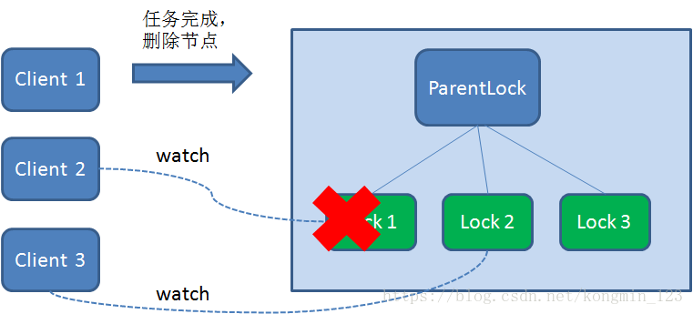

#### 任务执行过程中，客户端崩溃

获得锁的Client1在任务执行过程中，如果Duang的一声崩溃，则会断开与Zookeeper服务端的链接。**根据临时节点的特性，相关联的节点Lock1会随之自动删除**。

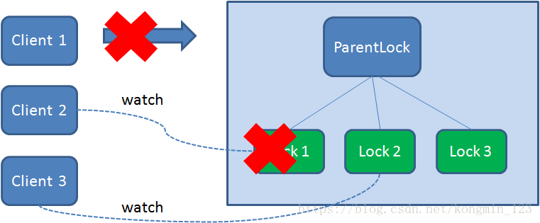

由于Client2一直监听着Lock1的存在状态，当Lock1节点被删除，Client2会立刻收到通知。这时候Client2会再次查询ParentLock下面的所有节点，确认自己创建的节点Lock2是不是**目前最小的节点**。如果是最小，则Client2顺理成章获得了锁。

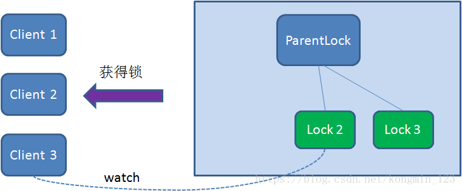

同理，如果Client2也因为任务完成或者节点崩溃而删除了节点Lock2，那么Client3就会接到通知。 

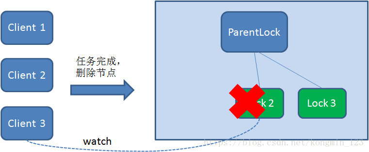

最终，Client3成功得到了锁。 

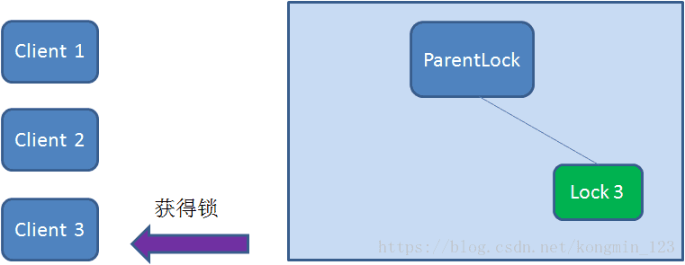

## 总结

其实如果有客户端C、客户端D等N个客户端争抢一个zk分布式锁，原理都是类似的。

- 大家都是上来直接创建一个锁节点下的一个接一个的临时顺序节点
- 如果自己不是第一个节点，就对自己上一个节点加监听器
- 只要上一个节点释放锁，自己就排到前面去了，相当于是一个排队机制。

而且用临时顺序节点的另外一个用意就是，如果某个客户端创建临时顺序节点之后，不小心自己宕机了也没关系，zk感知到那个客户端宕机，会自动删除对应的临时顺序节点，相当于自动释放锁，或者是自动取消自己的排队。

## 对比

| 分布式锁  | 优点                                                         | 缺点                                                         |
| --------- | ------------------------------------------------------------ | ------------------------------------------------------------ |
| Zookeeper | 1.有封装好的框架，容易实现2.有等待锁的队列，大大提升抢锁效率。 | 添加和删除节点性能较低                                       |
| Redis     | Set和Del指令性能较高                                         | 1.实现复杂，需要考虑超时，原子性，误删等情形。2.没有等待锁的队列，只能在客户端自旋来等待，效率低下。 |

- redis 分布式锁，其实**需要自己不断去尝试获取锁**，比较消耗性能。
- zk 分布式锁，获取不到锁，注册个监听器即可，不需要不断主动尝试获取锁，性能开销较小。但是不能支持大规模集群，不支持高并发。

**从释放锁方面看**：如果是 Redis 获取锁的那个客户端 出现 bug 挂了，那么只能等待超时时间之后才能释放锁；而 zk 的话，因为创建的是临时 znode，只要客户端挂了，znode 就没了，此时就自动释放锁。

**从分布式场景看**：从分布式系统协调语义而言，是ZooKeeper做分布式锁更好一些，因为Redis本身其实是缓存

**从高并发场景看**：zookeeper本身不适合部署大规模集群，他本身适用的场景就是部署三五台机器，不是承载高并发请求的，仅仅是用作分布式系统的协调的，但是Redis能抗高并发，高并发场景下更好一些，由于zookeeper分布式锁需要大量的创建、删除节点，所以性能上比较差

## 处理羊群效应

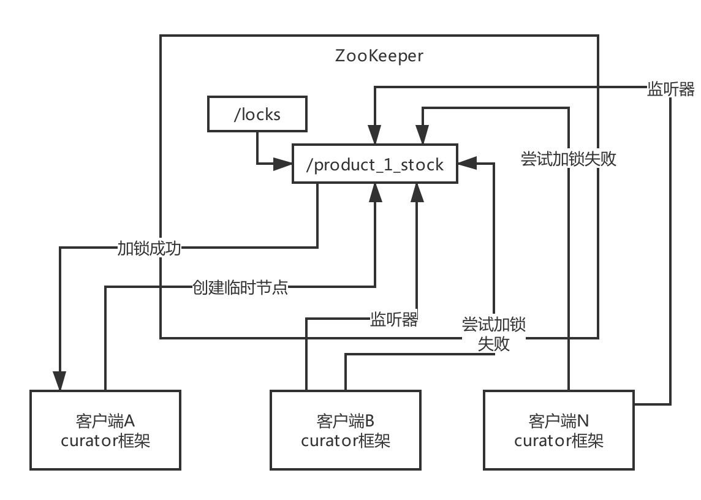

使用临时节点，而没用临时顺序节点。

如果几十个客户端同时争抢一个锁，此时会导致任何一个客户端释放锁的时候，zk反向通知几十个客户端，几十个客户端又要发送请求到zk去尝试创建锁，所以大家会发现，几十个人要加锁，大家乱糟糟的，无序的

羊群效应

造成很多没必要的请求和网络开销，会加重网络的负载

