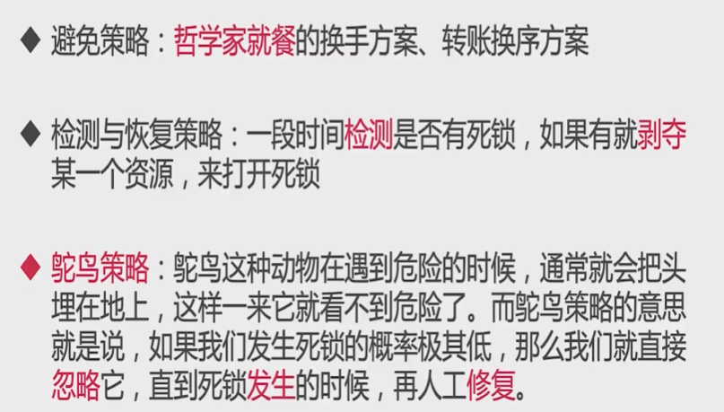

# 死锁

[TOC]

## 发生条件

死锁发生的4个必要条件，必须都满足

### 1.互斥条件

> 进程对所分配到的资源**不允许其他进程访问**，若其他进程访问该资源，只能等待至占有该资源的进程释放该资源

### 2.请求与保持条件

> 进程获得一定的资源后，又对其他资源**发出请求**，阻塞过程中**不会释放自己**已经占有的资源

### 3.不剥夺条件

> 进程已获得的资源，在未完成使用之前，不可被剥夺，**只能在使用后自己释放**

### 4.循环等待条件

> 系统中若干进程组成**环路**，环路中每个进程**都在等待**相邻进程占用的资源

**必然死锁的例子**

~~~java
public class MustDeadLock implements Runnable {

    int flag = 1;

    static Object o1 = new Object();
    static Object o2 = new Object();

    public static void main(String[] args) {
        MustDeadLock mustDeadLock1 = new MustDeadLock();
        MustDeadLock mustDeadLock2 = new MustDeadLock();
        mustDeadLock1.flag = 1;
        mustDeadLock2.flag = 0;
        new Thread(mustDeadLock1).start();
        new Thread(mustDeadLock2).start();
    }

    @Override
    public void run() {
        // 两个线程进入，分别以不同的顺序拿着两把锁
        if (flag == 1) {
            synchronized (o1) {
                try {
                    Thread.sleep(500);
                } catch (InterruptedException e) {
                    e.printStackTrace();
                }
                synchronized (o2) {
                    System.out.println("Thread1 get all locks");
                }
            }
        }

        if (flag == 0) {
            synchronized (o2) {
                try {
                    Thread.sleep(500);
                } catch (InterruptedException e) {
                    e.printStackTrace();
                }
                synchronized (o1) {
                    System.out.println("Thread2 get all locks");
                }
            }
        }
    }
}

~~~

## 常见的修复策略

## 哲学家进餐问题

每个哲学家都拿着左手的餐叉，永远都在等右边的餐叉（或者相反）

**解决**

服务员检查（避免策略）

改变一个哲学家拿叉子的顺序（避免策略）

餐票（避免策略）（人数-1张）

领导调节（检测与恢复策略）

## 使用锁的tips

避免死锁的tips
 -> 设置超时时间（tryLock(long timeout,TimeUnit unit)），synchronized不具备尝试锁的能力

 -> 多使用并发类，而不是自己设计锁（如ConcurrentHashMap，juc.atomic）

 -> 尽量降低锁的使用粒度：用不同的锁而不是一个锁

 -> 如果能使用同步代码块，就不使用同步方法：自己指定锁对象

 -> 新建线程起有意义的名字，便于排查

 -> 避免锁的嵌套

 -> 分配资源前先看能不能收回来：银行家算法

 -> 尽量不要几个功能用同一把锁：专锁专用

## 其他活性故障

死锁是最常见的活跃性问题，不过除了刚才的死锁之外，还有一些类似的问题，会导致程序无法顺利执行，统称活跃性问题

**活锁** ->  虽然线程并没有阻塞，也始终在运行，但是程序却得不到进展，因为线程始终重复做同样的事

​        -> 活锁问题原因：重试机制不变，消息队列始终重试

​        -> 解决：以太网的指数退避算法，加入随机因素

**饥饿** ->  当线程需要某些资源（例如CPU），但是却始终得不到

​         -> 如线程的优先级设置得过于低，或者某些线程持有锁同时又无限循环从而不释放锁，或者某程序始终占用某文件的写锁

​		-> 线程优先级，10个级别，默认是5，程序设计不应依赖于优先级

