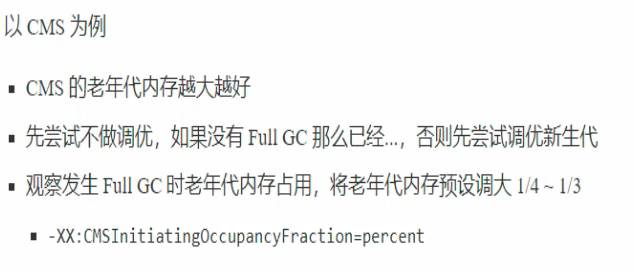

# GC调优

## 调优邻域

- 内存
- 锁竞争
- CPU占用
- IO

## 确定目标

低延迟/高吞吐量？ 选择合适的GC

- CMS G1 ZGC
- ParallelGC
- Zing

**最快的GC是不发生GC**

首先排除减少因为自身编写的代码而引发的内存问题

- 查看Full GC前后的内存占用，考虑以下几个问题
  - 数据是不是太多？
  - 数据表示是否太臃肿
    - 对象图
    - 对象大小
  - 是否存在内存泄漏

## 新生代调优

- 新生代的特点
  - 所有的new操作分配内存都是非常廉价的
    - TLAB （thread-local allocation buffer）伊甸园分配对象效率高
  - 死亡对象回收零代价
  - 大部分对象用过即死（朝生夕死）
  - MInor GC 所用时间远小于Full GC
- 新生代内存越大越好么？
  - 不是
    - 新生代内存太小：频繁触发Minor GC，会STW，会使得吞吐量下降
    - 新生代内存太大：老年代内存占比有所降低，会更频繁地触发Full GC。而且触发Minor GC时，清理新生代所花费的时间会更长
  - 新生代内存设置为能容纳所有[**并发量*(请求-响应)**]的数据为宜

## 幸存区调优

- 幸存区需要能够保存 **当前活跃对象**+**需要晋升的对象**
- 晋升阈值配置得当，让长时间存活的对象尽快晋升

## 老年代调优

