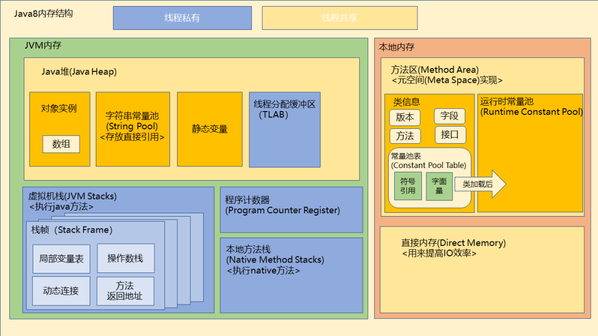
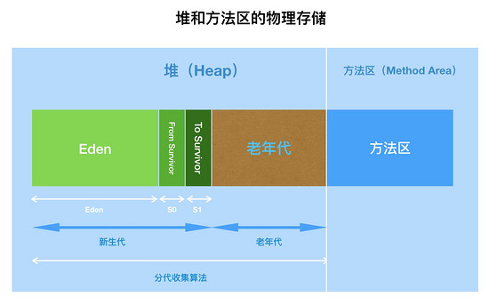
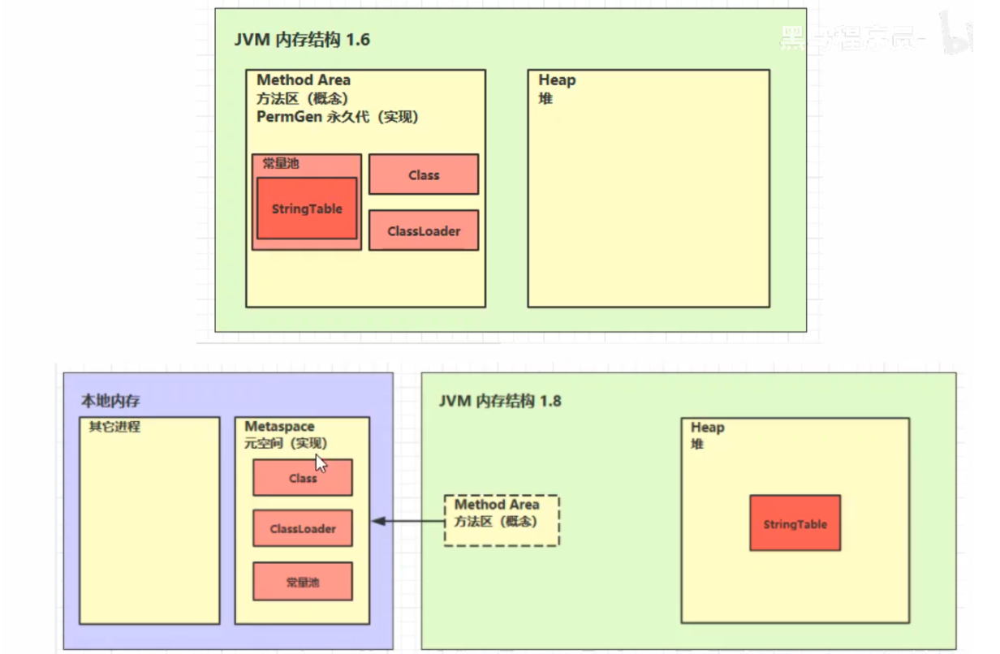
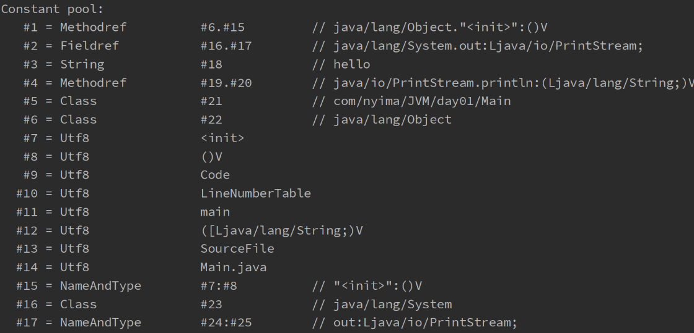
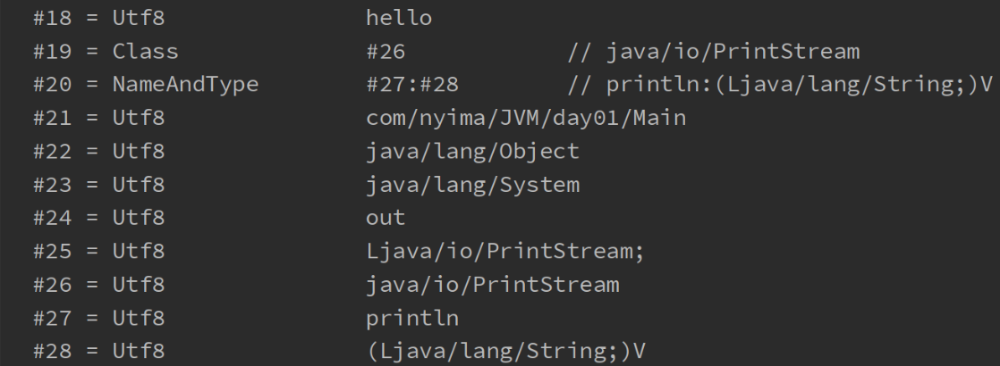
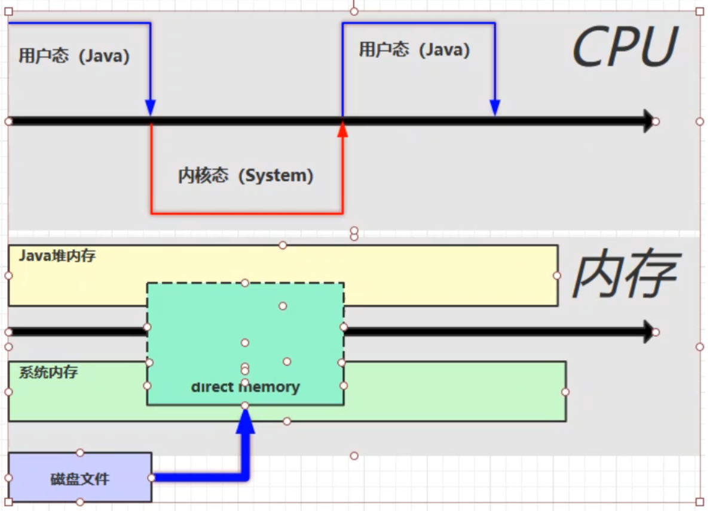

# JVM内存结构

[TOC]

## 整体架构





## 1、程序计数器

### 作用

用于保存JVM中下一条所要执行的指令的地址

### 特点

- 线程私有
  - CPU会为每个线程分配时间片，当当前线程的时间片使用完以后，CPU就会去执行另一个线程中的代码
  - 程序计数器是**每个线程**所**私有**的，当另一个线程的时间片用完，又返回来执行当前线程的代码时，通过程序计数器可以知道应该执行哪一句指令
- 不存在内存溢出


## 2、虚拟机栈

### 定义

- 每个**线程**运行需要的内存空间，称为**虚拟机栈**
- 每个栈由多个**栈帧**组成，对应着每次调用方法时所占用的内存
- 每个线程只能有**一个活动栈帧**，对应着**当前正在执行的方法**

### 演示

代码

~~~java
public class Main {
    public static void main(String[] args) {
        method1();
    }

    private static void method1() {
        method2(1, 2);
    }

    private static int method2(int a, int b) {
        int c = a + b;
        return c;
    }
}
~~~


在控制台中可以看到，主类中的方法在进入虚拟机栈的时候，符合栈的特点

### 问题辨析

- 垃圾回收是否涉及栈内存？
  - **不需要**。因为虚拟机栈中是由一个个栈帧组成的，在方法执行完毕后，对应的栈帧就会被弹出栈。所以无需通过垃圾回收机制去回收内存。
- 栈内存的分配越大越好吗？
  - 不是。因为**物理内存是一定的**，栈内存越大，可以支持更多的递归调用，但是可执行的**线程数就会越少**。
- 方法内的局部变量是否是线程安全的？
  - 如果方法内**局部变量没有逃离方法的作用范围**，则是**线程安全**的
  - 如果**局部变量引用了对象**，并**逃离了方法的作用范围**，则需要考虑线程安全问题


### 内存溢出

**Java.lang.stackOverflowError** 栈内存溢出

**发生原因**

- 虚拟机栈中，**栈帧过多**（无限递归）
- 每个栈帧**所占用过大**

### 线程运行诊断

CPU占用过高

- Linux环境下运行某些程序的时候，可能导致CPU的占用过高，这时需要定位占用CPU过高的线程
  - **top**命令，查看是哪个**进程**占用CPU过高
  - **ps H -eo pid, tid（线程id）, %cpu | grep 刚才通过top查到的进程号** 通过ps命令进一步查看是哪个线程占用CPU过高
  - **jstack 进程id** 通过查看进程中的线程的nid，刚才通过ps命令看到的tid来**对比定位**，注意jstack查找出的线程id是**16进制的**，**需要转换**


## 3、本地方法栈

一些带有**native关键字**的方法就是需要JAVA去调用本地的C或者C++方法，因为JAVA有时候没法直接和操作系统底层交互，所以需要用到本地方法


## 4、堆



### 定义

通过new关键字**创建的对象**都会被放在堆内存

### 特点

- **所有线程共享**，堆内存中的对象都需要**考虑线程安全问题**
- **有垃圾回收机制**，（GC主场）

### 堆内存溢出

**java.lang.OutofMemoryError** ：java heap space. 堆内存溢出

### 堆内存诊断

**jps** 查看当前系统中有哪些java进程

**jmap ** 查看堆内存占用情况 -heap 进程id

**jconsole**

**jvirsalvm**


## 5、方法区

### 结构



### 内存溢出

- 1.8以前会导致**永久代**内存溢出
- 1.8以后会导致**元空间**内存溢出

### 常量池

二进制字节码的组成：类的基本信息、常量池、类的方法定义（包含了虚拟机指令）

**通过反编译来查看类的信息**

在控制台输入 javap -v 类的绝对路径

~~~shell
javap -v F:\Thread_study\src\com\nyima\JVM\day01\Main.class
~~~

- 类的基本信息


- 常量池






- 虚拟机中执行编译的方法（框内的是真正编译执行的内容，**#号的内容需要在常量池中查找**）


### 运行时常量池

- 常量池
  - 一张表，虚拟机指令根据这张常量表找到要执行的类名、方法名、参数类型、字面量信息
- 运行时常量池
  - 常量池是.class文件中的，当该**类被加载以后**，它的常量池信息就会**放入运行时常量池**，并把里面的**符号地址变为真实地址**


### 常量池与串池的关系

#### 串池StringTable

> 1.6时StringTable是常量池的一部分，属永久代当中，1.8在堆中，之所以做出这样的转变，因为永久代的回收效率很低（Full GC时才触发），堆里只需要Minor GC

**特征**

- 常量池中的字符串仅是符号，只有**在被用到时才会转化为对象**
- 利用串池的机制，来避免重复创建字符串对象
- 字符串**变量**拼接的原理是**StringBuilder**
- 字符串**常量**拼接的原理是**编译器优化**
- 可以使用**intern方法**，主动将串池中还没有的字符串对象放入串池中
- **注意**：无论是串池还是堆里面的字符串，都是对象

用来放字符串对象且里面的**元素不重复**

~~~java
public class StringTableStudy {
    public static void main(String[] args) {
        String a = "a"; 
        String b = "b";
        String ab = "ab";
    }
}
~~~

常量池中的信息，都会被加载到运行时常量池中，但这是a b ab 仅是常量池中的符号，**还没有成为java字符串**

~~~java
0: ldc           #2                  // String a
2: astore_1
3: ldc           #3                  // String b
5: astore_2
6: ldc           #4                  // String ab
8: astore_3
9: return
~~~

当执行到 ldc #2 时，会把符号 a 变为 “a” 字符串对象，**并放入串池中**（hashtable结构 不可扩容）

当执行到 ldc #3 时，会把符号 b 变为 “b” 字符串对象，并放入串池中

当执行到 ldc #4 时，会把符号 ab 变为 “ab” 字符串对象，并放入串池中

最终**StringTable [“a”, “b”, “ab”]**

**注意**：字符串对象的创建都是**懒惰的**，只有当运行到那一行字符串且在串池中不存在的时候（如 ldc #2）时，该字符串才会被创建并放入串池中。

使用拼接**字符串变量对象**创建字符串的过程

~~~java
public class StringTableStudy {
    public static void main(String[] args) {
        String a = "a";
        String b = "b";
        String ab = "ab";
        //拼接字符串对象来创建新的字符串
        String ab2 = a+b; 
    }
}
~~~

反编译后的结果

~~~java
	 Code:
      stack=2, locals=5, args_size=1
         0: ldc           #2                  // String a
         2: astore_1
         3: ldc           #3                  // String b
         5: astore_2
         6: ldc           #4                  // String ab
         8: astore_3
         9: new           #5                  // class java/lang/StringBuilder
        12: dup
        13: invokespecial #6                  // Method java/lang/StringBuilder."<init>":()V
        16: aload_1
        17: invokevirtual #7                  // Method java/lang/StringBuilder.append:(Ljava/lang/String
;)Ljava/lang/StringBuilder;
        20: aload_2
        21: invokevirtual #7                  // Method java/lang/StringBuilder.append:(Ljava/lang/String
;)Ljava/lang/StringBuilder;
        24: invokevirtual #8                  // Method java/lang/StringBuilder.toString:()Ljava/lang/Str
ing;
        27: astore        4
        29: return
~~~

通过拼接的方式来创建字符串的**过程**是：StringBuilder().append(“a”).append(“b”).toString()

最后的toString方法的返回值是一个**新的字符串**，但字符串的**值**和拼接的字符串一致，但是两个不同的字符串，**一个存在于串池之中，一个存在于堆内存之中**

~~~java
String ab = "ab";
String ab2 = a+b;
//结果为false,因为ab是存在于串池之中，ab2是由StringBuffer的toString方法所返回的一个对象，存在于堆内存之中
System.out.println(ab == ab2);
~~~

使用**拼接字符串常量对象**的方法创建字符串

```java
public class StringTableStudy {
	public static void main(String[] args) {
		String a = "a";
		String b = "b";
		String ab = "ab";
		String ab2 = a+b;
		//使用拼接字符串的方法创建字符串
		String ab3 = "a" + "b";
	}
}Copy
```

反编译后的结果

```java
 	  Code:
      stack=2, locals=6, args_size=1
         0: ldc           #2                  // String a
         2: astore_1
         3: ldc           #3                  // String b
         5: astore_2
         6: ldc           #4                  // String ab
         8: astore_3
         9: new           #5                  // class java/lang/StringBuilder
        12: dup
        13: invokespecial #6                  // Method java/lang/StringBuilder."<init>":()V
        16: aload_1
        17: invokevirtual #7                  // Method java/lang/StringBuilder.append:(Ljava/lang/String
;)Ljava/lang/StringBuilder;
        20: aload_2
        21: invokevirtual #7                  // Method java/lang/StringBuilder.append:(Ljava/lang/String
;)Ljava/lang/StringBuilder;
        24: invokevirtual #8                  // Method java/lang/StringBuilder.toString:()Ljava/lang/Str
ing;
        27: astore        4
        //ab3初始化时直接从串池中获取字符串
        29: ldc           #4                  // String ab
        31: astore        5
        33: returnCopy
```

- 使用**拼接字符串常量**的方法来创建新的字符串时，因为**内容是常量，javac在编译期会进行优化，结果已在编译期确定为ab**，而创建ab的时候已经在串池中放入了“ab”，所以ab3直接从串池中获取值，所以进行的操作和 ab = “ab” 一致。
- 使用**拼接字符串变量**的方法来创建新的字符串时，因为内容是变量，只能**在运行期确定它的值，所以需要使用StringBuilder来创建**

#### intern方法 1.8

调用字符串对象的intern方法，会将该字符串对象尝试放入到串池中

- 如果串池中没有该字符串对象，则放入成功
- 如果有该字符串对象，则放入失败

无论放入是否成功，都会返回**串池中**的字符串对象

**注意**：此时如果调用intern方法成功，堆内存与串池中的字符串对象是同一个对象；如果失败，则不是同一个对象

**例1**

```java
public class Main {
	public static void main(String[] args) {
		//"a" "b" 被放入串池中，str则存在于堆内存之中
		String str = new String("a") + new String("b");
		//调用str的intern方法，这时串池中没有"ab"，则会将该字符串对象放入到串池中，此时堆内存与串池中的"ab"是同一个对象
		String st2 = str.intern();
		//给str3赋值，因为此时串池中已有"ab"，则直接将串池中的内容返回
		String str3 = "ab";
		//因为堆内存与串池中的"ab"是同一个对象，所以以下两条语句打印的都为true
		System.out.println(str == st2);
		System.out.println(str == str3);
	}
}Copy
```

**例2**

```java
public class Main {
	public static void main(String[] args) {
        //此处创建字符串对象"ab"，因为串池中还没有"ab"，所以将其放入串池中
		String str3 = "ab";
        //"a" "b" 被放入串池中，str则存在于堆内存之中
		String str = new String("a") + new String("b");
        //此时因为在创建str3时，"ab"已存在与串池中，所以放入失败，但是会返回串池中的"ab"
		String str2 = str.intern();
        //false
		System.out.println(str == str2);
        //false
		System.out.println(str == str3);
        //true
		System.out.println(str2 == str3);
	}
}Copy
```

#### intern方法 1.6

调用字符串对象的intern方法，会将该字符串对象尝试放入到串池中

- 如果串池中**没有**该字符串对象，**会将该字符串对象复制一份，再放入到串池中**
- 如果有该字符串对象，则放入失败

无论放入是否成功，都会返回**串池中**的字符串对象

**注意**：此时无论调用intern方法成功与否，串池中的字符串对象和堆内存中的字符串对象**都不是同一个对象**

#### StringTable 垃圾回收

StringTable在内存紧张时，会发生垃圾回收

#### StringTable调优

- 因为StringTable是由Hashtable实现的，所以可以**适当增加Hashtable桶的个数**，来减少字符串放入串池所需要的时间

  ```
  -XX:StringTableSize=xxxxCopy
  ```

  

- 考虑是否需要将字符串对象入池

  可以通过**intern方法减少重复入池**


## 6、直接内存

### 简介

> 在 JDK 1.4 中新引入了 NIO 类，它可以使用 Native 函数库直接分配堆外内存，然后通过 Java 堆里的 DirectByteBuffer 对象作为这块内存的引用进行操作。这样能在一些场景中显著提高性能，因为避免了在堆内存和堆外内存来回拷贝数据

- 属于操作系统，常见于NIO操作时，**用于数据缓冲区**
- 分配回收成本较高，但读写性能高
- 不受JVM内存回收管理

### 区别

Java虚拟机在执行的时候会把管理的内存分配成不同的区域，这些区域被称为虚拟机内存
同时，对于虚拟机没有直接管理的物理内存，也有一定的利用，这些被利用却不在虚拟机内存数据区的内存，我们称它为本地内存，这两种内存有一定的区别：

#### JVM内存

- 受虚拟机内存大小的参数控制，当大小超过参数设置的大小时就会报OOM

#### 本地内存

- 本地内存不受虚拟机内存参数的限制，只受物理内存容量的限制
- 虽然不受参数的限制，但是如果内存的占用超出物理内存的大小，同样也会报OOM

### 文件读写流程


**使用了DirectBuffer**



直接内存是操作系统和Java代码**都可以访问的一块区域**，无需将代码从系统内存复制到Java堆内存，从而提高了效率

### 释放原理

直接内存的回收不是通过JVM的垃圾回收来释放的，而是通过**unsafe.freeMemory**来手动释放

```java
//通过ByteBuffer申请1M的直接内存
ByteBuffer byteBuffer = ByteBuffer.allocateDirect(_1M);Copy
```

申请直接内存，但JVM并不能回收直接内存中的内容，它是如何实现回收的呢？

**allocateDirect的实现**

```java
public static ByteBuffer allocateDirect(int capacity) {
    return new DirectByteBuffer(capacity);
}
```

**DirectByteBuffer类**

```java
DirectByteBuffer(int cap) {   // package-private
   
    super(-1, 0, cap, cap);
    boolean pa = VM.isDirectMemoryPageAligned();
    int ps = Bits.pageSize();
    long size = Math.max(1L, (long)cap + (pa ? ps : 0));
    Bits.reserveMemory(size, cap);

    long base = 0;
    try {
        base = unsafe.allocateMemory(size); //申请内存
    } catch (OutOfMemoryError x) {
        Bits.unreserveMemory(size, cap);
        throw x;
    }
    unsafe.setMemory(base, size, (byte) 0);
    if (pa && (base % ps != 0)) {
        // Round up to page boundary
        address = base + ps - (base & (ps - 1));
    } else {
        address = base;
    }
    cleaner = Cleaner.create(this, new Deallocator(base, size, cap)); // 通过虚引用，来实现直接内存的释放，this为虚引用的实际对象
    att = null;
}Copy
```

这里调用了一个Cleaner的create方法，且后台线程还会对虚引用的对象监测，如果虚引用的实际对象（这里是DirectByteBuffer）被回收以后，就会调用Cleaner的clean方法，来清除直接内存中占用的内存

```java
public void clean() {
       if (remove(this)) {
           try {
               this.thunk.run(); //调用run方法
           } catch (final Throwable var2) {
               AccessController.doPrivileged(new PrivilegedAction<Void>() {
                   public Void run() {
                       if (System.err != null) {
                           (new Error("Cleaner terminated abnormally", var2)).printStackTrace();
                       }

                       System.exit(1);
                       return null;
                   }
               });
           }Copy
```

对应对象的run方法

```java
public void run() {
    if (address == 0) {
        // Paranoia
        return;
    }
    unsafe.freeMemory(address); //释放直接内存中占用的内存
    address = 0;
    Bits.unreserveMemory(size, capacity);
}
```

#### 直接内存的回收机制总结

- 使用了Unsafe类来完成直接内存的分配回收，回收需要主动调用freeMemory方法
- ByteBuffer的实现内部使用了Cleaner（虚引用）来检测ByteBuffer。一旦ByteBuffer被垃圾回收，那么会由ReferenceHandler来调用Cleaner的clean方法调用freeMemory来释放内存


