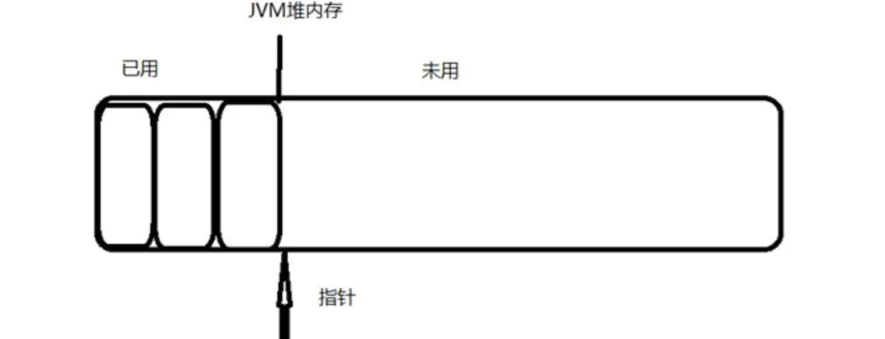

# JVM问与答

[TOC]

### 可达性算法不可达的对象就一定会被回收吗？

不一定，当发现对象不可达的时候，将会对此对象进行**第一次标记**，对标记的对象进行筛选，筛选的条件是 **是否有必要执行finalize()方法。**
 当此对象已经调用过finalize()方法或者在对象中没有覆盖finalize()方法，则判定次对象没有必要执行finalize()方法。
 **没有必要执行finalize()方法的对象将会直接被回收。**
 有必要执行finalize()方法的对象放在一个**队列**中，之后有虚拟机创建一个低优先级的线程去出发队列中的对象的finalize()方法，注意此处为触发并非等待finalize()执行结束，防止finalize()方法中出现死循环导致回收系统崩溃。
 当一个对象的finalize()方法执行结束后，方法并没有被回收，稍后会对队列中的对象进行二次标记，此时标记的依据是对象是否可达。如果还是不可达，才会将此对象放入即将回收的集合。所以finalize()方法中如果为对象添加引用链，可以拯救此对象。
 注意：每个对象的finalize()方法只会被jvm调用一次，如果一个对象在第一次执行finalize()时候被拯救，在下次执行回收会直接对对象就行回收，将不会调用对象的finalize()方法。

### 方法区中的垃圾回收和无用的类

方法区有垃圾回收，但是回收的效率低。
方法区只要回收废弃的常量和无用的类。
如果没有任何地方对此常量进行引用，则此常量就会被回收。

- (1)java堆中不存在该类的任何实例。
- (2)加载该类的ClassLoader已经被回收。
- (3)该类的class对象没有任何地方被引用。

满足以上三个条件的类可以被回收，而不是和java堆中的对象一样必然会被回收。

### new一个对象的过程

1. **首先检查类元消息是否存在**，如果没有，在双亲委派下，使用当前类加载器以ClassLoader+包名+类名为key进行查找对应的.class文件，如果没有找到文件，抛出ClassNotFoundException异常，找到则进行类加载，并生成对应的class类对象

2. **为对象分配内存**，计算对象占用空间大小，接着在堆中划分一块内存给新对象，如果实例成员变量是引用变量，仅分配引用变量空间即可，即4字节大小

   > **内存分配两大方式**

   > 如果内存是规整的，那么虚拟机将采用的是**指针碰撞**来为对象分配内存，即所有用过的内存放在一边，空闲的内存在另一边，**中间放一个指针作为分界点的指示器**，分配内存仅仅是把指针**向空闲**那边挪动一段对象大小相等的距离

   > 如果内存**不规整**（即已使用的内存和未使用的内存相互交错），虚拟机需要维护一个列表，使用空间列表分配（**空闲列表**），分配对象的时候，**优先从 FreeList 中寻找合适的内存大小进行分配**

   > 分配空间的时候，因为堆是共用的，需要处理并发安全问题，一般采用**CAS或TLAB**

3. **初始化分配到的空间**

   > 内存分配结束，虚拟机将分配到的内存空间都初始化为零值（不包括对象头），这一步保证了对象的实例字段在Java里可以不用赋初始值就可以直接使用（所对应的零值）

4. **设置对象的对象头**

5. **执行init方法进行初始化**

### 何为TLAB（并发场景下新建对象分配内存保证安全性）

> 指针碰撞

> CAS+失败重试 保证更新原子性，导致效率下降

Thread Local Allocation Buffer，即线程本地分配缓存区，这是一个**线程专用的内存分配区域**。

虚拟机参数 -XX:UseTLAB，在线程初始化时，同时也会申请一块指定大小的内存，**只给当前线程使用**，这样每个线程都单独拥有一个空间，如果需要分配内存，就在自己的空间上分配，这样就**不存在竞争的情况**，可以大大提升分配效率

TLAB的本质其实是三个指针管理的区域：start，top 和 end，每个线程都会从Eden分配一块空间，例如说100KB，作为自己的TLAB，其中 start 和 end 是占位用的，标识出 eden 里被这个 TLAB 所管理的区域，卡住eden里的一块空间不让其它线程来这里分配。

TLAB只是让每个线程有私有的分配指针，但**底下存对象的内存空间还是给所有线程访问的**，只是其它线程无法在这个区域分配而已。

- -XX:UseTLAB：设置是否开启TLAB空间；
- -XX:TLABWasteTargetPercent：设置TLAB空间所占Eden空间的百分比大小，默认仅占1%;

**栈上分配**

> **JVM通过逃逸分析确定该对象不会被外部访问,如果不会逃逸可以将该对象在栈上分配内存，每个方法或者说每个线程都有属于自己独立的栈帧,随着方法的调用结束,这样该对象所占用的内存空间就可以随栈帧出栈而销毁**，就减轻了垃圾回收的压力
>
> OLD老年代

**缺点**

- TLAB大小是固定的，通常很小，所以放不下大对象
- 当前 TLAB 不够分配时，如果剩余空间小于**最大浪费空间限制**，那么这个 TLAB 会被退回 Eden，重新申请一个新的。这个剩余空间就会成为碎片。

### GC Root对象及寻找过程

**根节点主要在全局性的引用(常量、类静态属性)和执行上下文(栈帧中的本地变量表)中**。

(1)虚拟机栈的栈帧中引用的对象。
(2)方法区中静态属性引用的对象。
(3)方法区中常量引用的对象。
(4)本地方法栈中jni引用的对象。
枚举根节点时候需要GC停顿，保证分析结果的准确性。

> 使用GCRoot枚举根节点，由于在整个方法区进行枚举会耗费时间。如何解决？

执行准确式GC并不需要检查执行上下文中所有的引用的位置，在Hotspor中通过**OopMap**（**来存放一个对象内什么偏移量上是什么类型的数据**）。

### 什么是安全点

在类加载完成的时候，虚拟机会将对象内什么偏移量什么数据计算出来，在JIT编译的时候，会在一些特定的位置记录下OopMap，记录了执行到该方法的某条指令的时候，栈上和寄存器里哪些位置是引用，每个方法可能会有好多个OopMap，这是根据特定位置来决定的，这个特定位置会把这个方法分会好几块，每一块都有一个OopMap。

这些特定的位置主要在：

1、方法临返回前/调用方法的call指令后

2、循环的末尾

3、可能抛出异常的地方

这些特定的位置也叫**安全点(Safepoint)。**

OopMap虽然可以进行快速准确的Gc Root枚举，但是虚拟机的指令太多，如果为每个指令都生成对应的OopMap会浪费大量的空间，所以虚拟机会在特定的位置生成OopMap，这些特定的位置称作安全点。

所以程序不是在任何时候都能够进行GC，**只有到达安全点才能进行GC**。

#### 安全点如何选点

依据是否能够让程序长时间的运行为特点进行选定，由于每条指令的运行时间都十分短，所以一般选用的点为方法的调用，循环跳转，异常跳转等。

#### 安全区域

安全点解决了GC问题，但是当发生GC的时候线程处于sleep状态，此时线程无法响应中断请求。此时需要使用安全区域进行解决。安**全区域就是代码片段中引用关系不会发生变化的地方**。当线程执行到安全区域的时候，会对线程进行标记，发生GC时候，jvm不管这些线程，在GC的时候，如果这些线程要离开安全区域，此时，判断jvm是否已经完成GC，如果完成，则线程执行，如果没有完成，则线程停顿等待GC完成的信号。（当线程发生sleep时正处于安全区域）

### 内存泄漏的8中情况

1. **静态集合类**

   > 如HashMap、LinkedList等等。如果这些容器为静态的，那么它们的生命周期与程序一致，则**容器中的对象在程序结束之前将不能被释放，从而造成内存泄漏**。简单而言，长生命周期的对象持有短生命周期对象的引用，尽管短生命周期的对象不再使用，但是因为长生命周期对象持有它的引用而导致不能被回收。

2. **各种连接，如数据库连接、网络连接和IO连接等**

   > 在对数据库进行操作的过程中，首先需要建立与数据库的连接，当不再使用时，需要调用close方法来释放与数据库的连接。**只有连接被关闭后，垃圾回收器才会回收对应的对象**。否则，如果在访问数据库的过程中，对Connection、Statement或ResultSet不显性地关闭，将会造成大量的对象无法被回收，从而引起内存泄漏。

3. **变量不合理的作用域**

   > 一般而言，一个变量的定义的作用范围大于其使用范围，很有可能会造成内存泄漏。另一方面，如果没有及时地把对象设置为null，很有可能导致内存泄漏的发生。

4. **内部类持有外部类**

   > 如果一个外部类的实例对象的方法返回了一个内部类的实例对象，这个内部类对象被长期引用了，即使那个外部类实例对象不再被使用，但由于内部类持有外部类的实例对象，这个外部类对象将不会被垃圾回收，这也会造成内存泄露。

5. **改变哈希值**

   > 当一个对象被存储进HashSet集合中以后，就**不能修改这个对象中的那些参与计算哈希值的字段了**，否则，对象修改后的哈希值与最初存储进HashSet集合中时的哈希值就不同了，在这种情况下，即使在contains方法使用该对象的当前引用作为的参数去HashSet集合中检索对象，也将返回找不到对象的结果，这也会**导致无法从HashSet集合中单独删除当前对象**，造成内存泄露

6. **缓存泄漏**

   > 一旦你把对象引用放入到缓存中，他就很容易遗忘，对于这个问题，可以使用WeakHashMap代表缓存，此种Map的特点是，当除了自身有对key的引用外，此key没有其他引用那么此map会自动丢弃此值

7. **监听器和回调**

   > 如果客户端在你实现的API中注册回调，**却没有显示的取消**，那么就会积聚。需要确保回调立即被当作垃圾回收的最佳方法是只保存他的弱引用，例如将他们保存成为WeakHashMap中的键。

### 一个main函数执行的过程

**第一阶段**：操作系统层面进程和主线程的创建

**第二阶段**：主线程启动执行并进入到Java可执行文件（exe/elf）中的main函数（C++层面）

**第三阶段**：创建JVM，寻找启动类中的main方法，启动解释器执行对应字节码进入Java世界

### ClassLoader.loadClass 和Class.forName的区别

对于Class.forName 

~~~java
public static Class<?> forName(String name, boolean initialize,
                               ClassLoader loader)
~~~

- name: 要加载Class的名字 全限定类名
- initialize: 是否要初始化
- loader : 指定的classLoader类加载器

> forName会初始化类，将.class文件加载到jvm中，还会执行类中的static块，还会执行给静态变量赋值的静态方法，得到的class是已经初始化完成的

对于 ClassLoader.loadClass()

~~~java
protected Class<?> loadClass(String name, boolean resolve)
        throws ClassNotFoundException
~~~

- name : class的名字
- resolve : 是否要进行链接

> loadClass()只将class文件加载到jvm中，不会执行static中的内容,只有在newInstance才会去执行static块，得到的class是还没有链接的

**通过传入的参数可以知道,Class.forName 执行之后已经对 被加载类的静态变量分配完毕了存储空间，而classLoader.loadClass `并没有一定执行完` 链接这一步**.

**使用场景**

有些情况下只需要知道这个类的存在而不需要初始化，使用loadClass即可

数据库驱动加载就是使用Class.froName(“com.mysql.jdbc.Driver”)，是由于Driver类下的static块初始化后才能得到DriverManager

