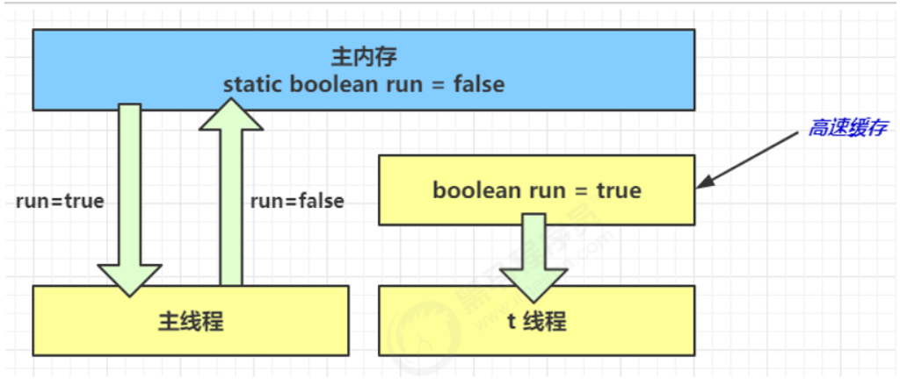
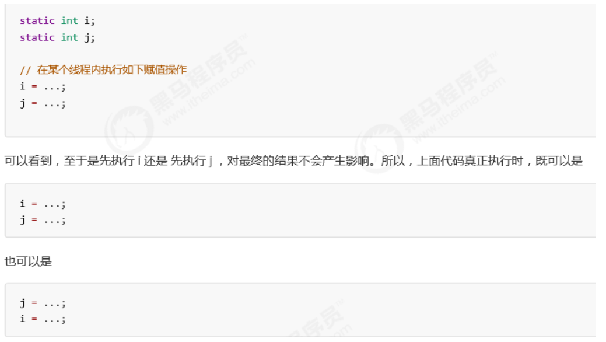
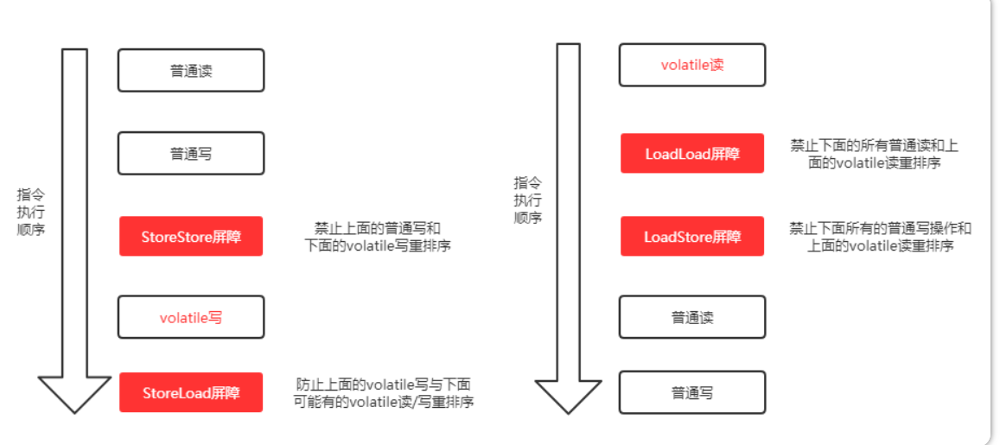

[TOC]

# 内存模型

## 简介

为了不让CPU在计算的时候因为实时读取内存数据而影响运算速度，CPU会加入一层缓存，在运算之前缓存内存的数据，CPU运算的时候操作的是缓存里的数据，运算完成后再同步回内存。这样虽然能够加速程序的运行速度，但是却带来了一个问题：缓存一致性问题。

编译器在编译的时候，允许重排序指令以优化运行速度。CPU在执行指令的时候，为了使处理器内部运算单元能被充分利用，也可以对指令进行乱序执行。

要解决**缓存一致性**问题需要某种协议，要解决重排序问题也需要某种协议。于是java定义了一种协议，一揽子解决了这两个问题，**这个协议就是Java内存模型**(JMM)。


JMM（Java Memory Model），它定义了主存（共享内存）、工作内存（线程私有）的抽象概念，底层对用着CPU寄存器、缓存、硬件、内存、CPU指令优化等

- 原子性 - 保证指令不会受到线程上下文切换的影响
- 可见性 - 保证指令不会受 cpu 缓存的影响
- 有序性 - 保证指令不会受 cpu 指令并行优化的影响


## 原子性

在单线程环境下我们可以认为整个步骤都是原子性操作，但是在多线程环境下则不同，Java**只保证了基本数据类型的变量和赋值操作**才是原子性的（注：在32位的JDK环境下，**对64位数据的读取不是原子性操作**，如long、double）。在多线程环境中，非原子操作可能会受其他线程的干扰，可通过lock、Synchronized保证原子性


## 可见性

**案例**

**退出不出的循环**

~~~java
static Boolean run = true;
public static void main(String[] args) throws InterruptedException {
    new Thread(()->{
        while (run) {
            // 如果run为真，则一直执行
        }
    }).start();// t thread

    Thread.sleep(1000);
    System.out.println("改变run的值为false");
    run = false;
}
~~~


**为什么无法退出该循环**

- 初始状态， t 线程刚开始从**主内存**读取了 run 的值到**工作内存**。

  

- 因为 t 线程要频繁从主内存中读取 run 的值，JIT 编译器会将 run 的值**缓存至自己工作内存**中的高速缓存中， 减少对主存中 run 的访问，提高效率

  

- 1 秒之后，main 线程修改了 run 的值，并同步至主存，而 t 是从自己工作内存中的高速缓存中读取这个变量 的值，结果永远是**旧值**

  


**解决方法**

- 使用**volatile**易变关键字
- 它可以用来修饰**成员变量**和**静态成员变量**（放在主存中的变量），他可以避免线程从自己的工作缓存中查找变量的值，**必须到主存中获取它的值**，线程操作 volatile 变量都是**直接操作主存**
- 保证所修饰变量修改后的内存可见性
- 禁止指令重排序
- 不保证原子性，**严格的说，对任意单个volatile变量的读/写具有原子性，但类似于volatile++这种复合操作不具有原子性**

~~~java
//使用易变关键字
volatile static Boolean run = true;
public static void main(String[] args) throws InterruptedException {
    new Thread(()->{
        while (run) {
            //如果run为真，则一直执行
        }
    }).start();

    Thread.sleep(1000);
    System.out.println("改变run的值为false");
    run = false;
}
~~~


## 有序性

### 指令重排

JVM 会在**不影响正确性**的前提下，可以**调整**语句的执行**顺序**



这种特性称之为『**指令重排**』，**多线程下『指令重排』会影响正确性**。


### 指令重排序优化

- 事实上，现代处理器会设计为一个时钟周期完成一条执行时间长的 CPU 指令。为什么这么做呢？可以想到指令还可以再划分成一个个更小的阶段，例如，每条指令都可以分为： **取指令 - 指令译码 - 执行指令 - 内存访问 - 数据写回** 这5 个阶段

  

- 

- 在不改变程序结果的前提下，这些指令的各个阶段可以通过**重排序**和**组合**来实现**指令级并行**

- 指令重排的前提是，重排指令**不能影响结果**，例如

  ```java
  // 可以重排的例子 
  int a = 10; 
  int b = 20; 
  System.out.println( a + b );
  
  // 不能重排的例子 
  int a = 10;
  int b = a - 5;
  ```


现代 CPU 支持多级**指令流水线**，例如支持**同时**执行 **取指令 - 指令译码 - 执行指令 - 内存访问 - 数据写回** 的处理器，就可以称之为五级指令流水线。这时 CPU 可以在一个时钟周期内，同时运行五条指令的不同阶段（相当于一 条执行时间长的复杂指令），IPC = 1，本质上，流水线技术并不能缩短单条指令的执行时间，但它变相地提高了指令的**吞吐率**。


**在多线程环境下，指令重排序可能导致出现意料之外的结果**

### 解决办法

**volatile** 修饰的变量，可以**禁用**指令重排

- 禁止的是加volatile关键字变量之前的代码被重排序


## 内存屏障

### 简介

编译器层次的控制就是插入内存屏障，禁止特定类型的处理器重排序，JVM就是通过内存屏障来限制处理器的重排序

件层面，内存屏障分两种：读屏障（Load Barrier）和写屏障（Store Barrier）。内存屏障有两个作用：

1. 阻止屏障两侧的指令重排序；
2. 强制把写缓冲区/高速缓存中的脏数据等写回主内存，或者让缓存中相应的数据失效


编译器在**生成字节码时**，会在指令序列中插入内存屏障来禁止特定类型的处理器重排序。编译器选择了一个**比较保守的JMM内存屏障插入策略**，这样可以保证在任何处理器平台，任何程序中都能得到正确的volatile内存语义。这个策略是：

- 在每个volatile写操作前插入一个StoreStore屏障；
- 在每个volatile写操作后插入一个StoreLoad屏障；
- 在每个volatile读操作后插入一个LoadLoad屏障；
- 在每个volatile读操作后再插入一个LoadStore屏障。





> 注：下述Load代表读操作，Store代表写操作
>
> **LoadLoad屏障**：对于这样的语句Load1; LoadLoad; Load2，在Load2及后续读取操作要读取的数据被访问前，保证Load1要读取的数据被读取完毕。
> **StoreStore屏障**：对于这样的语句Store1; StoreStore; Store2，在Store2及后续写入操作执行前，这个屏障会把Store1强制刷新到内存，保证Store1的写入操作对其它处理器可见。
> **LoadStore屏障**：对于这样的语句Load1; LoadStore; Store2，在Store2及后续写入操作被刷出前，保证Load1要读取的数据被读取完毕。
> **StoreLoad屏障**：对于这样的语句Store1; StoreLoad; Load2，在Load2及后续所有读取操作执行前，保证Store1的写入对所有处理器可见。它的开销是四种屏障中最大的（冲刷写缓冲器，清空无效化队列）。在大多数处理器的实现中，这个屏障是个万能屏障，兼具其它三种内存屏障的功能

对于连续多个volatile变量读或者连续多个volatile变量写，编译器做了一定的优化来提高性能，比如：

> 第一个volatile读;
>
> LoadLoad屏障；
>
> 第二个volatile读；
>
> LoadStore屏障

volatile与普通变量的重排序规则

1. 如果第一个操作是volatile读，那无论第二个操作是什么，都不能重排序；

2. 如果第二个操作是volatile写，那无论第一个操作是什么，都不能重排序；

3. 如果第一个操作是volatile写，第二个操作是volatile读，那不能重排序。

   

   举个例子，我们在案例中step 1，是普通变量的写，step 2是volatile变量的写，那符合第2个规则，这两个steps不能重排序。而step 3是volatile变量读，step 4是普通变量读，符合第1个规则，同样不能重排序。

   但如果是下列情况：第一个操作是普通变量读，第二个操作是volatile变量读，那是可以重排序的：

~~~java
// 声明变量
int a = 0; // 声明普通变量
volatile boolean flag = false; // 声明volatile变量

// 以下两个变量的读操作是可以重排序的
int i = a; // 普通变量读
boolean j = flag; // volatile变量读
~~~


**但是不能解决指令交错问题**

- 写屏障仅仅是保证之后的读能够读到新的结果，但不能保证读跑到它前面去
- 而有序性的保证也只是保证了**本线程内**相关代码不被重排序


### 实现原理

在X86处理器下通过工具获取JIT编译器生成的汇编指令来查看对volatile进行写操作时

```java
instance = new Singleton();
```

对应的汇编代码是

```shell
... lock addl ...
```


有volatile变量修饰的共享变量进行写操作的时候会多出第二行汇编代码，通过查IA-32架构软件开发者手册可知，**Lock前缀**的指令在多核处理器下会引发了两件事

- Lock前缀指令会引起处理器缓存回写到内存
  - Lock前缀指令导致在执行指令期间，声言处理器的LOCK#信号。在多处理器环境中，LOCK#信号确保在声言该信号期间，处理器可以独占任何共享内存。但是，在最近的处理器里，LOCK #信号一般不锁总线，而是**锁缓存**，毕竟锁总线开销的比较大。使用缓存一致性机制来确保修改的原子性，此操作被称为“缓存锁定”，**缓存一致性机制会阻止同时修改由两个以上处理器缓存的内存区域数据**
- 一个处理器的缓存回写到内存会导致其他处理器的缓存无效
  - 在多核处理器系统中进行操作的时候，IA-32和Intel 64处理器能**嗅探其他处理器访问系统内存和它们的内部缓存**。处理器使用嗅探技术保证它的内部缓存、系统内存和其他处理器的缓存的数据在总线上保持一致


