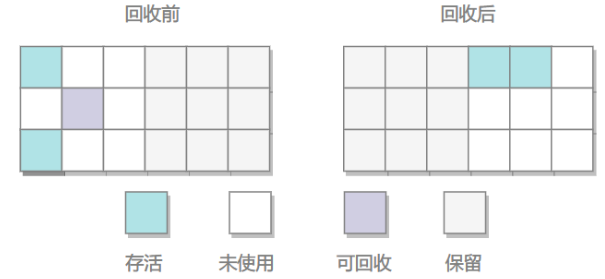
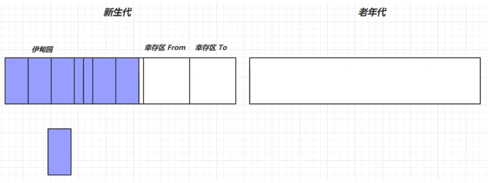
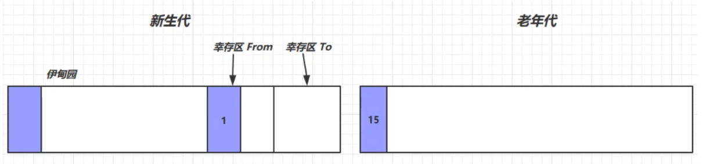
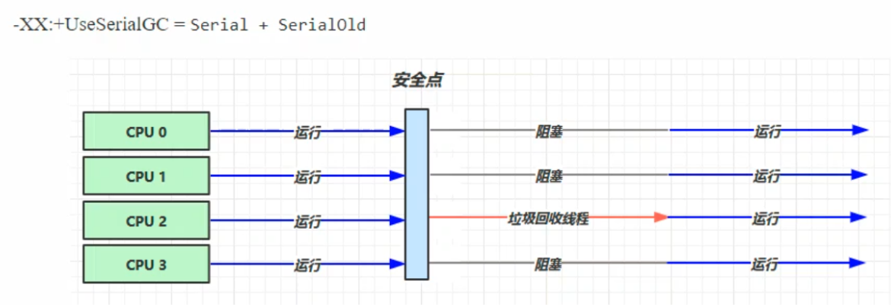
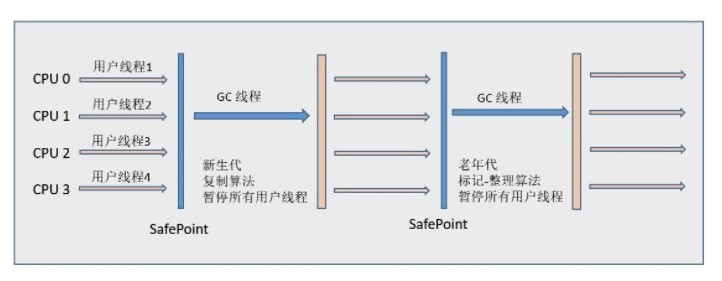

# 垃圾回收

[TOC]

垃圾收集主要是针对**堆和方法区**进行。程序计数器、虚拟机栈和本地方法栈这三个区域属于线程私有的，只存在于线程的生命周期内，线程结束之后就会消失，因此不需要对这三个区域进行垃圾回收。

## 判断对象是否可被回收

### 1.引用计数算法

为对象添加一个引用计数器，当对象增加一个引用时计数器加 1，引用失效时计数器减 1。引用计数为 0 的对象可被回收。

在两个对象出现**循环引用**的情况下，此时引用计数器**永远不为 0**，导致无法对它们进行回收 -> 内存泄漏。正是因为循环引用的存在，因此 Java 虚拟机不使用引用计数算法。

~~~java
public class Test {

    public Object instance = null;

    public static void main(String[] args) {
        Test a = new Test();
        Test b = new Test();
        a.instance = b;
        b.instance = a;
        a = null;
        b = null;
        doSomething();
    }
}
~~~

在上述代码中，a 与 b 引用的对象实例互相持有了对象的引用，因此当我们把对 a 对象与 b 对象的引用去除之后，由于两个对象还存在互相之间的引用，导致两个 Test 对象无法被回收。

###  2.可达性分析算法

以 GC Roots 为起始点进行搜索，**可达的对象都是存活的**，不可达的对象可被回收。

Java 虚拟机使用该算法来判断对象是否可被回收，GC Roots 一般包含以下内容：

- 虚拟机栈中局部变量表中引用的对象
- 本地方法栈中 JNI 中引用的对象
- 方法区中类静态属性引用的对象
- 方法区中的常量引用的对象

### 3.方法区回收

因为方法区主要存放永久代对象，而永久代对象的回收率比新生代低很多，所以在方法区上进行回收性价比不高。

**主要是对常量池的回收和对类的卸载。**

为了避免内存溢出，在大量使用反射和动态代理的场景都需要虚拟机具备类卸载功能。

类的卸载条件很多，需要满足以下三个条件，并且满足了条件也不一定会被卸载：

- 该类所有的实例都已经被回收，此时堆中不存在该类的任何实例。
- 加载该类的 ClassLoader 已经被回收。
- 该类对应的 Class 对象没有在任何地方被引用，也就无法在任何地方通过反射访问该类方法。

### 4.finalize()

类似 C++ 的析构函数，用于关闭外部资源。但是 try-finally 等方式可以做得更好，并且该方法运行**代价很高，不确定性大，无法保证各个对象的调用顺序**，因此最好不要使用。

当一个对象可被回收时，如果需要执行该对象的 finalize() 方法，那么就有可能在该方法中让对象重新被引用，从而实现自救。自救只能进行一次，如果回收的对象之前调用了 finalize() 方法自救，后面回收时不会再调用该方法。

## 引用类型

无论是通过引用计数算法判断对象的引用数量，还是通过可达性分析算法判断对象是否可达，判定对象是否可被回收**都与引用有关**。

Java 提供了**四种强度**不同的引用类型。

**引用队列**

> 引用队列由ReferenceQueue类表示，它用于保存被回收后对象的引用。当联合使用软引用、弱引用和引用队列时（可配合也可不配合），系统在回收被引用的对象之后，将把它所回收对象对应的引用添加到关联的引用队列中。而虚引用在对象被释放之前，将把它对应的虚引用添加到它关联的引用队列中，这使得可以在对象被回收之前采取行动。
>
> 虚引用和终结器引用**必须配合**引用队列

### 1.强引用

被强引用关联的对象不会被回收。

使用 new 一个新对象的方式来创建强引用。

~~~java
Object obj = new Object();
~~~

### 2.软引用

被软引用关联的对象**只有在内存不够的情况下才会被回收**，且还要满足没有其他强引用引用它

使用 SoftReference 类来创建软引用。

~~~java
Object obj = new Object();
SoftReference<Object> sf = new SoftReference<Object>(obj);
obj = null;  // 使对象只被软引用关联
~~~

### 3.弱引用

被弱引用关联的对象**一定会被回收**，也就是说它只能存活到下一次垃圾回收发生之前。

使用 WeakReference 类来创建弱引用。

~~~java
Object obj = new Object();
WeakReference<Object> wf = new WeakReference<Object>(obj);
obj = null;
~~~

### 4.虚引用

又称为幽灵引用或者幻影引用，一个对象是否有虚引用的存在，不会对其生存时间造成影响，也无法通过虚引用得到一个对象。

为一个对象设置虚引用的唯一目的是能在这个对象**被回收时收到一个系统通知**。

使用 PhantomReference 来创建虚引用。

~~~java
Object obj = new Object();
PhantomReference<Object> pf = new PhantomReference<Object>(obj, null);
obj = null;
~~~

### 5.终结器引用

所有的类都继承自Object类，Object类有一个finalize方法。当某个对象不再被其他的对象所引用时，会先将终结器引用对象放入引用队列中，然后根据终结器引用对象找到它所引用的对象，然后调用该对象的finalize方法。调用以后，该对象就可以被垃圾回收了

## 垃圾回收算法

### 1.标记-清除

在标记阶段，程序会检查每个对象是否为活动对象，如果是活动对象，则程序会在对象头部打上标记。

在清除阶段，会进行对象**回收并取消标志位**，另外，还会判断回收后的分块与前一个空闲分块是否连续，若连续，会合并这两个分块。回收对象就是把对象作为分块，连接到被称为 “空闲链表” 的单向链表，之后进行分配时**只需要遍历这个空闲链表，就可以找到分块。**

在分配时，程序会搜索空闲链表寻找空间大于等于新对象大小 size 的块 block。如果它找到的块等于 size，会直接返回这个分块；如果找到的块大于 size，会将块分割成大小为 size 与 (block - size) 的两部分，返回大小为 size 的分块，并把大小为 (block - size) 的块返回给空闲链表。

不足：

- 标记和清除过程**效率都不高**；
- 会产生**大量不连续的内存碎片**，导致**无法给大对象分配内存**。

### 2.标记-整理

**让所有存活的对象都向一端移动**，然后直接清理掉端边界以外的内存。

优点:

- 不会产生内存碎片

不足:

- **需要移动大量对象，处理效率比较低**

### 3.复制

将内存划分为**大小相等的两块**，每次只使用其中一块，当这一块内存用完了就将**还存活的对象复制到另一块**上面，然后再把使用过的内存空间进行一次清理。

主要不足是**只使用了内存的一半**。

现在的商业虚拟机都采用这种收集算法回收新生代，但是并不是划分为大小相等的两块，而是**一块较大的 Eden 空间和两块较小的 Survivor 空间**，每次使用 Eden 和其中一块 Survivor。在回收时，将 Eden 和 Survivor 中**还存活着的对象全部复制到另一块 Survivor 上**，最后清理 Eden 和使用过的那一块 Survivor。

HotSpot 虚拟机的 Eden 和 Survivor 大小比例默认为 8:1，保证了内存的利用率达到 90%。如果每次回收有多于 10% 的对象存活，那么一块 Survivor 就不够用了，此时需要依赖于老年代进行空间分配担保，也就是借用老年代的空间存储放不下的对象。

## 分代回收

现在的商业虚拟机采用分代收集算法，它根据对象存活周期将内存划分为几块，不同块采用适当的收集算法。

一般将堆分为新生代和老年代。

- **新生代使用：复制算法 **（对象存活率较低，大多对象都是无用的）
- **老年代使用：标记 - 清除 或者 标记 - 整理 算法**

### 回收流程

新创建的对象首先都被放在了**新生代的伊甸园**中

当伊甸园中的内存不足时，就会进行一次垃圾回收，这时的回收叫做 **Minor GC**

Minor GC会引发 stop the world，暂停其他用户线程，等待垃圾回收结束，用户线程才恢复运行

Minor GC 会将**伊甸园和幸存区FROM**存活的对象**先复制**到 **幸存区 TO**中， 并让其**寿命加1**，再**交换两个幸存区**

再次创建对象，若新生代的伊甸园又满了，则会**再次触发 Minor GC**（会触发 **stop the world**， 暂停其他用户线程，只让垃圾回收线程工作），这时不仅会回收伊甸园中的垃圾，**还会回收幸存区中的垃圾**，再将活跃对象复制到幸存区TO中。回收以后会交换两个幸存区，并让幸存区中的对象**寿命加1**

如果幸存区中的对象的**寿命超过某个阈值**（最大为15，4bit -> 1111），就会被**放入老年代**中，注意，并不是非要等到15才到老年代，**紧张时也会到老年代**

如果新生代老年代中的内存都满了，就会先触发Minor GC，再触发**Full GC**，扫描**新生代和老年代中**所有不再使用的对象并回收，老年代对象其存活时间长，因此 Full GC 很少执行，执行速度会比 Minor GC 慢很多。

### GC分析

#### 大对象处理策略

当遇到一个**较大的对象**时，就算新生代的**伊甸园**为空，也**无法容纳该对象**时，会将该对象**直接晋升为老年代**

#### 线程内存溢出

某个线程的内存溢出了而抛异常（out of memory），不会让其他的线程结束运行

这是因为当一个线程**抛出OOM异常后**，**它所占据的内存资源会全部被释放掉**，从而不会影响其他线程的运行，**进程依然正常**

## 内存分配策略

### 1. 对象优先在 Eden 分配

大多数情况下，对象在新生代 Eden 上分配，当 Eden 空间不够时，发起 Minor GC。

### 2. 大对象直接进入老年代

`注意：所以新创建一个对象不一定就是分配在年轻代上`

大对象是指需要连续内存空间的对象，最典型的大对象是那种很长的字符串以及数组。

经常出现大对象会提前触发垃圾收集以获取足够的连续空间分配给大对象。

-XX:PretenureSizeThreshold，大于此值的对象**直接在老年代分配，避免在 Eden 和 Survivor 之间的大量内存复制**。

### 3. 长期存活的对象进入老年代

为对象定义年龄计数器，对象在 Eden 出生并经过 Minor GC 依然存活，将移动到 Survivor 中，年龄就增加 1 岁，增加到一定年龄则移动到老年代中。

-XX:MaxTenuringThreshold 用来定义年龄的阈值。

### 4. 动态对象年龄判定

虚拟机并不是永远要求对象的年龄必须达到 MaxTenuringThreshold 才能晋升老年代，如果在 Survivor 中相同年龄所有对象大小的总和大于 Survivor 空间的一半，则年龄大于或等于该年龄的对象可以直接进入老年代，无需等到 MaxTenuringThreshold 中要求的年龄。

### 5. 空间分配担保

在发生 Minor GC 之前，虚拟机先检查老年代最大可用的连续空间是否大于新生代所有对象总空间，如果条件成立的话，那么 Minor GC 可以确认是安全的。

如果不成立的话虚拟机会查看 HandlePromotionFailure 的值是否允许担保失败，如果允许那么就会继续检查老年代最大可用的连续空间是否大于历次晋升到老年代对象的平均大小，如果大于，将尝试着进行一次 Minor GC；如果小于，或者 HandlePromotionFailure 的值不允许冒险，那么就要进行一次 Full GC。

## Full GC 的触发条件

对于 Minor GC，其触发条件非常简单，当 Eden 空间满时，就将触发一次 Minor GC。而 Full GC 则相对复杂，有以下条件：

### 1. 调用 System.gc()

只是建议虚拟机执行 Full GC，但是虚拟机不一定真正去执行。不建议使用这种方式，而是让虚拟机管理内存。

### 2.老年代空间不足

老年代空间不足的常见场景为前文所讲的大对象直接进入老年代、长期存活的对象进入老年代等。

为了避免以上原因引起的 Full GC，应当尽量不要创建过大的对象以及数组。除此之外，可以通过 -Xmn 虚拟机参数调大新生代的大小，让对象尽量在新生代被回收掉，不进入老年代。还可以通过 -XX:MaxTenuringThreshold 调大对象进入老年代的年龄，让对象在新生代多存活一段时间。

### 3. 空间分配担保失败

使用复制算法的 Minor GC 需要老年代的内存空间作担保，如果担保失败会执行一次 Full GC。

### JDK 1.7 及以前的永久代空间不足

在 JDK 1.7 及以前，HotSpot 虚拟机中的方法区是用永久代实现的，永久代中存放的为一些 Class 的信息、常量、静态变量等数据。

当系统中要加载的类、反射的类和调用的方法较多时，永久代可能会被占满，在未配置为采用 CMS GC 的情况下也会执行 Full GC。如果经过 Full GC 仍然回收不了，那么虚拟机会抛出 java.lang.OutOfMemoryError。

为避免以上原因引起的 Full GC，可采用的方法为增大永久代空间或转为使用 CMS GC

### Concurrent Mode Failure

执行 CMS GC 的过程中同时有对象要放入老年代，而此时老年代空间不足（可能是 GC 过程中浮动垃圾过多导致暂时性的空间不足），便会报 Concurrent Mode Failure 错误，并触发 Full GC。

## 垃圾回收器

### 相关概念

**并行收集**：指多条垃圾收集线程并行工作，但此时**用户线程仍处于等待状态**。

**并发收集**：指用户线程与垃圾收集线程**同时工作**（不一定是并行的可能会交替执行）。**用户程序在继续运行**，而垃圾收集程序运行在另一个CPU上

**吞吐量**：即CPU用于**运行用户代码的时间**与CPU**总消耗时间**的比值（吞吐量 = 运行用户代码时间 / ( 运行用户代码时间 + 垃圾收集时间 )），也就是。例如：虚拟机共运行100分钟，垃圾收集器花掉1分钟，那么吞吐量就是99%

### 垃圾收集器

以上是 HotSpot 虚拟机中的 7 个垃圾收集器，连线表示垃圾收集器可以配合使用。

- 单线程与多线程：单线程指的是垃圾收集器只使用一个线程，而多线程使用多个线程；
- 串行与并行：串行指的是垃圾收集器与用户程序交替执行，这意味着在执行垃圾收集的时候**需要停顿用户程序**；并行指的是垃圾收集器和用户程序**同时执行**。除了 **CMS 和 G1 之外（并行）**，其它垃圾收集器都是以串行的方式执行。

### 串行

- 单线程
- 堆内存较小，个人电脑（CPU核数较少）

**安全点**：让其他线程都在这个点停下来，以免垃圾回收时移动对象地址，使得其他线程找不到被移动的对象

因为是串行的，所以只有一个垃圾回收线程。且在该线程执行回收工作时，其他线程进入**阻塞**状态

#### 1. Serial 收集器

Serial 翻译为串行，也就是说它以串行的方式执行。

Serial收集器是最基本的、发展历史最悠久的收集器。

它是单线程的收集器，**只会使用一个线程**进行垃圾收集工作。

它的优点是简单高效，在单个 CPU 环境下，由于没有线程交互的开销，因此拥有最高的单线程收集效率。

它是 Client 场景下的默认新生代收集器，因为在该场景下内存一般来说不会很大。它收集一两百兆垃圾的停顿时间可以控制在一百多毫秒以内，只要不是太频繁，这点停顿时间是可以接受的。

> 特点：单线程、简单高效（与其他收集器的单线程相比），采用**复制算法**。对于限定单个CPU的环境来说，Serial收集器由于没有线程交互的开销，专心做垃圾收集自然可以获得最高的单线程手机效率。收集器进行垃圾回收时，必须暂停其他所有的工作线程，直到它结束（Stop The World）

#### 2. ParNew 收集器

它是 Serial 收集器的多线程版本。

它是 Server 场景下默认的新生代收集器，除了性能原因外，主要是因为除了 Serial 收集器，只有它能与 CMS 收集器配合使用。

**特点**：多线程、ParNew收集器默认开启的收集线程数与CPU的数量相同，在CPU非常多的环境中，可以使用-XX:ParallelGCThreads参数来限制垃圾收集的线程数。和Serial收集器一样存在Stop The World问题

#### 3. Serial Old 收集器

是 Serial 收集器的老年代版本，也是给 Client 场景下的虚拟机使用。如果用在 Server 场景下，它有两大用途：

- 在 JDK 1.5 以及之前版本（Parallel Old 诞生以前）中与 Parallel Scavenge 收集器搭配使用。
- 作为 CMS 收集器的**后备预案**，在并发收集发生 Concurrent Mode Failure 时使用（处理浮动垃圾）。

**特点**：同样是单线程收集器，采用**标记-整理算法**

### 吞吐量优先

- 多线程
- 堆内存较大，多核CPU
- 让单位时间内，STW的时间最短
- **JDK1.8默认使用**的垃圾回收器

#### 4. Parallel Scavenge 收集器

与 ParNew 一样是多线程收集器。

其它收集器目标是尽可能缩短垃圾收集时用户线程的停顿时间，而它的目标是达到一个可控制的吞吐量，因此它被称为“吞吐量优先”收集器。这里的吞吐量指 CPU 用于运行用户程序的时间占总时间的比值。

停顿时间越短就越适合需要与用户交互的程序，良好的响应速度能提升用户体验。而高吞吐量则可以高效率地利用 CPU 时间，尽快完成程序的运算任务，适合在后台运算而不需要太多交互的任务。

缩短停顿时间是以牺牲吞吐量和新生代空间来换取的：新生代空间变小，垃圾回收变得频繁，导致吞吐量下降。

可以通过一个开关参数打开 GC 自适应的调节策略（GC Ergonomics），就不需要手工指定新生代的大小（-Xmn）、Eden 和 Survivor 区的比例、晋升老年代对象年龄等细节参数了。虚拟机会根据当前系统的运行情况收集性能监控信息，动态调整这些参数以提供最合适的停顿时间或者最大的吞吐量。

#### 5. Parallel Old 收集器

是 Parallel Scavenge 收集器的老年代版本。

在注重吞吐量以及 CPU 资源敏感的场合，都可以优先考虑 Parallel Scavenge 加 Parallel Old 收集器。

**特点**：多线程，采用**标记-整理算法**（老年代没有幸存区）

### 响应时间优先

- 多线程
- 堆内存较大，多核CPU
- 尽可能让单次STW的时间最短

#### 6. CMS 收集器

CMS（Concurrent Mark Sweep），Mark Sweep 指的是**标记 - 清除**算法。

分为以下四个流程：

- 初始标记：仅仅只是标记一下 GC Roots **能直接关联到的对象**，速度很快，需要停顿，这里会STW
- 并发标记：进行 GC Roots Tracing 的过程，它在整个回收过程中耗时最长，不需要停顿，和用户线程一起执行，主要标记的是GC Roots **能间接关联到的对象**
- 重新标记：为了修正并发标记期间因用户程序继续运作而导致标记产生变动的那一部分对象的标记记录，**需要停顿**。
- 并发清除：不需要停顿。

在整个过程中耗时最长的并发标记和并发清除过程中，收集器线程都可以与用户线程一起工作，不需要进行停顿。

具有以下缺点：

- **吞吐量低**：低停顿时间是以牺牲吞吐量为代价的，导致 CPU 利用率不够高。
- 无法处理浮动垃圾，可能出现 Concurrent Mode Failure。浮动垃圾是指并发清除阶段由于用户线程继续运行而产生的垃圾，这部分垃圾只能到下一次 GC 时才能进行回收。由于浮动垃圾的存在，因此需要预留出一部分内存，意味着 CMS 收集不能像其它收集器那样等待老年代快满的时候再回收。如果预留的内存不够存放浮动垃圾，就会出现 Concurrent Mode Failure，这时虚拟机将临时启用 Serial Old 来替代 CMS。
- 标记 - 清除算法导致的空间碎片，往往出现老年代空间剩余，但无法找到足够大连续空间来分配当前对象，不得不提前触发一次 Full GC。

#### 7. G1 收集器

JDK 9以后默认使用，而且替代了CMS 收集器

G1（Garbage-First），它是一款面向服务端应用的垃圾收集器，在多 CPU 和大内存的场景下有很好的性能。HotSpot 开发团队赋予它的使命是未来可以替换掉 CMS 收集器。

 **适用场景**

- 同时注重吞吐量和低延迟（响应时间）
- 超大堆内存（内存大的），会将堆内存划分为多个**大小相等**的区域
- 整体上是**标记-整理**算法，两个区域之间是**复制**算法

堆被分为新生代和老年代，其它收集器进行收集的范围都是整个新生代或者老年代，而 G1 可以**直接对新生代和老年代一起回收**。

G1 把堆划分成**多个大小相等的独立区域**（Region），新生代和老年代不再物理隔离。

通过引入 Region 的概念，从而将原来的一整块内存空间划分成多个的小空间，使得每个小空间可以**单独进行垃圾回收**。这种划分方法带来了很大的灵活性，使得可预测的停顿时间模型成为可能。通过记录每个 Region 垃圾回收时间以及回收所获得的空间（这两个值是通过过去回收的经验获得），并维护一个**优先列表**，每次根据允许的收集时间，优先回收价值最大的 Region。

每个 Region 都有一个 Remembered Set，用来记录该 Region 对象的**引用对象所在的 Region**。通过使用 Remembered Set，在做可达性分析的时候就可以避免全堆扫描。

如果不计算维护 Remembered Set 的操作，G1 收集器的运作大致可划分为以下几个步骤：

- 初始标记
- 并发标记
- 最终标记：为了修正在并发标记期间因用户程序继续运作而导致标记产生变动的那一部分标记记录，虚拟机将这段时间对象变化记录在线程的 Remembered Set Logs 里面，最终标记阶段需要把 Remembered Set Logs 的数据合并到 Remembered Set 中。这阶段需要停顿线程，但是可并行执行。
- 筛选回收：首先对各个 Region 中的回收价值和成本进行排序，根据用户所期望的 GC 停顿时间来制定回收计划。此阶段其实也可以做到与用户程序一起并发执行，但是因为只回收一部分 Region，时间是用户可控制的，而且停顿用户线程将大幅度提高收集效率。

具备如下特点：

- 空间整合：整体来看是基于“标记 - 整理”算法实现的收集器，从局部（两个 Region 之间）上来看是基于“复制”算法实现的，这意味着运行期间不会产生内存空间碎片。
- 可预测的停顿：能让使用者明确指定在一个长度为 M 毫秒的时间片段内，消耗在 GC 上的时间不得超过 N 毫秒。

##### 回收阶段

新生代伊甸园垃圾回收—–>内存不足，新生代回收+并发标记—–>回收新生代伊甸园、幸存区、老年代内存——>新生代伊甸园垃圾回收(重新开始)

##### Young Collection

分代是按对象的**生命周期划分**，分区则是将堆空间划分连续几个不同小区间，每一个小区间**独立回收**，可以控制一次回收多少个小区间，方便控制 GC 产生的停顿时间

E：伊甸园 S：幸存区 O：老年代

- 会STW

  

  

  >  幸存的对象复制到S

  

  

  

  

##### Young Collection + CM

CM：并发标记

- 在 Young GC 时会**对 GC Root 进行初始标记**
- 在老年代**占用堆内存的比例**达到阈值时，对进行并发标记（不会STW），阈值可以根据用户来进行设定， 由下面的参数决定

~~~shell
-XX:InitiatingHeapOccypancyPercent=percent (默认45%)
~~~

##### Mixed Collection

混合收集会对E S O 进行**全面的回收**

- 最终标记 (Remark) 会STW
- **拷贝**存活 （Evacuation）会STW

~~~shell
-XX:MaxGCPauseMills:xxx 用于指定最长的停顿时间
~~~

**问**：为什么有的老年代被拷贝了，有的没拷贝？

因为指定了最大停顿时间，如果对所有老年代都进行回收，耗时可能过高。为了保证时间不超过设定的停顿时间，会**回收最有价值的老年代**（回收后，能够得到更多内存）

##### Full GC

G1在老年代内存不足时（老年代所占内存超过阈值）

- 如果垃圾产生速度慢于垃圾回收速度，不会触发Full GC，还是并发地进行清理
- 如果垃圾产生速度快于垃圾回收速度，便会触发Full GC

##### Young Collection 跨代引用

- 新生代回收的跨代引用（老年代引用新生代）问题

  

- 卡表与Remembered Set

  - Remembered Set 存在于E中，用于**保存新生代对象对应的脏卡**
    - 脏卡：O被划分为多个区域（一个区域512K），如果该区域引用了新生代对象，则该区域被称为脏卡

- 在引用变更时通过post-write barried + dirty card queue

- concurrent refinement threads 更新 Remembered Set

  

##### Remark

重新标记阶段

在垃圾回收时，收集器处理对象的过程中

黑色：已被处理，需要保留的 灰色：正在处理中的 白色：还未处理的

但是在**并发标记过程中**，有可能A被处理了以后未引用C，但该处理过程还未结束，在处理过程结束之前A引用了C，这时就会用到remark

过程如下

- 之前C未被引用，这时A引用了C，就会给C加一个写屏障，写屏障的指令会被执行，将C放入一个队列当中，并将C变为 处理中 状态
- 在**并发标记**阶段结束以后，重新标记阶段会STW，然后将放在该队列中的对象重新处理，发现有强引用引用它，就会处理它

