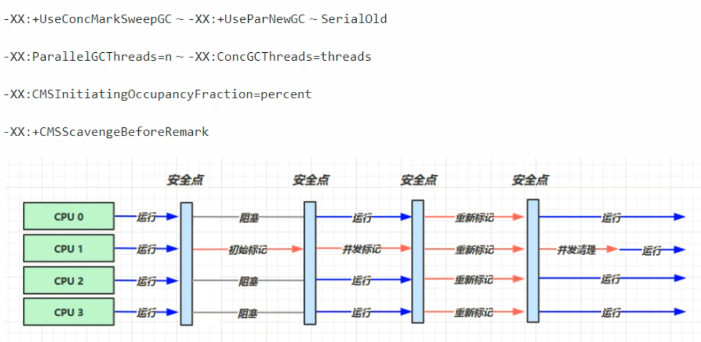
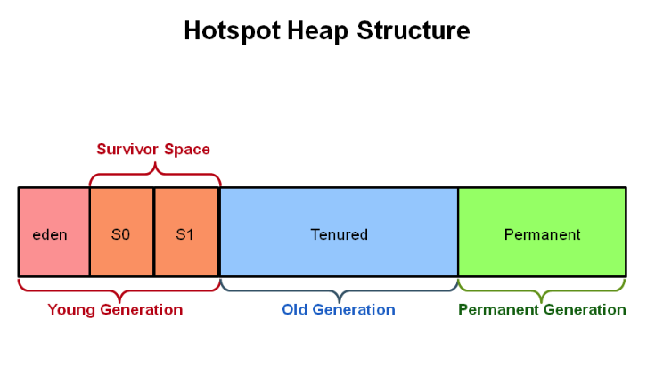
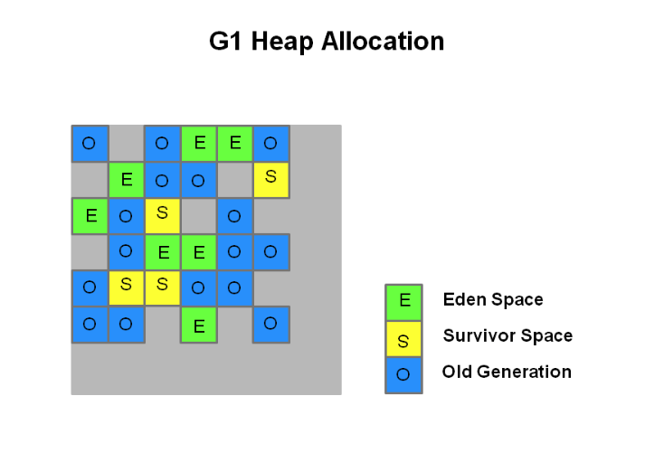
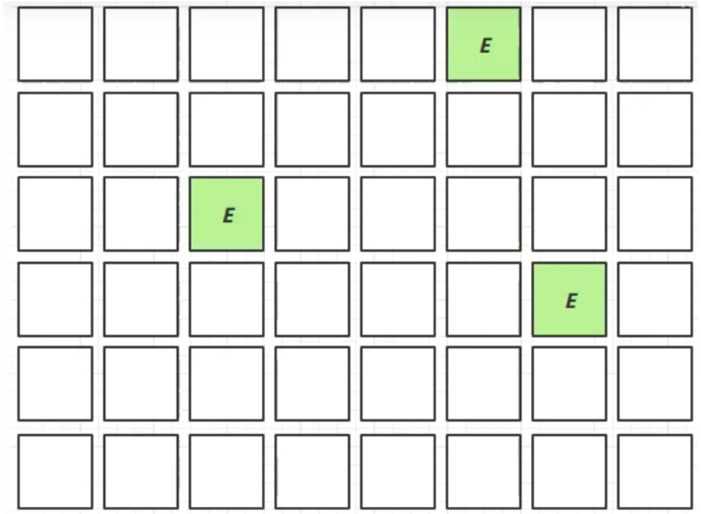
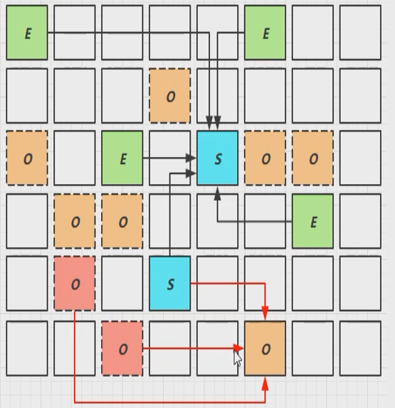

# 垃圾回收器

[TOC]

## 相关概念

**并行收集**：指多条垃圾收集线程并行工作，但此时**用户线程仍处于等待状态**。

**并发收集**：指用户线程与垃圾收集线程**同时工作**（不一定是并行的可能会交替执行）。**用户程序在继续运行**，而垃圾收集程序运行在另一个CPU上

**吞吐量**：即CPU用于**运行用户代码的时间**与CPU**总消耗时间**的比值（吞吐量 = 运行用户代码时间 / ( 运行用户代码时间 + 垃圾收集时间 )），也就是。例如：虚拟机共运行100分钟，垃圾收集器花掉1分钟，那么吞吐量就是99%

## 垃圾收集器

以上是 HotSpot 虚拟机中的 7 个垃圾收集器，连线表示垃圾收集器可以配合使用。

- 单线程与多线程：单线程指的是垃圾收集器只使用一个线程，而多线程使用多个线程；
- 串行与并行：串行指的是垃圾收集器与用户程序交替执行，这意味着在执行垃圾收集的时候**需要停顿用户程序**；并行指的是垃圾收集器和用户程序**同时执行**。除了 **CMS 和 G1 之外（并行）**，其它垃圾收集器都是以串行的方式执行。

## 串行

- 单线程
- 堆内存较小，个人电脑（CPU核数较少）

**安全点**：让其他线程都在这个点停下来，以免垃圾回收时移动对象地址，使得其他线程找不到被移动的对象

因为是串行的，所以只有一个垃圾回收线程。且在该线程执行回收工作时，其他线程进入**阻塞**状态

### 1. Serial 收集器

Serial 翻译为串行，也就是说它以串行的方式执行。

Serial收集器是最基本的、发展历史最悠久的收集器。

它是单线程的收集器，**只会使用一个线程**进行垃圾收集工作。

它的优点是简单高效，在单个 CPU 环境下，由于没有线程交互的开销，因此拥有最高的单线程收集效率。

它是 Client 场景下的默认新生代收集器，因为在该场景下内存一般来说不会很大。它收集一两百兆垃圾的停顿时间可以控制在一百多毫秒以内，只要不是太频繁，这点停顿时间是可以接受的。

> 特点：单线程、简单高效（与其他收集器的单线程相比），采用**复制算法**。对于限定单个CPU的环境来说，Serial收集器由于没有线程交互的开销，专心做垃圾收集自然可以获得最高的单线程手机效率。收集器进行垃圾回收时，必须暂停其他所有的工作线程，直到它结束（Stop The World）

### 2. ParNew 收集器

它是 Serial 收集器的多线程版本。

它是 Server 场景下默认的新生代收集器，除了性能原因外，主要是因为除了 Serial 收集器，只有它能与 CMS 收集器配合使用。

**特点**：多线程、ParNew收集器默认开启的收集线程数与CPU的数量相同，在CPU非常多的环境中，可以使用-XX:ParallelGCThreads参数来限制垃圾收集的线程数。和Serial收集器一样存在Stop The World问题

### 3. Serial Old 收集器

是 Serial 收集器的老年代版本，也是给 Client 场景下的虚拟机使用。如果用在 Server 场景下，它有两大用途：

- 在 JDK 1.5 以及之前版本（Parallel Old 诞生以前）中与 Parallel Scavenge 收集器搭配使用。
- 作为 CMS 收集器的**后备预案**，在并发收集发生 Concurrent Mode Failure 时使用（处理浮动垃圾）。

**特点**：同样是单线程收集器，采用**标记-整理算法**

## 吞吐量优先

- 多线程
- 堆内存较大，多核CPU
- 让单位时间内，STW的时间最短
- **JDK1.8默认使用**的垃圾回收器

### 4. Parallel Scavenge 收集器

与 ParNew 一样是多线程收集器。

其它收集器目标是尽可能缩短垃圾收集时用户线程的停顿时间，而它的目标是达到一个可控制的吞吐量，因此它被称为“吞吐量优先”收集器。这里的吞吐量指 CPU 用于运行用户程序的时间占总时间的比值。

停顿时间越短就越适合需要与用户交互的程序，良好的响应速度能提升用户体验。而高吞吐量则可以高效率地利用 CPU 时间，尽快完成程序的运算任务，适合在后台运算而不需要太多交互的任务。

缩短停顿时间是以牺牲吞吐量和新生代空间来换取的：新生代空间变小，垃圾回收变得频繁，导致吞吐量下降。

可以通过一个开关参数打开 GC 自适应的调节策略（GC Ergonomics），就不需要手工指定新生代的大小（-Xmn）、Eden 和 Survivor 区的比例、晋升老年代对象年龄等细节参数了。虚拟机会根据当前系统的运行情况收集性能监控信息，动态调整这些参数以提供最合适的停顿时间或者最大的吞吐量。

### 5. Parallel Old 收集器

是 Parallel Scavenge 收集器的老年代版本。

在注重吞吐量以及 CPU 资源敏感的场合，都可以优先考虑 Parallel Scavenge 加 Parallel Old 收集器。

**特点**：多线程，采用**标记-整理算法**（老年代没有幸存区）

## 响应时间优先

- 多线程
- 堆内存较大，多核CPU
- 尽可能让单次STW的时间最短

### 6. CMS 收集器

> 目前使用最多的是 CMS 和 G1 收集器，二者都有分代的概念，主要内存结构如下

CMS（Concurrent Mark Sweep），Mark Sweep 指的是**标记 - 清除**算法。

分为以下四个流程：

> 两个阶段会出现STW，**一个是初始标记，一个是重新标记**

- 初始标记：仅仅只是标记一下 GC Roots **能直接关联到的对象**，速度很快，需要停顿，**这里会STW**
- 并发标记：进行 GC Roots Tracing 的过程，它在整个回收过程中耗时最长，**不需要停顿**，和用户线程一起执行，主要标记的是GC Roots **能间接关联到的对象**
- 重新标记：为了修正并发标记期间因用户程序继续运作而导致标记产生变动的那一部分对象的标记记录，**需要停顿**，STW。
- 并发清除：**不需要停顿**。

在整个过程中耗时最长的并发标记和并发清除过程中，收集器线程都可以与用户线程一起工作，不需要进行停顿。

具有以下缺点：

- **吞吐量低**：低停顿时间是以牺牲吞吐量为代价的，导致 CPU 利用率不够高。
- **无法处理浮动垃圾**，可能出现 Concurrent Mode Failure。浮动垃圾是指并发清除阶段由于用户线程继续运行而产生的垃圾，这部分垃圾只能到下一次 GC 时才能进行回收。由于浮动垃圾的存在，因此需要预留出一部分内存，意味着 CMS 收集不能像其它收集器那样等待老年代快满的时候再回收。如果预留的内存不够存放浮动垃圾，就会出现 Concurrent Mode Failure，这时虚拟机将临时启用 Serial Old 来替代 CMS。
- **标记 - 清除算法导致的空间碎片，往往出现老年代空间剩余，但无法找到足够大连续空间来分配当前对象，不得不提前触发一次 Full GC。**

### 7. G1 收集器

JDK 9以后默认使用，而且替代了CMS 收集器

G1（Garbage-First），它是一款面向服务端应用的垃圾收集器，在多 CPU 和大内存的场景下有很好的性能。HotSpot 开发团队赋予它的使命是未来可以替换掉 CMS 收集器。

 **适用场景**

- 同时注重吞吐量和低延迟（响应时间）
- 超大堆内存（内存大的），会将堆内存划分为多个**大小相等**的区域
- 整体上是**标记-整理**算法，两个区域之间是**复制**算法

堆被分为新生代和老年代，其它收集器进行收集的范围都是整个新生代或者老年代，而 G1 可以**直接对新生代和老年代一起回收**。

G1 把堆划分成**多个大小相等的独立区域**（Region），新生代和老年代**不再物理隔离**。

通过引入 Region 的概念，从而将原来的一整块内存空间划分成多个的小空间，使得每个小空间可以**单独进行垃圾回收**。一次回收不用针对全部内存，只需要先回收垃圾最多的region，提高了垃圾收集的效率。通过记录每个 Region 垃圾回收时间以及回收所获得的空间（这两个值是通过过去回收的经验获得），并维护一个**优先列表**，每次根据允许的收集时间，优先回收价值最大的 Region。

**注意**，Region 内部依旧会有碎片话的问题，但是相对于整个堆内存要小很多，即便因为碎片化无法继续分配对象，也会触发gc,采用复制算法，将存活对象拷贝到新的region，回收老的region，一定程度上解决了碎片问题

#### Remembered Set 

每个 Region 都有一个 Remembered Set（记忆集），用来记录该 Region 对象的**引用对象所在的 Region**（记录不同代际之间的引用关系）。通过使用 Remembered Set，在做可达性分析的时候就可以避免全堆扫描。

> **为什么需要记录跨代的引用**

JVM一般都会对内存进行分代处理，以提高内存分配和垃圾回收的效率。Minor GC只会回收年轻代，Major GC只会老年代，无论是哪一种GC都会面临跨代引用的情况，比如老年代对象引用新生代或者新生代对象引用老年代。

Minor GC在回收年轻代时，需要判断年轻代的对象是否存活，而年轻代的部分对象可能被老年代的对象引用，因此必须扫描老年代才不会发生误判年轻代的对象为垃圾；同理，在回收老年代时，也需要扫描年轻代。

那么无论是只回收新生代还是老年代，都需要扫描其他代的对象，相当于进行全堆扫描，效率很低。那么将代际之间的引用关系记录在一个单独的地方，只需要扫描这个地方即可，避免全堆扫描。

---

通常有两种方法记录引用关系，分别为point out和point in。比如a=b（a引用b），若采用point out结构，则在a的RSet中记录b的地址；若采用point in结构，**则在b的RSet中记录a的地址**。

G1的RSet采用的是point in结构，即谁引用了我。（Card Table采用的是point out结构）

如果不计算维护 Remembered Set 的操作，G1 收集器的运作大致可划分为以下几个步骤：

- 初始标记
- 并发标记
- 最终标记：为了修正在并发标记期间因用户程序继续运作而导致标记产生变动的那一部分标记记录，虚拟机将这段时间对象变化记录在线程的 Remembered Set Logs 里面，最终标记阶段需要把 Remembered Set Logs 的数据合并到 Remembered Set 中。这阶段需要停顿线程，但是可并行执行。
- 筛选回收：首先对各个 Region 中的回收价值和成本进行排序，根据用户所期望的 GC 停顿时间来制定回收计划。此阶段其实也可以做到与用户程序一起并发执行，但是因为只回收一部分 Region，时间是用户可控制的，而且停顿用户线程将大幅度提高收集效率。

具备如下特点：

- 空间整合：整体来看是基于“标记 - 整理”算法实现的收集器，从局部（两个 Region 之间）上来看是基于“复制”算法实现的，这意味着运行期间不会产生内存空间碎片。
- 可预测的停顿：能让使用者明确指定在一个长度为 M 毫秒的时间片段内，消耗在 GC 上的时间不得超过 N 毫秒。

>  **Remembered Set 带来的问题**

1. RSet需要**额外的内存空间**来存储这些引用关系，一般是JVM最大的额外开销的1%-20%之间；
2. RSet中的对象可能已经死亡，那么这个时候引用的对象会被认为活跃对象，实际上它是**浮动垃圾**；
3. RSet是通过写屏障来完成的，即在内存分配的地方，插入一段代码来执行RSet的更新，如果对象的创建/修改/回收比较频繁，那么写RSet的性能开销还是比较大的。因此**一般不会记录年轻代到老年代的引用**。

> **主要哪些记录在  Remembered Set **

- 分区内部的引用

  无论是新生代还是老年代的分区内部的引用，都不需要记录引用关系。因为是针对一个分区进行的垃圾回收，要么这个分区被回收，要么不被回收。

- 新生代引用新生代

  G1的三种回收算法（YGC/MIXED GC/FULL GC）都会全量处理新生代分区，所以新生代都会被遍历到。因此无需记录这种引用关系。

- 新生代引用老年代

  无需记录。G1的YGC回收新生代，无需这个引用关系。混合GC时，G1会采用新生代分区作为根，那么在遍历新生代分区时就能找到老年代分区了，无需这个引用关系。对于FGC来说，所有分区都会被处理，也无需这个引用关系。

- **老年代引用新生代**

  需要记录。YGC在回收新生代时，如果新生代的对象被老年代引用，那么需要标记为存活对象。即此时的根对象有两种，一个是栈空间/全局变量的引用，一个是老年代到新生代的引用。

- **老年代引用老年代**

  需要记录。混合GC时，只会回收部分老年代，被回收的老年代需要正确的标记哪些对象存活。

> **Remembered Set 更新**

写屏障即在改变特定内存的值时，执行一些额外的动作。

G1的RSet的更新是通过写屏障完成的，在写变更时，通过插入一条额外的代码把引用关系放入到DCQ队列中，随后refine线程取出DCQ队列的引用关系，更新RSet。比如，每一次将一个老年代对象的引用修改为指向新生代对象时，都会被写屏障捕获，并且记录下来。

对于一个写屏障来时，过滤掉不必要的写操作是十分必要的，G1进行以下过滤：

1. 不记录新生代到新生代的引用 或者 新生代到老年代的引用
2. 过滤一个分区内部的引用
3. 过滤空引用

> **Region是如何划分数量和大小**  （主要针对Java8）

~~~c++
// Minimum region size; we won't go lower than that.
// We might want to decrease this in the future, to deal with small
// heaps a bit more efficiently.
// 允许的最小的REGION_SIZE，即1M，不可能比1M还小；
#define MIN_REGION_SIZE  (      1024 * 1024 )
// Maximum region size; we don't go higher than that. There's a good
// reason for having an upper bound. We don't want regions to get too
// large, otherwise cleanup's effectiveness would decrease as there
// will be fewer opportunities to find totally empty regions after
// marking.
// 允许的最大的REGION_SIZE，即32M，不可能比32M更大；限制最大REGION_SIZE是为了考虑GC时的清理效果；
#define MAX_REGION_SIZE  ( 32 * 1024 * 1024 )
// The automatic region size calculation will try to have around this
// many regions in the heap (based on the min heap size).
// JVM对堆期望划分的REGION数量，而不是实际划分的REGION数量
#define TARGET_REGION_NUMBER          2048
size_t HeapRegion::max_region_size() {
  return (size_t)MAX_REGION_SIZE;
}
// 这个方法是计算region的核心实现
void HeapRegion::setup_heap_region_size(size_t initial_heap_size, 
                                        size_t max_heap_size) {
  uintx region_size = G1HeapRegionSize;
  // 是否设置了G1HeapRegionSize参数，如果没有配置，那么按照下面的方法计算；
  // 如果设置了G1HeapRegionSize就按照设置的值计算
  if (FLAG_IS_DEFAULT(G1HeapRegionSize)) {
    // average_heap_size即平均堆的大小，(初始化堆的大小即Xms+最大堆的大小即Xmx)/2
    size_t average_heap_size = (initial_heap_size + max_heap_size) / 2;
    // average_heap_size除以期望的REGION数量得到每个REGION的SIZE，
    // 与MIN_REGION_SIZE取两者中的更大值就是实际的REGION_SIZE；
    // 从这个计算公式可知，默认情况下如果JVM堆在2G（TARGET_REGION_NUMBER*MIN_REGION_SIZE）
    // 以下，那么每个REGION_SIZE都是1M；
    region_size = MAX2(average_heap_size / TARGET_REGION_NUMBER, (uintx) MIN_REGION_SIZE);
  }
  // region_size的对数值
  int region_size_log = log2_long((jlong) region_size);
  // 重新计算region_size，确保它是最大的小于或等于region_size的2的N次方的数值，
  // 例如重新计算前region_size=33，那么重新计算后region_size=32；
  // 重新计算前region_size=16，那么重新计算后region_size=16；
  // Recalculate the region size to make sure it's a power of
  // 2. This means that region_size is the largest power of 2 that's
  // <= what we've calculated so far.
  region_size = ((uintx)1 << region_size_log);
  // 确保计算出来的region_size不能比MIN_REGION_SIZE更小，也不能比MAX_REGION_SIZE更大
  // Now make sure that we don't go over or under our limits.
  if (region_size < MIN_REGION_SIZE) {
    region_size = MIN_REGION_SIZE;
  } else if (region_size > MAX_REGION_SIZE) {
    region_size = MAX_REGION_SIZE;
  }
  // 与MIN_REGION_SIZE和MAX_REGION_SIZE比较后，再次重新计算region_size
  // And recalculate the log.
  region_size_log = log2_long((jlong) region_size);
  ... ...
}
// eg 假设配置JVM参数-Xmx6144m -Xms2048m，那么计算过程如下
// average_heap_size=(6144m+2048m)/2=4096m
// region_size=max(4096m/2048, 1m)=2m
// region_size_log=21（因为2^21=2*1024*1024<=2m）
// region_size=2^21=2m（保证region_size的值为2^n）
// region_size=2m（因为MIN_REGION_SIZE<=2m<=MAX_REGION_SIZE）
~~~

---

#### 回收阶段

新生代伊甸园垃圾回收—–>内存不足，新生代回收+并发标记—–>回收新生代伊甸园、幸存区、老年代内存——>新生代伊甸园垃圾回收(重新开始)

#### Young Collection

分代是按对象的**生命周期划分**，分区则是将堆空间划分连续几个不同小区间，每一个小区间**独立回收**，可以控制一次回收多少个小区间，方便控制 GC 产生的停顿时间

E：伊甸园 S：幸存区 O：老年代

- 会STW

  

  

  >  幸存的对象复制到S

  

  

  

  

#### Young Collection + CM

CM：并发标记

- 在 Young GC 时会**对 GC Root 进行初始标记**
- 在老年代**占用堆内存的比例**达到阈值时，对进行并发标记（不会STW），阈值可以根据用户来进行设定， 由下面的参数决定

~~~shell
-XX:InitiatingHeapOccypancyPercent=percent (默认45%)
~~~

#### Mixed Collection

混合收集会对E S O 进行**全面的回收**

- 最终标记 (Remark) 会STW
- **拷贝**存活 （Evacuation）会STW

~~~shell
-XX:MaxGCPauseMills:xxx 用于指定最长的停顿时间
~~~

**问**：为什么有的老年代被拷贝了，有的没拷贝？

因为指定了最大停顿时间，如果对所有老年代都进行回收，耗时可能过高。为了保证时间不超过设定的停顿时间，会**回收最有价值的老年代**（回收后，能够得到更多内存）

#### Full GC

G1在老年代内存不足时（老年代所占内存超过阈值）

- 如果垃圾产生速度慢于垃圾回收速度，不会触发Full GC，还是并发地进行清理
- 如果垃圾产生速度快于垃圾回收速度，便会触发Full GC

#### Young Collection 跨代引用

- 新生代回收的跨代引用（老年代引用新生代）问题

  

- 卡表与Remembered Set

  - Remembered Set 存在于E中，用于**保存新生代对象对应的脏卡**
    - 脏卡：O被划分为多个区域（一个区域512K），如果该区域引用了新生代对象，则该区域被称为脏卡

- 在引用变更时通过post-write barried + dirty card queue

- concurrent refinement threads 更新 Remembered Set

  

#### Remark

重新标记阶段

在垃圾回收时，收集器处理对象的过程中

黑色：已被处理，需要保留的 灰色：正在处理中的 白色：还未处理的

但是在**并发标记过程中**，有可能A被处理了以后未引用C，但该处理过程还未结束，在处理过程结束之前A引用了C，这时就会用到remark

过程如下

- 之前C未被引用，这时A引用了C，就会给C加一个写屏障，写屏障的指令会被执行，将C放入一个队列当中，并将C变为 处理中 状态
- 在**并发标记**阶段结束以后，重新标记阶段会STW，然后将放在该队列中的对象重新处理，发现有强引用引用它，就会处理它

