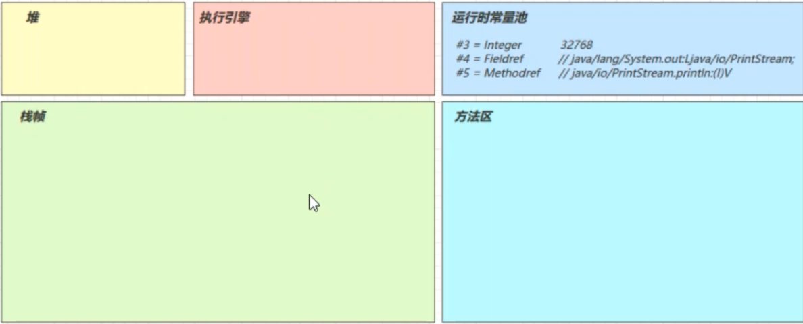
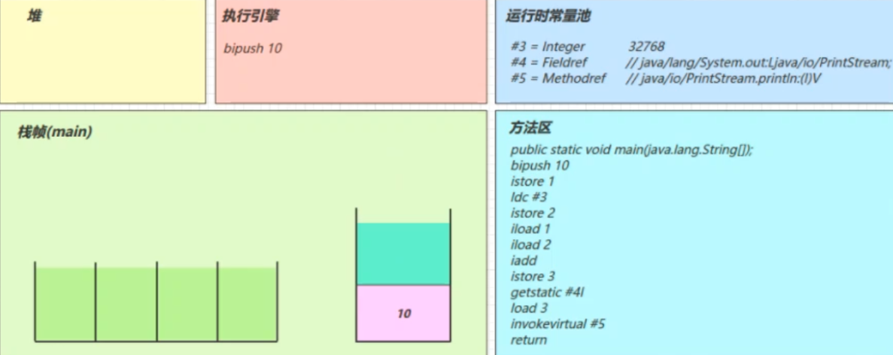
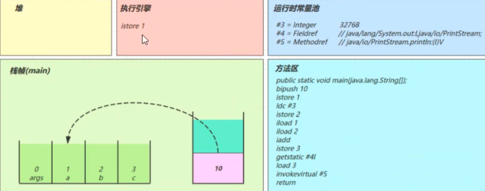
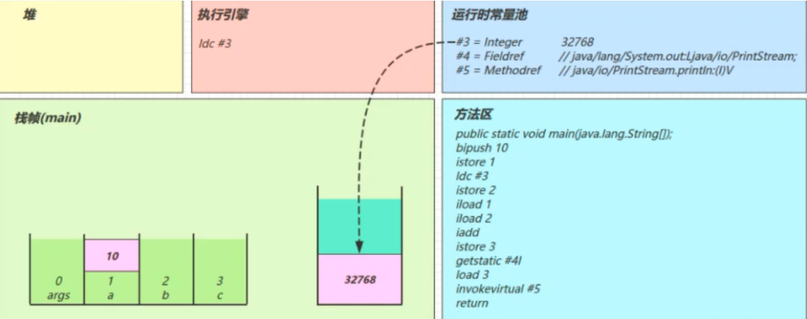
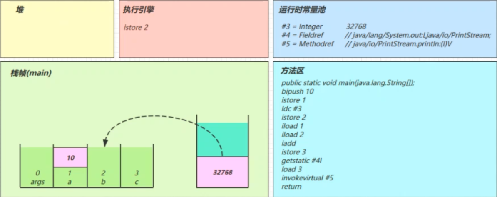
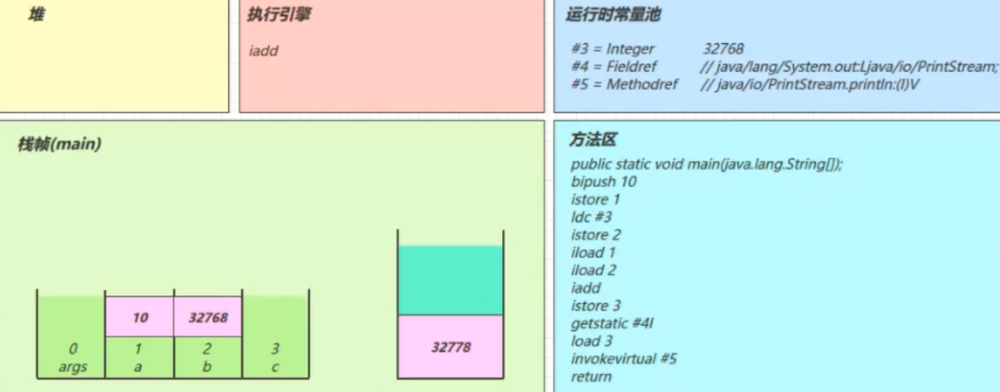
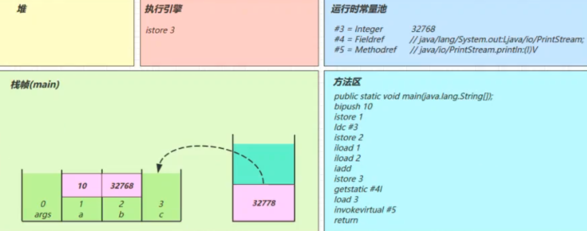
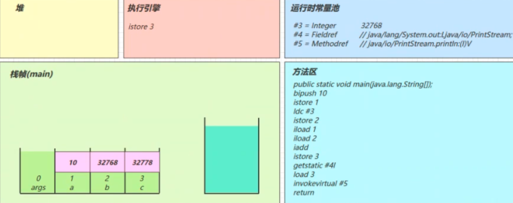

[TOC]


# 类加载机制

类是在运行期间第一次使用时**动态加载**的，而不是一次性加载所有类。因为如果一次性加载，那么会占用很多的内存。


## 类的生命周期


包括以下 7 个阶段：

- **加载（Loading）**
- **验证（Verification）**
- **准备（Preparation）**
- **解析（Resolution）**
- **初始化（Initialization）**
- 使用（Using）
- 卸载（Unloading）


## 图解方法执行流程

~~~java
public class Demo3_1 {    
    public static void main(String[] args) {        
        int a = 10;        
        int b = Short.MAX_VALUE + 1;        
        int c = a + b;        
        System.out.println(c);   
    } 
}
~~~

### 常量池载入运行时常量池

常量池也属于方法区，只不过这里单独提出来了



### 方法字节码载入方法区

main线程开始运行，分配栈帧内存

（stack=2，locals=4） 对应操作数栈有2个空间（每个空间4个字节），局部变量表中有4个槽位


### 执行引擎开始执行字节码

**bipush 10**

- 将一个 byte 压入操作数栈

  （其长度会补齐 4 个字节），类似的指令还有

  - sipush 将一个 short 压入操作数栈（其长度会补齐 4 个字节）
  - ldc 将一个 int 压入操作数栈
  - ldc2_w 将一个 long 压入操作数栈（**分两次压入**，因为 long 是 8 个字节）
  - 这里小的数字都是和字节码指令存在一起，**超过 short 范围的数字存入了常量池**





### istore 1

将操作数栈栈顶元素弹出，放入局部变量表的slot 1中

对应代码中的 

```java
a = 10
```




### ldc #3

读取运行时常量池中#3，即32768(超过short最大值范围的数会被放到运行时常量池中)，将其加载到操作数栈中

注意 Short.MAX_VALUE 是 32767，所以 32768 = Short.MAX_VALUE + 1 实际是在编译期间计算好的，**常量折叠优化**



### istore 2

将操作数栈中的元素弹出，放到局部变量表的2号位置




### iload1 iload2

将局部变量表中1号位置和2号位置的元素放入操作数栈中

- 因为只能在操作数栈中执行运算操作

  

  


### iadd

将操作数栈中的两个元素**弹出栈**并相加，结果在压入操作数栈中




### istore 3

将操作数栈中的元素弹出，放入局部变量表的3号位置






### getstatic #4

在运行时常量池中找到#4，发现是一个对象

在堆内存中找到该对象，并将其**引用**放入操作数栈中


### iload 3

将局部变量表中3号位置的元素压入操作数栈中


### invokevirtual #5

找到常量池 #5 项，定位到方法区 java/io/PrintStream.println:(I)V 方法

生成新的栈帧（分配 locals、stack等）

传递参数，执行新栈帧中的字节码


执行完毕，弹出栈帧

清除 main 操作数栈内容


### return

完成 main 方法调用，弹出 main 栈帧，程序结束


## 通过字节码指令来分析问题

~~~java
public class Demo2 {
    public static void main(String[] args) {
        int i=0;
        int x=0;
        while(i<10) {
            x = x++;
            i++;
        }
        System.out.println(x); // 结果为0
    }
}
~~~

为什么最终的x结果为0呢？ 通过分析字节码指令即可知晓

```java
Code:
stack=2, locals=3, args_size=1	//操作数栈分配2个空间，局部变量表分配3个空间
0: iconst_0	//准备一个常数0
1: istore_1	//将常数0放入局部变量表的1号槽位 i=0
2: iconst_0	//准备一个常数0
3: istore_2	//将常数0放入局部变量的2号槽位 x=0	
4: iload_1		//将局部变量表1号槽位的数放入操作数栈中
5: bipush        10	//将数字10放入操作数栈中，此时操作数栈中有2个数
7: if_icmpge     21	//比较操作数栈中的两个数，如果下面的数大于上面的数，就跳转到21。这里的比较是将两个数做减法。因为涉及运算操作，所以会将两个数弹出操作数栈来进行运算。运算结束后操作数栈为空
10: iload_2		//将局部变量2号槽位的数放入操作数栈中，放入的值是0
11: iinc          2, 1	//将局部变量2号槽位的数加1，自增后，槽位中的值为1
14: istore_2	//将操作数栈中的数放入到局部变量表的2号槽位，2号槽位的值又变为了0
15: iinc          1, 1 //1号槽位的值自增1
18: goto          4 //跳转到第4条指令
21: getstatic     #2                  // Field java/lang/System.out:Ljava/io/PrintStream;
24: iload_2
25: invokevirtual #3                  // Method java/io/PrintStream.println:(I)V
28: return
```


## 构造方法

### cinit()V

~~~java
public class Demo3 {
    static int i = 10;

    static {
        i = 20;
    }

    static {
        i = 30;
    }

    public static void main(String[] args) {
        System.out.println(i); //结果为30
    }
}
~~~

编译器会按**从上至下**的顺序，收集所有 static 静态代码块和静态成员赋值的代码，**合并**为一个特殊的方法 cinit()V ：

~~~java
stack=1, locals=0, args_size=0
         0: bipush        10
         2: putstatic     #3                  // Field i:I
         5: bipush        20
         7: putstatic     #3                  // Field i:I
        10: bipush        30
        12: putstatic     #3                  // Field i:I
        15: return
~~~


### init()V

~~~java
public class Demo4 {
    private String a = "s1";

    {
        b = 20;
    }

    private int b = 10;

    {
        a = "s2";
    }

    public Demo4(String a, int b) {
        this.a = a;
        this.b = b;
    }

    public static void main(String[] args) {
        Demo4 d = new Demo4("s3", 30);
        System.out.println(d.a);
        System.out.println(d.b);
    }
}
~~~

编译器会按**从上至下**的顺序，收集所有 {} 代码块和成员变量赋值的代码，**形成新的构造方法**，但**原始构造方法**内的代码**总是在后**


~~~java
Code:
     stack=2, locals=3, args_size=3
        0: aload_0
        1: invokespecial #1                  // Method java/lang/Object."<init>":()V
        4: aload_0
        5: ldc           #2                  // String s1
        7: putfield      #3                  // Field a:Ljava/lang/String;
       10: aload_0
       11: bipush        20
       13: putfield      #4                  // Field b:I
       16: aload_0
       17: bipush        10
       19: putfield      #4                  // Field b:I
       22: aload_0
       23: ldc           #5                  // String s2
       25: putfield      #3                  // Field a:Ljava/lang/String;
       //原始构造方法在最后执行
       28: aload_0
       29: aload_1
       30: putfield      #3                  // Field a:Ljava/lang/String;
       33: aload_0
       34: iload_2
       35: putfield      #4                  // Field b:I
       38: return
~~~


## 方法调用

```java
public class Demo5 {
	public Demo5() {

	}

	private void test1() {

	}

	private final void test2() {

	}

	public void test3() {

	}

	public static void test4() {

	}

	public static void main(String[] args) {
		Demo5 demo5 = new Demo5();
		demo5.test1();
		demo5.test2();
		demo5.test3();
		Demo5.test4();
	}
}
```

不同方法在调用时，对应的虚拟机指令有所区别

- 私有、构造、被final修饰的方法，在调用时都使用**invokespecial**指令
- 普通成员方法在调用时，使用invokespecial指令。因为编译期间无法确定该方法的内容，只有在运行期间才能确定
- 静态方法在调用时使用invokestatic指令

```java
Code:
      stack=2, locals=2, args_size=1
         0: new           #2                  // class com/star/JVM/day5/Demo5 
         3: dup
         4: invokespecial #3                  // Method "<init>":()V
         7: astore_1
         8: aload_1
         9: invokespecial #4                  // Method test1:()V
        12: aload_1
        13: invokespecial #5                  // Method test2:()V
        16: aload_1
        17: invokevirtual #6                  // Method test3:()V
        20: invokestatic  #7                  // Method test4:()V
        23: returnCopy
```

- new 是创建【对象】，给对象分配堆内存，执行成功会将【**对象引用**】压入操作数栈
- dup 是赋值操作数栈栈顶的内容，本例即为【**对象引用**】，为什么需要两份引用呢，一个是要配合 invokespecial 调用该对象的构造方法 “init”:()V （会消耗掉栈顶一个引用），另一个要 配合 astore_1 赋值给局部变量
- 终方法（final），私有方法（private），构造方法都是由 invokespecial 指令来调用，属于静态绑定
- 普通成员方法是由 invokevirtual 调用，属于**动态绑定**，即支持多态 成员方法与静态方法调用的另一个区别是，执行方法前是否需要【对象引用】


## 多态原理

因为普通成员方法需要在运行时才能确定具体的内容，所以虚拟机需要调用**invokevirtual**指令

在执行invokevirtual指令时，经历了以下几个步骤

- 先通过栈帧中对象的引用找到对象
- 分析对象头，找到对象实际的Class
- Class结构中有**vtable**
- 查询vtable找到方法的具体地址
- 执行方法的字节码


## 异常处理

### try-catch

```java
public class Demo1 {
	public static void main(String[] args) {
		int i = 0;
		try {
			i = 10;
		}catch (Exception e) {
			i = 20;
		}
	}
}
```

对应字节码指令

```java
Code:
     stack=1, locals=3, args_size=1
        0: iconst_0
        1: istore_1
        2: bipush        10
        4: istore_1
        5: goto          12
        8: astore_2
        9: bipush        20
       11: istore_1
       12: return
     //多出来一个异常表
     Exception table:
        from    to  target type
            2     5     8   Class java/lang/ExceptionCopy
```

- 可以看到多出来一个 Exception table 的结构，[from, to) 是**前闭后开**（也就是检测2~4行）的检测范围，一旦这个范围内的字节码执行出现异常，则通过 type 匹配异常类型，如果一致，进入 target 所指示行号
- 8行的字节码指令 astore_2 是将异常对象引用存入局部变量表的2号位置（为e）

### 多个single-catch

```java
public class Demo1 {
	public static void main(String[] args) {
		int i = 0;
		try {
			i = 10;
		}catch (ArithmeticException e) {
			i = 20;
		}catch (Exception e) {
			i = 30;
		}
	}
}
```

对应的字节码

```java
Code:
     stack=1, locals=3, args_size=1
        0: iconst_0
        1: istore_1
        2: bipush        10
        4: istore_1
        5: goto          19
        8: astore_2
        9: bipush        20
       11: istore_1
       12: goto          19
       15: astore_2
       16: bipush        30
       18: istore_1
       19: return
     Exception table:
        from    to  target type
            2     5     8   Class java/lang/ArithmeticException
            2     5    15   Class java/lang/ExceptionCopy
```

- 因为异常出现时，**只能进入** Exception table 中**一个分支**，所以局部变量表 slot 2 位置**被共用**

### finally

```java
public class Demo2 {
	public static void main(String[] args) {
		int i = 0;
		try {
			i = 10;
		} catch (Exception e) {
			i = 20;
		} finally {
			i = 30;
		}
	}
}
```

对应字节码

```java
Code:
     stack=1, locals=4, args_size=1
        0: iconst_0
        1: istore_1
        //try块
        2: bipush        10
        4: istore_1
        //try块执行完后，会执行finally    
        5: bipush        30
        7: istore_1
        8: goto          27
       //catch块     
       11: astore_2 //异常信息放入局部变量表的2号槽位
       12: bipush        20
       14: istore_1
       //catch块执行完后，会执行finally        
       15: bipush        30
       17: istore_1
       18: goto          27
       //出现异常，但未被Exception捕获，会抛出其他异常，这时也需要执行finally块中的代码   
       21: astore_3
       22: bipush        30
       24: istore_1
       25: aload_3
       26: athrow  //抛出异常
       27: return
     Exception table:
        from    to  target type
            2     5    11   Class java/lang/Exception
            2     5    21   any
           11    15    21   anyCopy
```

可以看到 finally 中的代码被**复制了 3 份**，分别放入 try 流程，catch 流程以及 catch剩余的异常类型流程

**注意**：虽然从字节码指令看来，每个块中都有finally块，但是finally块中的代码**只会被执行一次**

### finally中的return

```java
public class Demo3 {
	public static void main(String[] args) {
		int i = Demo3.test();
        //结果为20
		System.out.println(i);
	}

	public static int test() {
		int i;
		try {
			i = 10;
			return i;
		} finally {
			i = 20;
			return i;
		}
	}
}
```

对应字节码

```java
Code:
     stack=1, locals=3, args_size=0
        0: bipush        10
        2: istore_0
        3: iload_0
        4: istore_1  //暂存返回值
        5: bipush        20
        7: istore_0
        8: iload_0
        9: ireturn	//ireturn会返回操作数栈顶的整型值20
       //如果出现异常，还是会执行finally块中的内容，没有抛出异常
       10: astore_2
       11: bipush        20
       13: istore_0
       14: iload_0
       15: ireturn	//这里没有athrow了，也就是如果在finally块中如果有返回操作的话，且try块中出现异常，会吞掉异常！
     Exception table:
        from    to  target type
            0     5    10   anyCopy
```

- 由于 finally 中的 **ireturn** 被插入了所有可能的流程，因此返回结果肯定以finally的为准
- 至于字节码中第 2 行，似乎没啥用，且留个伏笔，看下个例子
- 跟上例中的 finally 相比，发现**没有 athrow 了**，这告诉我们：如果在 finally 中出现了 return，会**吞掉异常**
- 所以**不要在finally中进行返回操作**

### 被吞掉的异常

```java
public class Demo3 {
   public static void main(String[] args) {
      int i = Demo3.test();
      //最终结果为20
      System.out.println(i);
   }

   public static int test() {
      int i;
      try {
         i = 10;
         //这里应该会抛出异常
         i = i/0;
         return i;
      } finally {
         i = 20;
         return i;
      }
   }
}
```

会发现打印结果为20，并未抛出异常

### finally不带return

```java
public class Demo4 {
	public static void main(String[] args) {
		int i = Demo4.test();
		System.out.println(i);
	}

	public static int test() {
		int i = 10;
		try {
			return i;
		} finally {
			i = 20;
		}
	}
}
```

对应字节码

```java
Code:
     stack=1, locals=3, args_size=0
        0: bipush        10
        2: istore_0 //赋值给i 10
        3: iload_0	//加载到操作数栈顶
        4: istore_1 //加载到局部变量表的1号位置
        5: bipush        20
        7: istore_0 //赋值给i 20
        8: iload_1 //加载局部变量表1号位置的数10到操作数栈
        9: ireturn //返回操作数栈顶元素 10
       10: astore_2
       11: bipush        20
       13: istore_0
       14: aload_2 //加载异常
       15: athrow //抛出异常
     Exception table:
        from    to  target type
            3     5    10   anyCopy
```

### Synchronized

```java
public class Demo5 {
	public static void main(String[] args) {
		int i = 10;
		Lock lock = new Lock();
		synchronized (lock) {
			System.out.println(i);
		}
	}
}

class Lock{}Copy
```

对应字节码

```java
Code:
     stack=2, locals=5, args_size=1
        0: bipush        10
        2: istore_1
        3: new           #2                  // class com/star/JVM/day06/Lock
        6: dup //复制一份，放到操作数栈顶，用于构造函数消耗
        7: invokespecial #3                  // Method com/star/JVM/day06/Lock."<init>":()V
       10: astore_2 //剩下的一份放到局部变量表的2号位置
       11: aload_2 //加载到操作数栈
       12: dup //复制一份，放到操作数栈，用于加锁时消耗
       13: astore_3 //将操作数栈顶元素弹出，暂存到局部变量表的三号槽位。这时操作数栈中有一份对象的引用
       14: monitorenter //加锁 (lock引用)
       //锁住后代码块中的操作    
       15: getstatic     #4                  // Field java/lang/System.out:Ljava/io/PrintStream;
       18: iload_1
       19: invokevirtual #5                  // Method java/io/PrintStream.println:(I)V
       //加载局部变量表中三号槽位对象的引用，用于解锁    
       22: aload_3    
       23: monitorexit //解锁
       24: goto          34
       // 异常操作    
       27: astore        4
       29: aload_3
       30: monitorexit //解锁
       31: aload         4
       33: athrow
       34: return
     //可以看出，无论何时出现异常，都会跳转到27行，将异常放入局部变量中，并进行解锁操作，然后加载异常并抛出异常。      
     Exception table:
        from    to  target type
           15    24    27   any
           27    31    27   any
```


# 类加载阶段

> 先概括性的总结如下
>
> 类的加载过程：加载，连接（验证，准备，解析），初始化
>
> 类的生命周期：在上面五点后再加上使用和卸载
>
> 1.加载
>
> - 通过全类名获取此类的二进制字节流
> - 将字节流所代表的静态存储结构转换为运行时数据区的结构
> - 在内存中生成一个代表该类的Class对象，作为方法区这些数据的访问入口
>
> 2.验证
>
> - 文件格式验证
> - 元数据验证
> - 字节码验证
> - 符号引用验证
>
> 3.准备
>
> - 为类变量（static）分配内存并设置类变量初始值
> - 准备阶段初始化为0值，等到初始化阶段才会赋值。但是有特殊情况，如果是**final static**的变量，那么准备阶段**就会被赋值了**
>
> 4.解析
>
> - 将常量池内的符号引用替换为直接引用的过程
> - 符号引用就是一组符号来描述目标，可以是任何字面量。直接引用就是直接指向目标的指针。
>
> 5.初始化
>
> - 调用`<clint>`方法，就是执行静态代码块
> - 只有以下6中情况会发生初始化
>   - main 方法所在的类，总会被首先初始化
>   - 首次访问这个类的静态变量或静态方法时
>   - 子类初始化，如果父类还没初始化，会引发
>   - 子类访问父类的静态变量，只会触发父类的初始化
>   - Class.forName
>   - 遇到new、getstatic、putstatic、invokestatic

## 加载

- 将类的字节码载入方法区（1.8后为元空间，在本地内存中）中，内部采用 C++ 的 instanceKlass 描述 java 类，它的重要 field 有：

  - _java_mirror 即 java 的类镜像，例如对 String 来说，它的镜像类就是 String.class，作用是把 klass 暴露给 java 使用
  - _super 即父类
  - _fields 即成员变量
  - _methods 即方法
  - _constants 即常量池
  - _class_loader 即类加载器
  - _vtable 虚方法表
  - _itable 接口方法

- 如果这个类还有父类没有加载，**先加载父类**

- 加载和链接可能是**交替运行**

  

- instanceKlass保存在**方法区**。JDK 8以后，方法区位于元空间中，而元空间又位于本地内存中

- _java_mirror则是保存在**堆内存**中

- InstanceKlass和*.class(JAVA镜像类)互相保存了对方的地址

- 类的对象在对象头中保存了*.class的地址。让对象可以通过其找到方法区中的instanceKlass，从而获取类的各种信息


## 连接

### 验证

验证类是否符合 JVM规范，安全性检查

### 准备

为 static 变量分配空间，设置默认值

- static变量在JDK 7以前是存储与instanceKlass末尾。但在JDK 7以后就存储在_java_mirror末尾了
- static变量在分配空间和赋值是在两个阶段完成的。分配空间在准备阶段完成，赋值在初始化阶段完成
- 如果 static 变量是 final 的**基本类型**，以及**字符串常量**，那么编译阶段值就确定了，**赋值在准备阶段完成**
- 如果 static 变量是 final 的，但属于**引用类型**，那么赋值也会在**初始化阶段完成**

### 解析

将常量池中的符号引用解析为直接引用

**HSDB的使用**

- 先获得要查看的进程ID

```shell
jps
```

- 打开HSDB

```shell
java -cp F:\JAVA\JDK8.0\lib\sa-jdi.jar sun.jvm.hotspot.HSDB
```

- 运行时可能会报错，是因为**缺少一个.dll的文件**，我们在JDK的安装目录中找到该文件，复制到缺失的文件下即可

  


- 定位需要的进程

  

  


**解析的含义**

将常量池中的符号引用解析为直接引用

- 未解析时，常量池中的看到的对象仅是符号，未真正的存在于内存中

```java
public class Demo1 {
   public static void main(String[] args) throws IOException, ClassNotFoundException {
      ClassLoader loader = Demo1.class.getClassLoader();
      // 只加载不解析
      Class<?> c = loader.loadClass("com.nyima.JVM.day8.C");
      // 用于阻塞主线程
      System.in.read();
   }
}

class C {
   D d = new D();
}

class D {

}
```

- 打开HSDB

  - 可以看到此时只加载了类C

  

查看类C的常量池，可以看到类D**未被解析**，只是存在于常量池中的符号


- 解析以后，会将常量池中的符号引用解析为直接引用
  - 可以看到，此时已加载并解析了类C和类D


## 初始化

初始化阶段就是**执行类构造器clinit()方法的过程**，虚拟机会保证这个类的『构造方法』的线程安全

- clinit()方法是由编译器自动收集类中的所有类变量的**赋值动作和静态语句块**（static{}块）中的语句合并产生的

**注意**

编译器收集的顺序是由语句在源文件中**出现的顺序决定**的，静态语句块中只能访问到定义在静态语句块之前的变量，定义在它**之后**的变量，在前面的静态语句块**可以赋值，但是不能访问**，如


### 发生时机

**类的初始化的懒惰的**，以下情况会初始化

- main 方法所在的类，总会被首先初始化
- 首次访问这个类的静态变量或静态方法时
- 子类初始化，如果父类还没初始化，会引发
- 子类访问父类的静态变量，只会触发父类的初始化
- Class.forName
- 遇到new、getstatic、putstatic、invokestatic

以下情况不会初始化

- 访问类的 static final 静态常量（基本类型和字符串），在准备阶段赋值就完成
- 类对象.class 不会触发初始化
- 创建该类对象的数组
- 类加载器的.loadClass方法
- Class.forNamed的参数2为false时


**验证类是否被初始化，可以看类的静态代码块是否被执行**


## 使用


## 卸载

卸载就是该类的Class对象被GC

> 卸载发生的条件

- 该类的所有的实例对象都被GC了，堆中不存在该类的任何对象
- 该类没有在其他地方被引用
- 该类的类加载器的实例已被GC


## Java对象创建过程

- 类加载检查，检查能否在常量池中定位到这个类的符号引用，检查是否被加载，验证，准备，解析和初始化
- 内存分配，为新生对象分配内存，可以使用指针碰撞或空闲列表法，取决于堆是否规整
- 初始化零值，将分配到的内存空间初始化为0值
- 设置对象头，设置一些信息在对象头中，比如属于哪个类，年龄等
- 执行init方法，进行初始化等


## 虚拟机对对象初始化时，如何保证线程安全

采用两种方式：

1. CAS+失败重试
2. 为每个线程分配本地线程缓冲区(TLAB)，当TLAB使用完之后分配新的TLAB的时候，实行同步锁定。分配结束后，将分配的内存除对象头外，其余初始化为0值。如果使用TLAB，则初始化为0值提前到TLAB分配时执行。


# 类加载器

Java虚拟机设计团队有意把类加载阶段中的**“通过一个类的全限定名来获取描述该类的二进制字节流”**这个动作放到Java虚拟机外部去实现，以便让应用程序自己决定如何去获取所需的类。实现这个动作的代码被称为**“类加载器”**（ClassLoader）


> **加载的类信息放在方法区**


## 类与类加载器

类加载器虽然只用于实现类的加载动作，但它在Java程序中起到的作用却远超类加载阶段

对于任意一个类，都必须由加载它的**类加载器**和这个**类本身**一起共同确立其在Java虚拟机中的唯一性，每一个类加载器，都拥有一个独立的类名称空间。这句话可以表达得更通俗一些：**比较两个类是否“相等”，只有在这两个类是由同一个类加载器加载的前提下才有意义**，否则，即使这两个类来源于同一个Class文件，被同一个Java虚拟机加载，只要加载它们的类加载器不同，那这两个类就必定不相等

以JDK 8为例

|                   名称                    |       加载的类        |              说明               |
| :---------------------------------------: | :-------------------: | :-----------------------------: |
|   Bootstrap ClassLoader（启动类加载器）   |   JAVA_HOME/jre/lib   |          无法直接访问           |
|    Extension ClassLoader(拓展类加载器)    | JAVA_HOME/jre/lib/ext | 上级为Bootstrap，**显示为null** |
| Application ClassLoader(应用程序类加载器) |       classpath       |         上级为Extension         |
|              自定义类加载器               |        自定义         |        上级为Application        |

## 启动类加载器

可通过在控制台输入指令，使得类被启动类加器加载

## 拓展类加载器

如果classpath和JAVA_HOME/jre/lib/ext 下有同名类，加载时会使用**拓展类加载器**加载。当应用程序类加载器发现拓展类加载器已将该同名类加载过了，则不会再次加载

## 双亲委派模式

双亲委派模式，即调用类加载器ClassLoader 的 loadClass 方法时，查找类的规则

> 如果要加载一个类，会先判断**是否已经加载**。如果为加载，会把请求**委派给父加载器**，如果父加载器还有父，则让**父的父加载**。如果父为null，则给`BootstrapClassLoader`。如果父无法处理，才由儿子来处理


### 双亲委派机制的好处

1. 避免了重复类的加载（相同文件，被不同的类加载器加载了，就是不同的类）
2. 保证java核心代码不会被篡改（总是先由最上层来加载）


### loadClass源码

```java
protected Class<?> loadClass(String name, boolean resolve)
    throws ClassNotFoundException
{
    synchronized (getClassLoadingLock(name)) {
        // 首先查找该类是否已经被该类加载器加载过了
        Class<?> c = findLoadedClass(name);
        // 如果没有被加载过
        if (c == null) {
            long t0 = System.nanoTime();
            try {
                // 看是否被它的上级加载器加载过了 Extension的上级是Bootstarp，但它显示为null
                if (parent != null) {
                    c = parent.loadClass(name, false);
                } else {
                    // 看是否被启动类加载器加载过
                    c = findBootstrapClassOrNull(name);
                }
            } catch (ClassNotFoundException e) {
                // ClassNotFoundException thrown if class not found
                // from the non-null parent class loader
                // 捕获异常，但不做任何处理
            }

            if (c == null) {
                // 如果还是没有找到，先让拓展类加载器调用findClass方法去找到该类，如果还是没找到，就抛出异常
                // 然后让应用类加载器去找classpath下找该类
                long t1 = System.nanoTime();
                c = findClass(name);

                // 记录时间
                sun.misc.PerfCounter.getParentDelegationTime().addTime(t1 - t0);
                sun.misc.PerfCounter.getFindClassTime().addElapsedTimeFrom(t1);
                sun.misc.PerfCounter.getFindClasses().increment();
            }
        }
        if (resolve) {
            resolveClass(c);
        }
        return c;
    }
}
```

## 自定义类加载器

### 使用场景

- 想加载非 classpath 随意路径中的类文件
- 通过接口来使用实现，希望解耦时，常用在框架设计
- 这些类希望予以隔离，不同应用的同名类都可以加载，不冲突，常见于 tomcat 容器

### 步骤

- 继承ClassLoader父类
- 要遵从双亲委派机制，重写 findClass 方法
  - 不是重写loadClass方法，否则不会走双亲委派机制
- 读取类文件的字节码
- 调用父类的 defineClass 方法来加载类
- 使用者调用该类加载器的 loadClass 方法

### 破坏双亲委派模式

- 双亲委派模型的第一次“被破坏”其实发生在双亲委派模型出现之前——即JDK1.2面世以前的“远古”时代
  - 建议用户重写findClass()方法，在类加载器中的loadClass()方法中也会调用该方法
- 双亲委派模型的第二次“被破坏”是由这个模型自身的缺陷导致的
  - 如果有基础类型又要调用回用户的代码，此时也会破坏双亲委派模式
- 双亲委派模型的第三次“被破坏”是由于用户对程序动态性的追求而导致的
  - 这里所说的“动态性”指的是一些非常“热”门的名词：代码热替换（Hot Swap）、模块热部署（Hot Deployment）等


# 运行期优化

## 分层编译

JVM 将执行状态分成了 5 个层次：

- 0层：解释执行，用解释器将字节码翻译为机器码
- 1层：使用 C1 即时编译器编译执行（不带 profiling）
- 2层：使用 C1 即时编译器编译执行（带基本的profiling）
- 3层：使用 C1 即时编译器编译执行（带完全的profiling）
- 4层：使用 C2 即时编译器编译执行

profiling 是指在运行过程中收集一些程序执行状态的数据，例如【方法的调用次数】，【循环的回边次数】等

## 即时编译器（JIT）与解释器的区别

- 解释器
  - 将字节码**解释**为机器码，下次即使遇到相同的字节码，仍会执行重复的解释
  - 是将字节码解释为针对所有平台都通用的机器码
- 即时编译器
  - 将一些字节码**编译**为机器码，**并存入 Code Cache**，下次遇到相同的代码，**直接执行**，无需再编译
  - 根据平台类型，生成**平台特定**的机器码

对于大部分的不常用的代码，我们无需耗费时间将其编译成机器码，而是采取解释执行的方式运行；另一方面，对于仅占据小部分的热点代码，我们则可以将其编译成机器码，以达到理想的运行速度。 执行效率上简单比较一下 Interpreter < C1 < C2，总的目标是发现热点代码（hotspot名称的由来），并优化这些热点代码

## 逃逸分析

逃逸分析（Escape Analysis）简单来讲就是，Java Hotspot 虚拟机可以分析新创建对象的使用范围，并决定是否在 Java 堆上分配内存的一项技术

逃逸分析的 JVM 参数如下：

- 开启逃逸分析：-XX:+DoEscapeAnalysis
- 关闭逃逸分析：-XX:-DoEscapeAnalysis
- 显示分析结果：-XX:+PrintEscapeAnalysis

逃逸分析技术在 Java SE 6u23+ 开始支持，并默认设置为启用状态，可以不用额外加这个参数

**对象逃逸状态**

**全局逃逸（GlobalEscape）**

- 即一个对象的作用范围逃出了当前方法或者当前线程，有以下几种场景：
  - 对象是一个静态变量
  - 对象是一个已经发生逃逸的对象
  - 对象作为当前方法的返回值

**参数逃逸（ArgEscape）**

- 即一个对象被作为方法参数传递或者被参数引用，但在调用过程中不会发生全局逃逸，这个状态是通过被调方法的字节码确定的

**没有逃逸**

- 即方法中的对象没有发生逃逸

**逃逸分析优化**

针对上面第三点，当一个对象**没有逃逸**时，可以得到以下几个虚拟机的优化

**锁消除**

我们知道线程同步锁是非常牺牲性能的，当编译器确定当前对象只有当前线程使用，那么就会移除该对象的同步锁

例如，StringBuffer 和 Vector 都是用 synchronized 修饰线程安全的，但大部分情况下，它们都只是在当前线程中用到，这样编译器就会优化移除掉这些锁操作

锁消除的 JVM 参数如下：

- 开启锁消除：-XX:+EliminateLocks
- 关闭锁消除：-XX:-EliminateLocks

锁消除在 JDK8 中都是默认开启的，并且锁消除都要建立在逃逸分析的基础上

**标量替换**

首先要明白标量和聚合量，**基础类型**和**对象的引用**可以理解为**标量**，它们不能被进一步分解。而能被进一步分解的量就是聚合量，比如：对象

对象是聚合量，它又可以被进一步分解成标量，将其成员变量分解为分散的变量，这就叫做**标量替换**。

这样，如果一个对象没有发生逃逸，那压根就不用创建它，只会在栈或者寄存器上创建它用到的成员标量，节省了内存空间，也提升了应用程序性能

标量替换的 JVM 参数如下：

- 开启标量替换：-XX:+EliminateAllocations
- 关闭标量替换：-XX:-EliminateAllocations
- 显示标量替换详情：-XX:+PrintEliminateAllocations

标量替换同样在 JDK8 中都是默认开启的，并且都要建立在逃逸分析的基础上

**栈上分配**

当对象没有发生逃逸时，该**对象**就可以通过标量替换分解成成员标量分配在**栈内存**中，和方法的生命周期一致，随着栈帧出栈时销毁，减少了 GC 压力，提高了应用程序性能

## 方法内联

### 内联函数

内联函数就是在程序编译时，编译器将程序中出现的内联函数的调用表达式用内联函数的函数体来直接进行替换

###  JVM内联函数

C++是否为内联函数由自己决定，Java由**编译器决定**。Java不支持直接声明为内联函数的，如果想让他内联，你只能够向编译器提出请求: 关键字**final修饰** 用来指明那个函数是希望被JVM内联的，如

```java
public final void doSomething() {  
        // to do something  
}
```

总的来说，一般的函数都不会被当做内联函数，只有声明了final后，编译器才会考虑是不是要把你的函数变成内联函数

JVM内建有许多运行时优化。首先**短方法**更利于JVM推断。流程更明显，作用域更短，副作用也更明显。如果是长方法JVM可能直接就跪了。

第二个原因则更重要：**方法内联**

如果JVM监测到一些**小方法被频繁的执行**，它会把方法的调用替换成方法体本身，如：

```java
private int add4(int x1, int x2, int x3, int x4) { 
		// 这里调用了add2方法
        return add2(x1, x2) + add2(x3, x4);  
    }  

    private int add2(int x1, int x2) {  
        return x1 + x2;  
    }
```

方法调用被替换后

```java
private int add4(int x1, int x2, int x3, int x4) {  
	//被替换为了方法本身
	return x1 + x2 + x3 + x4;  
}
```

## 反射优化

```java
public class Reflect1 {
   public static void foo() {
      System.out.println("foo...");
   }

   public static void main(String[] args) throws NoSuchMethodException, InvocationTargetException, IllegalAccessException {
      Method foo = Demo3.class.getMethod("foo");
      for(int i = 0; i<=16; i++) {
         foo.invoke(null);
      }
   }
}
```

foo.invoke 前面 0 ~ 15 次调用使用的是 MethodAccessor 的 NativeMethodAccessorImpl 实现

invoke方法源码

```java
@CallerSensitive
public Object invoke(Object obj, Object... args)
    throws IllegalAccessException, IllegalArgumentException,
       InvocationTargetException
{
    if (!override) {
        if (!Reflection.quickCheckMemberAccess(clazz, modifiers)) {
            Class<?> caller = Reflection.getCallerClass();
            checkAccess(caller, clazz, obj, modifiers);
        }
    }
    //MethodAccessor是一个接口，有3个实现类，其中有一个是抽象类
    MethodAccessor ma = methodAccessor;             // read volatile
    if (ma == null) {
        ma = acquireMethodAccessor();
    }
    return ma.invoke(obj, args);
}
```

[](https://nyimapicture.oss-cn-beijing.aliyuncs.com/img/20200614133554.png)

会由DelegatingMehodAccessorImpl去调用NativeMethodAccessorImpl

NativeMethodAccessorImpl源码

```java
class NativeMethodAccessorImpl extends MethodAccessorImpl {
    private final Method method;
    private DelegatingMethodAccessorImpl parent;
    private int numInvocations;

    NativeMethodAccessorImpl(Method var1) {
        this.method = var1;
    }
	
	//每次进行反射调用，会让numInvocation与ReflectionFactory.inflationThreshold的值（15）进行比较，并使使得numInvocation的值加一
	//如果numInvocation>ReflectionFactory.inflationThreshold，则会调用本地方法invoke0方法
    public Object invoke(Object var1, Object[] var2) throws IllegalArgumentException, InvocationTargetException {
        if (++this.numInvocations > ReflectionFactory.inflationThreshold() && !ReflectUtil.isVMAnonymousClass(this.method.getDeclaringClass())) {
            MethodAccessorImpl var3 = (MethodAccessorImpl)(new MethodAccessorGenerator()).generateMethod(this.method.getDeclaringClass(), this.method.getName(), this.method.getParameterTypes(), this.method.getReturnType(), this.method.getExceptionTypes(), this.method.getModifiers());
            this.parent.setDelegate(var3);
        }

        return invoke0(this.method, var1, var2);
    }

    void setParent(DelegatingMethodAccessorImpl var1) {
        this.parent = var1;
    }

    private static native Object invoke0(Method var0, Object var1, Object[] var2);
}
//ReflectionFactory.inflationThreshold()方法的返回值
private static int inflationThreshold = 15;
```

- 一开始if条件不满足，就会调用本地方法invoke0
- 随着numInvocation的增大，当它大于ReflectionFactory.inflationThreshold的值16时，就会本地方法访问器替换为一个运行时动态生成的访问器，来提高效率
  - 这时会从反射调用变为**正常调用**，即直接调用 Reflect1.foo()

[](https://nyimapicture.oss-cn-beijing.aliyuncs.com/img/20200614135011.png)


