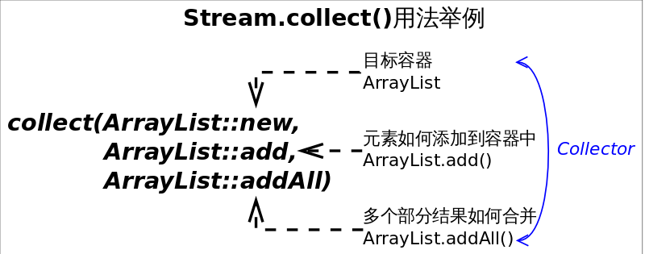

# Stream


图中4种*stream*接口继承自`BaseStream`，其中`IntStream, LongStream, DoubleStream`对应三种基本类型（`int, long, double`，注意不是包装类型），`Stream`对应所有剩余类型的*stream*视图。为不同数据类型设置不同*stream*接口，可以1.提高性能，2.增加特定接口函数。

这些方法的名字虽然相同，但是返回类型不同，如果设计成父子接口关系，这些方法将不能共存，因为Java不允许只有返回类型不同的方法重载。


虽然大部分情况下*stream*是容器调用`Collection.stream()`方法得到的，但*stream*和*collections*有以下不同：

- **无存储**。*stream*不是一种数据结构，它只是某种数据源的一个视图，数据源可以是一个数组，Java容器或I/O channel等。
- **为函数式编程而生**。对*stream*的任何修改都不会修改背后的数据源，比如对*stream*执行过滤操作并不会删除被过滤的元素，而是会产生一个不包含被过滤元素的新*stream*。
- **惰式执行**。*stream*上的操作并不会立即执行，只有等到用户真正需要结果的时候才会执行。
- **可消费性**。*stream*只能被“消费”一次，一旦遍历过就会失效，就像容器的迭代器那样，想要再次遍历必须重新生成。


对*stream*的操作分为为两类，**中间操作(intermediate operations)和结束操作(terminal operations\)**，二者特点是：

1. **中间操作总是会惰式执行**，调用中间操作只会生成一个标记了该操作的新*stream*，仅此而已。
2. **结束操作会触发实际计算**，计算发生时会把所有中间操作积攒的操作以*pipeline*的方式执行，这样可以减少迭代次数。计算完成之后*stream*就会失效。


| 操作类型 |                           接口方法                           |
| :------: | :----------------------------------------------------------: |
| 中间操作 | concat() distinct() filter() flatMap() limit() map() peek() skip() sorted() parallel() sequential() unordered() |
| 结束操作 | allMatch() anyMatch() collect() count() findAny() findFirst() forEach() forEachOrdered() max() min() noneMatch() reduce() toArray() |

区分中间操作和结束操作最简单的方法，就是看方法的返回值，返回值为*stream*的大都是中间操作，否则是结束操作。


*stream*跟函数接口关系非常紧密。

回顾一下：**函数接口是指内部只有一个抽象方法的接口**。通常函数接口出现的地方都可以使用Lambda表达式，所以不必记忆函数接口的名字。


## forEach()

我们对`forEach()`方法并不陌生，在`Collection`中我们已经见过。方法签名为`void forEach(Consumer<? super E> action)`，作用是对容器中的每个元素执行`action`指定的动作，也就是对元素进行遍历。


```java
// 使用Stream.forEach()迭代
Stream<String> stream = Stream.of("I", "love", "you", "too");
stream.forEach(str -> System.out.println(str));
```

由于`forEach()`是结束方法，上述代码会立即执行，输出所有字符串。


## filter()


函数原型为`Stream<T> filter(Predicate<? super T> predicate)`，作用是返回一个只包含满足`predicate`条件元素的`Stream`。


```java
// 保留长度等于3的字符串
Stream<String> stream= Stream.of("I", "love", "you", "too");
stream.filter(str -> str.length()==3)
    .forEach(str -> System.out.println(str));
```

上述代码将输出为长度等于3的字符串`you`和`too`。注意，由于`filter()`是个中间操作，如果只调用`filter()`不会有实际计算，因此也不会输出任何信息。


## distinct()


函数原型为`Stream<T> distinct()`，作用是返回一个去除重复元素之后的`Stream`。

```java
Stream<String> stream= Stream.of("I", "love", "you", "too", "too");
stream.distinct()
    .forEach(str -> System.out.println(str));
```

上述代码会输出去掉一个`too`之后的其余字符串。


## sorted()

排序函数有两个，一个是用自然顺序排序，一个是使用自定义比较器排序，函数原型分别为`Stream<T>　sorted()`和`Stream<T>　sorted(Comparator<? super T> comparator)`。

```java
Stream<String> stream= Stream.of("I", "love", "you", "too");
stream.sorted((str1, str2) -> str1.length()-str2.length())
    .forEach(str -> System.out.println(str));
```

上述代码将输出按照长度升序排序后的字符串，结果完全在预料之中。


## map()


函数原型为`<R> Stream<R> map(Function<? super T,? extends R> mapper)`，作用是返回一个对当前所有元素执行执行`mapper`之后的结果组成的`Stream`。直观的说，就是对每个元素按照某种操作进行转换，转换前后`Stream`中元素的个数不会改变，但元素的类型取决于转换之后的类型。

```java
Stream<String> stream　= Stream.of("I", "love", "you", "too");
stream.map(str -> str.toUpperCase())
    .forEach(str -> System.out.println(str));
```

上述代码将输出原字符串的大写形式。


## flatMap()

[](https://github.com/CarpenterLee/JavaLambdaInternals/blob/master/Figures/Stream.flatMap.png)

函数原型为`<R> Stream<R> flatMap(Function<? super T,? extends Stream<? extends R>> mapper)`，作用是对每个元素执行`mapper`指定的操作，并用所有`mapper`返回的`Stream`中的元素组成一个新的`Stream`作为最终返回结果。说起来太拗口，通俗的讲`flatMap()`的作用就相当于把原*stream*中的所有元素都"摊平"之后组成的`Stream`，转换前后元素的个数和类型都可能会改变。

```java
Stream<List<Integer>> stream = Stream.of(Arrays.asList(1,2), Arrays.asList(3, 4, 5));
stream.flatMap(list -> list.stream())
    .forEach(i -> System.out.println(i));
```

上述代码中，原来的`stream`中有两个元素，分别是两个`List<Integer>`，执行`flatMap()`之后，将每个`List`都“摊平”成了一个个的数字，所以会新产生一个由5个数字组成的`Stream`。所以最终将输出1~5这5个数字。


## 规约操作

*reduction operation* 又被称作折叠操作（*fold*）, 是通过某个连接动作将所有元素汇总成一个汇总结果的过程。

元素求和、求最大值或最小值、求出元素总个数、将所有元素转换成一个列表或集合，都属于规约操作。*Stream*类库有两个通用的规约操作`reduce()`和`collect()`，也有一些为简化书写而设计的专用规约操作，比如`sum()`、`max()`、`min()`、`count()`等。


## reduce()

*reduce*操作可以实现从一组元素中生成一个值，`sum()`、`max()`、`min()`、`count()`等都是*reduce*操作，将他们单独设为函数只是因为常用。`reduce()`的方法定义有三种重写形式：

- `Optional<T> reduce(BinaryOperator<T> accumulator)`
- `T reduce(T identity, BinaryOperator<T> accumulator)`
- `<U> U reduce(U identity, BiFunction<U,? super T,U> accumulator, BinaryOperator<U> combiner)`

虽然函数定义越来越长，但语义不曾改变，多的参数只是为了指明初始值（参数*identity*），或者是指定并行执行时多个部分结果的合并方式（参数*combiner*）。`reduce()`最常用的场景就是从一堆值中生成一个值。用这么复杂的函数去求一个最大或最小值，你是不是觉得设计者有病。其实不然，因为“大”和“小”或者“求和"有时会有不同的语义。

需求：*从一组单词中找出最长的单词*。这里“大”的含义就是“长”。

```java
// 找出最长的单词
Stream<String> stream = Stream.of("I", "love", "you", "too");
Optional<String> longest = stream.reduce((s1, s2) -> s1.length()>=s2.length() ? s1 : s2);
//Optional<String> longest = stream.max((s1, s2) -> s1.length()-s2.length());
System.out.println(longest.get());
```

上述代码会选出最长的单词*love*，其中*Optional*是（一个）值的容器，使用它可以避免*null*值的麻烦。当然可以使用`Stream.max(Comparator<? super T> comparator)`方法来达到同等效果，但`reduce()`自有其存在的理由。


需求：*求出一组单词的长度之和*。这是个“求和”操作，操作对象输入类型是*String*，而结果类型是*Integer*。


```java
// 求单词长度之和
Stream<String> stream = Stream.of("I", "love", "you", "too");
Integer lengthSum = stream.reduce(0,　// 初始值　// (1)
        (sum, str) -> sum+str.length(), // 累加器 // (2)
        (a, b) -> a+b);　// 部分和拼接器，并行执行时才会用到 // (3)
// int lengthSum = stream.mapToInt(str -> str.length()).sum();
System.out.println(lengthSum);
```

上述代码标号(2)处将i. 字符串映射成长度，ii. 并和当前累加和相加。这显然是两步操作，使用`reduce()`函数将这两步合二为一，更有助于提升性能。如果想要使用`map()`和`sum()`组合来达到上述目的，也是可以的。


## Collect()

```Java
// 将Stream转换成容器或Map
Stream<String> stream = Stream.of("I", "love", "you", "too");
List<String> list = stream.collect(Collectors.toList()); // (1)
// Set<String> set = stream.collect(Collectors.toSet()); // (2)
// Map<String, Integer> map = stream.collect(Collectors.toMap(Function.identity(), String::length)); // (3)
```


## 方法引用

诸如`String::length`的语法形式叫做方法引用（*method references*），这种语法用来替代某些特定形式Lambda表达式。如果Lambda表达式的全部内容就是调用一个已有的方法，那么可以用方法引用来替代Lambda表达式。方法引用可以细分为四类：

|    方法引用类别    |       举例       |
| :----------------: | :--------------: |
|    引用静态方法    |  `Integer::sum`  |
| 引用某个对象的方法 |   `list::add`    |
|  引用某个类的方法  | `String::length` |
|    引用构造方法    |  `HashMap::new`  |

我们会在后面的例子中使用方法引用。


## 收集器



收集器（*Collector*）是为`Stream.collect()`方法量身打造的工具接口（类）。考虑一下将一个*Stream*转换成一个容器（或者*Map*）需要做哪些工作？我们至少需要两样东西：

1. 目标容器是什么？是*ArrayList*还是*HashSet*，或者是个*TreeMap*。
2. 新元素如何添加到容器中？是`List.add()`还是`Map.put()`。

如果并行的进行规约，还需要告诉*collect()* 3. 多个部分结果如何合并成一个。

结合以上分析，collect()方法定义为`<R> R collect(Supplier<R> supplier, BiConsumer<R,? super T> accumulator, BiConsumer<R,R> combiner)`，三个参数依次对应上述三条分析。不过每次调用collect()都要传入这三个参数太麻烦，收集器Collector就是对这三个参数的简单封装,所以collect()的另一定义为`<R,A> R collect(Collector<? super T,A,R> collector)`。Collectors工具类可通过静态方法生成各种常用的Collector*。举例来说，如果要将*Stream规约成List可以通过如下两种方式实现：

```java
//　将Stream规约成List
Stream<String> stream = Stream.of("I", "love", "you", "too");
List<String> list = stream.collect(ArrayList::new, ArrayList::add, ArrayList::addAll);// 方式１
//List<String> list = stream.collect(Collectors.toList());// 方式2
System.out.println(list);
```

通常情况下我们不需要手动指定*collect()\*的三个参数，而是调用`collect(Collector<? super T,A,R> collector)`方法，并且参数中的\*Collector*对象大都是直接通过*Collectors*工具类获得。实际上传入的**收集器的行为决定了`collect()`的行为**。


## 使用collect()生成Collection

前面已经提到通过`collect()`方法将*Stream*转换成容器的方法，这里再汇总一下。将*Stream*转换成*List*或*Set*是比较常见的操作，所以*Collectors*工具已经为我们提供了对应的收集器，通过如下代码即可完成：

~~~java
// 将Stream转换成List或Set
Stream<String> stream = Stream.of("I", "love", "you", "too");
List<String> list = stream.collect(Collectors.toList()); // (1)
Set<String> set = stream.collect(Collectors.toSet()); // (2)
~~~

上述代码能够满足大部分需求，但由于返回结果是接口类型，我们并不知道类库实际选择的容器类型是什么，有时候我们可能会想要人为指定容器的实际类型，这个需求可通过`Collectors.toCollection(Supplier<C> collectionFactory)`方法完成。

~~~java
// 使用toCollection()指定规约容器的类型
ArrayList<String> arrayList = stream.collect(Collectors.toCollection(ArrayList::new));// (3)
HashSet<String> hashSet = stream.collect(Collectors.toCollection(HashSet::new));// (4)
~~~


## 使用collect()生成Map

前面已经说过*Stream*背后依赖于某种数据源，数据源可以是数组、容器等，但不能是*Map*。反过来从*Stream*生成*Map*是可以的，但我们要想清楚*Map*的*key*和*value*分别代表什么，根本原因是我们要想清楚要干什么。通常在三种情况下`collect()`的结果会是*Map*：

1. 使用`Collectors.toMap()`生成的收集器，用户需要指定如何生成*Map*的*key*和*value*。
2. 使用`Collectors.partitioningBy()`生成的收集器，对元素进行二分区操作时用到。
3. 使用`Collectors.groupingBy()`生成的收集器，对元素做*group*操作时用到。

情况1：使用`toMap()`生成的收集器，这种情况是最直接的，前面例子中已提到，这是和`Collectors.toCollection()`并列的方法。如下代码展示将学生列表转换成由<学生，GPA>组成的*Map*。非常直观，无需多言。

`Function.identity()`返回一个输出跟输入一样的Lambda表达式对象，等价于形如`t -> t`形式的Lambda表达式。

```java
// 使用toMap()统计学生GPA
Map<Student, Double> studentToGPA =
     students.stream().collect(Collectors.toMap(Function.identity(),// 如何生成key
                                     student -> computeGPA(student)));// 如何生成value
```

情况2：使用`partitioningBy()`生成的收集器，这种情况适用于将`Stream`中的元素依据某个二值逻辑（满足条件，或不满足）分成互补相交的两部分，比如男女性别、成绩及格与否等。下列代码展示将学生分成成绩及格或不及格的两部分。

```java
// Partition students into passing and failing
Map<Boolean, List<Student>> passingFailing = students.stream()
         .collect(Collectors.partitioningBy(s -> s.getGrade() >= PASS_THRESHOLD));
```

情况3：使用`groupingBy()`生成的收集器，这是比较灵活的一种情况。跟SQL中的*group by*语句类似，这里的*groupingBy()\*也是按照某个属性对数据进行分组，属性相同的元素会被对应到\*Map*的同一个*key*上。下列代码展示将员工按照部门进行分组：

```java
// Group employees by department
Map<Department, List<Employee>> byDept = employees.stream()
            .collect(Collectors.groupingBy(Employee::getDepartment));
```

以上只是分组的最基本用法，有些时候仅仅分组是不够的。在SQL中使用*group by*是为了协助其他查询，比如*1. 先将员工按照部门分组，2. 然后统计每个部门员工的人数*。Java类库设计者也考虑到了这种情况，增强版的`groupingBy()`能够满足这种需求。增强版的`groupingBy()`允许我们对元素分组之后再执行某种运算，比如求和、计数、平均值、类型转换等。这种先将元素分组的收集器叫做**上游收集器**，之后执行其他运算的收集器叫做**下游收集器**(*downstream Collector*)。

```java
// 使用下游收集器统计每个部门的人数
Map<Department, Integer> totalByDept = employees.stream()
                    .collect(Collectors.groupingBy(Employee::getDepartment,
                                                   Collectors.counting()));// 下游收集器
```

上面代码的逻辑是不是越看越像SQL？高度非结构化。还有更狠的，下游收集器还可以包含更下游的收集器，这绝不是为了炫技而增加的把戏，而是实际场景需要。考虑将员工按照部门分组的场景，如果*我们想得到每个员工的名字（字符串），而不是一个个*Employee*对象*，可通过如下方式做到：

```java
// 按照部门对员工分布组，并只保留员工的名字
Map<Department, List<String>> byDept = employees.stream()
                .collect(Collectors.groupingBy(Employee::getDepartment,
                        Collectors.mapping(Employee::getName,// 下游收集器
                                Collectors.toList())));// 更下游的收集器
```


## 使用collect()做字符串join

字符串拼接时使用`Collectors.joining()`生成的收集器，从此告别*for*循环。`Collectors.joining()`方法有三种重写形式，分别对应三种不同的拼接方式。无需多言，代码过目难忘。

```java
// 使用Collectors.joining()拼接字符串
Stream<String> stream = Stream.of("I", "love", "you");
//String joined = stream.collect(Collectors.joining());// "Iloveyou"
//String joined = stream.collect(Collectors.joining(","));// "I,love,you"
String joined = stream.collect(Collectors.joining(",", "{", "}"));// "{I,love,you}"
```

