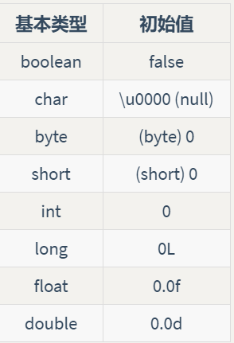

## 基础语法

[TOC]

### 对象操纵

Java 利用万物皆对象的思想和单一一致的语法方式来简化问题。虽万物皆可为对象，但我们所操纵的标识符实际上只是对对象的“引用”。 举例：我们可以用遥控器（引用）去操纵电视（对象）。只要拥有对象的“引用”，就可以操纵该“对象”。换句话说，我们无需直接接触电视，就可通过遥控器（引用）自由地控制电视（对象）的频道和音量。此外，没有电视，遥控器也可以单独存在。就是说，你仅仅有一个“引用”并不意味着你必然有一个与之关联的“对象”。

```java
String s = "asdf";
```

### 对象创建

```java
String s = new String("asdf");
```

### 数据存储

>- **寄存器**（Registers）最快的存储区域，位于 CPU 内部。然而，寄存器的数量十分有限，所以寄存器根据需求进行分配。我们对其没有直接的控制权，也无法在自己的程序里找到寄存器存在的踪迹（另一方面，C/C++ 允许开发者向编译器建议寄存器的分配）。
>- **栈内存**（Stack）存在于常规内存 RAM（随机访问存储器，Random Access Memory）区域中，可通过栈指针获得处理器的直接支持。栈指针下移分配内存，上移释放内存。这是一种仅次于寄存器的非常快速有效的分配存储方式。创建程序时，Java 系统必须知道栈内保存的所有项的生命周期。这种约束限制了程序的灵活性。因此，虽然在栈内存上存在一些 Java 数据（如对象引用），但 Java 对象本身的数据却是保存在堆内存的。
>- **堆内存**（Heap）这是一种通用的内存池（也在 RAM 区域），所有 Java 对象都存在于其中。与栈内存不同，编译器不需要知道对象必须在堆内存上停留多长时间。因此，用堆内存保存数据更具灵活性。创建一个对象时，只需用 `new` 命令实例化对象即可，当执行代码时，会自动在堆中进行内存分配。这种灵活性是有代价的：分配和清理堆内存要比栈内存需要更多的时间（如果可以用 Java 在栈内存上创建对象，就像在 C++ 中那样的话）。随着时间的推移，Java 的堆内存分配机制现在已经非常快，因此这不是一个值得关心的问题了。
>- **常量存储**（Constant storage）常量值通常直接放在程序代码中，因为它们永远不会改变。如需严格保护，可考虑将它们置于只读存储器 ROM （只读存储器，Read Only Memory）中 .
>- **非 RAM 存储**（Non-RAM storage）数据完全存在于程序之外，在程序未运行以及脱离程序控制后依然存在。两个主要的例子：（1）序列化对象：对象被转换为字节流，通常被发送到另一台机器；（2）持久化对象：对象被放置在磁盘上，即使程序终止，数据依然存在。这些存储的方式都是将对象转存于另一个介质中，并在需要时恢复成常规的、基于 RAM 的对象。Java 为轻量级持久化提供了支持。而诸如 JDBC 和 Hibernate 这些类库为使用数据库存储和检索对象信息提供了更复杂的支持。

### 八大基本数据类型




### 运算符

Java 中，由于赋予的只是对象的引用，改变 t1 也就改变了 t2。 这是因为 t1 和 t2 此时指向的是堆中同一个对象，（t1 原始对象的引用在 t2 赋值给其时丢失，它引用的对象会在垃圾回收时被清理）----这种现象通常称为**别名**

**位运算符**允许我们操作一个整型数字中的单个二进制位。位运算符会对两个整数对应的位执行布尔代数，从而产生结果。&不同的取0；|跟或类似；^（异或）不同取1，相同取0；~ （非）取相反。位运算符可与等号 `=` 联合使用以接收结果及赋值：`&=`，`|=` 和 `^=` 都是合法的（由于  ~ 是一元运算符，所以不可与 =  联合使用）。

位运算是按位进行与、或、非和异或的运算。

与运算的规则是，必须两个数同时为`1`，结果才为`1`。

或运算的规则是，只要任意一个为`1`，结果就为`1`。

非运算的规则是，`0`和`1`互换。

异或运算的规则是，如果两个数不同，结果为`1`，否则为`0`。

> 对于&(与):无论左边是否为false，都继续检查右边的布尔值
>
> 对于&&(短路与):只要检查到左边为false，立即判断结果。执行效率高
>
> 同样，|与||之间也是如此

**移位运算符**面向的运算对象也是二进制的“位”，它们只能用于处理整数类型。

左移位运算符 `<<` 能将其左边的运算对象向左移动右侧指定的位数（在低位补 0）。

右移位运算符 `>>` 则相反，有“正”、“负”值：若值为正，则在高位插入 0；若值为负，则在高位插入 1。

**三元运算符**，也称为条件运算符。**布尔表达式 ? 值 1 : 值 2**，若表达式计算为 **true**，则返回结果 **值 1** ；如果表达式的计算为 **false**，则返回结果 **值 2**。


**运算优先级**

在Java的计算表达式中，运算优先级从高到低依次是：

- `()`
- `!` `~` `++` `--`
- `*` `/` `%`
- `+` `-`
- `<<` `>>` `>>>`
- `&`
- `|`
- `+=` `-=` `*=` `/=`


**字符串运算符**

```java
int a = 10;
int b = 20;
System.out.println(""+a+b)//1020
System.out.println(a+b+"")//30
```

****


**==和equals的区别**

- == ：比较基本数据类型的时候，比较的是**值**，引用数据类型比较的是**地址**（也就是说，new的对象，==比较永远都是false，因为地址不同）
- equals：属于Object类的方法，如果我们没有重写equals方法，那么就是它就是==，但是字符串里面的equals被重写过了，比较的就是值

>  ==既可以比较基本数据类型也可以比较引用类型，对于基本数据类型就是比较值，对于引用类型就是比较内存地址           
>
> equals()是一个方法，而非运算符，<u>只能</u> 适用于**引用数据类型** ，Object类中定义的equals()和==的作用的相同的，即比较**两个对象的地址值是否相同**，**两个引用是否指向同一个对象实体**
>
> 如String、Data、File、包装类等都重写了Object类中的equlas()方法，重写以后比较的就不是两个引用的地址是否相同，<u>而是</u> 比较两个对象的**实体内容是否相同**

 ~~~java
public class EqualsDemo {

    static class Person {
        private String name;

        public Person(String name) {
            this.name = name;
        }
    }
    public static void main(String[] args) {
        String s1 = new String("abc");
        String s2 = new String("abc");

        System.out.println(s1 == s2);
        System.out.println(s1.equals(s2));
        Set<String> set1 = new HashSet<>();
        set1.add(s1);
        set1.add(s2);
        System.out.println(set1.size());

        System.out.println("==============");

        String s3 = "cbd";
        String s4 = "cbd";

        System.out.println(s3 == s4);
        System.out.println(s3.equals(s4));
        Set<String> set3 = new HashSet<>();
        set3.add(s3);
        set3.add(s3);
        System.out.println(set3.size());

        System.out.println("==============");

        Person person1 = new Person("abc");
        Person person2 = new Person("abc");
        System.out.println(person1 == person2);
        System.out.println(person1.equals(person2));
        Set<Person> set2 = new HashSet<>();
        set2.add(person1);
        set2.add(person2);
        System.out.println(set2.size());
    }
}

// 结果
false（==：如果是new出来的对象，比较的时候永远是false）
true：（字符串中的equals被重写过，比较的是值）
1：（HashSet底层是HashMap，HashMap内部是调用equals 和 HashCode，但是String内部的HashCode和equals也被复写）
==============
true（我们通过这种方式创建的会放在一个字符串常量池中，相同的字符串，会指向常量池中同一个对象，因此他们的地址是一样的）
true（字符串中的equals被重写过，比较的是值）
1
==============
false（==：如果是new出来的对象，比较的时候永远是false）
false（Person中的equals没有被重写，相当于等等）
2
 ~~~

又如：

~~~java
String str1 = "abc";
String str2 = new String("abc");
String str3 = "abc";
String str4 =  "xxx";
String str5 = "abc" + "xxx";
String str6 = s3 + s4;

System.out.println("str1 == str2：" + (str1 == str2));
System.out.println("str1.equals(str2)：" + (str1.equals(str2)));
System.out.println("str1 == str5：" + (str1 == str5));
System.out.println("str1 == str6：" + (str1 == str6));
System.out.println("str5 == str6：" + (str5 == str6));
System.out.println("str5.equals(str6)：" + (str5.equals(str6)));
System.out.println("str1 == str6.intern()：" + (str1 == str6.intern()));
System.out.println("str1 == str2.intern()：" + (str1 == str2.intern()));

// 结果
str1 == str2：false
str1.equals(str2)：true
str1 == str5：false
str1 == str6：false
str5 == str6：false
str5.equals(str6)：true
str1 == str6.intern()：false
str1 == str2.intern()：true
    
    
/**
intern方法就是从常量池中获取对象
返回字符串对象的规范表示形式
字符串池最初为空，由类字符串私下维护
调用intern方法时，如果池中已包含由equals(Object)方法确定的与此String对象相等的字符串，则返回池中的字符串
否者，此字符串添加到池中，并返回对此字符串对象的引用
因此，对于任意两个字符串s和t，s.intern() == t.intern() 在且仅当 s.equals(t) 为 true时候,所有文字字符串和字符串值常量表达式都会被插入
*/
~~~


**类型转换**

自动类型提升：当容量小（数的范围的大和小）的数据类型的变量与容量大的数据类型的变量做运算时，结果自动提升为容大的数据类型（byte、char、short->int->long->float->double）

特别的，当byte、char、short三种类型的变量做运算时，结果为int型

强制类型转换：使用强转符（），自动类型提升运算的逆运算。除了布尔类型的数据，Java 允许任何基本类型的数据转换为另一种基本类型的数据。此外，类是不能进行类型转换的。

在执行“向下转换”时，必须注意数据的截断和舍入问题。从 **float** 和 **double** 转换为整数值时，小数位将被截断，对结果进行四舍五入，可以使用 `java.lang.Math` 的 `round()` 方法。

此外，Java中没有sizeof，因为所有类型的大小在不同平台上是相同的。


### 作用域

Java 中，作用域是由大括号 `{}` 的位置决定的。ava 的变量只有在其作用域内才可用。

```java
{
    int x = 12;
    // 仅 x 变量可用
    {
        int q = 96;
        // x 和 q 变量皆可用
    }
    // 仅 x 变量可用
    // 变量 q 不在作用域内
}
```

Java 对象与基本类型具有不同的生命周期。当我们使用 `new` 关键字来创建 Java 对象时，它的生命周期将会超出作用域

```java
{
    String s = new String("a string");
} 
// 作用域终点
```

上例中，引用 s 在作用域终点就结束了。但是，引用 s 指向的字符串对象依然还在占用内存。在这段代码中，我们无法在这个作用域之后访问这个对象，因为唯一对它的引用 s 已超出了作用域的范围，也就是说，`new` 出来的对象就会一直存活下去。

Java 的垃圾收集器会检查所有 `new` 出来的对象并判断哪些不再可达，继而释放那些被占用的内存，供其他新的对象使用。

Java 使用动态内存分配。每次创建对象时，使用 `new` 关键字构建该对象的动态实例。这又带来另一个问题：对象的生命周期。较之堆内存，在栈内存中创建对象，编译器能够确定该对象的生命周期并自动销毁它；然而如果你在堆内存创建对象的话，编译器是不知道它的生命周期的。在 C++ 中你必须以编程方式确定何时销毁对象，否则可能导致内存泄漏。Java 的内存管理是建立在垃圾收集器上的，它能自动发现对象不再被使用并释放内存。

### 类的创建

#### 方法

类是对象的外观及行为方式的描述。创建好一个类之后，我们可以往类里存放两种类型的元素：方法（method）和字段（field）。类的字段可以是基本类型，也可以是引用类型。如果类的字段是对某个对象的引用，那么必须要初始化该引用将其关联到一个实际的对象上,对象名称.方法名称或字段名称.

```java
class DataOnly {
    int i;
    double d;
    boolean b;
}
 DataOnly data = new DataOnly();
  data.i = 47;
  data.d = 1.1;
  data.b = false;
```

在 Java 中，方法决定对象能接收哪些消息。方法的基本组成部分包括名称、参数、返回类型、方法体。方法的返回类型表明了当你调用它时会返回的结果类型。参数列表则显示了可被传递到方法内部的参数类型及名称。

方法名和参数列表统称为**方法签名**（signature of the method）。签名作为方法的唯一标识。方法只能作为类的一部分创建，它只能被对象所调用。并且该对象必须有权限来执行调用。

```java
 [返回类型] [方法名](/*参数列表*/){
     // 方法体
 }
```

若方法不带参数，如一个对象引用 `a` 的方法 `f` 不带参数并返回 **int** 型结果

```java
int x = a.f();
```

上例中方法 `f` 的返回值类型必须和变量 `x` 的类型兼容 。调用方法的行为有时被称为向对象发送消息。

面向对象编程可以总结为：向对象发送消息

#### 参数

方法参数列表指定了传递给方法的信息，以对象的形式传递。参数列表必须指定每个对象的类型和名称。并没有直接处理对象，而是在传递对象引用。可以返回任何类型的数据，`void` 来表明这是一个无需返回值的方法。

```java
int storage(String s) {
    return s.length() * 2;
}
```

将 s 传递给 `storage()` 后，把它看作和任何其他对象一样，可以向它发送消息，调用 `length()` 方法，它是一个 String 方法，返回字符串中的字符数。字符串中每个字符的大小为 16 位或 2 个字节。**return** 关键字仅用于退出方法

#### 静态

通常只有在使用 `new` 创建类的对象后，数据存储空间才被分配，对象的方法才能供外界调用。而这种方式在两种情况下是不足的。

>- 有时你只想为特定字段（注：也称为属性、域）分配一个共享存储空间，而不去考虑究竟要创建多少对象，甚至根本就不创建对象。
>- 创建一个与此类的任何对象无关的方法。也就是说，即使没有创建对象，也能调用该方法。

**static** 关键字就符合上述两点要求。当我们说某个事物是静态时，就意味着该字段或方法不依赖于任何特定的对象实例 。 即使我们从未创建过该类的对象，也可以调用其静态方法或访问其静态字段。

相反，对于普通的非静态字段和方法，我们必须要先创建一个对象并使用该对象来访问字段或方法，因为非静态字段和方法必须与特定对象关联。

```java
class StaticTest {
    static int i = 47;
}
```

现在，即使你创建了两个 `StaticTest` 对象，但是静态变量 `i` 仍只占一份存储空间。两个对象都会共享相同的变量 `i`。

`````java
StaticTest st1 = new StaticTest();
StaticTest st2 = new StaticTest();
StaticTest.i++;
`````

`st1.i` 和 `st2.i` 指向同一块存储空间，因此它们的值都是 47。

引用静态变量有两种方法。1.通过一个对象来定位它,如st2.i

2.也可以通过类名直接引用它，这种方式对于非静态成员则不可行，使用类名直接引用静态变量是首选方法，因为它强调了变量的静态属性。

同样,对于静态方法

```JAVA
class Incrementable {
    static void increment() { 
      StaticTest.i++; 
    }
}
```

可以

```java
Incrementable sf = new Incrementable();
sf.increment();
     or
Incrementable.increment()；         
```

### 控制流

#### if-else

if里的执行语句既可以是以分号 `;` 结尾的一条简单语句，也可以是包含在大括号 `{}` 内的的复合语句 —— 封闭在大括号内的一组简单语句。 

注意：`else if` 并非新关键字，它仅是 `else` 后紧跟的一条新 `if` 语句。

```java
public class IfElse {
  static int result = 0;
  static void test(int testval, int target) {
    if(testval > target)
      result = +1;
    else if(testval < target) // [1]
      result = -1;
    else
      result = 0; // Match
  }

  public static void main(String[] args) {
    test(10, 5);
    System.out.println(result);//1
    test(5, 10);
    System.out.println(result);//-1
    test(5, 5);
    System.out.println(result);//0
  }
}
```

#### 迭代语句

while、do-while和for用来控制循环语句。只有控制循环的布尔表达式计算结果为 `false`，循环语句才会停止。

块（即复合语句）是指由一对大括号括起来的若干条简单的 Java 语句。块确定了变量的作 用域。一个块可以嵌套在另一个块中。

**while**

当条件为 true 时，while 循环执行一条语句（也可以是一个语句块）。

一般格式为 while { condition ) statement

 如果开始循环条件的值就为 false, 则 while 循环体一次也不执行。

**do-while**

如果希望 循环体至少执行一次，则应该将检测条件放在最后。使用 do/while 循环语句可以实现这种操 作方式。它的语法格式为： 

do statement while { condition); 

这种循环语句先执行语句（通常是一个语句块) 再检测循环条件；然后重复语句，再检测循环条件，以此类推。

**for**

```java
for(initialization; Boolean-expression; step)
  statement
```

初始化 (initialization) 表达式、布尔表达式 (Boolean-expression) ，或者步进 (step) 运算，都可以为空。无论在初始化还是在步进部分，语句都是**顺序**执行的。

每次迭代之前都会判断布尔表达式的结果是否成立。一旦计算结果为 `false`，则跳出 **for** 循环体并继续执行后面代码。 每次循环结束时，都会执行一次步进。

#### 无条件分支

无需任何测试即可发生。这些关键字包括 **return**，**break**，**continue** 和跳转到带标签语句的方法，类似于其他语言中的 **goto**。

**return**

1.指定一个方法返回值 (在方法返回类型非 **void** 的情况下)；

2.退出当前方法，并返回作用 1 中值。

**break&continue**

在任何迭代语句的主体内，都可以使用 **break** 和 **continue** 来控制循环的流程。 其中，**break** 表示跳出当前循环体，中断正常的控制流程。而 **continue** 将控制转移到最内层循环的首部。

### 数组

数组是一种数据结构， 用来存储同一类型值的集合。通过一个整型下标可以访问数组中 的每一个值。Java中允许数组长度为 0。

例如， 如果 a 是一个整型数组， a[i] 就是数组中下标为 i 的整数。

```java
int[] a = new int[100];
for (int i =0; i<100; i++)
    a[i] = i;; // fills the array with numbers 0 to 99
```

