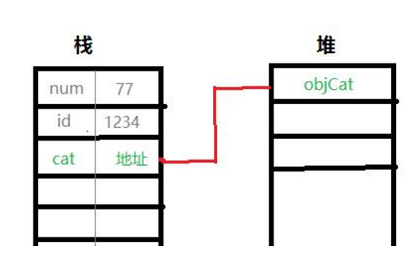

# 拷贝

## 深拷贝和浅拷贝

浅拷贝（shallowCopy）只是增加了一个指针指向已存在的内存地址，

深拷贝（deepCopy）是增加了一个指针并且申请了一个新的内存，使这个增加的指针指向这个新的内存，

使用深拷贝的情况下，释放内存的时候不会因为出现浅拷贝时释放同一个内存的错误。

## 值传递和引用传递

变量分值类型和引用类型，**深拷贝和浅拷贝都是针对引用类型变量的操作**。

值类型： 比如数值，字符串，布尔

引用类型 ： 比如数组，对象，函数

值类型的数据保存在栈中；

**引用类型的存储需要栈和堆共同完成**，在栈中存放地址，该地址指向对应的堆内存中的数据。

java中在参数传递时有2种方式，两者的区别如下：

1、按值传递：值传递是指在调用函数时**将实际参数复制一份传递到函数中**，这样在函数中如果对参数进行修改，将不会影响到实际参数。简单来说就是直接复制了一份数据过去，因为是直接复制，所以这种方式在传递时如果数据量非常大的话，运行效率自然就变低了，所以java在传递数据量很小的数据是值传递，比如java中的各种基本类型：int,float,double,boolean等类型的。

2、按引用传递：引用传递其实就弥补了上面说的不足，如果每次传参数的时候都复制一份的话，如果这个参数占用的内存空间太大的话，运行效率会很底下，所以**引用传递就是直接把内存地址传过去，也就是说引用传递时，操作的其实都是源数据**，比如Object，二维数组，List，Map等除了基本类型的参数都是引用传递。

