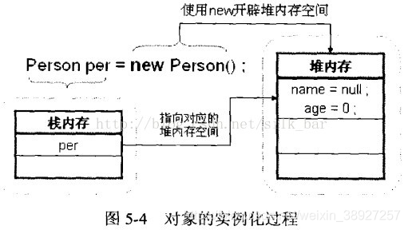
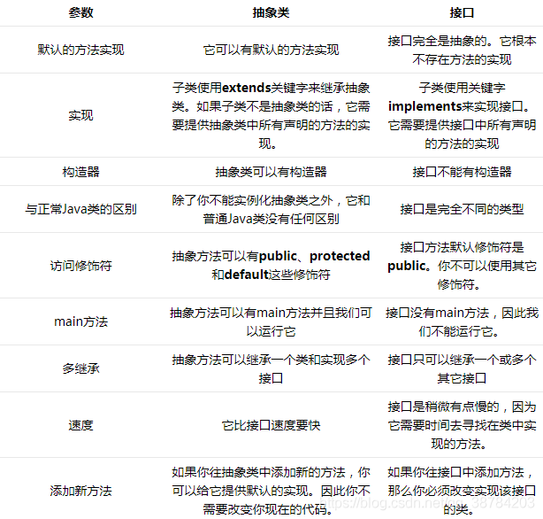

## 接口

---

[TOC]


---


### 概念

---

Java接口是一系列方法的声明，是一些方法特征的集合，接口不是类(即不能使用new，不能实例化)，而是对类的一组需求描述，其作用如下

> 达到多继承的效果 
>
> 用来描述一种抽象，实现解耦

**一个接口只有方法的特征没有方法的实现，因此这些方法可以在不同的地方被不同的类实现，而这些实现可以具有不同的行为（功能）**


```markdown
   											接口和抽象类区别
```

|              |                        抽象类abstract                        |                        接口interface                         |
| :----------: | :----------------------------------------------------------: | :----------------------------------------------------------: |
| 默认方法实现 |                     可以有默认的方法实现                     |             接口是完全抽象的，不存在方法的是实现             |
|     实现     | 子类使用关键字extends来继承抽象类，若子类不是抽象类的话，需提供抽象类中所有声明的抽象方法的实现 | 类使用关键字impements来实现接口，需要提供接口中所有声明的方法的实现 |
|    构造器    |                         可以有构造器                         |                         不能有构造器                         |
|  与类的区别  |                 不能实例化抽象类，只能被继承                 |                           不属于类                           |
|  访问修饰符  |                   public,protected,default                   |                       只有默认为public                       |
|   main方法   |                      有main方法，可运行                      |                     无main方法，无法运行                     |
|    多继承    |                 可以继承一个类和实现多个接口                 |                 只可以继承一个或多个其他接口                 |
|  添加新方法  |             可提供默认的实现，无需改变现在的代码             |                   添加必须改变实现接口的类                   |


若实现类覆盖了接口中的所有的抽象方法，则此实现类就可以实例化，否则，此实现类仍为一个抽象类

Java可以实现多个接口，格式：==class A extends B implements C,D,E…{…}==

接口与接口之间可以继承，且可以多继承

```java
interface C extends A,B{...}
```


### 方法

---

**类优先原则** -> 如果子类(或实现类)继承的父类和实现的接口中声明了同名同参数的方法，那么子类在**没有重写**此方法的情况下，默认调用的是**父类**中的同名同参数的方法


**接口冲突** -> 如果实现类实现了多个接口，而这多个接口中定义了同名同参数的默认方法，那么在实现类没有重写此方法的情况下报错，必须在**实现类中重写**此方法


#### 静态方法

使用static关键字，可以通过接口直接调用静态方法，并执行其方法体

接口中定义的静态方法，**只能通过接口**来调用


#### 默认方法

使用default关键字，可以通过**实现类的对象来调用**接口中的默认方法

如果实现类重写了接口中的默认方法，调用时，仍然调用的是重写以后的方法


### 使用

---

1. 接口的成员（字段 + 方法）默认都是 public 的，并且不允许定义为 private 或者 protected
2. 接口的字段默认都是 static 和 final 


#### 选择

使用接口

> - 需要让不相关的类都实现一个方法，例如不相关的类都可以实现 Comparable 接口中的 compareTo() 方法
> - 需要使用多重继承


使用抽象类

> - 需要在几个相关的类中共享代码
> - 需要能控制继承来的成员的访问权限，而不是都为 public
> - 需要继承非静态和非常量字段


### lambda

任何一个接口，如果只包含唯一一个抽象方法，那么它就是一个函数式接口

```java
//例如
public interface Runnable{
    public abstract void run()
}//对于函数式接口，可以通过lambda表达式来创建该接口的对象
```

Lambda 表达式由三个部分组成：

第一部分为一个括号内用逗号分隔的形式参数，参数是函数式接口里面方法的参数；

第二部分为一个箭头符号：->；

第三部为方法体，可以是表达式和代码块。

```markdown
(parameters) -> expression ##一条语句的时候
(parameters) -> { statements; } ##多条语句的时候,需要return返回值的时候
() -> { statements; } ##没有参数
```

多个参数也可去掉且必须全部去掉参数类型后加上括号





## 和抽象类的区别



1. 接口和抽象类都不能实例化 

   > 实例化实际意义是在jvm的堆中开辟出一块内存空间
   >
   > 而抽象类只分配了在栈中的引用，没有分配堆中的内存，程序都有一个代码段,再内存中需要占据一定的内存,而抽象类没有具体的实现方法,无法具体的给它分配内存空间, 所以为了安全,JAVA不允许抽象类,接口直接实例化
   >
   > **接口没有构造方法**，所以不能实例化，抽象类有构造方法，但是不是用来实例化的，是用来**初始化**的。
   >
   > 接口中的属性只能为常量，常量是不需要初始化的，它是存放在常量池中的
   > 而抽象类中可以定义变量，也可以定义普通方法，这就要求抽象类需要有构造方法对这些变量进行初始化，但由于抽象类中存在抽象的方法，假如他能实例化，那他里面的抽象方法就无法使用，因为没有方法体，这就使得抽象类不能实例化。

2. 抽象类要被子类**继承**，接口要被类**实现**。

3. 接口只能做方法申明，抽象类中可以做方法申明，也可以做方法实现，但是**抽象方法只能申明，不能实现**，抽象方法要被实现，所以**不能是静态的，也不能是私有的**

4. 接口里定义的变量只能是**公共的静态的常量**（public），抽象类中的变量是普通变量。

5. 抽象类里的抽象方法**必须全部被子类所实现**，如果子类不能全部实现父类抽象方法，那么该**子类只能是抽象类**，同样，实现接口的时候，如不能全部实现接口方法，那么该类也只能为抽象类。

6. 如果一个类里有抽象方法，那么这个类只能是抽象类

7. 接口可以继承接口，并且可多继承接口，但类只能单一继承。

