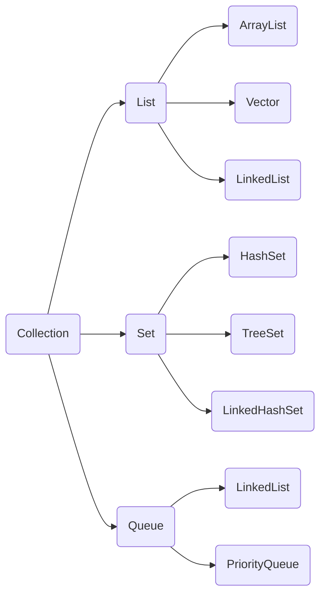
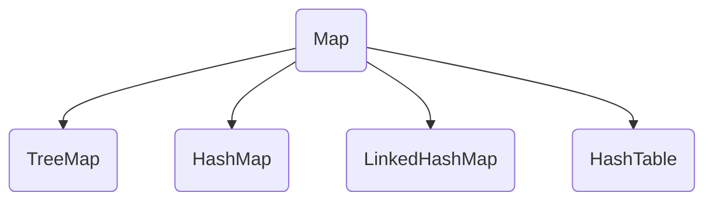

# 集合

[TOC]


## 概念

集合、数组都是对多个数据进行存储操作的结构，简称Java容器，此时的存储，主要指的是内存层面的存储，不涉及到持久化的存储

容器主要包括 **Collection 和 Map 两种体系**

Collection 存储着对象的集合，单列数据，定义了存取一组对象的方法的集合

- List有序，元素可重复，每一个元素都存在索引 (动态数组)
- Set无序，元素唯一
- Queue通过先进先出的方式来存储元素

 Map 双列数据，存储着键值对（两个对象）的映射表，将唯一的键映射到值








- List , Set, Map都是接口，前两个继承至Collection接口，Map为独立接口
- Set下有HashSet，LinkedHashSet，TreeSet
- List下有ArrayList，Vector，LinkedList
- Map下有Hashtable，LinkedHashMap，HashMap，TreeMap
- Collection接口下还有个Queue接口，有PriorityQueue类


## Collection

---

### List

—有序、可重复

- ArrayList
  **优点:** 底层数据结构是数组，查询快，增删慢。
  **缺点:** 线程不安全，效率高
- Vector
  **优点:** 底层数据结构是数组，查询快，增删慢。
  **缺点:** 线程安全，效率低
- LinkedList
  **优点:** 底层数据结构是链表，查询慢，增删快。
  **缺点:** 线程不安全，效率高


#### ArrayList

基于**动态数组**实现，支持随机访问，支持快速访问，可克隆可序列化，只能装入引用对象（基本类型要转换为封装类）；**线程不安全**；底层由数组实现（**顺序表**），因为由顺序表实现，所以会具备顺序表的特点，如：需要声明长度、超出长度时需要进行扩容、不适合频繁的移动删除元素、**检索元素快**

- ArrayList在执行插入元素是超过当前数组预定义的最大值时，数组需要扩容，扩容过程需要调用底层System.arraycopy()方法进行大量的数组复制操作；在删除元素时并不会减少数组的容量（如果需要缩小数组容量，可以调用trimToSize()方法）；在查找元素时要遍历数组，对于非null的元素采取equals的方式寻找
- ArrayList对元素的增加和删除都会引起数组的内存分配空间动态发生变化。因此，**对其进行插入和删除速度较慢，但检索速度很快**


#### Vector

和 ArrayList 类似，但它是**线程安全**的，只能装入引用对象（基本类型要转换为封装类）；Vector通过synchronized方法保证线程安全；底层由**动态数组**实现，特点和ArrayList一样，是一样而不是类似，**查询快 , 增删慢**


#### LinkedList

基于**双向链表**实现，只能顺序访问，但是可以快速地在链表中间**插入和删除元素**。不仅如此，LinkedList 还可以用作栈、队列和双向队列，只能装入引用对象（基本类型要转换为封装类）；**线程不安全**；底层实现为**双向链表**，具备链表的特点，如：不用声明长度、检索性能较差，但是插入移动删除较快，链表通过Node对象实现

- LinkedList在插入元素时，须创建一个新的Entry对象，并更新相应元素的前后元素的引用；在查找元素时，需遍历链表；在删除元素时，要遍历链表，找到要删除的元素，然后从链表上将此元素删除即可
- LinkedList由于基于链表方式存放数据，增加和删除元素的速度较快，但是检索速度较慢，因为链表不支持随机访问，但插入删除只需要改变指针


> - Vector 和 ArrayList 作为动态数组，其内部元素以数组形式顺序存储的，所以非常适合随机访问的场合。除了尾部插入和删除元素，往往性能会相对较差，比如我们在中间位置插入一个元素，需要移动后续所有元素。
> -  LinkedList 进行节点插入、删除却要高效得多，但是随机访问性能则要比动态数组慢。
> - Vector与ArrayList仅在插入元素时容量扩充机制不一致。对于Vector，默认创建一个大小为10的Object数组，并将capacityIncrement设置为0；当插入元素数组大小不够时，如果capacityIncrement大于0，则将Object数组的大小扩大为现有size+capacityIncrement；如果capacityIncrement<=0,则将Object数组的大小扩大为现有大小的2倍


List数组遍历主要有三种方法，普通for循环，增强for循环（foreach）和Iterator（迭代器）

```java
	 List<String> list=new ArrayList<String>();
     list.add("a");
     list.add("b");
     list.add("c");
     
     for(int i=0;i<list.size();i++){
    	 System.out.println(list.get(i));//普通for循环可以获取数据下标
     }

	//for(集合元素的类型 局部变量 : 集合对象)
     for (String str : list) {  //增强for循环  
    	 System.out.println(str);
     }
     
     Iterator<String> iterator=list.iterator();
     while(iterator.hasNext())
     {//不用担心在遍历的过程中集合长度发生变化
      // remove 元素请使用Iterator方式，如果并发操作，需要对 Iterator 对象加锁
         System.out.println(iterator.next());
     }
```


### Set

—无序、唯一

- HashSet
  底层数据结构是哈希表。(无序,唯一)
  如何来保证元素唯一性?
  1.依赖两个方法：hashCode()和equals()

  

- TreeSet
  底层数据结构是红黑树。(唯一，有序)
  1.如何保证元素排序的呢?
  自然排序
  比较器排序

  2.如何保证元素唯一性的呢?
  根据比较的返回值是否是0来决定

- LinkedHashSet
  底层数据结构是链表和哈希表。(FIFO插入有序,唯一)
  1.由链表保证元素有序
  2.由哈希表保证元素唯一


可以保证元素的**唯一性** , 但是**不保证有序**(有序: 指的是存储和取出的顺序一致)，set集合在存储元素的时候,需要对元素进行处理,按照一定的算法对元素进行排序,而有的时候我们的添加元素的顺序巧号是set集合计算完毕以后的顺序,但是这也不能说明是有序的

**不允许重复的数据，检索效率低下，删除和插入效率高**

Set是一种**不包含重复**的元素的Collection，即任意的两个元素e1和e2都有e1.equals(e2)=false，Set最多有一个null元素。因为Set是一个抽象的接口，所以是不能直接实例化一个set对象


#### HashSet

`Set hashSet = new HashSet();`

非线程安全、无序、数据可为空

基于哈希表实现，支持快速查找，但不支持有序性操作

HashSet集合保证元素的**唯一性**依赖于两个方法一个是hashCode方法,一个是equals方法在进行比较的时候先比较的是对象的hashCode值,如果对象的hashCode值是相同的,那么在调用equals方法比较


#### TreeSet

非线程安全、有序、数据不可为空

基于红黑树实现，支持有序性操作，例如根据一个范围查找元素的操作

查找效率不如HashSet，HashSet 查找的时间复杂度为 O(1)，TreeSet 则为 O(logN)


#### LinkedHashSet

非线程安全、无序、数据可为空，写入比HashSet强，新增和删除比HashSet差，具有HashSet的查找效率，并且内部使用双向链表维护元素的插入顺序


- TreeSet的主要功能用于排序
- LinkedHashSet的主要功能用于保证FIFO即有序的集合(先进先出)
- HashSet只是通用的存储数据的集合
- Duplicates elements: 因为三者都实现Set interface，所以三者都不包含duplicate elements
- Thread safety: 三者都不是线程安全的，如果要使用线程安全可以Collections.synchronizedSet()
- HashSet插入数据最快，其次LinkHashSet，最慢的是TreeSet因为内部实现排序
- HashSet不保证有序，LinkHashSet保证FIFO即按插入顺序排序，**TreeSet安装内部实现排序，也可以自定义排序规则**
- HashSet和LinkHashSet允许存在null数据，但是TreeSet中插入null数据时会报NullPointerException


### Queue

1）LinkedList：可以用它来实现双向队列


2）PriorityQueue：基于堆结构实现，可以用它来实现优先队列


## Map

---

> **Map 接口并不是 Collection 接口的继承**。Map提供key到value的映射。一个Map中不能包含相同的key，每个key只能映射一个value。Map接口提供3种集合的视图，Map的内容可以被当作一组key集合，一组value集合，或者一组key-value映射


- TreeMap是有序的，HashMap和HashTable是无序的。
- Hashtable的方法是同步的，HashMap的方法不是同步的。这是两者最主要的区别。

这就意味着:

- Hashtable是线程安全的，HashMap不是线程安全的。
- HashMap效率较高，Hashtable效率较低。
  如果对同步性或与遗留代码的兼容性没有任何要求，建议使用HashMap。 查看Hashtable的源代码就可以发现，除构造函数外，Hashtable的所有 public 方法声明中都有 synchronized关键字，而HashMap的源码中则没有。
- Hashtable不允许null值，HashMap允许null值（key和value都允许）
- 父类不同：Hashtable的父类是Dictionary，HashMap的父类是AbstractMap


### TreeMap

基于红黑树实现

可以将保存的记录根据键进行排序，默认是按键值的升序排序（自然顺序）。也可以指定排序的比较器，当用Iterator遍历TreeMap时，得到的记录是排过序的。它也是不允许key值为空，并且不是线程安全的


### HashMap

基于哈希表实现

HashMap的键是根据HashCode来获取，所以根据键可以很快的获取相应的值。不过它的键对象是不可以重复的，它允许键为Null，但是最多只能有一条记录，不过却是可以允许多条记录的值为Null。因为HashMap是非线程安全的，所以它的效率很高


### LinkedHashMap

使用双向链表来维护元素的顺序，顺序为插入顺序或者最近最少使用（LRU）顺序

LinkedHashMap基本和HashMap一致。不过区别在与LinkedHashMap是维护一个双链表，可以将里面的数据按写入 的顺序读出。可以认为LinkedHashMap是HashMap+LinkedList。即它既使用HashMap操作数据结构，又使用LinkedList维护插入元素的先后顺序。它也不是线程安全的


### HashTable

和 HashMap 类似，但它是线程安全的，这意味着同一时刻多个线程同时写入 HashTable 不会导致数据不一致。它是遗留类，不应该去使用它，而是使用 ConcurrentHashMap 来支持线程安全，ConcurrentHashMap 的效率会更高，因为 ConcurrentHashMap 引入了分段锁；HashTable是不允许记录的键或者值为null。因为它支持线程的同步，是线程安全的，所以也导致了Hashtale在效率较低

 ConcurrentHashMap在Java 1.5作为Hashtable的替代选择新引入的。使用锁分段技术技术来保证线程安全的，可以看作是Hashtable的升级版