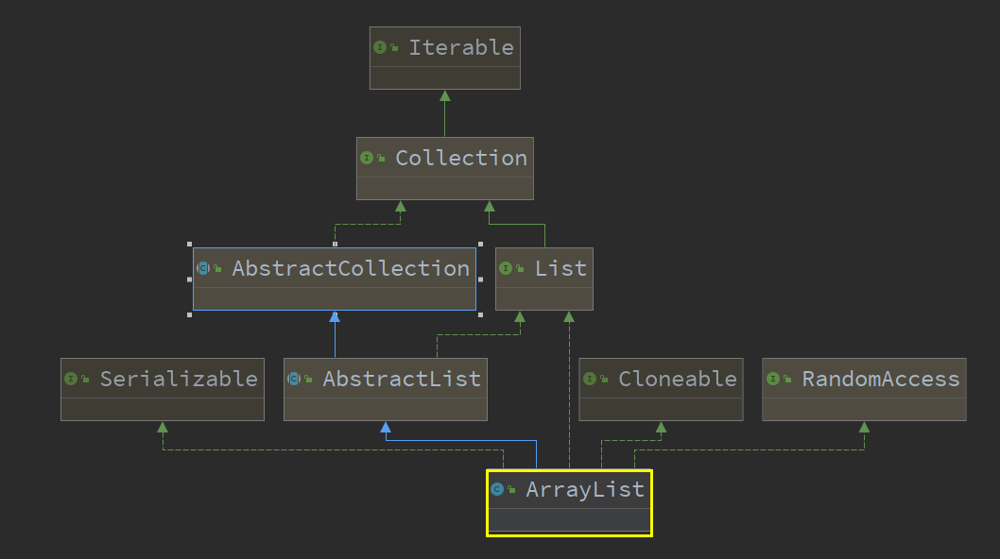
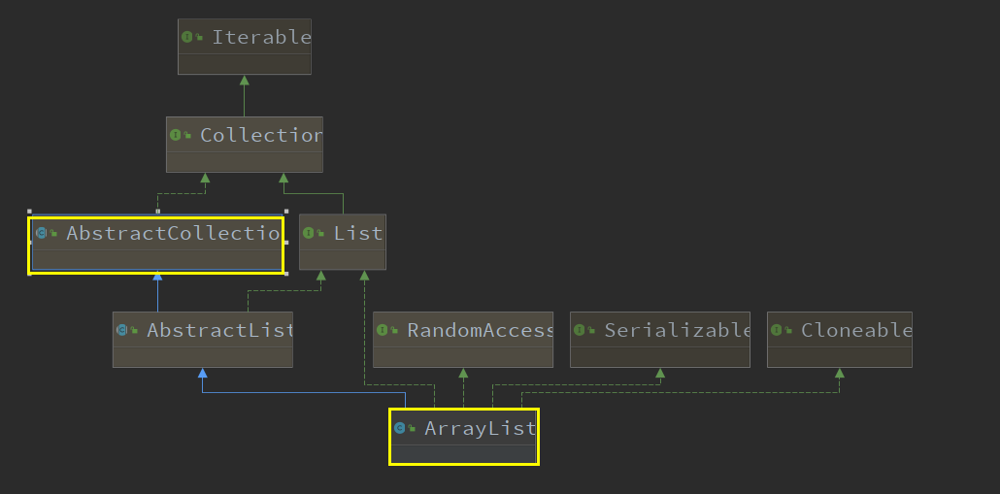
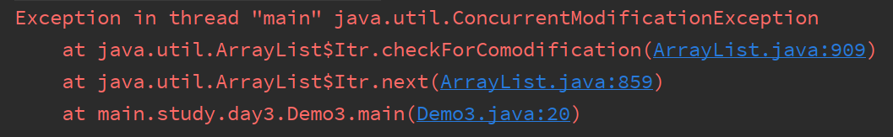
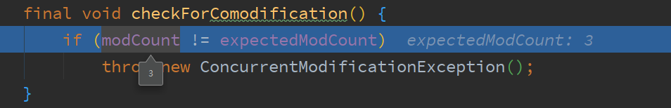
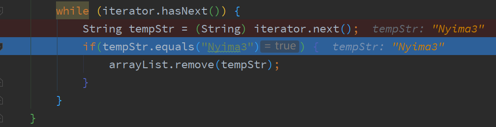
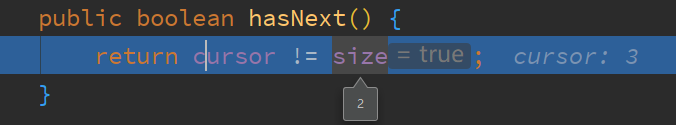
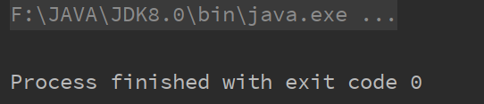
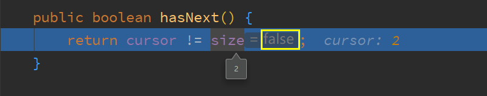

# ArrayList

[TOC]

## 简介

ArrayList是**List**集合**可变大小**的数组的实现

`ArrayList` 的底层是数组队列，相当于动态数组。与 Java 中的数组相比，它的容量能动态增长。在添加大量元素前，应用程序可以使用`ensureCapacity`操作来增加 `ArrayList` 实例的容量。这可以减少递增式再分配的数量。

~~~java
public class ArrayList<E> extends AbstractList<E>
    implements List<E>, RandomAccess, Cloneable, java.io.Serializable
~~~

- `RandomAccess` 是一个标志接口，表明实现这个这个接口的 List 集合是支持**快速随机访问**的。在 `ArrayList` 中，我们即可以通过元素的序号快速获取元素对象，这就是快速随机访问。
- `ArrayList` 实现了 **`Cloneable` 接口** ，即覆盖了函数`clone()`，能被克隆。
- `ArrayList` 实现了 java.io.Serializable `接口，这意味着`ArrayList支持序列化，能通过序列化去传输


## 序列化

ArrayList 基于数组实现，并且具有动态扩容特性，因此保存元素的数组不一定都会被使用，那么就没必要全部进行序列化。

保存元素的数组 elementData 使用 transient 修饰，该关键字声明数组默认不会被序列化。

~~~java
transient Object[] elementData; // non-private to simplify nested class access
~~~

ArrayList 实现了 writeObject() 和 readObject() 来控制只序列化数组中有元素填充那部分内容。

序列化时需要使用 ObjectOutputStream 的 writeObject() 将对象转换为字节流并输出。而 writeObject() 方法在传入的对象存在 writeObject() 的时候会去反射调用该对象的 writeObject() 来实现序列化。反序列化使用的是 ObjectInputStream 的 readObject() 方法，原理类似。

~~~java
/**
     * Reconstitute the <tt>ArrayList</tt> instance from a stream (that is,
     * deserialize it).
     */
private void readObject(java.io.ObjectInputStream s)
    throws java.io.IOException, ClassNotFoundException {
    elementData = EMPTY_ELEMENTDATA;

    // Read in size, and any hidden stuff
    s.defaultReadObject();

    // Read in capacity
    s.readInt(); // ignored

    if (size > 0) {
        // be like clone(), allocate array based upon size not capacity
        int capacity = calculateCapacity(elementData, size);
        SharedSecrets.getJavaOISAccess().checkArray(s, Object[].class, capacity);
        ensureCapacityInternal(size);

        Object[] a = elementData;
        // Read in all elements in the proper order.
        for (int i=0; i<size; i++) {
            a[i] = s.readObject();
        }
    }
}

/**
     * Save the state of the <tt>ArrayList</tt> instance to a stream (that
     * is, serialize it).
     *
     * @serialData The length of the array backing the <tt>ArrayList</tt>
     *             instance is emitted (int), followed by all of its elements
     *             (each an <tt>Object</tt>) in the proper order.
     */
private void writeObject(java.io.ObjectOutputStream s)
    throws java.io.IOException{
    // Write out element count, and any hidden stuff
    int expectedModCount = modCount;
    s.defaultWriteObject();

    // Write out size as capacity for behavioural compatibility with clone()
    s.writeInt(size);

    // Write out all elements in the proper order.
    for (int i=0; i<size; i++) {
        s.writeObject(elementData[i]);
    }

    if (modCount != expectedModCount) {
        throw new ConcurrentModificationException();
    }
}

ArrayList list = new ArrayList();
ObjectOutputStream oos = new ObjectOutputStream(new FileOutputStream(file));
oos.writeObject(list);
~~~


## 优缺点

### 优点

ArrayList底层是以数组实现，是一种随机访问模式，再加上它实现了RandomAccess接口，因此在执行get方法的时候很快。

ArrayList在顺序添加元素的时候非常场面，只是往数组中添加了一个元素而已，根据下标遍历元素，效率高。

可以自动扩容，默认为每次扩容为原来的1.5倍

### 缺点

数组里面（除了末尾）**插入和删除元素效率不高**，因为需要移动大量的元素

> ArrayList在小于扩容容量的情况下，其实增加操作效率非常高，在涉及扩容的情况下，添加操作效率确实低，删除操作需要移位拷贝。
>
> 同时因为ArrayList中增加（扩容）或者删除元素要调用System.arrayCopy()这种效率很低的方法进行处理，所以遇到数据量略大 或者 需要频繁插入和删除操作的时候，效率就比较低了，如果遇到上述的场景，那么就需要使用LinkedList来代替
>
> 因为ArrayList的优点在于构造好数组后，**频繁的访问元素的效率非常高。**


## 继承关系




## 区别

> 首先List接口一共有三个实现类：ArrayList、Vector、LinkedList

### ArrayList和Array

1. Array可以包含基本类型和对象类型，ArrayList只能包含对象类型

2. 数组大小一旦确定，需要在初始化的时候指定，就无法改变

   **增删慢**：每次添加或删除元素，都需要更改数组长度、拷贝以及移动元素位置

   **查询快**：由于数组在内存中是一块连续空间，因此可以根据地址+索引的方式快速获取对应位置上的元素

   


### ArrayList和Vector

1. `ArrayList` 是 `List` 的主要实现类，底层使用 `Object[ ]`存储，适用于频繁的查找工作，线程不安全 ；
2. `Vector` 是 `List` 的古老实现类，底层使用 `Object[ ]`存储，线程安全的，但实现同步需要很高的代Synchronized 因此，Vector的效率比ArrayList慢
3. Vector每次扩容为数组长度的一倍，而ArrayList则是原来数组长度的1.5倍。


### ArrayList和LinkedList

1. **是否保证线程安全：** `ArrayList` 和 `LinkedList` 都是不同步的，也就是不保证线程安全；
2. **底层数据结构：** `Arraylist` 底层使用的是 **`Object` 数组**；`LinkedList` 底层使用的是 **双向链表** 数据结构（JDK1.6 之前为循环链表，JDK1.7 取消了循环。注意双向链表和双向循环链表的区别）
3. **插入和删除是否受元素位置的影响：** ① **`ArrayList` 采用数组存储，所以插入和删除元素的时间复杂度受元素位置的影响。** 比如：执行`add(E e)`方法的时候， `ArrayList` 会默认在将指定的元素追加到此列表的末尾，这种情况时间复杂度就是 O(1)。但是如果要在指定位置 i 插入和删除元素的话（`add(int index, E element)`）时间复杂度就为 O(n-i)。因为在进行上述操作的时候集合中第 i 和第 i 个元素之后的(n-i)个元素都要执行向后位/向前移一位的操作。 ② **`LinkedList` 采用链表存储，所以对于`add(E e)`方法的插入，删除元素时间复杂度不受元素位置的影响，近似 O(1)，如果是要在指定位置`i`插入和删除元素的话（`(add(int index, E element)`） 时间复杂度近似为`o(n))`因为需要先移动到指定位置再插入。**
4. **是否支持快速随机访问：** `LinkedList` 不支持高效的随机元素访问，而 `ArrayList` 支持。快速随机访问就是通过元素的序号快速获取元素对象(对应于`get(int index)`方法)。
5. **内存空间占用：** `ArrayList` 的空 间浪费主要体现在在 list 列表的结尾会预留一定的容量空间，而 `LinkedList` 的空间花费则体现在它的每一个元素都需要消耗比 `ArrayList` 更多的空间（因为要存放直接后继和直接前驱以及数据）。


## 源码 & 扩容

> **扩容总结**
>
> - 如果是空数组，调用add方法，扩容大小就是10；如果不是空数组，调用add方法，minCapacity = size + 1，判断minCapacity是否大于数组容量，如果大于就进行扩容，调用grow方法，如果不大于就不需要扩容
> - grow方法，newCapacity = oldCapacity + (oldCapacity >> 1);如果newCapacity大于minCapacity，直接扩容成newCapacity，也就是原数组的大小的1.5倍左右(**oldCapacity 为偶数就是 1.5 倍，为奇数就是 1.5 倍-0.5**）；如果newCapacity小于minCapacity，就执行newCapacity=minCapacity，扩容成newCapacity。
> - 扩容之前还要检查newCapacity是否大于Integer.MAX_VALUE，如果大于，就执行newCapacity=Integer.MAX_VALUE;如果不大于不做改变。


### 拷贝方法

#### System.arraycopy() & Arrays.copyOf()

 ArrayList 中大量调用了这两个方法。比如扩容操作以及`add(int index, E element)`、`toArray()` 等方法中都用到了该方法

~~~java
//  System.arraycopy()
/**
     * 在此列表中的指定位置插入指定的元素。
     *先调用 rangeCheckForAdd 对index进行界限检查；然后调用 ensureCapacityInternal 方法保证capacity足够大；
     *再将从index开始之后的所有成员后移一个位置；将element插入index位置；最后size加1。
     */
public void add(int index, E element) {
    rangeCheckForAdd(index);

    ensureCapacityInternal(size + 1);  // Increments modCount!!
    //arraycopy()方法实现数组自己复制自己
    //elementData:源数组;index:源数组中的起始位置;elementData：目标数组；index + 1：目标数组中的起始位置； size - index：要复制的数组元素的数量；
    System.arraycopy(elementData, index, elementData, index + 1, size - index);
    elementData[index] = element;
    size++;
}

~~~

~~~java
// Test  System.arraycopy()
public class ArraycopyTest {

    public static void main(String[] args) {
        // TODO Auto-generated method stub
        int[] a = new int[10];
        a[0] = 0;
        a[1] = 1;
        a[2] = 2;
        a[3] = 3;
        System.arraycopy(a, 2, a, 3, 3);
        a[2]=99;
        for (int i = 0; i < a.length; i++) {
            System.out.print(a[i] + " ");
        }
    }
}
// 0 1 99 2 3 0 0 0 0 0
~~~

~~~java
// Test  Arrays.copyOf()
/**
     以正确的顺序返回一个包含此列表中所有元素的数组（从第一个到最后一个元素）; 返回的数组的运行时类型是指定数组的运行时类型。
     */
public Object[] toArray() {
    //elementData：要复制的数组；size：要复制的长度
    return Arrays.copyOf(elementData, size);
}

public class ArrayscopyOfTest {

    public static void main(String[] args) {
        int[] a = new int[3];
        a[0] = 0;
        a[1] = 1;
        a[2] = 2;
        int[] b = Arrays.copyOf(a, 10);
        System.out.println("b.length" + b.length);
    }
}
// 10
~~~

看两者源代码可以发现 `copyOf()`内部实际调用了 `System.arraycopy()` 方法

`arraycopy()` 需要目标数组，将原数组拷贝到你自己定义的数组里或者原数组，而且可以选择拷贝的起点和长度以及放入新数组中的位置 `copyOf()` 是系统自动在内部新建一个数组，并返回该数组

~~~java
// 底层native
public static native void arraycopy(Object src,  int  srcPos,
                                    Object dest, int destPos,
                                    int length);
~~~


### 构造方法

#### 无参构造器

~~~java
public class ArrayList {
    // 默认的初始化容量 
    private static final int DEFAULT_CAPACITY = 10;

    // 默认的Object类型的空数组，基于默认值的大小10扩容进行1.5倍扩容
    // 把它从EMPTY_ELEMENTDATA数组中区分出来，以知道在添加第一个元素时容量需要增加多少。
    private static final Object[] DEFAULTCAPACITY_EMPTY_ELEMENTDATA = {};

    // 不可序列化的Object类型数组，用于存储ArrayList元素的数组，相当于存储元素的缓冲区
    transient Object[] elementData;

    // 这个list集合的长度
    private int size;

    public ArrayList() {
        // 如果没有指定集合的大小，当第一次向集合中添加元素时，集合容量会扩充为10
        // 也就是说初始其实是空数组 当添加第一个元素的时候数组容量才变成10
        // 也是一种懒加载的形式
        this.elementData = DEFAULTCAPACITY_EMPTY_ELEMENTDATA;
    }
}
~~~

无参构造方法没有指定集合的大小，所以当**第一次向集合中添加元素的时候，集合的容量会扩充为10**


#### initialCapacity构造方法

~~~java
// 空的Objcet类型数组，区别于DEFAULTCAPACITY_EMPTY_ELEMENTDATA，基于用户设置大小值进行1.5倍扩容 用于空实例
private static final Object[] EMPTY_ELEMENTDATA = {};

public ArrayList(int initialCapacity) {
    // 如果容量大于0
    if (initialCapacity > 0) {
        // 根据传入的容量大小创建Objcet类型的数组，赋值给elementData
        this.elementData = new Object[initialCapacity];
    } else if (initialCapacity == 0) {
        // 如果容量等于0，就将elementData赋值为一个Object类型的空数组
        this.elementData = EMPTY_ELEMENTDATA;
    } else {
        // 如果容量小于0，就抛出异常
        throw new IllegalArgumentException("Illegal Capacity: "+
                                           initialCapacity);
    }
}
~~~

initialCapacity构造函数会根据传入的容量大小来创建满足要求的集合


#### Collection构造方法

> 构造包含指定collection元素的列表，这些元素利用该集合的迭代器按顺序返回
>
> 如果指定的集合为null，throws NullPointerException

~~~java
public ArrayList(Collection<? extends E> c) {
    // 将传入的集合转成数组
    elementData = c.toArray();

    // 判断传入集合的大小是否为0
    if ((size = elementData.length) != 0) {
        // c.toArray might (incorrectly) not return Object[] (see 6260652)
        // 存在一个bug，c.toArray方法的返回值可能不是一个Object类型的数组
        // 如果elementData的类型不是一个Object类型的数组
        if (elementData.getClass() != Object[].class)
            // 就再次进行拷贝操作
            elementData = Arrays.copyOf(elementData, size, Object[].class);
    } else {
        // replace with empty array.
        // 如果传入集合的大小为0，就赋值为一个空数组
        this.elementData = EMPTY_ELEMENTDATA;
    }
}

// toArray方法
public Object[] toArray() {
    // 调用了copyOf方法
    return Arrays.copyOf(elementData, size);
}

// copyOf方法
public static <T> T[] copyOf(T[] original, int newLength) {
    // 调用了重载后的copyOf方法，对集合进行拷贝操作
        return (T[]) copyOf(original, newLength, original.getClass());
}
~~~

Collection构造方法主要是将传入的集合转变为数组类型。在转换后根据elementData的大小再次对elementData进行了赋值操作

- 当size != 0时，要判断 c.toArray() 所返回的结果是不是Objcet类型的数组，如果不是，则还需要elementData该为Object数组
- 当size == 0时，将其赋值为一个空数组


### 添加方法

#### add(E e)方法

~~~java
public class Demo1 {
    public static void main(String[] args) {
        ArrayList<String> list = new ArrayList<>();
        // 向集合中添加一个元素时，会调用add(E e)方法
        list.add("Starry");
    }
}

// 将指定的元素加到列表的末尾
public boolean add(E e) {
    // 传入需要扩容的最小容量，值为元素个数+1
    ensureCapacityInternal(size + 1);  // Increments modCount!!
    // 扩容后，放入要添加的元素
    // 这里看到的ArrayList添加元素的实质相当于为数组赋值
    elementData[size++] = e;
    return true;
}

// 如有必要，增加此ArrayList实例的容量，以确保它至少能容纳元素的数量
// minCapacity   所需的最小容量
public void ensureCapacity(int minCapacity) {
    int minExpand = (elementData != DEFAULTCAPACITY_EMPTY_ELEMENTDATA)
        // any size if not default element table
        ? 0
        // larger than default for default empty table. It's already
        // supposed to be at default size.
        : DEFAULT_CAPACITY;

    if (minCapacity > minExpand) {
        ensureExplicitCapacity(minCapacity);
    }
}

// 得到最小的扩容量
private void ensureCapacityInternal(int minCapacity) {
    // 调用calculateCapacity方法，计算最小容量
    // 然后再调用ensureExplicitCapacity方法，来增加数组被修改次数modCount，以及查看是否真正需要扩容
    ensureExplicitCapacity(calculateCapacity(elementData, minCapacity));
}

private static final int DEFAULT_CAPACITY = 10;

private static int calculateCapacity(Object[] elementData, int minCapacity) {
    // 如果集合是DEFAULTCAPACITY_EMPTY_ELEMENTDATA，也就是创建集合时没有传入容量大小，并且是第一次进行添加操作
    if (elementData == DEFAULTCAPACITY_EMPTY_ELEMENTDATA) {
        // 返回默认容量10，和最小容量的较大者
        return Math.max(DEFAULT_CAPACITY, minCapacity);
    }
    // 返回最小容量
    return minCapacity;
}

// 判断是否触发扩容
private void ensureExplicitCapacity(int minCapacity) {
    // 增加modCount++
    // modCount用于保存集合被修改的次数
    modCount++;

    // overflow-conscious code
    // 如果容量不够，才扩容
    if (minCapacity - elementData.length > 0)
        // 真正的扩容操作
        grow(minCapacity);
}

// 真正的扩容操作 核心方法
private void grow(int minCapacity) {
    // overflow-conscious code
    // 保存扩容前数组的容量
    int oldCapacity = elementData.length;

    // 得到扩容后数组的容量，扩大为原容量的1.5倍数
    // 右移 >> : 右移多少位就是除以2的多少次幂，这里是除以2
    // 左移 << : 左移多少位就是乘以2的多少次幂
    int newCapacity = oldCapacity + (oldCapacity >> 1);

    // 如果扩容1.5倍后的容量小于最小容量
    if (newCapacity - minCapacity < 0)
        // 就按照最小容量进行扩容（选取较大的扩容方式）
        newCapacity = minCapacity;

    // 如果新容量大于数组的最大容量
    // private static final int MAX_ARRAY_SIZE = Integer.MAX_VALUE - 8;
    if (newCapacity - MAX_ARRAY_SIZE > 0)
        //就将其令为最大容量
        newCapacity = hugeCapacity(minCapacity);

    // minCapacity is usually close to size, so this is a win:
    // 将数组根据newCapacity扩容，并将其原来的元素放入到elementData中
    elementData = Arrays.copyOf(elementData, newCapacity);
}

private static int hugeCapacity(int minCapacity) {
    if (minCapacity < 0) // overflow
        throw new OutOfMemoryError();
    return (minCapacity > MAX_ARRAY_SIZE) ?
        Integer.MAX_VALUE :
    MAX_ARRAY_SIZE;
}
~~~

**总结**

- 向集合中添加元素时，先进行容量检测，在进行添加操作

- 容量检测操作如下

  - 最小扩容容量为**当前数组元素个数+1**
  - 判断当前数组是否为DEFAULTCAPACITY_EMPTY_ELEMENTDATA，也就是调用了无参构造函数来创建集合
    - 如果是，最小容量就变为DEFAULT_CAPACITY(10)和最小容量的较大者
    - 如果不是，就返回较小容量
  - 返回得到的最小扩容容量

- 然后调用方法，增加集合被修改的次数（modCount++），然后再次确定最小扩容容量是否大于数组当前的大小（也就是放入元素后会不会大于数组的当前长度，

  容量不足），如果满足，则调用最重要的grow方法进行数组的扩容，方法执行的操作如下

  - 用变量**oldCapacity**保存扩容前数组的大小（**数组中元素的个数**）
  - 进行扩容，**扩容大小为原容量的1.5倍**（右移一位，表示除以2）
  - 查看扩容后的容量是否小于最小扩容容量（如果原容量为0，如初始化了集合大小，newCapaticy就还是0，所以需要比较）
    - 如果是，就以最小扩容容量来进行扩容
    - 如果不是，就扩大为原容量的1.5倍

**补充：**集合在被操作的时候，都会增加modCount的值，那么这个值到底有什么用呢？

#### Fail-Fast

> Fail-Fast机制是Java集合中的一种错误机制，当多个线程对用一个集合的内容进行操作时，就可能会产生Fail-Fast事件
>
> 由于expectedModCount 与modCount的改变不同步，导致两者之间不等，从而产生fail-fast机制。

modCount 用来记录 ArrayList 结构发生变化的次数。**结构发生变化是指添加或者删除至少一个元素的所有操作，或者是调整内部数组的大小**，仅仅只是设置元素的值不算结构发生变化。

在使用迭代器进行迭代时会用到这个变量。**这个变量是用来保证线程的安全性的**。如果在进行迭代的时候，发现modCount的值被修改了，那么就会抛出ConcurrentModificationException


#### 代替方案

使用Vector，性能严重下降

使用 `Collections.synchronizedList();` 得到一个线程安全的 ArrayList。

~~~java
List<String> list = new ArrayList<>();
List<String> synList = Collections.synchronizedList(list);
~~~

也可以使用 concurrent 并发包下的 CopyOnWriteArrayList 类。

~~~java
List<String> list = new CopyOnWriteArrayList<>();
~~~


#### add(int index, E element)

~~~java
public class Demo1 {
    public static void main(String[] args) {
        ArrayList<String> list = new ArrayList<>(1);
        list.add("zzStar1");
        list.add("zzStar2");
        list.add("zzStar3");
        // 向指定位置插入元素
        list.add(1, "zzStar4");
    }
}

public void add(int index, E element) {
    // 判断插入的位置是否合法
    rangeCheckForAdd(index);

    // 对数组容量进行检查，查看是否需要进行扩容，并增加数组被修改的次数modCount
    ensureCapacityInternal(size + 1);  // Increments modCount!!

    /**
        * 进行拷贝操作，将插入位置及其后面的所有元素后移一位
        * @param      src      the source array.
        * @param      srcPos   starting position in the source array.
     	* @param      dest     the destination array.
     	* @param      destPos  starting position in the destination data.
        * @param      length   the number of array elements to be copied.
        */
    System.arraycopy(elementData, index, elementData, index + 1,
                     size - index);

    // 在目标位置插入该元素
    elementData[index] = element;
    // 集合容量加1
    size++;
}


private void rangeCheckForAdd(int index) {
    // 如果插入位置超出了数组的范围，就抛出异常
    if (index > size || index < 0)
        throw new IndexOutOfBoundsException(outOfBoundsMsg(index));
}
~~~


#### addAll(Collection<? extends E> c)方法

~~~java
public class Demo1 {
    public static void main(String[] args) {
        ArrayList<String> list = new ArrayList<>(1);
        ArrayList<String> list2 = new ArrayList<>();

        list.add("zzStar1");
        list.add("zzStar2");
        list.add("zzStar3");

        // 此处调用了addAll方法，将list集合中的所有元素插入到list2集合的末尾
        list2.addAll(list);
    }
}

public boolean addAll(Collection<? extends E> c) {
    // 将要插入的集合转为Object类型的数组
    Object[] a = c.toArray();

    // 得到插入数组的长度
    int numNew = a.length;

    // 增加modCount并根据需求进行扩容
    ensureCapacityInternal(size + numNew);  // Increments modCount

    // 调用数组拷贝的方法，将数组a中的所有元素添加到elementData数组的末尾
    System.arraycopy(a, 0, elementData, size, numNew);

    // 数组的大小增加，增加大小为被拷贝集合的大小
    size += numNew;

    // 返回是否添加成功。如果被添加集合是一个空数组，则添加失败
    return numNew != 0;
}
~~~


#### addAll(int index, Collection<? extends E> c)方法

~~~java
public class Demo1 {
    public static void main(String[] args) {
        ArrayList<String> list = new ArrayList<>(1);
        ArrayList<String> list2 = new ArrayList<>();
        ArrayList<String> list3 = new ArrayList<>();

        list.add("zzStar1");
        list.add("zzStar2");
        list.add("zzStar3");

        list2.add("zzStar4");
        list2.add("zzStar5");

        // 在指定位置插入所有集合
        list2.addAll(1, list);
    }
}

public boolean addAll(int index, Collection<? extends E> c) {
    // 进行边界检查，如果超出集合范围，则会抛出异常
    rangeCheckForAdd(index);

    // 将要插入的集合转为Object类型的数组
    Object[] a = c.toArray();

    // 得到插入数组的长度
    int numNew = a.length;

    // 根据需求进行扩容操作
    ensureCapacityInternal(size + numNew);  // Increments modCount

    // 计算需要移动的步数
    int numMoved = size - index;

    // 如果需要移动的步数大于0， 则进行移动操作
    if (numMoved > 0)
        // 先将被插入数组中在index之后的元素向后移动
        System.arraycopy(elementData, index, elementData, index + numNew,
                         numMoved);

    // 在指定位置插入数组
    System.arraycopy(a, 0, elementData, index, numNew);

    // 增加size的大小
    size += numNew;

    // 返回是否插入成功
    return numNew != 0;
}
~~~

这里的插入操作和 add(int index, E element) 方法有一些类似。边界判断、集合转数组、数组扩容等。并且**在移动被插入数组中的元素时，都用到了 System.arraycopy() 方法**。只不过 add(int index, E element) 只用插入一个元素，所以直接插入就可以了。而 a**ddAll(int index, Collection<? extends E> c) 方法**因为需要插入多个元素，所以**再次用到了 System.arraycopy() 方法**，来进行多个元素的插入操作


###  移除方法

#### remove(int index)

> 删除该列表中指定位置的元素。 将任何后续元素移动到左侧（从其索引中减去一个元素）

```java
public E remove(int index) {
    // 判断是否越界
    rangeCheck(index);

    modCount++;
    E oldValue = elementData(index);

    // 需要移动的元素个数
    int numMoved = size - index - 1;

    // 从index+1开始，后面的元素全部前移1位
    if (numMoved > 0)
        System.arraycopy(elementData, index+1, elementData, index,
                         numMoved);

    // 让最后一个元素置空，让GC来清楚它
    elementData[--size] = null; // clear to let GC do its work

    // 返回被移除的元素
    return oldValue;
}
```


#### remove(Object o)

> 从列表中删除指定元素的第一个出现（如果存在）。 如果列表不包含该元素，则它不会更改，返回true，如果此列表包含指定的元素

~~~java
public boolean remove(Object o) {
    // 被移除的元素为空
    if (o == null) {
        for (int index = 0; index < size; index++)
            // 移除为空的元素
            if (elementData[index] == null) {
                fastRemove(index);
                return true;
            }
    } else {
        for (int index = 0; index < size; index++)
            // 移除指定的元素
            if (o.equals(elementData[index])) {
                // 每次删除一个元素
                fastRemove(index);
                return true;
            }
    }
    // 移除失败
    return false;
}

// 这个方法和remove(int index)方法有些类似，只不过不用返回被删除的元素
private void fastRemove(int index) {
    modCount++;
    int numMoved = size - index - 1;
    if (numMoved > 0)
        System.arraycopy(elementData, index+1, elementData, index,
                         numMoved);

    // 让最后一个元素置空，让GC来清楚它
    elementData[--size] = null; // clear to let GC do its work
}
~~~


### set/get

#### set(int index, E element)

~~~java
public E set(int index, E element) {
    // 判断索引是否越界
    rangeCheck(index);

    // 用oldValue保存数组中index位置上的元素
    E oldValue = elementData(index);

    // 将要插入的元素插入到数组的index位置上
    elementData[index] = element;

    // 返回index原来位置上的元素
    return oldValue;
}
~~~

set方法在改变数组中指定位置的元素时，**会返回被覆盖的元素**


#### get(int index)

~~~java
public E get(int index) {
    // 判断索引是否越界
    rangeCheck(index);

    // 返回数组中index位置上的元素
    return elementData(index);
}
~~~


### 转换方法

#### toString()

AbstractCollection 的toString 方法



~~~java
public abstract class AbstractCollection<E> implements Collection<E> {
    public String toString() {
        // 获取迭代器
        Iterator<E> it = iterator();
        // 如果迭代器为空，就返回"[]"
        if (! it.hasNext())
            return "[]";

        // 使用StringBuilder来进行字符串的拼接
        StringBuilder sb = new StringBuilder();
        sb.append('[');
        for (;;) {
            // 获取一个元素
            E e = it.next();

            // 进行拼接操作
            sb.append(e == this ? "(this Collection)" : e);

            // 看是否还有下一个元素
            if (! it.hasNext())
                // 如果没有，就加上']'，并调用toStrng方法转化为String类型
                return sb.append(']').toString();

            // 如果还有下一个元素，就加上 ", " 进行分割
            sb.append(',').append(' ');
        }
    }
}
~~~


### 迭代器

#### iterator()

> 使用迭代器**遍历**获取集合的每一个元素

~~~java
public Iterator<E> iterator() {
    return new Itr();
}

// Itr为ArrayList中的内部类
private class Itr implements Iterator<E> {
    // 光标，用于指向下次被查看的元素。 一开始为0
    int cursor;       // index of next element to return
    // 最后一个元素的索引，如果没有元素就是-1
    int lastRet = -1; // index of last element returned; -1 if no such

    // 期望的被修改次数 = 开始迭代时被修改的次数。主要是为了检查多线程情况下，是否出现了并发安全性问题
    int expectedModCount = modCount;

    // 无参构造函数
    Itr() {}

    // 查看是否到了末尾， 如果光标和数组大小相等，则到了末尾
    public boolean hasNext() {
        return cursor != size;
    }

    @SuppressWarnings("unchecked")
    public E next() {
        // 检查是否有并发安全性问题
        checkForComodification();

        // i 用来访问数组中的元素。 把光标的值赋值给i
        int i = cursor;

        // 如果越界，抛出异常
        if (i >= size)
            throw new NoSuchElementException();

        // 将被迭代的数组赋值给elementData
        Object[] elementData = ArrayList.this.elementData;

        // 是否越界
        if (i >= elementData.length)
            throw new ConcurrentModificationException();

        // 光标后移
        cursor = i + 1;

        // 给lastRet赋值，同时返回 i 指向的元素
        return (E) elementData[lastRet = i];
    }


    final void checkForComodification() {
        // 看当前的 modCount 和迭代开始前的 modCount (expectedModCount)是否相同
        if (modCount != expectedModCount)
            // 如果不同，抛出异常
            throw new ConcurrentModificationException();
    }
}
~~~


> 在使用迭代器遍历元素时，删除**最后一个**元素

~~~java
public class Demo3 {
    public static void main(String[] args) {
        ArrayList<String> arrayList = new ArrayList<>();
        arrayList.add("zzStar1");
        arrayList.add("zzStar2");
        arrayList.add("zzStar3");

        Iterator iterator = arrayList.iterator();

        while (iterator.hasNext()) {
            String tempStr = (String) iterator.next();
            // 移除最后一个元素
            if(tempStr.equals("zzStar3")) {
                arrayList.remove(tempStr);
            }
        }
    }
}
~~~



**问题分析**

- 每次进行遍历操作调用 next 方法时，在开头都会先调用**checkForComodification**方法，**来判断modCount是否和expectedModCount是否一致**

  - 在删除指定元素前的遍历中，可以看到 modCount 和 expectedModCount 相同，都为3

    

- 进行删除操作，**删除操作会使得数组的大小-1**

  


~~~java
public boolean remove(Object o) {
    if (o == null) {
        for (int index = 0; index < size; index++)
            if (elementData[index] == null) {
                fastRemove(index);
                return true;
            }
    } else {
        for (int index = 0; index < size; index++)
            if (o.equals(elementData[index])) {
                fastRemove(index);
                return true;
            }
    }
    return false;
}

/*
     * Private remove method that skips bounds checking and does not
     * return the value removed.
     */
private void fastRemove(int index) {
    modCount++;
    int numMoved = size - index - 1;
    if (numMoved > 0)
        System.arraycopy(elementData, index+1, elementData, index,
                         numMoved);

    // 这里会使得数组的大小-1
    elementData[--size] = null; // clear to let GC do its work
}
~~~

- 继续向下执行，会发现在遍历了所有元素之后，**循环并没有第一时间就停下来**！
  - 可以看到，hasNext 是**根据光标和数组大小是否一致来判断是否有下一个元素的**



- 再次执行next，此时发现

  modCount是否和expectedModCount不一致！

  便抛出了异常

  - modCount的增加是因为**前面进行了删除操作，使得modCount的值+1了**

**结论**：在使用迭代器进行遍历时，如果中途**移除了最后一个元素**，则会出现**并发修改异常**。因为在遍历过程中modCount的值被修改了


> 使用迭代器删除**倒数第二个**元素

~~~java
public class Demo3 {
    public static void main(String[] args) {
        ArrayList<String> arrayList = new ArrayList<>();
        arrayList.add("zzStar1");
        arrayList.add("zzStar2");
        arrayList.add("zzStar3");

        Iterator iterator = arrayList.iterator();

        while (iterator.hasNext()) {
            String tempStr = (String) iterator.next();
            // 移除倒数第二个元素
            if(tempStr.equals("Nyima2")) {
                arrayList.remove(tempStr);
            }
        }
    }
}
~~~

**运行结果**：没有抛出异常

[

问题分析：

- 在删除第二个元素的时候，modCount确实增加了 3->4

  

- 因为删除了一个元素，**此时的数组大小 size = 2，与光标cursor的大小一致了** ！

  

- 所以**还没来得及做下一次 modCount 和 expectedModCount 的检测，就跳出了循环**

在遍历ArrayList时，**不要对集合中的元素进行增加与修改操作**。如果要进行元素的**删除**，最好**使用迭代器自身的 remove() 方法**


#### 迭代器默认remove()

~~~java
public void remove() {
    if (lastRet < 0)
        throw new IllegalStateException();

    // 调用方法检测 modCount 和 expectedModCount，此时还未进行删除操作，所以两个值相同
    checkForComodification();

    try {
        // 调用ArrayList的remove(index)方法进行删除，此操作会修改modCount的值
        ArrayList.this.remove(lastRet);  
        cursor = lastRet;
        lastRet = -1;

        // 更新 expectedModCount 的值
        expectedModCount = modCount;
    } catch (IndexOutOfBoundsException ex) {
        throw new ConcurrentModificationException();
    }
}
~~~

可以看出，**迭代器默认的remove方法，在进行完删除操作后，更新了 expectedModCount 的值，使得其与modCount一致**


### 清空方法

#### clear()方法

```java
public void clear() {
    modCount++;

    // clear to let GC do its work
    // 依次将数组中的元素置为null，方便GC来回收内存
    for (int i = 0; i < size; i++)
        elementData[i] = null;

    // 将容量设置为0
    size = 0;
}
```


### 包含方法

#### contains(Object o)

~~~java
// 将参数转为了Object类型
public boolean contains(Object o) {
    // 调用 indexOf 方法，查找o的索引。如果索引值大于等于0，就返回true，反之返回false
    return indexOf(o) >= 0;
}

public int indexOf(Object o) {
    // 传入参数是否为 null
    if (o == null) {
        // 依次遍历数组，返回遇到的第一个null的索引
        for (int i = 0; i < size; i++)
            if (elementData[i]==null)
                return i;
    } else {
        // 遍历数组，返回遇到的第一个o的索引
        for (int i = 0; i < size; i++)
            if (o.equals(elementData[i]))
                return i;
    }
    // 如果数组中没有该元素，就返回-1
    return -1;
}
~~~


