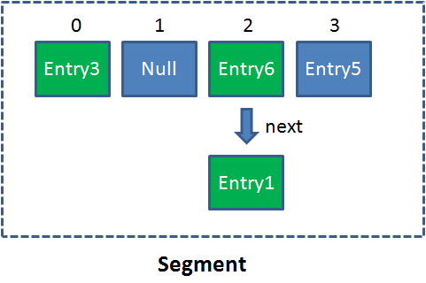
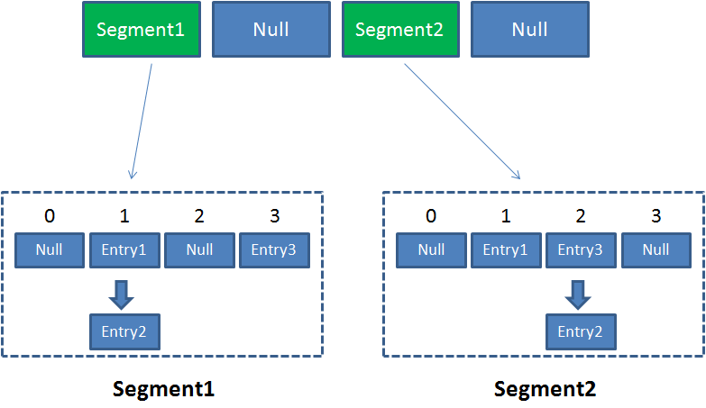

# ConcurrentHashMap1.6 & 1.7

[TOC]

## 图解

首先要了解Segment（段），Segment本身就相当于一个HashMap对象，同HashMap一样，Segment包含一个HashEntry数组，数组中每一个HashEntry既是一个键值对，也是一个链表的头节点



在ConcurrentHashMap集合中有2的N次方个，共同保存在一个名为segments的数组当中，因此整个ConcurrentHashMap的结构如下



可以说，ConcurrentHashMap是一个二级哈希表。在一个总的哈希表下面，有若干个子哈希表。这样的二级结构，和数据库的水平拆分有些相似。

采用锁分段技术，每一个Segment读写操作高度自治，互不影响，同一Segment的写和读是可以并发执行的。但Segment的写入是需要上锁的，因此对同一Segment的并发写入会被阻塞。每个Segment各自持有一把锁。在保证线程安全的同时降低了锁的粒度，让并发操作效率更高。


### 具体操作

**Get**

1.为输入的Key做Hash运算，得到hash值

2.通过hash值，定位到对应的Segment对象

3.再次通过hash值，定位到Segment当中数组的具体位置

---

**Put**

1.为输入的Key做Hash运算，得到hash值，为了实现Segment均匀分步，进行两次Hash操作

2.通过hash值，定位到对应的Segment对象

3.获取可重入锁

4.再次通过hash值，定位到Segment当中数组的具体位置。

5.插入或覆盖HashEntry对象

6.释放锁

> 通过上面可以看出，读写都需要二次定位，首先定位到Segment，之后定位到Segment内的具体数组下标

---

**Size**

1.遍历所有的Segment。

2.把Segment的元素数量累加起来。

3.把Segment的修改次数累加起来。

4.判断所有Segment的总修改次数是否大于上一次的总修改次数。如果大于，说明统计过程中有修改，重新统计，尝试次数+1；如果不是。说明没有修改，统计结束。

5.如果尝试次数超过阈值，则对每一个Segment加锁，再重新统计。

6.再次判断所有Segment的总修改次数是否大于上一次的总修改次数。由于已经加锁，次数一定和上次相等。

7.释放锁，统计结束。

统计总元素数量时，为了尽量不锁住所有的Segment，首先乐观假设Size过程中不会有修改，当尝试一定次数之后，才无奈转为悲观锁，锁住所有的Segment保证强一致性


## 深入分析

如上所说，一言以蔽之，一个ConcurrentHashMap实例中包含由若干个Segment实例组成的数组，而每个Segment实例又包含若干个桶，每个桶都包含一条由若干个HashEntry对象链接起来的链表。


### 继承实现关系

~~~java
public class ConcurrentHashMap<K, V> extends AbstractMap<K, V>
    implements ConcurrentMap<K, V>, Serializable {}
~~~


### 成员变量定义

与HashMap相比，ConcurrentHashMap 增加了两个属性用于**定位段**，分别是 segmentMask 和 segmentShift。此外，不同于HashMap的是，ConcurrentHashMap**底层结构是一个Segment数组，而不是Object数组**，具体源码如下：

~~~java
/**
     * Mask value for indexing into segments. The upper bits of a
     * key's hash code are used to choose the segment.
     */
final int segmentMask;  // 用于定位段，大小等于segments数组的大小减 1，是不可变的

/**
     * Shift value for indexing within segments.
     */
final int segmentShift;    // 用于定位段，大小等于32(hash值的位数)减去对segments的大小取以2为底的对数值，是不可变的

/**
     * The segments, each of which is a specialized hash table
     */
final Segment<K,V>[] segments;   // ConcurrentHashMap的底层结构是一个Segment数组
~~~


### 段的定义

**Segment 类继承于 ReentrantLock 类，从而使得 Segment 对象能充当锁的角色。**每个 Segment 对象用来守护它的成员对象 table 中包含的若干个桶。table 是一个由 HashEntry 对象组成的链表数组，table 数组的每一个数组成员就是一个桶。

在Segment类中，count 变量是一个计数器，它表示每个 Segment 对象管理的 table 数组包含的 HashEntry 对象的个数，也就是 Segment 中包含的 HashEntry 对象的总数。特别需要注意的是，之所以在每个 Segment 对象中包含一个计数器，而不是在 ConcurrentHashMap 中使用全局的计数器，是对 ConcurrentHashMap 并发性的考虑：**因为这样当需要更新计数器时，不用锁定整个ConcurrentHashMap。**事实上，每次对段进行结构上的改变，如在段中进行增加/删除节点(修改节点的值不算结构上的改变)，都要更新count的值，此外，在JDK的实现中**每次读取操作开始都要先读取count的值**。特别需要注意的是，**count是volatile的**，这使得对count的任何更新对其它线程都是**立即可见的**。modCount用于统计段结构改变的次数，主要是为了检测对多个段进行遍历过程中**某个段是否发生改变**，这一点具体在谈到跨段操作时会详述。threashold用来表示段需要进行重哈希的阈值。loadFactor表示段的负载因子，其值等同于ConcurrentHashMap的负载因子的值。table是一个典型的链表数组，而且也是volatile的，这使得对table的任何更新对其它线程也都是立即可见的。段(Segment)的定义如下：

~~~java
/**
     * Segments are specialized versions of hash tables.  This
     * subclasses from ReentrantLock opportunistically, just to
     * simplify some locking and avoid separate construction.
     */
static final class Segment<K,V> extends ReentrantLock implements Serializable {

    /**
         * The number of elements in this segment's region.
         */
    transient volatile int count;    // Segment中元素的数量，可见的

    /**
         * Number of updates that alter the size of the table. This is
         * used during bulk-read methods to make sure they see a
         * consistent snapshot: If modCounts change during a traversal
         * of segments computing size or checking containsValue, then
         * we might have an inconsistent view of state so (usually)
         * must retry.
         */
    transient int modCount;  //对count的大小造成影响的操作的次数（比如put或者remove操作）

    /**
         * The table is rehashed when its size exceeds this threshold.
         * (The value of this field is always <tt>(int)(capacity *
         * loadFactor)</tt>.)
         */
    transient int threshold;      // 阈值，段中元素的数量超过这个值就会对Segment进行扩容

    /**
         * The per-segment table.
         */
    transient volatile HashEntry<K,V>[] table;  // 链表数组

    /**
         * The load factor for the hash table.  Even though this value
         * is same for all segments, it is replicated to avoid needing
         * links to outer object.
         * @serial
         */
    final float loadFactor;  // 段的负载因子，其值等同于ConcurrentHashMap的负载因子
    ...
}
~~~

本质上，ConcurrentHashMap就是一个Segment数组，而一个Segment实例则是一个小的哈希表，而Segment继承于ReentrantLock类，从而使得Segment对象能充当锁的角色，**通过使用段(Segment)将ConcurrentHashMap划分为不同的部分，ConcurrentHashMap就可以使用不同的锁来控制对哈希表的不同部分的修改，从而允许多个修改操作并发进行, 这正是ConcurrentHashMap锁分段技术的核心内涵。**

**ConcurrentHashMap允许多个修改(写)操作并发进行，其关键在于使用了锁分段技术，它使用了不同的锁来控制对哈希表的不同部分进行的修改(写)，而 ConcurrentHashMap 内部使用段(Segment)来表示这些不同的部分。**

实际上，每个段实质上就是一个小的哈希表，每个段都有自己的锁(Segment 类继承了 ReentrantLock 类)。只要多个修改(写)操作发生在不同的段上，它们就可以并发进行。


### HashEntry

HashEntry用来封装具体的键值对，是个典型的四元组。与HashMap中的Entry类似，HashEntry也包括同样的四个域，分别是key、hash、value和next。

**不同的是，在HashEntry类中，key，hash和next域都被声明为final的，value域被volatile所修饰，因此HashEntry对象几乎是不可变的，这是ConcurrentHashMap读操作并不需要加锁的一个重要原因。**

next域被声明为final本身就意味着我们不能从hash链的中间或尾部添加或删除节点，因为这需要修改next引用值，因此所有的节点的修改只能从头部开始。

对于put操作，可以一律添加到Hash链的头部。但是对于remove操作，可能需要从中间删除一个节点，这就需要将要删除节点的前面所有节点整个复制(重新new)一遍，最后一个节点指向要删除结点的下一个结点

**由于value域被volatile修饰，所以其可以确保被读线程读到最新的值，这是ConcurrentHashMap读操作并不需要加锁的另一个重要原因。**

实际上，ConcurrentHashMap完全允许多个读操作并发进行，读操作并不需要加锁。HashEntry代表hash链中的一个节点，其结构如下所示

~~~java
/**
     * ConcurrentHashMap 中的 HashEntry 类
     * 
     * ConcurrentHashMap list entry. Note that this is never exported
     * out as a user-visible Map.Entry.
     *
     * Because the value field is volatile, not final, it is legal wrt
     * the Java Memory Model for an unsynchronized reader to see null
     * instead of initial value when read via a data race.  Although a
     * reordering leading to this is not likely to ever actually
     * occur, the Segment.readValueUnderLock method is used as a
     * backup in case a null (pre-initialized) value is ever seen in
     * an unsynchronized access method.
     */
static final class HashEntry<K,V> {
    final K key;                       // 声明 key 为 final 的
    final int hash;                   // 声明 hash 值为 final 的
    volatile V value;                // 声明 value 被volatile所修饰
    final HashEntry<K,V> next;      // 声明 next 为 final 的

    HashEntry(K key, int hash, HashEntry<K,V> next, V value) {
        this.key = key;
        this.hash = hash;
        this.next = next;
        this.value = value;
    }

    @SuppressWarnings("unchecked")
    static final <K,V> HashEntry<K,V>[] newArray(int i) {
        return new HashEntry[i];
    }
}
~~~

与HashMap类似，在ConcurrentHashMap中，如果在散列时发生碰撞，也会将碰撞的 HashEntry 对象链成一个链表。由于HashEntry的next域是final的，所以新节点只能在**链表的表头处插入**。


## 构造函数

ConcurrentHashMap 一共提供了五个构造函数，其中默认无参的构造函数和参数为Map的构造函数 为 Java Collection Framework 规范的推荐实现，其余三个构造函数则是 ConcurrentHashMap 专门提供的。

### ConcurrentHashMap(int initialCapacity, float loadFactor, int concurrencyLevel)

该构造函数意在构造一个具有指定容量、指定负载因子和指定段数目/并发级别(若不是2的幂次方，则会调整为2的幂次方)的空ConcurrentHashMap，其相关源码如下：

~~~java
/**
     * Creates a new, empty map with the specified initial
     * capacity, load factor and concurrency level.
     *
     * @param initialCapacity the initial capacity. The implementation
     * performs internal sizing to accommodate this many elements.
     * @param loadFactor  the load factor threshold, used to control resizing.
     * Resizing may be performed when the average number of elements per
     * bin exceeds this threshold.
     * @param concurrencyLevel the estimated number of concurrently
     * updating threads. The implementation performs internal sizing
     * to try to accommodate this many threads.
     * @throws IllegalArgumentException if the initial capacity is
     * negative or the load factor or concurrencyLevel are
     * nonpositive.
     */
public ConcurrentHashMap(int initialCapacity,
                         float loadFactor, int concurrencyLevel) {
    if (!(loadFactor > 0) || initialCapacity < 0 || concurrencyLevel <= 0)
        throw new IllegalArgumentException();

    if (concurrencyLevel > MAX_SEGMENTS)              
        concurrencyLevel = MAX_SEGMENTS;

    // Find power-of-two sizes best matching arguments
    int sshift = 0;            // 大小为 lg(ssize) 
    int ssize = 1;            // 段的数目，segments数组的大小(2的幂次方)
    while (ssize < concurrencyLevel) {
        ++sshift;
        ssize <<= 1;
    }
    segmentShift = 32 - sshift;      // 用于定位段
    segmentMask = ssize - 1;      // 用于定位段
    this.segments = Segment.newArray(ssize);   // 创建segments数组

    if (initialCapacity > MAXIMUM_CAPACITY)
        initialCapacity = MAXIMUM_CAPACITY;
    int c = initialCapacity / ssize;    // 总的桶数/总的段数
    if (c * ssize < initialCapacity)
        ++c;
    int cap = 1;     // 每个段所拥有的桶的数目(2的幂次方)
    while (cap < c)
        cap <<= 1;

    for (int i = 0; i < this.segments.length; ++i)      // 初始化segments数组
        this.segments[i] = new Segment<K,V>(cap, loadFactor);
}
~~~


### ConcurrentHashMap(int initialCapacity, float loadFactor)

该构造函数意在构造一个具有指定容量、指定负载因子和默认并发级别(16)的空ConcurrentHashMap，其相关源码如下：

~~~java
/**
     * Creates a new, empty map with the specified initial capacity
     * and load factor and with the default concurrencyLevel (16).
     *
     * @param initialCapacity The implementation performs internal
     * sizing to accommodate this many elements.
     * @param loadFactor  the load factor threshold, used to control resizing.
     * Resizing may be performed when the average number of elements per
     * bin exceeds this threshold.
     * @throws IllegalArgumentException if the initial capacity of
     * elements is negative or the load factor is nonpositive
     *
     * @since 1.6
     */
public ConcurrentHashMap(int initialCapacity, float loadFactor) {
    this(initialCapacity, loadFactor, DEFAULT_CONCURRENCY_LEVEL);  // 默认并发级别为16
}
~~~


### ConcurrentHashMap(int initialCapacity)

该构造函数意在构造一个具有指定容量、默认负载因子(0.75)和默认并发级别(16)的空ConcurrentHashMap，其相关源码如下：

~~~java
/**
     * Creates a new, empty map with the specified initial capacity,
     * and with default load factor (0.75) and concurrencyLevel (16).
     *
     * @param initialCapacity the initial capacity. The implementation
     * performs internal sizing to accommodate this many elements.
     * @throws IllegalArgumentException if the initial capacity of
     * elements is negative.
     */
public ConcurrentHashMap(int initialCapacity) {
    this(initialCapacity, DEFAULT_LOAD_FACTOR, DEFAULT_CONCURRENCY_LEVEL);
}
~~~


### ConcurrentHashMap()

该构造函数意在构造一个具有默认初始容量(16)、默认负载因子(0.75)和默认并发级别(16)的空ConcurrentHashMap，其相关源码如下：

~~~java
/**
     * Creates a new, empty map with a default initial capacity (16),
     * load factor (0.75) and concurrencyLevel (16).
     */
public ConcurrentHashMap() {
    this(DEFAULT_INITIAL_CAPACITY, DEFAULT_LOAD_FACTOR, DEFAULT_CONCURRENCY_LEVEL);
}
~~~


### ConcurrentHashMap(Map<? extends K, ? extends V> m)

该构造函数意在构造一个与指定 Map 具有相同映射的 ConcurrentHashMap，其初始容量不小于 16 (具体依赖于指定Map的大小)，负载因子是 0.75，并发级别是 16， 是 Java Collection Framework 规范推荐提供的，其源码如下：

~~~java
/**
     * Creates a new map with the same mappings as the given map.
     * The map is created with a capacity of 1.5 times the number
     * of mappings in the given map or 16 (whichever is greater),
     * and a default load factor (0.75) and concurrencyLevel (16).
     *
     * @param m the map
     */
public ConcurrentHashMap(Map<? extends K, ? extends V> m) {
    this(Math.max((int) (m.size() / DEFAULT_LOAD_FACTOR) + 1,
                  DEFAULT_INITIAL_CAPACITY),
         DEFAULT_LOAD_FACTOR, DEFAULT_CONCURRENCY_LEVEL);
    putAll(m);
}
~~~

三个非常重要的参数：**初始容量**、**负载因子** 和 **并发级别**，这三个参数是影响ConcurrentHashMap性能的重要参数。从上述源码我们可以看出，ConcurrentHashMap 也正是通过initialCapacity、loadFactor和concurrencyLevel这三个参数进行构造并初始化segments数组、段偏移量segmentShift、段掩码segmentMask和每个segment的。


## 实现

> 在ConcurrentHashMap中，线程对映射表做读操作时，一般情况下不需要加锁就可以完成，对容器做结构性修改的操作(比如，put操作、remove操作等)才需要加锁

### put

用分段锁机制实现多个线程间的并发写操作

~~~java
/**
     * Maps the specified key to the specified value in this table.
     * Neither the key nor the value can be null.
     *
     * <p> The value can be retrieved by calling the <tt>get</tt> method
     * with a key that is equal to the original key.
     *
     * @param key key with which the specified value is to be associated
     * @param value value to be associated with the specified key
     * @return the previous value associated with <tt>key</tt>, or
     *         <tt>null</tt> if there was no mapping for <tt>key</tt>
     * @throws NullPointerException if the specified key or value is null
     */
public V put(K key, V value) {
    if (value == null)
        throw new NullPointerException();
    int hash = hash(key.hashCode());
    return segmentFor(hash).put(key, hash, value, false);
}
~~~

ConcurrentHashMap不同于HashMap，**它既不允许key值为null，也不允许value值为null**。此外，我们还可以看到，实际上我们对ConcurrentHashMap的put操作被ConcurrentHashMap**委托给特定的段来实现**。也就是说，当我们向ConcurrentHashMap中put一个Key/Value对时，首先会获得**Key的哈希值并对其再次哈希**，然后根据最终的hash值**定位到这条记录所应该插入的段**，定位段的segmentFor()方法源码如下：

~~~java
/**
     * Returns the segment that should be used for key with given hash
     * @param hash the hash code for the key
     * @return the segment
     */
final Segment<K,V> segmentFor(int hash) {
    return segments[(hash >>> segmentShift) & segmentMask];
}
~~~

segmentFor()方法根据传入的hash值向右无符号右移segmentShift位，然后和segmentMask进行与操作就可以定位到特定的段。

在这里，假设Segment的数量(segments数组的长度)是2的n次方(Segment的数量总是2的倍数，具体见构造函数的实现)，那么segmentShift的值就是32-n(hash值的位数是32)，而segmentMask的值就是2^n-1（写成二进制的形式就是n个1）。进一步地，我们就可以得出以下结论：**根据key的hash值的高n位就可以确定元素到底在哪一个Segment中。**紧接着，调用这个段的put()方法来将目标Key/Value对插到段中，段的put()方法的源码如下所示：

~~~java
V put(K key, int hash, V value, boolean onlyIfAbsent) {
    lock();    // 上锁
    try {
        int c = count;
        if (c++ > threshold) // ensure capacity
            rehash();
        HashEntry<K,V>[] tab = table;    // table是Volatile的
        int index = hash & (tab.length - 1);    // 定位到段中特定的桶
        HashEntry<K,V> first = tab[index];   // first指向桶中链表的表头
        HashEntry<K,V> e = first;

        // 检查该桶中是否存在相同key的结点
        while (e != null && (e.hash != hash || !key.equals(e.key)))  
            e = e.next;

        V oldValue;
        if (e != null) { 
            // 该桶中存在相同key的结点
            oldValue = e.value;
            if (!onlyIfAbsent)
                // 更新value值
                e.value = value;        
        } else {         // 该桶中不存在相同key的结点
            oldValue = null;
            // 结构性修改，modCount加1
            ++modCount;     
            // 创建HashEntry并将其链到表头
            tab[index] = new HashEntry<K,V>(key, hash, first, value); 
            // write-volatile，count值的更新一定要放在最后一步(volatile变量)
            count = c;      
        }
        // 返回旧值(该桶中不存在相同key的结点，则返回null)
        return oldValue;    
    } finally {
        // 在finally子句中解锁
        unlock();      
    }
}
~~~

从源码中首先可以知道，ConcurrentHashMap对Segment的put操作是加锁完成的。在第二节我们已经知道，Segment是ReentrantLock的子类，因此Segment本身就是一种可重入的Lock，所以我们可以直接调用其继承而来的lock()方法和unlock()方法对代码进行上锁/解锁。需要注意的是，这里的加锁操作是针对某个具体的Segment，锁定的也是该Segment而不是整个ConcurrentHashMap。因为插入键/值对操作只是在这个Segment包含的某个桶中完成，不需要锁定整个ConcurrentHashMap。因此，其他写线程对另外15个Segment的加锁并不会因为当前线程对这个Segment的加锁而阻塞。故而 **相比较于 Hashtable 和由同步包装器包装的HashMap每次只能有一个线程执行读或写操作，ConcurrentHashMap 在并发访问性能上有了质的提高。在理想状态下，ConcurrentHashMap 可以支持 16 个线程执行并发写操作（如果并发级别设置为 16），及任意数量线程的读操作。**

在将Key/Value对插入到Segment之前，首先会检查本次插入会不会导致Segment中元素的数量超过阈值threshold，如果会，那么就先对Segment进行扩容和重哈希操作，然后再进行插入。重哈希操作暂且不表，稍后详述。第8和第9行的操作就是定位到段中特定的桶并确定链表头部的位置。第12行的while循环用于检查该桶中是否存在相同key的结点，如果存在，就直接更新value值；如果没有找到，则进入21行生成一个新的HashEntry并且把它链到该桶中链表的表头，然后再更新count的值(由于count是volatile变量，所以count值的更新一定要放在最后一步)。


### rehash

在ConcurrentHashMap中使用put操作插入Key/Value对之前，首先会检查本次插入会不会导致Segment中节点数量超过阈值threshold，如果会，那么就先对Segment进行扩容和重哈希操作。**特别需要注意的是，ConcurrentHashMap的重哈希实际上是对ConcurrentHashMap的某个段的重哈希，因此ConcurrentHashMap的每个段所包含的桶位自然也就不尽相同。**针对段进行rehash()操作的源码如下：

~~~java
void rehash() {
    HashEntry<K,V>[] oldTable = table;    // 扩容前的table
    int oldCapacity = oldTable.length;
    if (oldCapacity >= MAXIMUM_CAPACITY)   // 已经扩到最大容量，直接返回
        return;

    /*
             * Reclassify nodes in each list to new Map.  Because we are
             * using power-of-two expansion, the elements from each bin
             * must either stay at same index, or move with a power of two
             * offset. We eliminate unnecessary node creation by catching
             * cases where old nodes can be reused because their next
             * fields won't change. Statistically, at the default
             * threshold, only about one-sixth of them need cloning when
             * a table doubles. The nodes they replace will be garbage
             * collectable as soon as they are no longer referenced by any
             * reader thread that may be in the midst of traversing table
             * right now.
             */

    // 新创建一个table，其容量是原来的2倍
    HashEntry<K,V>[] newTable = HashEntry.newArray(oldCapacity<<1);   
    threshold = (int)(newTable.length * loadFactor);   // 新的阈值
    int sizeMask = newTable.length - 1;     // 用于定位桶
    for (int i = 0; i < oldCapacity ; i++) {
        // We need to guarantee that any existing reads of old Map can
        //  proceed. So we cannot yet null out each bin.
        HashEntry<K,V> e = oldTable[i];  // 依次指向旧table中的每个桶的链表表头

        if (e != null) {    // 旧table的该桶中链表不为空
            HashEntry<K,V> next = e.next;
            int idx = e.hash & sizeMask;   // 重哈希已定位到新桶
            if (next == null)    // 旧table的该桶中只有一个节点
                newTable[idx] = e;
            else {    
                // Reuse trailing consecutive sequence at same slot
                HashEntry<K,V> lastRun = e;
                int lastIdx = idx;
                for (HashEntry<K,V> last = next;
                     last != null;
                     last = last.next) {
                    int k = last.hash & sizeMask;
                    // 寻找k值相同的子链，该子链尾节点与父链的尾节点必须是同一个
                    if (k != lastIdx) {
                        lastIdx = k;
                        lastRun = last;
                    }
                }

                // JDK直接将子链lastRun放到newTable[lastIdx]桶中
                newTable[lastIdx] = lastRun;

                // 对该子链之前的结点，JDK会挨个遍历并把它们复制到新桶中
                for (HashEntry<K,V> p = e; p != lastRun; p = p.next) {
                    int k = p.hash & sizeMask;
                    HashEntry<K,V> n = newTable[k];
                    newTable[k] = new HashEntry<K,V>(p.key, p.hash,
                                                     n, p.value);
                }
            }
        }
    }
    table = newTable;   // 扩容完成
}

~~~

**由于扩容是按照2的幂次方进行的，所以扩展前在同一个桶中的元素，现在要么还是在原来的序号的桶里，或者就是原来的序号再加上一个2的幂次方，就这两种选择。**

根据本文前面对HashEntry的介绍，我们知道链接指针next是final的，因此看起来我们好像只能把该桶的HashEntry链中的每个节点复制到新的桶中(这意味着我们要重新创建每个节点)，但事实上JDK对其做了一定的优化。因为在理论上原桶里的HashEntry链可能存在一条子链，这条子链上的节点都会被重哈希到同一个新的桶中，这样我们只要拿到该子链的头结点就可以直接把该子链放到新的桶中，从而避免了一些节点不必要的创建，提升了一定的效率。因此，JDK为了提高效率，它会首先去查找这样的一个子链，而且这个子链的尾节点必须与原hash链的尾节点是同一个，那么就只需要把这个子链的头结点放到新的桶中，其后面跟的一串子节点自然也就连接上了。对于这个子链头结点之前的结点，JDK会挨个遍历并把它们复制到新桶的链头(只能在表头插入元素)中。特别地，我们注意这段代码：

~~~java
for (HashEntry<K,V> last = next;
     last != null;
     last = last.next) {
    int k = last.hash & sizeMask;
    if (k != lastIdx) {
        lastIdx = k;
        lastRun = last;
    }
}
newTable[lastIdx] = lastRun;
~~~

在该代码段中，JDK直接将子链lastRun放到newTable[lastIdx]桶中，难道这个操作不会覆盖掉newTable[lastIdx]桶中原有的元素么？事实上，这种情形时不可能出现的，因为桶newTable[lastIdx]在子链添加进去之前压根就不会有节点存在，这还是因为table的大小是按照2的幂次方的方式去扩展的。假设原来table的大小是2^k 大小，那么现在新table的大小是2^(k+1)大小，而定位桶的方式是:

```java
// sizeMask = newTable.length - 1，即 sizeMask = 11...1，共k+1个1。
int idx = e.hash & sizeMask;12
```

　　因此这样得到的idx实际上就是key的hash值的低k+1位的值，而原table的sizeMask也全是1的二进制，不过总共是k位，那么原table的idx就是key的hash值的低k位的值。所以，**如果元素的hashcode的第k+1位是0，那么元素在新桶的序号就是和原桶的序号是相等的；如果第k+1位的值是1，那么元素在新桶的序号就是原桶的序号加上2^k。**因此，JDK直接将子链lastRun放到newTable[lastIdx]桶中就没问题了，因为newTable中新序号处此时肯定是空的。


### get

> 读取实现，查询一个指定key的键值对，首先会定位其该存在的段，然后查询请求委托给这个段进行处理

~~~java
/**
     * Returns the value to which the specified key is mapped,
     * or {@code null} if this map contains no mapping for the key.
     *
     * <p>More formally, if this map contains a mapping from a key
     * {@code k} to a value {@code v} such that {@code key.equals(k)},
     * then this method returns {@code v}; otherwise it returns
     * {@code null}.  (There can be at most one such mapping.)
     *
     * @throws NullPointerException if the specified key is null
     */
public V get(Object key) {
    int hash = hash(key.hashCode());
    return segmentFor(hash).get(key, hash);
}
~~~


~~~java
V get(Object key, int hash) {
    if (count != 0) {            // read-volatile，首先读 count 变量
        HashEntry<K,V> e = getFirst(hash);   // 获取桶中链表头结点
        while (e != null) {
            // 查找链中是否存在指定Key的键值对
            if (e.hash == hash && key.equals(e.key)) {    
                V v = e.value;
                if (v != null)  // 如果读到value域不为 null，直接返回
                    return v;   
                // 如果读到value域为null，说明发生了重排序，加锁后重新读取
                return readValueUnderLock(e); // recheck
            }
            e = e.next;
        }
    }
    return null;  // 如果不存在，直接返回null
}
~~~

**ConcurrentHashMap不同于HashMap，它既不允许key值为null，也不允许value值为null。但是，此处怎么会存在键值对存在且的Value值为null的情形呢？JDK官方给出的解释是，这种情形发生的场景是：初始化HashEntry时发生的指令重排序导致的，也就是在HashEntry初始化完成之前便返回了它的引用。这时，JDK给出的解决之道就是加锁重读**，源码如下：

~~~java
 /**
         * Reads value field of an entry under lock. Called if value
         * field ever appears to be null. This is possible only if a
         * compiler happens to reorder a HashEntry initialization with
         * its table assignment, which is legal under memory model
         * but is not known to ever occur.
         */
        V readValueUnderLock(HashEntry<K,V> e) {
            lock();
            try {
                return e.value;
            } finally {
                unlock();
            }
        }
~~~


### 总结

在ConcurrentHashMap进行存取时，首先会定位到具体的段，然后通过对具体段的存取来完成对整个ConcurrentHashMap的存取。特别地，无论是ConcurrentHashMap的读操作还是写操作都具有很高的性能：在进行读操作时不需要加锁，而在写操作时通过锁分段技术只对所操作的段加锁而不影响客户端对其它段的访问。


## 为何读操作不需要加锁

HashEntry对象几乎是不可变的(只能改变Value的值)，因为HashEntry中的key、hash和next指针都是final的。这意味着，我们不能把节点添加到链表的中间和尾部，也不能在链表的中间和尾部删除节点。这个特性可以保证：在访问某个节点时，这个节点之后的链接不会被改变，这个特性可以大大降低处理链表时的复杂性。与此同时，由于HashEntry类的value字段被声明是Volatile的，因此Java的内存模型就可以保证：某个写线程对value字段的写入马上就可以被后续的某个读线程看到。此外，由于在ConcurrentHashMap中不允许用null作为键和值，所以当读线程读到某个HashEntry的value为null时，便知道产生了冲突 —— 发生了重排序现象，此时便会加锁重新读入这个value值。这些特性互相配合，使得读线程即使在不加锁状态下，也能正确访问 ConcurrentHashMap。总的来说，ConcurrentHashMap读操作不需要加锁的奥秘在于以下三点：

- **用HashEntery对象的不变性来降低读操作对加锁的需求；**
- **用Volatile变量协调读写线程间的内存可见性；**
- **若读时发生指令重排序现象，则加锁重读；**


### 用HashEntery对象的不变性来降低读操作对加锁的需求

非结构性修改操作只是更改某个HashEntry的value字段的值。由于对Volatile变量的写入操作将与随后对这个变量的读操作进行同步，所以当一个写线程修改了某个HashEntry的value字段后，Java内存模型能够保证读线程一定能读取到这个字段更新后的值。所以，写线程对链表的非结构性修改能够被后续不加锁的读线程看到。

对ConcurrentHashMap做结构性修改时，实质上是对某个桶指向的链表做结构性修改。如果能够确保在读线程遍历一个链表期间，写线程对这个链表所做的结构性修改不影响读线程继续正常遍历这个链表，那么读/写线程之间就可以安全并发访问这个ConcurrentHashMap。在ConcurrentHashMap中，结构性修改操作包括put操作、remove操作和clear操作，下面我们分别分析这三个操作：

- **clear操作只是把ConcurrentHashMap中所有的桶置空，每个桶之前引用的链表依然存在，只是桶不再引用这些链表而已，而链表本身的结构并没有发生任何修改。**因此，正在遍历某个链表的读线程依然可以正常执行对该链表的遍历。
- 关于put操作的细节在上文已经单独介绍过，**put操作如果需要插入一个新节点到链表中时会在链表头部插入这个新节点，此时链表中的原有节点的链接并没有被修改。**也就是说，插入新的健/值对到链表中的操作不会影响读线程正常遍历这个链表。


**remove**

~~~java
public V remove(Object key) {
    int hash = hash(key.hashCode());
        return segmentFor(hash).remove(key, hash, null);
    }

// 同样地，在ConcurrentHashMap中删除一个键值对时，首先需要定位到特定的段并将删除操作委派给该段。Segment的remove操作如下所示：
       
        V remove(Object key, int hash, Object value) {
            lock();     // 加锁
            try {
                int c = count - 1;      
                HashEntry<K,V>[] tab = table;
                int index = hash & (tab.length - 1);        // 定位桶
                HashEntry<K,V> first = tab[index];
                HashEntry<K,V> e = first;
                while (e != null && (e.hash != hash || !key.equals(e.key)))  // 查找待删除的键值对
                    e = e.next;

                V oldValue = null;
                if (e != null) {    // 找到
                    V v = e.value;
                    if (value == null || value.equals(v)) {
                        oldValue = v;
                        // All entries following removed node can stay
                        // in list, but all preceding ones need to be
                        // cloned.
                        ++modCount;
                        // 所有处于待删除节点之后的节点原样保留在链表中
                        HashEntry<K,V> newFirst = e.next;
                        // 所有处于待删除节点之前的节点被克隆到新链表中
                        for (HashEntry<K,V> p = first; p != e; p = p.next)
                            newFirst = new HashEntry<K,V>(p.key, p.hash,newFirst, p.value); 

                        tab[index] = newFirst;   // 将删除指定节点并重组后的链重新放到桶中
                        count = c;      // write-volatile，更新Volatile变量count
                    }
                }
                return oldValue;
            } finally {
                unlock();          // finally子句解锁
            }
        }
~~~

　Segment的remove操作和前面提到的get操作类似，首先根据散列码找到具体的链表，然后遍历这个链表找到要删除的节点，最后把待删除节点之后的所有节点原样保留在新链表中，把待删除节点之前的每个节点克隆到新链表中

**在执行remove操作时，原始链表并没有被修改，也就是说，读线程不会受同时执行 remove 操作的并发写线程的干扰。**

无论写线程对某个链表进行结构性修改还是非结构性修改，都不会影响其他的并发读线程对这个链表的访问。


### 用 Volatile 变量协调读写线程间的内存可见性

Java的内存模型可以保证：**只要之前对链表做结构性修改操作的写线程M在退出写方法前写volatile变量count，读线程N就能读取到这个volatile变量count的最新值。**

事实上，ConcurrentHashMap就是一个Segment数组，而每个Segment都有一个volatile变量count去统计Segment中的HashEntry的个数。并且，在ConcurrentHashMap中，所有不加锁读方法在进入读方法时，首先都会去读这个count变量。

~~~java
V get(Object key, int hash) {
    if (count != 0) {            // read-volatile，首先读 count 变量
        HashEntry<K,V> e = getFirst(hash);   // 获取桶中链表头结点
        while (e != null) {
            if (e.hash == hash && key.equals(e.key)) {    // 查找链中是否存在指定Key的键值对
                V v = e.value;
                if (v != null)  // 如果读到value域不为 null，直接返回
                    return v;   
                // 如果读到value域为null，说明发生了重排序，加锁后重新读取
                return readValueUnderLock(e); // recheck
            }
            e = e.next;
        }
    }
    return null;  // 如果不存在，直接返回null
}
~~~


### 总结

在ConcurrentHashMap中，所有执行写操作的方法（put、remove和clear）在对链表做结构性修改之后，在退出写方法前都会去写这个count变量；所有未加锁的读操作（get、contains和containsKey）在读方法中，都会首先去读取这个count变量。根据 Java 内存模型，对同一个 volatile 变量的写/读操作可以确保：写线程写入的值，能够被之后未加锁的读线程“看到”。这个特性和前面介绍的HashEntry对象的不变性相结合，使得在ConcurrentHashMap中读线程进行读取操作时基本不需要加锁就能成功获得需要的值。**这两个特性以及加锁重读机制的互相配合，不仅减少了请求同一个锁的频率（读操作一般不需要加锁就能够成功获得值），也减少了持有同一个锁的时间（只有读到 value 域的值为 null 时 , 读线程才需要加锁后重读）。**


## 跨段操作

在ConcurrentHashMap中，有些操作需要涉及到多个段，比如说size操作、containsValaue操作等。以size操作为例，如果我们要统计整个ConcurrentHashMap里元素的大小，那么就必须统计所有Segment里元素的大小后求和。我们知道，Segment里的全局变量count是一个volatile变量，那么在多线程场景下，我们是不是直接把所有Segment的count相加就可以得到整个ConcurrentHashMap大小了呢？显然不能，虽然相加时可以获取每个Segment的count的最新值，但是拿到之后可能累加前使用的count发生了变化，那么统计结果就不准了。所以最安全的做法，是在统计size的时候把所有Segment的put，remove和clean方法全部锁住，但是这种做法显然非常低效。

~~~java
/**
     * Returns the number of key-value mappings in this map.  If the
     * map contains more than <tt>Integer.MAX_VALUE</tt> elements, returns
     * <tt>Integer.MAX_VALUE</tt>.
     *
     * @return the number of key-value mappings in this map
     */
    public int size() {
        final Segment<K,V>[] segments = this.segments;
        long sum = 0;
        long check = 0;
        int[] mc = new int[segments.length];
        // Try a few times to get accurate count. On failure due to
        // continuous async changes in table, resort to locking.
        for (int k = 0; k < RETRIES_BEFORE_LOCK; ++k) {
            check = 0;
            sum = 0;
            int mcsum = 0;
            for (int i = 0; i < segments.length; ++i) {
                sum += segments[i].count;   
                mcsum += mc[i] = segments[i].modCount;  // 在统计size时记录modCount
            }
            if (mcsum != 0) {
                for (int i = 0; i < segments.length; ++i) {
                    check += segments[i].count;
                    if (mc[i] != segments[i].modCount) {  // 统计size后比较各段的modCount是否发生变化
                        check = -1; // force retry
                        break;
                    }
                }
            }
            if (check == sum)// 如果统计size前后各段的modCount没变，且两次得到的总数一致，直接返回
                break;
        }
        if (check != sum) { // Resort to locking all segments  // 加锁统计
            sum = 0;
            for (int i = 0; i < segments.length; ++i)
                segments[i].lock();
            for (int i = 0; i < segments.length; ++i)
                sum += segments[i].count;
            for (int i = 0; i < segments.length; ++i)
                segments[i].unlock();
        }
        if (sum > Integer.MAX_VALUE)
            return Integer.MAX_VALUE;
        else
            return (int)sum;
    }
~~~

size方法主要思路是先在没有锁的情况下对所有段大小求和，这种求和策略最多执行RETRIES_BEFORE_LOCK次(默认是两次)：在没有达到RETRIES_BEFORE_LOCK之前，求和操作会不断尝试执行（这是因为遍历过程中可能有其它线程正在对已经遍历过的段进行结构性更新）；在超过RETRIES_BEFORE_LOCK之后，如果还不成功就在持有所有段锁的情况下再对所有段大小求和。事实上，在累加count操作过程中，之前累加过的count发生变化的几率非常小，所以ConcurrentHashMap的做法是先尝试RETRIES_BEFORE_LOCK次通过不锁住Segment的方式来统计各个Segment大小，如果统计的过程中，容器的count发生了变化，则再采用加锁的方式来统计所有Segment的大小。

　　那么，ConcurrentHashMap是如何判断在统计的时候容器的段发生了结构性更新了呢？我们在前文中已经知道，Segment包含一个modCount成员变量，在会引起段发生结构性改变的所有操作(put操作、 remove操作和clean操作)里，都会将变量modCount进行加1，因此，**JDK只需要在统计size前后比较modCount是否发生变化就可以得知容器的大小是否发生变化。**


