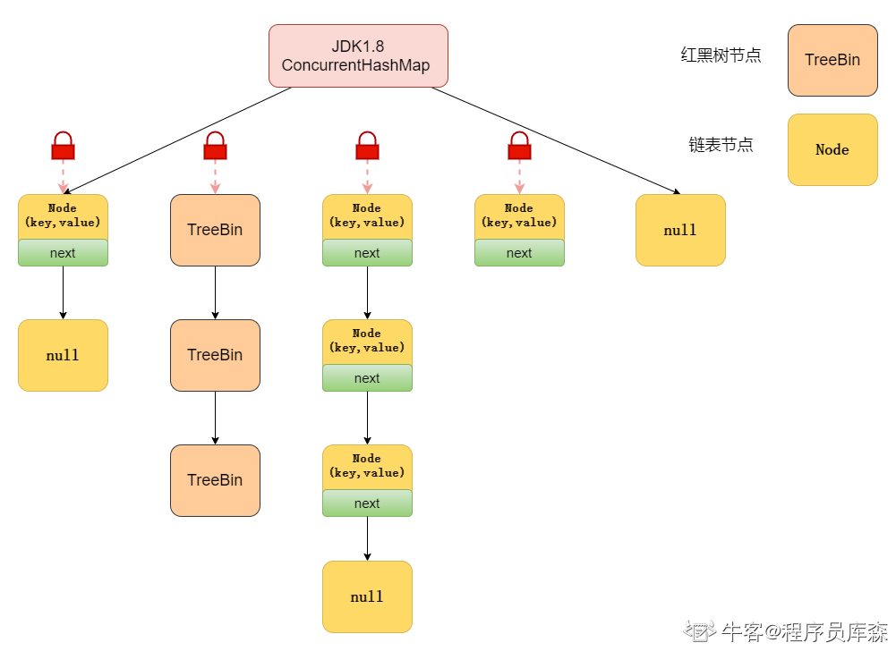

# ConcurrentHashMap1.8源码

[TOC]

## 主要变化

- 不同于1.7使用分段锁机制来实现并发更新操作，核心类为Segment，它继承自重入锁ReentrantLock，并发度于Segment数量相等，1.8中使用了CAS操作来支持更高的并发度，在CAS操作失败时使用内置锁synchronized，实现更加细粒度的锁，并且1.8的实现也在链表过长时会转换为红黑树
- 不再使用Segment代理Map这种设计，整体结构变为HashMap这种结构，但依旧保留分段锁的思想，之前版本是每个Segment都持有一把锁，1.8版本改为锁住恰好装在一个hash桶本身位置上的节点，也就是hash桶的第一个节点 tabAt(table, i)，后面直接叫第一个节点。它可能是Node链表的头结点、保留节点ReservationNode、或者是TreeBin节点（TreeBin节点持有红黑树的根节点），另外，1.8的节点变为了4种
- 使用新的计数方法，不使用Segment，1.8里使用的是java.util.concurrent.atomic.LongAdder，基本思想也是使用一层中间类，叫做Cell（类似Segment）的计数单元，来实现分段计数，最后合并统计一次，因为不用的计数单元可以承担不同的线程的计数要求，减少了线程之间的竞争
- 可以多线程并发来完成扩容，之前如果Segment正在进行扩容操作，其他写线程都会被阻塞，1.8改为一个写线程触发了扩容操作，其他写线程进行写入操作时，可以帮助它来完成扩容这个耗时的操作，因为多线程并发扩容的存在，导致的其他操作的实现上会有比较大的改动，常见的get/put/remove/replace/clear，以及迭代操作，都要考虑并发扩容的影响
- 引进函数式编程、Stream api

> 将锁的级别控制在了更细粒度的hash数组元素级别，也就是说只需要锁着这个链表头节点（红黑树的根节点），就不会影响其他的hash数组元素的读写，大大提高了并发度

## 常量

concurrencyLevel和loadFactor都不再是原来的作用了，保留很大程度只是为了兼容之前的版本。

~~~java
private static final int MAXIMUM_CAPACITY = 1 << 30;
private static final int DEFAULT_CAPACITY = 16;

// 下面3个，在1.8的HashMap中也有相同的常量

// 一个hash桶中hash冲突的数目大于此值时，把链表转化为红黑树，加快hash冲突时的查找速度
static final int TREEIFY_THRESHOLD = 8;

// 一个hash桶中hash冲突的数目小于等于此值时，把红黑树转化为链表，当数目比较少时，链表的实际查找速度更快，也是为了查找效率
static final int UNTREEIFY_THRESHOLD = 6;

// 当table数组的长度小于此值时，不会把链表转化为红黑树。所以转化为红黑树有两个条件，还有一个是 TREEIFY_THRESHOLD
static final int MIN_TREEIFY_CAPACITY = 64;

// 虚拟机限制的最大数组长度，在ArrayList中有说过，jdk1.8新引入的，ConcurrentHashMap的主体代码中是不使用这个的，主要用在Collection.toArray两个方法中
static final int MAX_ARRAY_SIZE = Integer.MAX_VALUE - 8;

// 默认并行级别，主体代码中未使用此常量，为了兼容性，保留了之前的定义，主要是配合同样是为了兼容性的Segment使用，另外在构造方法中有一些作用
// 千万注意，1.8的并发级别有了大的改动，具体并发级别可以认为是hash桶是数量，也就是容量，会随扩容而改变，不再是固定值
private static final int DEFAULT_CONCURRENCY_LEVEL = 16;

// 加载因子，为了兼容性，保留了这个常量（名字变了），配合同样是为了兼容性的Segment使用
// 1.8的ConcurrentHashMap的加载因子固定为 0.75，构造方法中指定的参数是不会被用作loadFactor的，为了计算方便，统一使用 n - (n >> 2) 代替浮点乘法 *0.75
private static final float LOAD_FACTOR = 0.75f;

// 扩容操作中，transfer这个步骤是允许多线程的，这个常量表示一个线程执行transfer时，最少要对连续的16个hash桶进行transfer
//（不足16就按16算，多控制下正负号就行）
// 也就是单线程执行transfer时的最小任务量，单位为一个hash桶，这就是线程的transfer的步进（stride）
// 最小值是DEFAULT_CAPACITY，不使用太小的值，避免太小的值引起transfer时线程竞争过多，如果计算出来的值小于此值，就使用此值
// 正常步骤中会根据CPU核心数目来算出实际的，一个核心允许8个线程并发执行扩容操作的transfer步骤，这个8是个经验值，不能调整的
// 因为transfer操作不是IO操作，也不是死循环那种100%的CPU计算，CPU计算率中等，1核心允许8个线程并发完成扩容，理想情况下也算是比较合理的值
// 一段代码的IO操作越多，1核心对应的线程就要相应设置多点，CPU计算越多，1核心对应的线程就要相应设置少一些
// 表明：默认的容量是16，也就是默认构造的实例，第一次扩容实际上是单线程执行的，看上去是可以多线程并发（方法允许多个线程进入），
// 但是实际上其余的线程都会被一些if判断拦截掉，不会真正去执行扩容
private static final int MIN_TRANSFER_STRIDE = 16;

// 用于生成每次扩容都唯一的生成戳的数，最小是6。很奇怪，这个值不是常量，但是也不提供修改方法。
/** The number of bits used for generation stamp in sizeCtl. Must be at least 6 for 32bit arrays. */
private static int RESIZE_STAMP_BITS = 16;

// 最大的扩容线程的数量，如果上面的 RESIZE_STAMP_BITS = 32，那么此值为 0，这一点也很奇怪。
/** The maximum number of threads that can help resize. Must fit in 32 - RESIZE_STAMP_BITS bits. */
private static final int MAX_RESIZERS = (1 << (32 - RESIZE_STAMP_BITS)) - 1;

// 移位量，把生成戳移位后保存在sizeCtl中当做扩容线程计数的基数，相反方向移位后能够反解出生成戳
/** The bit shift for recording size stamp in sizeCtl. */
private static final int RESIZE_STAMP_SHIFT = 32 - RESIZE_STAMP_BITS;

// 下面几个是特殊的节点的hash值，正常节点的hash值在hash函数中都处理过了，不会出现负数的情况，特殊节点在各自的实现类中有特殊的遍历方法
// ForwardingNode的hash值，ForwardingNode是一种临时节点，在扩进行中才会出现，并且它不存储实际的数据
// 如果旧数组的一个hash桶中全部的节点都迁移到新数组中，旧数组就在这个hash桶中放置一个ForwardingNode
// 读操作或者迭代读时碰到ForwardingNode时，将操作转发到扩容后的新的table数组上去执行，写操作碰见它时，则尝试帮助扩容
/** Encodings for Node hash fields. See above for explanation. */
static final int MOVED     = -1; // hash for forwarding nodes

// TreeBin的hash值，TreeBin是ConcurrentHashMap中用于代理操作TreeNode的特殊节点，持有存储实际数据的红黑树的根节点
// 因为红黑树进行写入操作，整个树的结构可能会有很大的变化，这个对读线程有很大的影响，
//     所以TreeBin还要维护一个简单读写锁，这是相对HashMap，这个类新引入这种特殊节点的重要原因
static final int TREEBIN   = -2; // hash for roots of trees

// ReservationNode的hash值，ReservationNode是一个保留节点，就是个占位符，不会保存实际的数据，正常情况是不会出现的，
// 在jdk1.8新的函数式有关的两个方法computeIfAbsent和compute中才会出现
static final int RESERVED  = -3; // hash for transient reservations

// 用于和负数hash值进行 & 运算，将其转化为正数（绝对值不相等），Hashtable中定位hash桶也有使用这种方式来进行负数转正数
static final int HASH_BITS = 0x7fffffff; // usable bits of normal node hash

// CPU的核心数，用于在扩容时计算一个线程一次要干多少活
/** Number of CPUS, to place bounds on some sizings */
static final int NCPU = Runtime.getRuntime().availableProcessors();

// 在序列化时使用，这是为了兼容以前的版本
/** For serialization compatibility. */
private static final ObjectStreamField[] serialPersistentFields = {
    new ObjectStreamField("segments", Segment[].class),
    new ObjectStreamField("segmentMask", Integer.TYPE),
    new ObjectStreamField("segmentShift", Integer.TYPE)
};

// Unsafe初始化跟1.7版本的基本一样，不说了
~~~

## 变量

nextTable、sizeCtl、transferIndex与多线程扩容有关，baseCount、cellsBusy、counterCells与新的高效的并发计数方式有关。

~~~java
transient volatile Node<K,V>[] table;
private transient KeySetView<K,V> keySet;
private transient ValuesView<K,V> values;
private transient EntrySetView<K,V> entrySet;

// 扩容后的新的table数组，只有在扩容时才有用
// nextTable != null，说明扩容方法还没有真正退出，一般可以认为是此时还有线程正在进行扩容，
//     极端情况需要考虑此时扩容操作只差最后给几个变量赋值（包括nextTable = null）的这个大的步骤，
//     这个大步骤执行时，通过sizeCtl经过一些计算得出来的扩容线程的数量是0
private transient volatile Node<K,V>[] nextTable;

// 非常重要的一个属性，源码中的英文翻译，直译过来是下面的四行文字的意思
//     sizeCtl = -1，表示有线程正在进行真正的初始化操作
//     sizeCtl = -(1 + nThreads)，表示有nThreads个线程正在进行扩容操作
//     sizeCtl > 0，表示接下来的真正的初始化操作中使用的容量，或者初始化/扩容完成后的threshold
//     sizeCtl = 0，默认值，此时在真正的初始化操作中使用默认容量
//     sizeCtl = -(1 + nThreads) 默认构造的16个大小的ConcurrentHashMap，只有一个线程执行扩容时，sizeCtl = -2145714174，
//     但是照这段英文注释的意思，sizeCtl的值应该是 -(1 + 1) = -2
// sizeCtl在小于0时的确有记录有多少个线程正在执行扩容任务的功能，但是不是这段英文注释说的那样直接用 -(1 + nThreads)
// 实际中使用了一种生成戳，根据生成戳算出一个基数，不同轮次的扩容操作的生成戳都是唯一的，来保证多次扩容之间不会交叉重叠，
//     当有n个线程正在执行扩容时，sizeCtl在值变为 (基数 + n)
// 1.8.0_111的源码的383-384行写了个说明：A generation stamp in field sizeCtl ensures that resizings do not overlap.
/**
 * Table initialization and resizing control.
 * When negative, the table is being initialized or resized: -1 for initialization,
 * else -(1 + the number of active resizing threads).
 * Otherwise, when table is null, holds the initial table size to use upon creation,
 * or 0 for default.
 * After initialization, holds the next element count value upon which to resize the table.
 */
private transient volatile int sizeCtl;

// 下一个transfer任务的起始下标index 加上1 之后的值，transfer时下标index从length - 1开始往0走
// transfer时方向是倒过来的，迭代时是下标从小往大，二者方向相反，尽量减少扩容时transefer和迭代两者同时处理一个hash桶的情况，
// 顺序相反时，二者相遇过后，迭代没处理的都是已经transfer的hash桶，transfer没处理的，都是已经迭代的hash桶，冲突会变少
// 下标在[nextIndex - 实际的stride （下界要 >= 0）, nextIndex - 1]内的hash桶，就是每个transfer的任务区间
// 每次接受一个transfer任务，都要CAS执行 transferIndex = transferIndex - 实际的stride，
//     保证一个transfer任务不会被几个线程同时获取（相当于任务队列的size减1）
// 当没有线程正在执行transfer任务时，一定有transferIndex <= 0，这是判断是否需要帮助扩容的重要条件（相当于任务队列为空）
private transient volatile int transferIndex;

// 下面三个主要与统计数目有关，可以参考jdk1.8新引入的java.util.concurrent.atomic.LongAdder的源码，帮助理解
// 计数器基本值，主要在没有碰到多线程竞争时使用，需要通过CAS进行更新
private transient volatile long baseCount;

// CAS自旋锁标志位，用于初始化，或者counterCells扩容时
private transient volatile int cellsBusy;

// 用于高并发的计数单元，如果初始化了这些计数单元，那么跟table数组一样，长度必须是2^n的形式
private transient volatile CounterCell[] counterCells;
~~~

## 基本类

### Node

> 此节点就是一个很普通的Entry，在链表形式保存才使用这种节点，它存储实际的数据，基本结构类似于1.8的HashMap.Node，和1.7的Concurrent.HashEntry。

~~~java
// 此类不会在ConcurrentHashMap以外被修改，只读迭代可以利用这个类，迭代时的写操作需要由另一个内部类MapEntry代理执行写操作
// 此类的子类具有负数hash值，并且不存储实际的数据，如果不使用子类直接使用这个类，那么key和val永远不会为null
static class Node<K,V> implements Map.Entry<K,V> {
    final int hash;
    final K key;
    volatile V val; // get操作全程不需要加锁是因为Node的成员val是用volatile修饰的和数组用volatile修饰没有关系。数组用volatile修饰主要是保证在数组扩容的时候保证可见性。
    volatile Node<K,V> next;

    Node(int hash, K key, V val, Node<K,V> next) {
        this.hash = hash;
        this.key = key;
        this.val = val;
        this.next = next;
    }

    public final K getKey()       { return key; }
    public final V getValue()     { return val; }
    public final int hashCode()   { return key.hashCode() ^ val.hashCode(); }
    public final String toString(){ return key + "=" + val; }
    // 不支持来自ConcurrentHashMap外部的修改，跟1.7的一样，迭代操作需要通过另外一个内部类MapEntry来代理，迭代写会重新执行一次put操作
    // 迭代中可以改变value，是一种写操作，此时需要保证这个节点还在map中，
    //     因此就重新put一次：节点不存在了，可以重新让它存在；节点还存在，相当于replace一次
    // 设计成这样主要是因为ConcurrentHashMap并非为了迭代操作而设计，它的迭代操作和其他写操作不好并发，
    //     迭代时的读写都是弱一致性的，碰见并发修改时尽量维护迭代的一致性
    // 返回值V也可能是个过时的值，保证V是最新的值会比较困难，而且得不偿失
    public final V setValue(V value) {
        throw new UnsupportedOperationException();
    }

    public final boolean equals(Object o) {
        Object k, v, u; Map.Entry<?,?> e;
        return ((o instanceof Map.Entry) &&  (k = (e = (Map.Entry<?,?>)o).getKey()) != null &&  (v = e.getValue()) != null && 
                (k == key || k.equals(key)) &&  (v == (u = val) || v.equals(u))); 
    }

    // 从此节点开始查找k对应的节点
    // 这里的实现是专为链表实现的，一般作用于头结点，各种特殊的子类有自己独特的实现
    // 不过主体代码中进行链表查找时，因为要特殊判断下第一个节点，所以很少直接用下面这个方法，
    //     而是直接写循环遍历链表，子类的查找则是用子类中重写的find方法
    /**  Virtualized support for map.get(); overridden in subclasses. */
    Node<K,V> find(int h, Object k) {
        Node<K,V> e = this;
        if (k != null) {
            do {
                K ek;
                if (e.hash == h &&  ((ek = e.key) == k || (ek != null && k.equals(ek)))) 
                    return e;
            } while ((e = e.next) != null);
        }
        return null;
    }
}
~~~

### TreeNode

> 在红黑树形式保存时才存在，它也存储有实际的数据，结构和1.8的HashMap的TreeNode一样，一些方法的实现代码也基本一样。不过，ConcurrentHashMap对此节点的操作，都会由TreeBin来代理执行。也可以把这里的TreeNode看出是有一半功能的HashMap.TreeNode，另一半功能在ConcurrentHashMap.TreeBin中。
>
> 红黑树节点本身保存有普通链表节点Node的所有属性，因此可以使用两种方式进行读操作。

~~~java
static final class TreeNode<K,V> extends Node<K,V> {
    TreeNode<K,V> parent;  // red-black tree links
    TreeNode<K,V> left;
    TreeNode<K,V> right;
    // 新添加的prev指针是为了删除方便，删除链表的非头节点的节点，都需要知道它的前一个节点才能进行删除，所以直接提供一个prev指针
    TreeNode<K,V> prev;    // needed to unlink next upon deletion
    boolean red;

    TreeNode(int hash, K key, V val, Node<K,V> next, TreeNode<K,V> parent) {
        super(hash, key, val, next);
        this.parent = parent;
    }

    Node<K,V> find(int h, Object k) {
        return findTreeNode(h, k, null);
    }

    // 以当前节点 this 为根节点开始遍历查找，跟HashMap.TreeNode.find实现一样
    final TreeNode<K,V> findTreeNode(int h, Object k, Class<?> kc) {
        if (k != null) {
            TreeNode<K,V> p = this;
            do  {
                int ph, dir; K pk; TreeNode<K,V> q;
                TreeNode<K,V> pl = p.left, pr = p.right;
                if ((ph = p.hash) > h)
                    p = pl;
                else if (ph < h)
                    p = pr;
                else if ((pk = p.key) == k || (pk != null && k.equals(pk)))
                    return p;
                else if (pl == null)
                    p = pr;
                else if (pr == null)
                    p = pl;
                else if ((kc != null || (kc = comparableClassFor(k)) != null) && (dir = compareComparables(kc, k, pk)) != 0)
                    p = (dir < 0) ? pl : pr;
                else if ((q = pr.findTreeNode(h, k, kc)) != null) // 对右子树进行递归查找
                    return q;
                else
                    p = pl; // 前面递归查找了右边子树，这里循环时只用一直往左边找
            } while (p != null);
        }
        return null;
    }
}
~~~

### ForwardingNode

> 临时节点，在扩容进行中才会出现，hash值固定为-1，并且它不存储实际的数据数据。如果旧数组的一个hash桶中全部的节点都迁移到新数组中，旧数组就在这个hash桶中放置一个ForwardingNode。读操作或者迭代读时碰到ForwardingNode时，将操作转发到扩容后的新的table数组上去执行，写操作碰见它时，则尝试帮助扩容。

~~~java
static final class ForwardingNode<K,V> extends Node<K,V> {
    final Node<K,V>[] nextTable;
    ForwardingNode(Node<K,V>[] tab) {
        super(MOVED, null, null, null);
        this.nextTable = tab;
    }

    // ForwardingNode的查找操作，直接在新数组nextTable上去进行查找
    Node<K,V> find(int h, Object k) {
        // loop to avoid arbitrarily deep recursion on forwarding nodes 使用循环，避免多次碰到ForwardingNode导致递归过深
        outer: for (Node<K,V>[] tab = nextTable;;) {
            Node<K,V> e; int n;
            if (k == null || tab == null || (n = tab.length) == 0 ||  (e = tabAt(tab, (n - 1) & h)) == null) 
                return null;
            for (;;) {
                int eh; K ek;
                if ((eh = e.hash) == h &&  ((ek = e.key) == k || (ek != null && k.equals(ek)))) // 第一个节点就是要找的节点，直接返回
                    return e;
                if (eh < 0) {
                    if (e instanceof ForwardingNode) { // 继续碰见ForwardingNode的情况，这里相当于是递归调用一次本方法
                        tab = ((ForwardingNode<K,V>)e).nextTable;
                        continue outer;
                    }
                    else
                        return e.find(h, k); // 碰见特殊节点，调用其find方法进行查找
                }
                if ((e = e.next) == null) // 普通节点直接循环遍历链表
                    return null;
            }
        }
    }
}
~~~

### TreeBin

> 代理操作TreeNode的节点，TreeBin的hash值固定为-2，它是ConcurrentHashMap中用于代理操作TreeNode的特殊节点，持有存储实际数据的红黑树的根节点。因为红黑树进行写入操作，整个树的结构可能会有很大的变化，这个对读线程有很大的影响，所以TreeBin还要维护一个简单读写锁，这是相对HashMap，这个类新引入这种特殊节点的重要原因

~~~java
// 红黑树节点TreeNode实际上还保存有链表的指针，因此也可以用链表的方式进行遍历读取操作
// 自身维护一个简单的读写锁，不用考虑写-写竞争的情况
// 不是全部的写操作都要加写锁，只有部分的put/remove需要加写锁
// 很多方法的实现和jdk1.8的ConcurrentHashMap.TreeNode里面的方法基本一样，可以互相参考
static final class TreeBin<K,V> extends Node<K,V> {
    TreeNode<K,V> root; // 红黑树结构的跟节点
    volatile TreeNode<K,V> first; // 链表结构的头节点
    volatile Thread waiter; // 最近的一个设置 WAITER 标识位的线程
    volatile int lockState; // 整体的锁状态标识位

    // values for lockState
    // 二进制001，红黑树的 写锁状态
    static final int WRITER = 1; // set while holding write lock
    // 二进制010，红黑树的 等待获取写锁的状态，中文名字太长，后面用 WAITER 代替
    static final int WAITER = 2; // set when waiting for write lock
    // 二进制100，红黑树的 读锁状态，读锁可以叠加，也就是红黑树方式可以并发读，每有一个这样的读线程，lockState都加上一个READER的值
    static final int READER = 4; // increment value for setting read lock

    // 重要的一点，红黑树的 读锁状态 和 写锁状态 是互斥的，但是从ConcurrentHashMap角度来说，读写操作实际上可以是不互斥的
    // 红黑树的 读、写锁状态 是互斥的，指的是以红黑树方式进行的读操作和写操作（只有部分的put/remove需要加写锁）是互斥的
    // 但是当有线程持有红黑树的 写锁 时，读线程不会以红黑树方式进行读取操作，而是使用简单的链表方式进行读取，此时读操作和写操作可以并发执行
    // 当有线程持有红黑树的 读锁 时，写线程可能会阻塞，不过因为红黑树的查找很快，写线程阻塞的时间很短
    // 另外一点，ConcurrentHashMap的put/remove/replace方法本身就会锁住TreeBin节点，这里不会出现写-写竞争的情况，因此这里的读写锁可以实现得很简单

    // 在hashCode相等并且不是Comparable类时才使用此方法进行判断大小
    static int tieBreakOrder(Object a, Object b) {
        int d;
        if (a == null || b == null || (d = a.getClass().getName().compareTo(b.getClass().getName())) == 0)
            d = (System.identityHashCode(a) <= System.identityHashCode(b) ? -1 : 1);
        return d;
    }

    // 用以b为头结点的链表创建一棵红黑树
    TreeBin(TreeNode<K,V> b) {
        super(TREEBIN, null, null, null);
        this.first = b;
        TreeNode<K,V> r = null;
        for (TreeNode<K,V> x = b, next; x != null; x = next) {
            next = (TreeNode<K,V>)x.next;
            x.left = x.right = null;
            if (r == null) {
                x.parent = null;
                x.red = false;
                r = x;
            }
            else {
                K k = x.key;
                int h = x.hash;
                Class<?> kc = null;
                for (TreeNode<K,V> p = r;;) {
                    int dir, ph;
                    K pk = p.key;
                    if ((ph = p.hash) > h)
                        dir = -1;
                    else if (ph < h)
                        dir = 1;
                    else if ((kc == null && (kc = comparableClassFor(k)) == null) || (dir = compareComparables(kc, k, pk)) == 0)
                        dir = tieBreakOrder(k, pk);
                    TreeNode<K,V> xp = p;
                    if ((p = (dir <= 0) ? p.left : p.right) == null) {
                        x.parent = xp;
                        if (dir <= 0)
                            xp.left = x;
                        else
                            xp.right = x;
                        r = balanceInsertion(r, x);
                        break;
                    }
                }
            }
        }
        this.root = r;
        assert checkInvariants(root);
    }

    /**
     * Acquires write lock for tree restructuring.
     */
    // 对根节点加 写锁，红黑树重构时需要加上 写锁
    private final void lockRoot() {
        if (!U.compareAndSwapInt(this, LOCKSTATE, 0, WRITER)) // 先尝试获取一次 写锁
            contendedLock(); // offload to separate method 单独抽象出一个方法，直到获取到 写锁 这个调用才会返回
    }

    // 释放 写锁
    private final void unlockRoot() {
        lockState = 0;
    }

    // 可能会阻塞写线程，当写线程获取到写锁时，才会返回
    // ConcurrentHashMap的put/remove/replace方法本身就会锁住TreeBin节点，这里不会出现写-写竞争的情况
    // 本身这个方法就是给写线程用的，因此只用考虑 读锁 阻碍线程获取 写锁，不用考虑 写锁 阻碍线程获取 写锁，
    //     这个读写锁本身实现得很简单，处理不了写-写竞争的情况
    // waiter要么是null，要么是当前线程本身
    private final void contendedLock() {
        boolean waiting = false;
        for (int s;;) {
            // ~WAITER是对WAITER进行二进制取反，当此时没有线程持有 读锁（不会有线程持有 写锁）时，这个if为真
            if (((s = lockState) & ~WAITER) == 0) {
                if (U.compareAndSwapInt(this, LOCKSTATE, s, WRITER)) {
                    // 在 读锁、写锁 都没有被别的线程持有时，尝试为自己这个写线程获取 写锁，同时清空 WAITER 状态的标识位
                    if (waiting) // 获取到写锁时，如果自己曾经注册过 WAITER 状态，将其清除
                        waiter = null;
                    return;
                }
            }
            else if ((s & WAITER) == 0) { // 有线程持有 读锁（不会有线程持有 写锁），并且当前线程不是 WAITER 状态时，这个else if为真
                if (U.compareAndSwapInt(this, LOCKSTATE, s, s | WAITER)) { // 尝试占据 WAITER 状态标识位
                    waiting = true; // 表明自己正处于 WAITER 状态，并且让下一个被用于进入下一个 else if
                    waiter = Thread.currentThread();
                }
            }
            else if (waiting) // 有线程持有 读锁（不会有线程持有 写锁），并且当前线程处于 WAITER 状态时，这个else if为真
                LockSupport.park(this); // 阻塞自己
        }
    }

    // 从根节点开始遍历查找，找到“相等”的节点就返回它，没找到就返回null
    // 当有写线程加上 写锁 时，使用链表方式进行查找
    final Node<K,V> find(int h, Object k) {
        if (k != null) {
            for (Node<K,V> e = first; e != null; ) {
                int s; K ek;
                // 两种特殊情况下以链表的方式进行查找
                // 1、有线程正持有 写锁，这样做能够不阻塞读线程
                // 2、WAITER时，不再继续加 读锁，能够让已经被阻塞的写线程尽快恢复运行，或者刚好让某个写线程不被阻塞
                if (((s = lockState) & (WAITER|WRITER)) != 0) {
                    if (e.hash == h && ((ek = e.key) == k || (ek != null && k.equals(ek))))
                        return e;
                    e = e.next;
                }
                else if (U.compareAndSwapInt(this, LOCKSTATE, s, s + READER)) { // 读线程数量加1，读状态进行累加
                    TreeNode<K,V> r, p;
                    try {
                        p = ((r = root) == null ? null : r.findTreeNode(h, k, null));
                    } finally {
                        Thread w;
                        // 如果这是最后一个读线程，并且有写线程因为 读锁 而阻塞，那么要通知它，告诉它可以尝试获取写锁了
                        // U.getAndAddInt(this, LOCKSTATE, -READER)这个操作是在更新之后返回lockstate的旧值，
                        //     不是返回新值，相当于先判断==，再执行减法
                        if (U.getAndAddInt(this, LOCKSTATE, -READER) == (READER|WAITER) && (w = waiter) != null)
                            LockSupport.unpark(w); // 让被阻塞的写线程运行起来，重新去尝试获取 写锁
                    }
                    return p;
                }
            }
        }
        return null;
    }

    // 用于实现ConcurrentHashMap.putVal
    final TreeNode<K,V> putTreeVal(int h, K k, V v) {
        Class<?> kc = null;
        boolean searched = false;
        for (TreeNode<K,V> p = root;;) {
            int dir, ph; K pk;
            if (p == null) {
                first = root = new TreeNode<K,V>(h, k, v, null, null);
                break;
            }
            else if ((ph = p.hash) > h)
                dir = -1;
            else if (ph < h)
                dir = 1;
            else if ((pk = p.key) == k || (pk != null && k.equals(pk)))
                return p;
            else if ((kc == null && (kc = comparableClassFor(k)) == null) || (dir = compareComparables(kc, k, pk)) == 0) {
                if (!searched) {
                    TreeNode<K,V> q, ch;
                    searched = true;
                    if (((ch = p.left) != null && (q = ch.findTreeNode(h, k, kc)) != null) ||
                        ((ch = p.right) != null && (q = ch.findTreeNode(h, k, kc)) != null))
                        return q;
                }
                dir = tieBreakOrder(k, pk);
            }

            TreeNode<K,V> xp = p;
            if ((p = (dir <= 0) ? p.left : p.right) == null) {
                TreeNode<K,V> x, f = first;
                first = x = new TreeNode<K,V>(h, k, v, f, xp);
                if (f != null)
                    f.prev = x;
                if (dir <= 0)
                    xp.left = x;
                else
                    xp.right = x;
                // 下面是有关put加 写锁 部分
                // 二叉搜索树新添加的节点，都是取代原来某个的NIL节点（空节点，null节点）的位置
                if (!xp.red) // xp是新添加的节点的父节点，如果它是黑色的，新添加一个红色节点就能够保证x这部分的一部分路径关系不变，
                    //     这是insert重新染色的最最简单的情况
                    x.red = true; // 因为这种情况就是在树的某个末端添加节点，不会改变树的整体结构，对读线程使用红黑树搜索的搜索路径没影响
                else { // 其他情况下会有树的旋转的情况出现，当读线程使用红黑树方式进行查找时，可能会因为树的旋转，导致多遍历、少遍历节点，影响find的结果
                    lockRoot(); // 除了那种最最简单的情况，其余的都要加 写锁，让读线程用链表方式进行遍历读取
                    try {
                        root = balanceInsertion(root, x);
                    } finally {
                        unlockRoot();
                    }
                }
                break;
            }
        }
        assert checkInvariants(root);
        return null;
    }

    // 基本是同jdk1.8的HashMap.TreeNode.removeTreeNode，仍然是从链表以及红黑树上都删除节点
    // 两点区别：1、返回值，红黑树的规模太小时，返回true，调用者再去进行树->链表的转化；2、红黑树规模足够，不用变换成链表时，进行红黑树上的删除要加 写锁
    final boolean removeTreeNode(TreeNode<K,V> p) {
        TreeNode<K,V> next = (TreeNode<K,V>)p.next;
        TreeNode<K,V> pred = p.prev;  // unlink traversal pointers
        TreeNode<K,V> r, rl;
        if (pred == null)
            first = next;
        else
            pred.next = next;
        if (next != null)
            next.prev = pred;
        if (first == null) {
            root = null;
            return true;
        }
        if ((r = root) == null || r.right == null || (rl = r.left) == null || rl.left == null) // too small
            return true;
        lockRoot();
        try {
            TreeNode<K,V> replacement;
            TreeNode<K,V> pl = p.left;
            TreeNode<K,V> pr = p.right;
            if (pl != null && pr != null) {
                TreeNode<K,V> s = pr, sl;
                while ((sl = s.left) != null) // find successor
                    s = sl;
                boolean c = s.red; s.red = p.red; p.red = c; // swap colors
                TreeNode<K,V> sr = s.right;
                TreeNode<K,V> pp = p.parent;
                if (s == pr) { // p was s's direct parent
                    p.parent = s;
                    s.right = p;
                }
                else {
                    TreeNode<K,V> sp = s.parent;
                    if ((p.parent = sp) != null) {
                        if (s == sp.left)
                            sp.left = p;
                        else
                            sp.right = p;
                    }
                    if ((s.right = pr) != null)
                        pr.parent = s;
                }
                p.left = null;
                if ((p.right = sr) != null)
                    sr.parent = p;
                if ((s.left = pl) != null)
                    pl.parent = s;
                if ((s.parent = pp) == null)
                    r = s;
                else if (p == pp.left)
                    pp.left = s;
                else
                    pp.right = s;
                if (sr != null)
                    replacement = sr;
                else
                    replacement = p;
            }
            else if (pl != null)
                replacement = pl;
            else if (pr != null)
                replacement = pr;
            else
                replacement = p;
            if (replacement != p) {
                TreeNode<K,V> pp = replacement.parent = p.parent;
                if (pp == null)
                    r = replacement;
                else if (p == pp.left)
                    pp.left = replacement;
                else
                    pp.right = replacement;
                p.left = p.right = p.parent = null;
            }

            root = (p.red) ? r : balanceDeletion(r, replacement);

            if (p == replacement) {  // detach pointers
                TreeNode<K,V> pp;
                if ((pp = p.parent) != null) {
                    if (p == pp.left)
                        pp.left = null;
                    else if (p == pp.right)
                        pp.right = null;
                    p.parent = null;
                }
            }
        } finally {
            unlockRoot();
        }
        assert checkInvariants(root);
        return false;
    }

    // 下面四个是经典的红黑树方法，改编自《算法导论》
    static <K,V> TreeNode<K,V> rotateLeft(TreeNode<K,V> root, TreeNode<K,V> p);
    static <K,V> TreeNode<K,V> rotateRight(TreeNode<K,V> root, TreeNode<K,V> p);
    static <K,V> TreeNode<K,V> balanceInsertion(TreeNode<K,V> root, TreeNode<K,V> x);
    static <K,V> TreeNode<K,V> balanceDeletion(TreeNode<K,V> root, TreeNode<K,V> x);
    // 递归检查一些关系，确保构造的是正确无误的红黑树
    static <K,V> boolean checkInvariants(TreeNode<K,V> t);
    // Unsafe相关的初始化工作
    private static final sun.misc.Unsafe U;
    private static final long LOCKSTATE;
    static {
        try {
            U = sun.misc.Unsafe.getUnsafe();
            Class<?> k = TreeBin.class;
            LOCKSTATE = U.objectFieldOffset(k.getDeclaredField("lockState"));
        } catch (Exception e) {
            throw new Error(e);
        }
    }
}
~~~

### ReservationNode

> 保留节点
>
> 或者叫空节点，computeIfAbsent和compute这两个函数式api中才会使用。它的hash值固定为-3，就是个占位符，不会保存实际的数据，正常情况是不会出现的，在jdk1.8新的函数式有关的两个方法computeIfAbsent和compute中才会出现。
>
> 为什么需要这个节点，因为正常的写操作，都会想对hash桶的第一个节点进行加锁，但是null是不能加锁，所以就要new一个占位符出来，放在这个空hash桶中成为第一个节点，把占位符当锁的对象，这样就能对整个hash桶加锁了。put/remove不使用ReservationNode是因为它们都特殊处理了下，并且这种特殊情况实际上还更简单，put直接使用cas操作，remove直接不操作，都不用加锁。但是computeIfAbsent和compute这个两个方法在碰见这种特殊情况时稍微复杂些，代码多一些，不加锁不好处理，所以需要ReservationNode来帮助完成对hash桶的加锁操作。

~~~java
static final class ReservationNode<K,V> extends Node<K,V> {
    ReservationNode() {
        super(RESERVED, null, null, null);
    }

    // 空节点代表这个hash桶当前为null，所以肯定找不到“相等”的节点
    Node<K,V> find(int h, Object k) {
        return null;
    }
}
~~~

## 构造方法与初始化

下面是构造方法，不执行真正的初始化。

~~~java
// 真的是什么也不做
public ConcurrentHashMap() {
}

public ConcurrentHashMap(int initialCapacity) {
    if (initialCapacity < 0)
        throw new IllegalArgumentException();
    int cap = ((initialCapacity >= (MAXIMUM_CAPACITY >>> 1)) ?
               MAXIMUM_CAPACITY :
               tableSizeFor(initialCapacity + (initialCapacity >>> 1) + 1)); // 求 2^n
    this.sizeCtl = cap;  // 用这个重要的变量保存hash桶的接下来的初始化使用的容量
}

public ConcurrentHashMap(int initialCapacity, float loadFactor) {
    this(initialCapacity, loadFactor, 1);
}

// concurrencyLevel只是为了此方法能够兼容之前的版本，它并不是实际的并发级别，loadFactor也不是实际的加载因子了
// 这两个都失去了原有的意义，仅仅对初始容量有一定的控制作用
public ConcurrentHashMap(int initialCapacity, float loadFactor, int concurrencyLevel) {
    if (!(loadFactor > 0.0f) || initialCapacity < 0 || concurrencyLevel <= 0) // 检查参数
        throw new IllegalArgumentException();
    if (initialCapacity < concurrencyLevel)
        initialCapacity = concurrencyLevel;
    long size = (long)(1.0 + (long)initialCapacity / loadFactor);
    int cap = (size >= (long)MAXIMUM_CAPACITY) ?
        MAXIMUM_CAPACITY : tableSizeFor((int)size); // tableSizeFor，求不小于size的 2^n的算法，jdk1.8的HashMap中说过
    this.sizeCtl = cap; // 用这个重要的变量保存hash桶的接下来的初始化使用的容量
    // 不进行任何数组（hash桶）的初始化工作，构造方法进行懒初始化lazyInitialization
}

public ConcurrentHashMap(Map<? extends K, ? extends V> m) {
    this.sizeCtl = DEFAULT_CAPACITY;
    putAll(m);
}
~~~

真正的初始化在iniTable()方法中，在put方法中有调用此方法

~~~java
// 真正的初始化方法，使用保存在sizeCtl中的数据作为初始化容量
// Initializes table, using the size recorded in sizeCtl.
private final Node<K,V>[] initTable() {
    Node<K,V>[] tab; int sc;
    while ((tab = table) == null || tab.length == 0) { // Thread.yeild() 和 CAS 都不是100%和预期一致的方法，所以用循环，其他代码中也有很多这样的场景
        if ((sc = sizeCtl) < 0) // 看前面sizeCtl这个重要变量的注释
            Thread.yield(); // lost initialization race; just spin
        // 真正的初始化是要禁止并发的，保证tables数组只被初始化一次，但是又不能切换线程，所以用yeild()暂时让出CPU
        else if (U.compareAndSwapInt(this, SIZECTL, sc, -1)) { // CAS更新sizeCtl标识为 "初始化" 状态
            try {
                if ((tab = table) == null || tab.length == 0) { // 检查table数组是否已经被初始化，没初始化就真正初始化
                    int n = (sc > 0) ? sc : DEFAULT_CAPACITY;
                    @SuppressWarnings("unchecked")
                    Node<K,V>[] nt = (Node<K,V>[])new Node<?,?>[n];
                    table = tab = nt;
                    sc = n - (n >>> 2); // sc = threshold，n - (n >>> 2) = n - n/4 = 0.75n，前面说了loadFactor没用了，这里看出，统一用0.75f了
                }
            } finally {
                sizeCtl = sc; // 设置threshold
            }
            break;
        }
    }
    return tab;
}
~~~

## 基本方法

下面这些方法逻辑都比较简单，是最基础的方法，基本还是和1.8的HashMap，以及1.7的ConcurrentHashMap中的那些对应的基本方法差不多。

~~~java
// hash扰动函数，跟1.8的HashMap的基本一样，& HASH_BITS用于把hash值转化为正数，负数hash是有特别的作用的
static final int spread(int h) {
    return (h ^ (h >>> 16)) & HASH_BITS;
}

// 用于求2^n，用来作为table数组的容量，同1.8的HashMap
private static final int tableSizeFor(int c) {
    int n = c - 1;
    n |= n >>> 1;
    n |= n >>> 2;
    n |= n >>> 4;
    n |= n >>> 8;
    n |= n >>> 16;
    return (n < 0) ? 1 : (n >= MAXIMUM_CAPACITY) ? MAXIMUM_CAPACITY : n + 1;
}

// 1.8的HashMap中讲解红黑树相关的时候说过，用于获取Comparable接口中的泛型类
static Class<?> comparableClassFor(Object x) {
    if (x instanceof Comparable) {
        Class<?> c; Type[] ts, as; Type t; ParameterizedType p;
        if ((c = x.getClass()) == String.class) // bypass checks
            return c;
        if ((ts = c.getGenericInterfaces()) != null) {
            for (int i = 0; i < ts.length; ++i) {
                if (((t = ts[i]) instanceof ParameterizedType) &&
                    ((p = (ParameterizedType)t).getRawType() == Comparable.class) &&
                    (as = p.getActualTypeArguments()) != null &&
                    as.length == 1 && as[0] == c) // type arg is c
                    return c;
            }
        }
    }
    return null;
}

// 同1.8的HashMap，当类型相同且实现Comparable时，调用compareTo比较大小
@SuppressWarnings({"rawtypes","unchecked"}) // for cast to Comparable
static int compareComparables(Class<?> kc, Object k, Object x) {
    return (x == null || x.getClass() != kc ? 0 :  ((Comparable)k).compareTo(x)); 
}

// 下面几个用于读写table数组，使用Unsafe提供的更强的功能（数组元素的volatile读写，CAS 更新）代替普通的读写，调用者预先进行参数控制
// 方法功能，以及Unsafe的用法都基本同1.7

// volatile读取table[i]
@SuppressWarnings("unchecked")
static final <K,V> Node<K,V> tabAt(Node<K,V>[] tab, int i) {
    return (Node<K,V>)U.getObjectVolatile(tab, ((long)i << ASHIFT) + ABASE);
}

// CAS更新table[i]，也就是Node链表的头节点，或者TreeBin节点（它持有红黑树的根节点）
static final <K,V> boolean casTabAt(Node<K,V>[] tab, int i, Node<K,V> c, Node<K,V> v) {
    return U.compareAndSwapObject(tab, ((long)i << ASHIFT) + ABASE, c, v);
}

// volatile写入table[i]
static final <K,V> void setTabAt(Node<K,V>[] tab, int i, Node<K,V> v) {
    U.putObjectVolatile(tab, ((long)i << ASHIFT) + ABASE, v);
}

// 满足变换为红黑树的两个条件时（链表长度这个条件调用者保证，这里只验证Map容量这个条件），将链表变为红黑树，否则只是进行一次扩容操作
private final void treeifyBin(Node<K,V>[] tab, int index) {
    Node<K,V> b; int n, sc;
    if (tab != null) {
        if ((n = tab.length) < MIN_TREEIFY_CAPACITY) // Map的容量不够时，只是进行一次扩容
            tryPresize(n << 1);
        else if ((b = tabAt(tab, index)) != null && b.hash >= 0) {
            synchronized (b) {
                if (tabAt(tab, index) == b) {
                    TreeNode<K,V> hd = null, tl = null;
                    for (Node<K,V> e = b; e != null; e = e.next) {
                        TreeNode<K,V> p = new TreeNode<K,V>(e.hash, e.key, e.val, null, null);
                        if ((p.prev = tl) == null)
                            hd = p;
                        else
                            tl.next = p;
                        tl = p;
                    }
                    setTabAt(tab, index, new TreeBin<K,V>(hd));
                }
            }
        }
    }
}

// 规模不足时把红黑树转化为链表，此方法由调用者进行synchronized加锁，所以这里不加锁
static <K,V> Node<K,V> untreeify(Node<K,V> b) {
    Node<K,V> hd = null, tl = null;
    for (Node<K,V> q = b; q != null; q = q.next) {
        Node<K,V> p = new Node<K,V>(q.hash, q.key, q.val, null);
        if (tl == null)
            hd = p;
        else
            tl.next = p;
        tl = p;
    }
    return hd;
}
~~~

## 计数

1.7及以前的ConcurrentHashMap中使用了Segment，Segment能够分担所有的针对单个K-V的写操作，包括put/replace。并且Segment自带一些数据，比如Segment.count，用于处理Map的计数要求，这样就可以像put/repalce一样，分担整个Map的并发计数压力。

但是1.8中没有再使用Segment来完成put/replace，虽然还是利用了锁分段的思想，但是使用的是自带的synchronized锁住hash桶中的第一个节点，没有新增别的数据。因此计数操作，被落下来了，它无法享受synchronized实现的变种分段锁带来的高效率，单独使用一个Map.size来计数，线程竞争可能会很大，比使用Segment是效率低很多。

为了处理这个问题，jdk1.8中使用了一个仿造LongAdder实现的计数器，让计数操作额外使用别的基于分段并发思想的实现的类。ConcurrentHashMap中不直接使用LongAdder，而是自己拷贝代码实现一个内部的，主要为了方便。LongAdder的实现本身代码不是特别多，ConcurrentHashMap中的实现，基本和LongAdder一样，可以直接看做是LongAdder。

