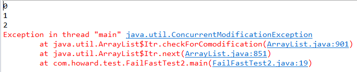
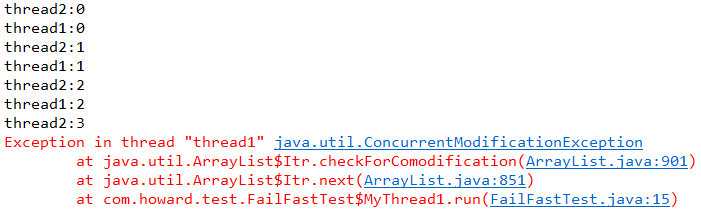

# FailFast

[TOC]

> fail-fast 机制，即快速失败机制，是java集合(Collection)中的一种错误检测机制。当在迭代集合的过程中该集合在结构上发生改变的时候，就有可能会发生fail-fast，即抛出 ConcurrentModificationException异常。fail-fast机制并不保证在不同步的修改下一定会抛出异常，它只是尽最大努力去抛出，所以这种机制一般仅用于检测bug.

## 出现场景

### 单线程

~~~java
public static void main(String[] args) {
    List<String> list = new ArrayList<>();
    for (int i = 0 ; i < 10 ; i++ ) {
        list.add(i + "");
    }
    Iterator<String> iterator = list.iterator();
    int i = 0 ;
    while(iterator.hasNext()) {
        if (i == 3) {
            list.remove(3);
        }
        System.out.println(iterator.next());
        i ++;
    }
}
~~~

在遍历过程中，刻意在某一步迭代中remove一个元素，这个时候，就会发生fail-fast。

### 多线程

~~~java
public class FailFastTest {
    public static List<String> list = new ArrayList<>();

    private static class MyThread1 extends Thread {
        @Override
        public void run() {
            Iterator<String> iterator = list.iterator();
            while(iterator.hasNext()) {
                String s = iterator.next();
                System.out.println(this.getName() + ":" + s);
                try {
                    Thread.sleep(1000);
                } catch (InterruptedException e) {
                    e.printStackTrace();
                }
            }
            super.run();
        }
    }

    private static class MyThread2 extends Thread {
        int i = 0;
        @Override
        public void run() {
            while (i < 10) {
                System.out.println("thread2:" + i);
                if (i == 2) {
                    list.remove(i);
                }
                try {
                    Thread.sleep(1000);
                } catch (InterruptedException e) {
                    e.printStackTrace();
                }
                i ++;
            }
        }
    }

    public static void main(String[] args) {
        for(int i = 0 ; i < 10;i++){
            list.add(i+"");
        }
        MyThread1 thread1 = new MyThread1();
        MyThread2 thread2 = new MyThread2();
        thread1.setName("thread1");
        thread2.setName("thread2");
        thread1.start();
        thread2.start();
    }
}
~~~

启动两个线程，分别对其中一个对list进行迭代，另一个在线程1的迭代过程中去remove一个元素，结果也是抛出了java.util.ConcurrentModificationException

## 原理

~~~java
@SuppressWarnings("unchecked")
public E next() {
    checkForComodification();
    int i = cursor;
    if (i >= size)
        throw new NoSuchElementException();
    Object[] elementData = ArrayList.this.elementData;
    if (i >= elementData.length)
        throw new ConcurrentModificationException();
    cursor = i + 1;
    return (E) elementData[lastRet = i];
}
final void checkForComodification() {
    if (modCount != expectedModCount)
        throw new ConcurrentModificationException();
}
~~~

每次调用next()方法，在实际访问元素前，都会调用checkForComodification方法

expectedModCount这个就是fail-fast判断的关键变量了，modCount用于记录集合操作过程中作的修改次数，与size还是有区别的，并不一定等于size

但是在一开始的时候，expectedModCount初始值默认等于modCount，为什么会出现modCount != expectedModCount，很明显expectedModCount在整个迭代过程除了一开始赋予初始值modCount外，并没有再发生改变，所以可能发生改变的就只有modCount，在前面关于ArrayList扩容机制的分析中，可以知道在ArrayList进行add，remove，clear等涉及到修改集合中的元素个数的操作时，modCount就会发生改变(modCount ++),所以当另一个线程(并发修改)或者同一个线程遍历过程中，调用相关方法使集合的个数发生改变，就会使modCount发生变化，这样在checkForComodification方法中就会抛出ConcurrentModificationException异常

## 避免fail-fast

### 迭代器的remove方法

~~~java
public void remove() {
    if (lastRet < 0)
        throw new IllegalStateException();
    checkForComodification();

    try {
        ArrayList.this.remove(lastRet);
        cursor = lastRet;
        lastRet = -1;
        expectedModCount = modCount;
    } catch (IndexOutOfBoundsException ex) {
        throw new ConcurrentModificationException();
    }
}
~~~

调用了集合类的remove()方法，modCount在remove()中是被重新赋值了的。expectedModCount在迭代器的remove()方法里被重新赋值ModCount保证的相等成立

### 用juc包

使用java并发包(java.util.concurrent)中的类来代替 ArrayList 和hashMap。
比如使用 CopyOnWriterArrayList代替 ArrayList， CopyOnWriterArrayList在是使用上跟 ArrayList几乎一样， CopyOnWriter是写时复制的容器(COW)，在读写时是线程安全的。该容器在对add和remove等操作时，并不是在原数组上进行修改，**而是将原数组拷贝一份，在新数组上进行修改，待完成后，才将指向旧数组的引用指向新数组**，所以对于 CopyOnWriterArrayList在迭代过程并不会发生fail-fast现象。但 CopyOnWrite容器**只能保证数据的最终一致性，不能保证数据的实时一致性。**
对于HashMap，可以使用ConcurrentHashMap， ConcurrentHashMap采用了锁机制，是线程安全的。在迭代方面，ConcurrentHashMap使用了一种不同的迭代方式。在这种迭代方式中，当iterator被创建后集合再发生改变就不再是抛出ConcurrentModificationException，取而代之的是在改变时new新的数据从而不影响原有的数据 ，iterator完成后再将头指针替换为新的数据 ，这样iterator线程可以使用原来老的数据，而写线程也可以并发的完成改变。即迭代不会发生fail-fast，但不保证获取的是最新的数据。

