# HashMap1.7详解

[TOC]

## 关于Hash

### 什么是Hash

也即散列，是**一类函数的统称**，其特点是定义域无限，值域有限，**把任意长度的输入，通过散列算法，变换成固定长度的输出，该输出就是散列值**,这种转换是一种压缩映射，也就是，散列值的空间通常小于输入的空间，不同的输入可能会散列成相同的输出，所以不可能从散列值来确定唯一的输入值。简单的说就是一种将任意长度的消息压缩到某一固定长度的消息摘要的函数。

### 数据结构

使用Hash的数据结构叫做散列表，主要是为了提高查询的效率。也有直接译作哈希表，也叫Hash表，

Hash表是一种特殊的数据结构，它同数组、链表以及二叉排序树等相比较有很明显的区别，它**能够快速定位到想要查找的记录**，而不是与表中存在的记录的关键字进行比较来进行查找。这个源于Hash表设计的特殊性，它采用了函数映射的思想将记录的存储位置与记录的关键字关联起来，从而能够很快速地进行查找。无论多大的数据量，算法复杂度总是O(1)的

### Hash碰撞

也即Hash冲突，类似于**抽屉原理**，输入空间大于输出空间，冲突是无可避免的，只能尽量减少冲突带来的损失

好的Hash算法应尽量满足

- 效率高，高效计算出hash值，也即压缩性，任意长度的数据都可以通过Hash来压缩（或扩展）到相同长度
- 抗计算原性：给定一个hash结果h,寻找原来的M来满足H(M)=h是计算困难的。（hash是一种单向的函数，这个功能很强大。例如，我们在数据库保存用户的密码并不是保存密码明文，而是保存密码明文的hash值，验证密码是否正确的时候将明文hash之后与数据库保存的hash值对比即可。这样即使数据库泄露，也不会泄露用户的密码）
- 抗碰撞性：找到两个明文M,M’ 使hash值 H(M)=H(M’)是计算困难的
- 两次输入，只要有一点不同，也得保证这个hash值是不同的
- 尽可能分散，分布均匀

#### 开放地址法

> 当关键字key的哈希地址p=H（key）出现冲突时，以p为基础，产生另一个哈希地址p1，如果p1仍然冲突，再以p为基础，产生另一个哈希地址p2，…，直到找出一个不冲突的哈希地址pi ，将相应元素存入其中。

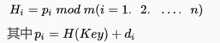

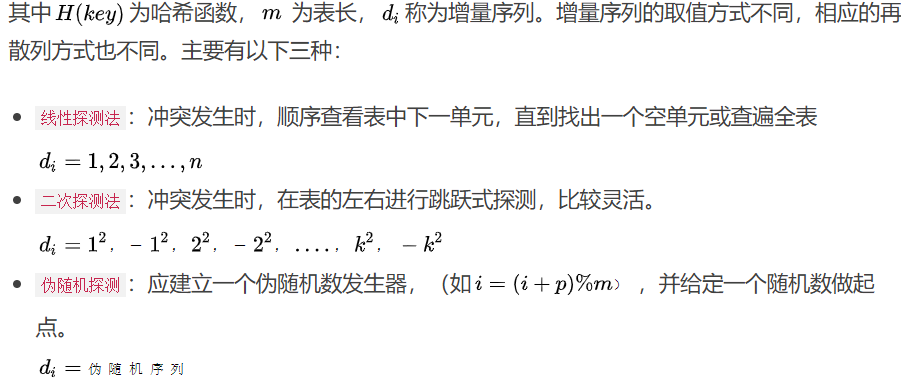

**对于利用开放地址法处理冲突所产生的哈希表中删除一个元素时需要谨慎，不能直接地删除，因为这样将会截断其他具有相同哈希地址的元素的查找地址，所以，通常采用设定一个特殊的标志以示该元素已被删除。**

#### 链地址法

也即拉链法，为每个Hash值建立一个单链表，当发生冲突时，将记录插入到链表中

> 优点：
>
> ① 拉链法处理冲突简单，且无堆积现象，即非同义词决不会发生冲突，因此平均查找长度较短；
>  ② 由于拉链法中各链表上的结点空间是动态申请的，故它更适合于造表前无法确定表长的情况；
>  ③ 开放地址法为减少冲突，要求装填因子α较小，故当结点规模较大时会浪费很多空间。而拉链法中可取α≥1，且结点较大时，拉链法中增加的指针域可忽略不计，因此节省空间；
>  ④ 在用拉链法构造的散列表中，删除结点的操作易于实现。只要简单地删去链表上相应的结点即可。而对开放地址法构造的散列表，删除结点不能简单地将被删结 点的空间置为空，否则将截断在它之后填人散列表的同义词结点的查找路径。这是因为各种开放地址法中，空地址单元(即开放地址)都是查找失败的条件。因此在 用开放地址法处理冲突的散列表上执行删除操作，只能在被删结点上做删除标记，而不能真正删除结点。

> 缺点：
>
> 指针需要额外的空间，故当结点规模较小时，开放定址法较为节省空间，而若将节省的指针空间用来扩大散列表的规模，可使装填因子变小，这又减少了开放定址法中的冲突，从而提高平均查找速度。

#### 再哈希法

又叫双哈希法，有多个不同的Hash函数，当发生冲突时，使用第二个，第三个，….，等哈希函数计算地址，直到无冲突，虽然不易发生聚集，但是增加了计算时间

#### 建立公共溢出区

将哈希表分为基本表和溢出表两部分，凡是和基本表发生冲突的元素，一律填入溢出表

## 常用API

~~~java
V get(Object key); // 获得指定键的值
V put(K key, V value);  // 添加键值对
void putAll(Map<? extends K, ? extends V> m);  // 将指定Map中的键值对 复制到 此Map中
V remove(Object key);  // 删除该键值对

boolean containsKey(Object key); // 判断是否存在该键的键值对；是 则返回true
boolean containsValue(Object value);  // 判断是否存在该值的键值对；是 则返回true

Set<K> keySet();  // 单独抽取key序列，将所有key生成一个Set
Collection<V> values();  // 单独value序列，将所有value生成一个Collection

void clear(); // 清除哈希表中的所有键值对
int size();  // 返回哈希表中所有 键值对的数量 = 数组中的键值对 + 链表中的键值对
boolean isEmpty(); // 判断HashMap是否为空；size == 0时 表示为 空 
~~~

## 1.7简介

采用拉链法解决Hash冲突，整体上看-> 数组（主）+ 单链表（副）

- 每个链表就算哈希表的桶（bucket）
- 链表的节点值就算一个键值对

HashMap中的数组元素 & 链表节点 采用的是Entry类实现

1. 一个正方形代表一个Entry对象，同时也代表一个键值对
2. 即HashMap的本质 = 1个存储Entry类对象的数组 + 多个单链表
3. Entry对象本质 = 1个映射（键-值对），属性包括：键（Key）、值（value）、下个节点（next）= 单链表指针 = 也是一个Entry对象，由于解决Hash冲突

### 初始化

~~~java
public class HashMap<K,V>
    extends AbstractMap<K,V>
    implements Map<K,V>, Cloneable, Serializable
{

    /*
    名词介绍：
    1、容量（capacity）： HashMap中数组【强调一下是数组，不是元素个数】的长度
    2、容量范围：必须是2的幂并且小于最大容量（2的30次方）
    3、初始容量 = 哈希表创建时的容量
    */

    //默认初始容量 = 哈希表创建时的容量。默认容量 = 16 = 1<<4 = 00001中的1向左移4位 = 十进制的2^4=16 初始容量为16，需要注意的是 capacity 必须保证为 2 的 n 次方。
    static final int DEFAULT_INITIAL_CAPACITY = 1 << 4; // aka 16

    // 最大容量 =  2的30次方（若传入的容量过大，将被最大值替换）
    static final int MAXIMUM_CAPACITY = 1 << 30;

    /*
    1、加载因子(Load factor)：HashMap在其容量自动增加前的一种尺度。
    2、加载因子越大、填满的元素越多 = 空间利用率高、但hash冲突的机会加大、查找效率变低（因为链表变长了）
    3、加载因子越小、填满的元素越少 = 空间利用率小、hash冲突的机会减小、查找效率高（链表不长）
    */

    // 实际加载因子
    final float loadFactor;

    // 默认加载因子 = 0.75 选择0.75是一种在时间和空间上的折中选择 
    // 如果当前哈希表中的元素个数 >= 容量 × 负载因子，就会进行扩容，否则可能就会发生严重的哈希碰撞
    static final float DEFAULT_LOAD_FACTOR = 0.75f;

    // 就是上面说的数组，hashmap用Entry数组储存k-v键值对
    transient Entry<K,V>[] table = (Entry<K,V>[]) EMPTY_TABLE;

    static final Entry<?,?>[] EMPTY_TABLE = {};

    // HashMap的大小，即HashMap中存储的键值对的数量。注意：和容量区分开，容量是数组Entry的长度
    transient int size;

    /*
    1、扩容阈值（threshold）：当哈希表的大小【就是上面的size】 ≥ 扩容阈值时，就会扩容哈希表
    （即扩充HashMap的容量） 
    2、扩容 = 对哈希表进行resize操作（即重建内部数据结构），从而哈希表将具有大约两倍的桶数
    3、扩容阈值 = 容量 x 加载因子
    4、hashmap里的元素达到阈值，就会进行扩容，每次扩容2倍
    */
    int threshold;

~~~

### 数组-Entry

~~~java
/** 
 * Entry类实现了Map.Entry接口
 * 即 实现了getKey()、getValue()、equals(Object o)和hashCode()等方法
**/  
static class Entry<K,V> implements Map.Entry<K,V> {
    final K key;  // 键
    V value;  // 值
    Entry<K,V> next; // 指向下一个节点 ，也是一个Entry对象，从而形成解决hash冲突的单链表
    int hash;  // hash值

    /** 
     * 构造方法，创建一个Entry 
     * 参数：哈希值h，键值k，值v、下一个节点n 
     */  
    Entry(int h, K k, V v, Entry<K,V> n) {  
        value = v;  
        next = n;  
        key = k;  
        hash = h;  
    }  

    // 返回 与 此项 对应的键
    public final K getKey() {  
        return key;  
    }  

    // 返回 与 此项 对应的值
    public final V getValue() {  
        return value;  
    }  

    public final V setValue(V newValue) {  
        V oldValue = value;  
        value = newValue;  
        return oldValue;  
    }  

    /** 
     * equals（）
     * 作用：判断2个Entry是否相等，必须key和value都相等，才返回true  
     */ 
    public final boolean equals(Object o) {  
        if (!(o instanceof Map.Entry))  
            return false;  
        Map.Entry e = (Map.Entry)o;  
        Object k1 = getKey();  
        Object k2 = e.getKey();  
        if (k1 == k2 || (k1 != null && k1.equals(k2))) {  
            Object v1 = getValue();  
            Object v2 = e.getValue();  
            if (v1 == v2 || (v1 != null && v1.equals(v2)))  
                return true;  
        }  
        return false;  
    }  

    /** 
     * hashCode（） 
     */ 
    public final int hashCode() { 
        return Objects.hashCode(getKey()) ^ Objects.hashCode(getValue());  
    }  

    public final String toString() {  
        return getKey() + "=" + getValue();  
    }  

    /** 
     * 当向HashMap中添加元素时，即调用put(k,v)时， 
     * 对已经在HashMap中k位置进行v的覆盖时，会调用此方法 
     * 此处没做任何处理 
     */  
    void recordAccess(HashMap<K,V> m) {  
    }  

    /** 
     * 当从HashMap中删除了一个Entry时，会调用该函数 
     * 此处没做任何处理 
     */  
    void recordRemoval(HashMap<K,V> m) {  
    } 

}
~~~

### 构造函数

~~~java

public class HashMap<K,V>
    extends AbstractMap<K,V>
    implements Map<K,V>, Cloneable, Serializable{

    // 省略上节阐述的参数

    /*
      构造函数1：默认构造函数（无参）
      加载因子和容量为默认，分别是0.75和16
     */
    public HashMap() {
        /*
         实际上是调用构造函数3：指定"容量大小"和"加载因子"的构造函数
         传入的指定容量和加载因子均为默认
        */
        this(DEFAULT_INITIAL_CAPACITY, DEFAULT_LOAD_FACTOR); 
    }

    /*
      构造函数2：指定"容量大小"的构造函数
      加载因子是默认的0.75 、容量为指定大小
     */
    public HashMap(int initialCapacity) {
        // 实际上是调用的也是构造函数3，只是在传入的加载因子参数为默认加载因子
        this(initialCapacity, DEFAULT_LOAD_FACTOR);

    }

    /*
      构造函数3：指定“容量大小”和“加载因子”的构造函数
      加载因子和容量都是程序员自己指定
     */
    public HashMap(int initialCapacity, float loadFactor) {
        
        // 如果传入的初始化容量小于0，则抛出异常
        if (initialCapacity < 0)
            throw new IllegalArgumentException("Illegal initial capacity: " + initialCapacity);

        // HashMap的最大容量只能是MAXIMUM_CAPACITY，哪怕传入的 > 最大容量
        if (initialCapacity > MAXIMUM_CAPACITY)
            initialCapacity = MAXIMUM_CAPACITY;
        
        // 如果负载因子小于0，或者是非法的浮点数，抛出异常
        if (loadFactor <= 0 || Float.isNaN(loadFactor))
            throw new IllegalArgumentException("Illegal load factor: " + loadFactor);

        // 设置加载因子
        this.loadFactor = loadFactor;

        /*
        设置扩容阈值 = 初始容量
        1、注意：此处不是真正的阈值，仅是为了接收参数初始容量大小（capacity）、加载因子(Load factor)，
        并没有真正初始化哈希表，即初始化存储数组table
        2、真正初始化哈希表（初始化存储数组table）是在第1次添加键值对时，即第1次调用put()时，下面会详细说明。
        */
        threshold = initialCapacity;   

        init(); // 一个空方法用于未来的子对象扩展，在向哈希表添加元素之前，不会真正地创建哈希表（以免占用过多的内存）
    }

    /*
      构造函数4：包含“子Map”的构造函数
      即构造出来的HashMap包含传入Map参数
      加载因子和容量均为默认
     */
    public HashMap(Map<? extends K, ? extends V> m) {

        // 设置容量大小和加载因子为默认值
        this(Math.max((int) (m.size() / DEFAULT_LOAD_FACTOR) + 1,
                      DEFAULT_INITIAL_CAPACITY), DEFAULT_LOAD_FACTOR);

        // 该方法用于初始化数组和阈值
        inflateTable(threshold);

        // 将传入的子Map中的全部元素逐个添加到HashMap中
        putAllForCreate(m);
    }
}

~~~

## put源码

### put

~~~java
// 空集合，用于判断表是否为空。Entry为hashMap的静态内部类
static final Entry<?,?>[] EMPTY_TABLE = {};

public V put(K key, V value) {

    /*  ①
    	1、若哈希表未初始化（即 table为空)，则调用inflateTable方法，使用构造函数时设置的阈值(即初始容量)初始化数组table 
    	2、当第一次往里放元素时才真正地申请空间
    	*/
    if (table == EMPTY_TABLE) {
        // 等到真正向哈希表中添加元素时，才开辟内存空间
        inflateTable(threshold);
    }
    /*  ②
    	1、判断key是否为空值null
		2、若key == null，则调用putForNullKey方法，putForNullKey方法最终将该键-值存放到数组
		table中的第1个位置，即table[0]。本质：key = Null时，hash值 = 0，故存放到table[0]中）
		该位置永远只有1个value，新传进来的value会覆盖旧的value
		3、k != null往下走
    	*/
    if (key == null)
        return putForNullKey(value);
    // 下面就是k != null的情况

    // 计算key的hash值
    int hash = hash(key);
    
    // 根据hash值最终获得key对应存放的数组Table中位置(也就是数组下标)
    // 这里也就是计算索引值，大小为0到table.length - 1
    // 根据哈希值来判断插入元素应该放在哪个桶中
    // 该方法决定了为什么哈希表的容量是2的幂
    int i = indexFor(hash, table.length);

    /*  ③
    	1、通过遍历以该数组元素为头结点的链表，逐个判断是否发生hash冲突，同时判断该key对应的值是否已存在
    	*/
    for (Entry<K,V> e = table[i]; e != null; e = e.next) {
        Object k;
          /* ④
            1、如果发生了hash冲突，且key也相等。则用新value替换旧value(此时说明发生了更新的情况)，
            注意这里强调的是发生了hash冲突并且key也相等。
            */
        if (e.hash == hash && ((k = e.key) == key || key.equals(k))) {
            V oldValue = e.value;
            e.value = value;
            e.recordAccess(this);
            return oldValue;
        }
    }
    // 修改次数+1
    modCount++;
    /* ⑤
    	1、走到这一步有两种情况
    	  1-1、没有发生hash冲突
    	  1-2、发生了hash冲突，但是没有在链表中找到key一样的键
    	2、接着准备采用头插法，插入链表的头部(也就是数组里面)
    	*/
    addEntry(hash, key, value, i);
    return null;
}
~~~

### inflateTable

> 为数组申请空间，扩容方法

~~~java
private void inflateTable(int toSize) {
    /*
	将传入的容量大小转化为：>传入容量大小的最小的2的次幂，即如果传入的是容量大小是18，那么转化后，
	初始化容量大小为32（即2的5次幂）
	让容量向上舍入变为2的幂。比如toSize = 10 就会变为 16。
	*/	
    int capacity = roundUpToPowerOf2(toSize);

    // 重新计算阈值 threshold = 容量 * 加载因子  
    // 向上取整后的容量×负载因子 或 最大容量+1，取其中的较小值
    // 该变量在第一次放入操作时不会用到
    threshold = (int) Math.min(capacity * loadFactor, MAXIMUM_CAPACITY + 1);
    
    /*
    使用计算后的初始容量（已经是2的次幂） 初始化数组table（作为数组长度）即 哈希表的容量大小 = 数组大小（长度）
    */
    table = new Entry[capacity];
    // initHashSeedAsNeeded方法判断是否需要rehash
    // 创建了一个哈希种子，重构String的hash算法，在后面的潜在安全漏洞会谈到
    initHashSeedAsNeeded(capacity);
}
~~~

### roundUpToPowerOf2

> 每次最接近number的数，而且是2的幂次方的数。如number=8就返回8，number=9就返回15

~~~java
private static int roundUpToPowerOf2(int number) {
    // 若容量超过了最大值，初始化容量设置为最大值 ；否则，设置为>传入容量大小的最小的2的次幂。如果容量大于最大容量，就返回最大容量。否则调用Integer.highestOneBit()方法让其向上舍入为2的幂
    return number >= MAXIMUM_CAPACITY
        ? MAXIMUM_CAPACITY
        : (number > 1) ? Integer.highestOneBit((number - 1) << 1) : 1;
}
~~~

### putForNullKey

> 如果已经存在null键则更新其value，否则将null键添加到数组中
>
> 当 key ==null时，将该 key-value 的存储位置规定为数组table 中的第1个位置，即table [0]

~~~java
private V putForNullKey(V value) {

    /*
	1、遍历以table[0]为首的链表，寻找是否存在key==null对应的键值对
	   1-1、若有：则用新value替换旧value；同时返回旧的value值。
	*/
    for (Entry<K,V> e = table[0]; e != null; e = e.next) {
        if (e.key == null) {
            V oldValue = e.value;
            e.value = value;
            e.recordAccess(this);
            return oldValue;
        }
    }
    modCount++;

    /*
    1、若无key==null的键，那么调用addEntry（），将空键和对应的值封装到Entry中，并放到table[0]中
    2、能走到这里的情况就是table[0]位置之前没有元素，这一次是第一次添加key为null的元素
    3、k == null已经是固定放在了table[0]的位置，不会有链表存在，只会有一个元素。
    */
    addEntry(0, null, value, 0);
    return null;
}
~~~

从此处可以看出：

- `HashMap`的键`key` 可为`null`（区别于 `HashTable`的`key` 不可为`null`）
- `HashMap`的键`key` 可为`null`且只能为1个，但值`value`可为null且为多个

### hash

> 1.7 & 1.8 改动比较大，1.8已不再使用该方法

将hashcode的高位和低位混合求hash值，减少冲突

~~~java
/**
   * 1、该函数在JDK7和8中的实现不同，但原理一样 = 扰动函数 = 使得根据key生成的
   * 哈希码（hash值）分布更加均匀、更具备随机性，避免出现hash值冲突（即指不同key但生成同1个hash值）
   * 2、JDK 1.7 做了9次扰动处理 = 4次位运算 + 5次异或运算
   * 3、JDK 1.8 简化了扰动函数 = 只做了2次扰动 = 1次位运算 + 1次异或运算
   */
final int hash(Object k) {
    int h = hashSeed;
    // 如果哈希种子存在，并且进行哈希的元素的String类型
    if (0 != h && k instanceof String) {
        return sun.misc.Hashing.stringHash32((String) k);
    }

    h ^= k.hashCode();
    // 4次位运算 + 5次异或运算
    h ^= (h >>> 20) ^ (h >>> 12);
    return h ^ (h >>> 7) ^ (h >>> 4);
}
~~~

### indexFor

> hash & (length -1)可以将所有hash值映射到0到length-1范围内，这也解释了为什么hashmap的容量必须是2的倍数。

~~~java
// 这里h & (length-1)的意思就是hash值与数组长度取模。只是因为数组长度是特殊的2的幂
// 所以这个等价关系刚好成立
static int indexFor(int h, int length) {
    // assert Integer.bitCount(length) == 1 : "length must be a non-zero power of 2";
    // 将传入的哈希值与其长度-1进行按位与操作，并返回其结果
    return h & (length-1);
}
~~~

### addEntry

~~~java
//作用：添加键值对（Entry）到HashMap中。参数3:插入数组table的索引位置,也就是数组下标
//注意：JDK7是先扩容再插入
void addEntry(int hash, K key, V value, int bucketIndex) {
    /*
	1、插入前，先判断容量是否足够
     1.1、若不足够，则进行扩容（2倍）、重新计算Hash值、重新计算存储数组下标
	*/
    // 如果哈希表中的元素个数超过了阈值，并且该元素应该放入的桶中已经有了元素
    if ((size >= threshold) && (null != table[bucketIndex])) {
        // 进行扩容，扩容大小为原大小的2倍，以保证扩容后容量仍为2的幂
        resize(2 * table.length);
        // 重新hash值
        hash = (null != key) ? hash(key) : 0;
        // 重新计算索引位置
        bucketIndex = indexFor(hash, table.length);
    }
    // 1.2、若容量足够，则创建1个新的数组元素（Entry） 并放入到数组中
    // 采用头插法将其放在对应的桶中
    createEntry(hash, key, value, bucketIndex);
}
~~~

## 扩容

> 接着上面的addEntry()

### resize

> 执行扩容操作，会判断是否需要rehash，其目的是降低因元素增多带来的hash膨胀问题，因为冲突过高，数组会退化为链表，查询速度大大降低

~~~java
  /**
   * 作用：当大小不足时（size > 阈值，注意是size，不是容量），则扩容（扩到2倍）
   */ 
	void resize(int newCapacity) {  

    // 1、保存旧数组（old table） 
    Entry[] oldTable = table;  

    // 2、保存旧容量（old capacity ），即数组长度
    int oldCapacity = oldTable.length; 

    // 3、若旧容量已经是系统默认最大容量了，那么将阈值设置成整型的最大值，返回   
    if (oldCapacity == MAXIMUM_CAPACITY) {  
        threshold = Integer.MAX_VALUE;  
        return;  
    }  

    // 4、根据新容量（2倍容量）新建1个数组，即newTable 
    Entry[] newTable = new Entry[newCapacity];  

    // 5、将旧数组上的数据（键值对）转移到新table中，从而完成扩容
    transfer(newTable, initHashSeedAsNeeded(newCapacity));

    // 6、新数组table引用到HashMap的table属性上
    table = newTable;

    // 7、重新设置阈值 
    threshold = (int)Math.min(newCapacity * loadFactor, MAXIMUM_CAPACITY + 1);
} 
~~~

### initHashSeedAsNeeded

> initHashSeedAsNeeded方法判断是否需要rehash

~~~java
final boolean initHashSeedAsNeeded(int capacity) {
    // hashSeed降低hash碰撞的hash种子，初始值为0，因此currentAltHashinghashSeed默认是false
    boolean currentAltHashing = hashSeed != 0;
    // ALTERNATIVE_HASHING_THRESHOLD： 当map的capacity容量大于这个值的时候并满足其他条件时候进行重新hash
    boolean useAltHashing = sun.misc.VM.isBooted() && (capacity >= Holder.ALTERNATIVE_HASHING_THRESHOLD);
    // 异或操作，二者满足一个条件即可rehash
    boolean switching = currentAltHashing ^ useAltHashing;
    if (switching) {
        // 更新hashseed的值
        hashSeed = useAltHashing ? sun.misc.Hashing.randomHashSeed(this) : 0;
    }
    return switching;
}
~~~

~~~java
/*
ALTERNATIVE_HASHING_THRESHOLD = threshold;
threshold = (null != altThreshold)? Integer.parseInt(altThreshold): ALTERNATIVE_HASHING_THRESHOLD_DEFAULT;
因此threshold又取决于altThreshold和ALTERNATIVE_HASHING_THRESHOLD_DEFAULT，
前者altThreshold = java.security.AccessController.doPrivileged(
                new sun.security.action.GetPropertyAction(
                    "jdk.map.althashing.threshold"));可以理解为你可以配置虚拟机参数如-D jdk.map.althashing.threshold=3，不配置就为null
后者ALTERNATIVE_HASHING_THRESHOLD_DEFAULT = Integer.MAX_VALUE;整数最大值
因此不配置altThreshold的时候，threshold为Integer.MAX_VALUE;整数最大值，这个时候ALTERNATIVE_HASHING_THRESHOLD=Integer.MAX_VALUE;整数最大值，再回到上面(capacity >= Holder.ALTERNATIVE_HASHING_THRESHOLD);一定为false， boolean switching = currentAltHashing ^ useAltHashing;中的useAltHashing为false,currentAltHashing默认为false,switching就为false,就不会初始化hashseed，也不会重新计算hash。

如果配置altThreshold的时候，ALTERNATIVE_HASHING_THRESHOLD=threshold=配置的值，(capacity >= Holder.ALTERNATIVE_HASHING_THRESHOLD)如果成立，就为true,boolean switching = currentAltHashing ^ useAltHashing;中的useAltHashing为true,currentAltHashing默认为false,switching就为true,就会初始化hashseed，也会重新计算hash。

本质是什么呢，其实就是看你是否想要初始化hashseed，默认为零的，如果你要初始化hashseed,就要设置虚拟机参数，然后rehash才会有可能发生。
rehash的好处是什么呢，在扩容转移数据的时候，rehash后，重新计算的索引值就会变化概率更大，链表就有可能拆散分到数组上去，这样就加强了查询的效率。

*/
private static class Holder {

    /**
         * Table capacity above which to switch to use alternative hashing.
         */
    static final int ALTERNATIVE_HASHING_THRESHOLD;

    static {
        String altThreshold = java.security.AccessController.doPrivileged(
            new sun.security.action.GetPropertyAction(
                "jdk.map.althashing.threshold"));

        int threshold;
        try {
            threshold = (null != altThreshold)
                ? Integer.parseInt(altThreshold)
                : ALTERNATIVE_HASHING_THRESHOLD_DEFAULT;

            // disable alternative hashing if -1
            if (threshold == -1) {
                threshold = Integer.MAX_VALUE;
            }

            if (threshold < 0) {
                throw new IllegalArgumentException("value must be positive integer.");
            }
        } catch(IllegalArgumentException failed) {
            throw new Error("Illegal value for 'jdk.map.althashing.threshold'", failed);
        }

        ALTERNATIVE_HASHING_THRESHOLD = threshold;
    }
}
~~~

### transfer

> 扩容方法（头插法）
>
> 将原始table中元素复制到newTable
>
> 如果多线程并发扩容时会形成循环链表，线程A执行完`Entry<K,V> next = e.next;`，如果让给线程B执行，线程B执行完扩容后，线程A还会继续扩容，这种情况下就会形成循环链表。采用尾插法可以解决这个问题，所以jdk1.8就采用尾插法了。

~~~java
/**
   * 作用：将旧数组上的数据（键值对）转移到新table中，从而完成扩容
   * 过程：按旧链表的正序遍历链表、在新链表的头部依次插入。但是这样会导致扩容完成后，链表逆序
   */ 	
void transfer(Entry[] newTable, boolean rehash) {
    int newCapacity = newTable.length;
    // 通过遍历 旧数组，将旧数组上的数据（键值对）转移到新数组中
    // 复制是从老表的头部开始
    for (Entry<K,V> e : table) {
        while(null != e) {
            /*
                 1、遍历以该数组元素为首的链表
                 2、转移链表时，因是单链表，故要保存下1个结点，否则转移后链表会断开
                 */
            Entry<K,V> next = e.next;
            // 如果需要重新hash就重新hash
            if (rehash) {
                e.hash = null == e.key ? 0 : hash(e.key);
            }
            // 重新计算每个元素的存储位置
            int i = indexFor(e.hash, newCapacity);

            // 头插法
            e.next = newTable[i];
            // 将当前元素，赋给新数组的对应下标位置。
            newTable[i] = e;
            // 访问下1个Entry链上的元素，如此不断循环，直到遍历完该链表上的所有节点
            e = next;
        }
    }
}
~~~

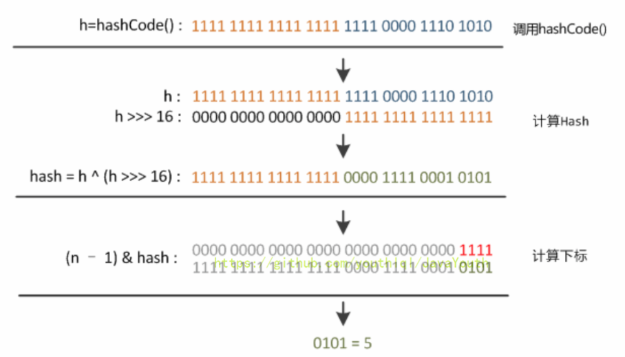

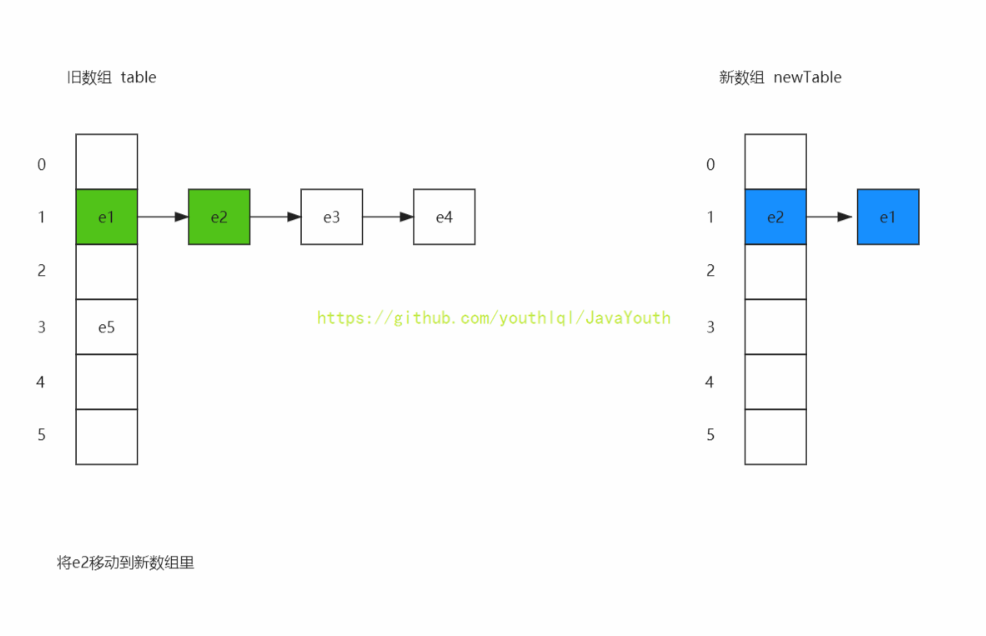

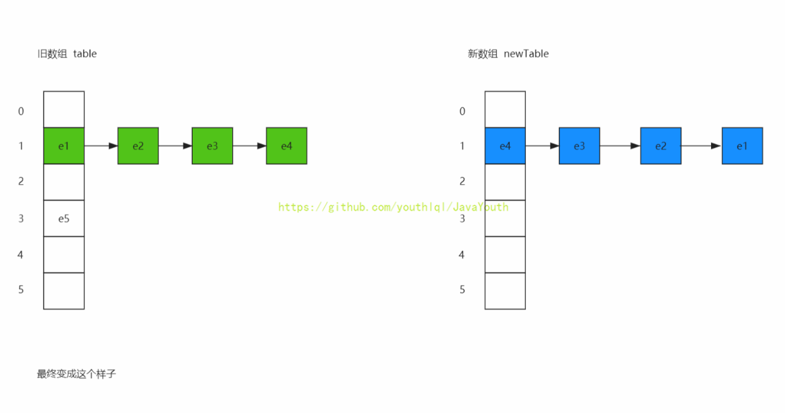

1、在扩容`resize（）`过程中，在将旧数组上的数据转移到新数组上时，转移操作就是按旧链表的正序遍历链表、在新链表的头部依次插入，即在转移数据、扩容后，容易出现链表逆序的情况。

2、设重新计算存储位置后不变，即扩容前 1->2->3，扩容后 = 3->2->1

3、此时若（多线程）并发执行 put（）操作，一旦出现扩容情况，则 **容易出现环形链表**，从而在获取数据、遍历链表时形成死循环（Infinite Loop），即**线程不安全**。

### createEntry

> 如果没有超过阈值，则直接存入table

~~~java
void createEntry(int hash, K key, V value, int bucketIndex) {
    Entry<K,V> e = table[bucketIndex];
    // 将新节点放在桶的第一个位置，也就是采用头插法进行插入
    table[bucketIndex] = new Entry<>(hash, key, value, e);
    size++; //这里才进行size++
}
~~~

举个例子说明流程：

1、假设hashmap中容量为16，加载因为为0.75 = 12。

2、此时hashmap中有11个元素，也就是size == 11，在你添加第12个元素时。看代码，此时size还是11，所以并不会扩容。只有在你调用完`createEntry()`,`size++`执行完毕后，size变成12。

3、在添加第13个元素时，才会进入if逻辑里进行先扩容。

~~~java
void addEntry(int hash, K key, V value, int bucketIndex) {

    if ((size >= threshold) && (null != table[bucketIndex])) {
        resize(2 * table.length);
        hash = (null != key) ? hash(key) : 0;
        bucketIndex = indexFor(hash, table.length);
    }
    createEntry(hash, key, value, bucketIndex);
}
~~~

## get源码

~~~java
public V get(Object key) {  

    // 当key==null时，则到table[0]为头结点的链表去寻找对应 key == null的键
    if (key == null)  
        return getForNullKey(); 

    // 当key ≠ null时，去获得对应值 
    Entry<K,V> entry = getEntry(key);

    return null == entry ? null : entry.getValue();  
}  

// key = null映射为索引0，查找table[0]中有没有key=null的结点
private V getForNullKey() {  

    if (size == 0) {  
        return null;  
    }  

    // 遍历以table[0]为头结点的链表，寻找 key==null 对应的值
    for (Entry<K,V> e = table[0]; e != null; e = e.next) {  

        // 从table[0]中取key==null的value值 
        if (e.key == null)  
            return e.value; 
    }  
    return null;  
}  

final Entry<K,V> getEntry(Object key) {  

    if (size == 0) {  
        return null;  
    }  

    // 根据key值，通过hash（）计算出对应的hash值
    int hash = (key == null) ? 0 : hash(key);  

    // 根据hash值计算出对应的数组下标,遍历以该数组下标的数组元素为头结点的链表所有节点，
    // 寻找该key对应的值
    // 先找到在那个table[i]，然后遍历链表找到这个key
    for (Entry<K,V> e = table[indexFor(hash, table.length)];  e != null;  e = e.next) {  

        Object k;  
        // 若 hash值和key 相等，则证明该Entry = 我们要的键值对
        if (e.hash == hash &&  
            ((k = e.key) == key || (key != null && key.equals(k))))  
            return e;  
    }  
    return null;  
}  
~~~

## 死循环问题

### 前置条件

为了演示方便，初始状态时，hashmap容量为2，加载因子为默认的0.75.

### 步骤1

**hashmap初始状态**

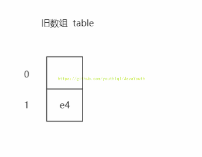

1、此时只有一个元素，扩容阈值为2*0.75 = 1.5。

2、此时假设有两个线程，线程a和线程b**同时put**，并且都没有进入到addEntry()方法里的if逻辑【因为此时size都没有++，size == 1 < 1.5 所以if判断不成立。】。两个线程都准备**同时调用createEntry()方法**。

~~~java
void addEntry(int hash, K key, V value, int bucketIndex) {

    if ((size >= threshold) && (null != table[bucketIndex])) {
        resize(2 * table.length);
        hash = (null != key) ? hash(key) : 0;
        bucketIndex = indexFor(hash, table.length);
    }
    createEntry(hash, key, value, bucketIndex);
}
~~~

3、线程a put的是 e3 = <k3,v3>。线程b put的是e2 = <k2,v2>。两个都调用了`createEntry()`方法。

### 步骤2

**两个线程调用完毕之后，hashmap目前是这样的。**

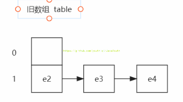

此时size==3。下次再进行put的时候，**addEntry()方法里的if判断就会成立**

### 步骤3

1、接着，又来了两个线程，线程1和线程2。【假设线程1put的是e1，线程2put的是e0。其实也不用管它们两put的是谁】

2、两个线程**都同时调用resize()方法**，新数组已经扩容完毕，准备转移旧数组上的数据到新数组里。也就是准备调用resize()里的下面这个方法。

~~~java
// 5、将旧数组上的数据（键值对）转移到新table中，从而完成扩容
transfer(newTable, initHashSeedAsNeeded(newCapacity));
~~~

3、来看下此时内存里的状态

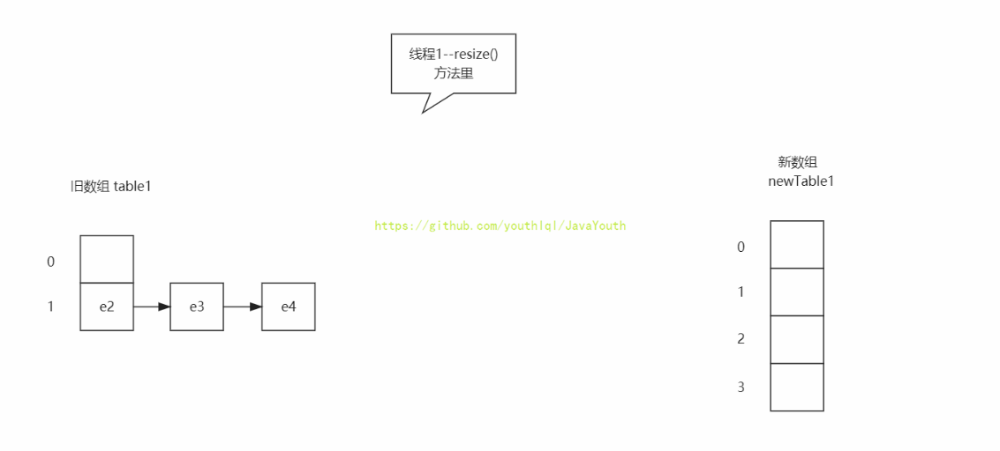

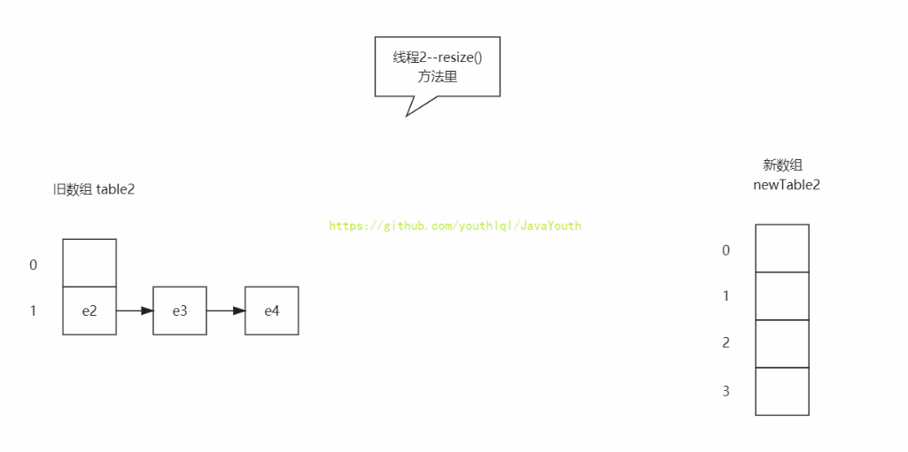

### 步骤4

~~~java
void transfer(Entry[] newTable, boolean rehash) {
    int newCapacity = newTable.length;

    for (Entry<K,V> e : table) {
        while(null != e) {
            // pos_1
            Entry<K,V> next = e.next;
            if (rehash) {
                e.hash = null == e.key ? 0 : hash(e.key);
            }
            int i = indexFor(e.hash, newCapacity);   
            // pos_2
            e.next = newTable[i];
            // pos_3
            newTable[i] = e;
            // pos_4
            e = next;
        }
    }
}
~~~

1、假设线程1**执行完**代码pos_1位置后，暂时挂起。此时e == e2  e.next == e3

2、线程2直接**扩容完毕**，那么完成后的状态是这样【假设e2和e3还是hash到同一个位置】

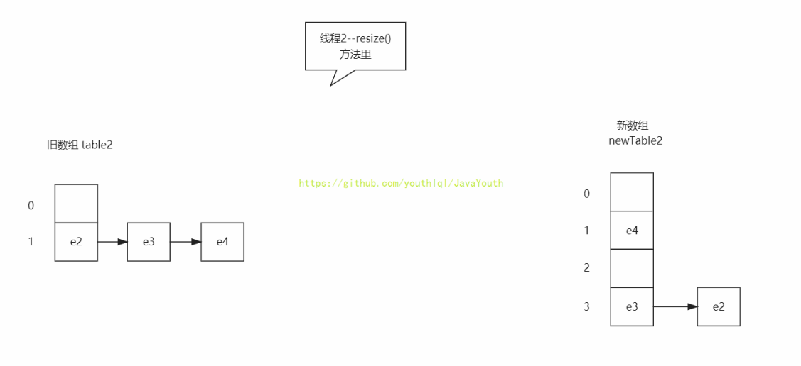

3、线程1还是原来的状态

**强调一点：线程2已经扩容完毕**

### 步骤5

目前两个线程里的新数组是这样的

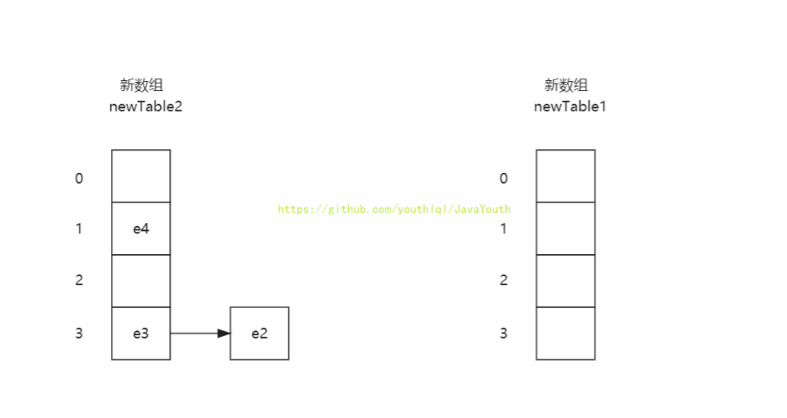

为了方便后面观看

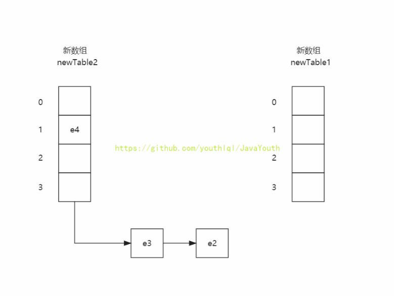

### 步骤6

~~~java
void transfer(Entry[] newTable, boolean rehash) {
    int newCapacity = newTable.length;
    for (Entry<K,V> e : table) {
        while(null != e) {
            //pos_1
            Entry<K,V> next = e.next;
            if (rehash) {
                e.hash = null == e.key ? 0 : hash(e.key);
            }
            int i = indexFor(e.hash, newCapacity);   
            //pos_2
            e.next = newTable[i];
            //pos_3
            newTable[i] = e;
            //pos_4
            e = next;
        }
    }
}
~~~

> 之前说过：假设线程1**执行完**代码pos_1位置后，暂时挂起。此时e == e2 e.next == e3【也就是next == e3】

1、线程1唤醒后，继续执行pos_2，pos_3，pos_4

2、执行pos_2：意思是e2的next指针指向了线程1的新hash表【也就是newTable1】，因为newTable1是新的所以为null，

所以e2.next = null。

3、执行pos_3：newTable1[3] = e2;

4、执行pos_4： e = e3;

也就变成了下面这个样子。

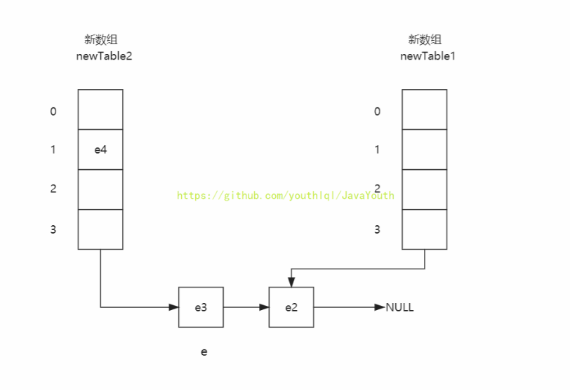

### 步骤7

1、线程1继续执行循环

> 注意之前强调过线程2已经扩容完毕，那么table就已经被指向了newTable2，也就是说第二次循环时，线程1所循环的table变量就是newTable2

~~~java
void transfer(Entry[] newTable, boolean rehash) {
    int newCapacity = newTable.length;
    for (Entry<K,V> e : table) {
        while(null != e) {
            //pos_1
            Entry<K,V> next = e.next;
            if (rehash) {
                e.hash = null == e.key ? 0 : hash(e.key);
            }
            int i = indexFor(e.hash, newCapacity);   
            //pos_2
            e.next = newTable[i];
            //pos_3
            newTable[i] = e;
            //pos_4
            e = next;
        }
    }
}
~~~

1、执行pos_1：此时e == e3，那么next就是 e3.next，此时next == e2；

2、执行pos_2：经过第一轮循环，newTable1[3] == e2。那么执行完这行代码后，e3.next还是等于e2【相当于没执行】

3、执行pos_3：newTable1[3] == e3。

4、执行pos_4：e = e2

执行完，变成这样

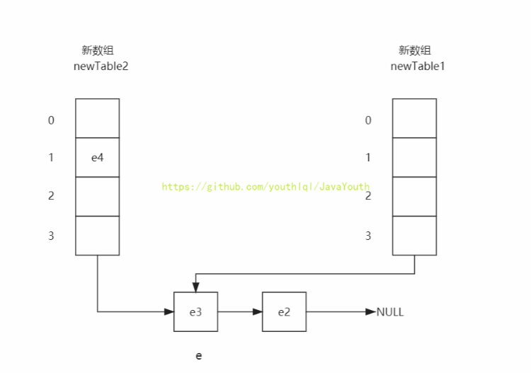

### 步骤8

线程1执行第三次循环

1、执行pos_1：next = e2.next得到 next == null。

2、执行pos_2： `e.next = newTable[i]` e2.next == newTable1[3]。也就是相当于 e2.next == e3

3、执行pos_3： newTable[i] = e得到 newTable1[3] == e2

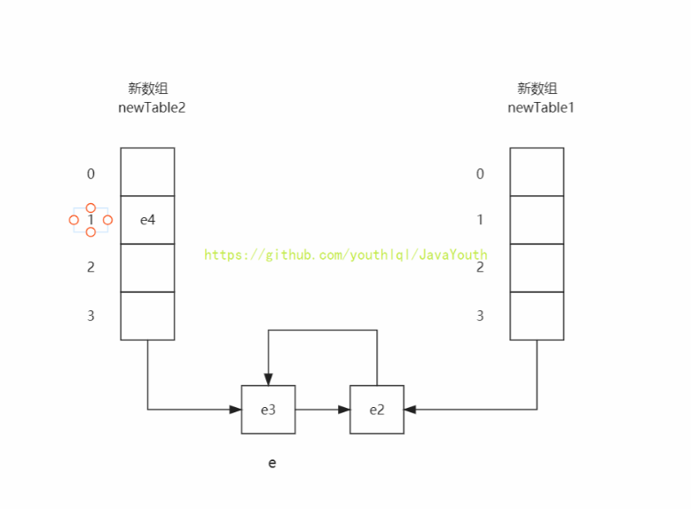

**这样就形成了循环链表，再get()数据就会陷入死循环。**

