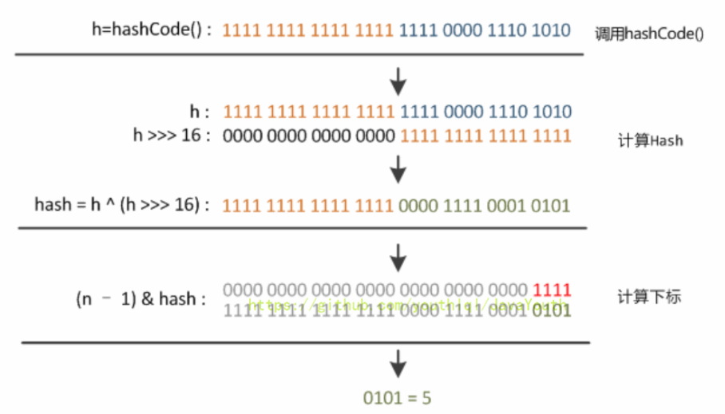

# HashMap1.8

[TOC]

**注意一点，因为原子操作+原子操作 != 原子操作，所以即便全同步的HashMap，也即所有方法都加了synchronized，也无法保证完全安全**

## 数据结构

HashMap：它根据键的hashCode值存储数据，大多数情况下可以直接定位到它的值，因而具有很快的访问速度，但遍历顺序却是不确定的。 HashMap**最多只允许一条记录的键为null，允许多条记录的值为null**。HashMap非线程安全，即任一时刻可以有多个线程同时写HashMap，可能会导致数据的不一致。如果需要满足线程安全，可以用 Collections的synchronizedMap方法使HashMap具有线程安全的能力，或者使用ConcurrentHashMap。

默认的初始容量是16 默认的负载因子0.75 

当桶上的结点数大于等于8会转成红黑树 

当桶上的结点数小于6红黑树转链表

 Node<k,v>[] table //存储元素的哈希桶数组，总是2的幂次倍

### 红黑树

一种**二叉查找树**，但在每个节点增加一个存储位表示节点的颜色，可以是红或黑（**非红即黑**）。通过对任何一条从根到叶子的路径上各个节点着色的方式的限制，红黑树确保**没有一条路径会比其它路径长出两倍**，因此，红黑树是一种**弱平衡二叉树**（由于是弱平衡，可以看到，**在相同的节点情况下，AVL树的高度低于红黑树）**，相对于要求严格的AVL树来说，它的旋转次数少，所以**对于搜索，插入，删除操作较多的情况下，我们就用红黑树**

#### 性质

- 每个节点非红即黑
- 根节点（root）是黑的
- **不能有两个红色的节点连在一起**（黑色可以）
- 每个叶节点（叶节点即树尾端NULL指针或NULL节点）都是黑的
- 如果一个节点是红的，那么它的两儿子都是黑的
- 对于任意节点而言，其到叶子点树NULL指针的每条路径都包含相同数目的黑节点
- 每条路径**都包含相同的黑节点**

1.8中，HashMap在引入红黑树之后的数据结构 -> 数组 + 链表 + 红黑树 

### Node类

1.8中的HashMap数组元素、链表节点均采用Node类实现，与1.7的对比（Entry类），

仅仅是换了名字

### 初始化

~~~java
/** 
  * Node  = HashMap的内部类，实现了Map.Entry接口，本质是 = 一个映射(键值对)
  * 实现了getKey()、getValue()、equals(Object o)和hashCode()等方法
  **/  
static class Node<K,V> implements Map.Entry<K,V> {

    final int hash; 
    final K key; 
    V value; 
    Node<K,V> next;

    // 构造方法
    Node(int hash, K key, V value, Node<K,V> next) {
        this.hash = hash;
        this.key = key;
        this.value = value;
        this.next = next;
    }

    public final K getKey()        { return key; }  
    public final V getValue()      { return value; } 
    public final String toString() { return key + "=" + value; }

    public final V setValue(V newValue) {
        V oldValue = value;
        value = newValue;
        return oldValue;
    }

    public final int hashCode() {
        return Objects.hashCode(key) ^ Objects.hashCode(value);
    }

    public final boolean equals(Object o) {
        if (o == this)
            return true;
        if (o instanceof Map.Entry) {
            Map.Entry<?,?> e = (Map.Entry<?,?>)o;
            if (Objects.equals(key, e.getKey()) &&
                Objects.equals(value, e.getValue()))
                return true;
        }
        return false;
    }
}
~~~

### TreeNode

~~~java
static final class TreeNode<K,V> extends LinkedHashMap.Entry<K,V> {  

    // 属性 = 父节点、左子树、右子树、删除辅助节点 + 颜色
    TreeNode<K,V> parent;  
    TreeNode<K,V> left;   
    TreeNode<K,V> right;
    TreeNode<K,V> prev;   
    boolean red;   

    // 构造函数
    TreeNode(int hash, K key, V val, Node<K,V> next) {  
        super(hash, key, val, next);  
    }  

    // 返回当前节点的根节点  
    final TreeNode<K,V> root() {  
        for (TreeNode<K,V> r = this, p;;) {  
            if ((p = r.parent) == null)  
                return r;  
            r = p;  
        }  
    } 
~~~

### 参数

~~~java
  // 默认容量
  static final int DEFAULT_INITIAL_CAPACITY = 1 << 4; 
  
  // 最大容量
  static final int MAXIMUM_CAPACITY = 1 << 30; 

  final float loadFactor; 
 
  // 装载因子
  static final float DEFAULT_LOAD_FACTOR = 0.75f; 

  // 阈值就是容量*装载因子
  int threshold;

  // 存储数据的Node类型 数组，长度 = 2的幂；
  transient Node<K,V>[] table;  
  transient int size;
  
  // 与红黑树相关的参数
  
  /*
  1、单链表(桶)的树化阈值：即 链表转成红黑树的阈值，在存储数据时，当链表长度 > 该值时，则将链表转换成红黑树，当桶中结点达到8时，将转为红黑树
  */
  static final int TREEIFY_THRESHOLD = 8; 

/*
  1、桶的链表还原阈值：即 红黑树转为链表的阈值，当在扩容（resize（））时（此时HashMap的数据存储位置会重新计算），在重新计算存储位置后，当原有的红黑树内节点数量 < 6时，则将红黑树转换成链表
*/
  static final int UNTREEIFY_THRESHOLD = 6;

  /*
  1、最小树形化容量阈值：即 当哈希表中的容量 > 该值时，才允许树形化链表 （即 将链表 转换成 红黑树）桶树化，哈希表最小的容量
  否则，若 （单链表）桶内元素太多时，则直接扩容，而不是树形化。
  2、为了避免进行扩容、树形化选择的冲突，这个值不能小于 4 * TREEIFY_THRESHOLD
  */
  static final int MIN_TREEIFY_CAPACITY = 64;
~~~

## 构造函数

~~~java
public class HashMap<K,V>
    extends AbstractMap<K,V>
    implements Map<K,V>, Cloneable, Serializable{

    public HashMap() {
        this.loadFactor = DEFAULT_LOAD_FACTOR;
    }

    public HashMap(int initialCapacity) {
        this(initialCapacity, DEFAULT_LOAD_FACTOR);

    }

    /**
     * 构造函数3：指定"容量大小"和"加载因子"的构造函数
     * 加载因子和容量由自己指定
     */
    public HashMap(int initialCapacity, float loadFactor) {

        // 指定初始容量必须非负，否则报错  
        if (initialCapacity < 0)  
            throw new IllegalArgumentException("Illegal initial capacity: " +  
                                               initialCapacity); 

        // HashMap的最大容量只能是MAXIMUM_CAPACITY，哪怕传入的 > 最大容量
        if (initialCapacity > MAXIMUM_CAPACITY)
            initialCapacity = MAXIMUM_CAPACITY;

        // 填充比必须为正  
        if (loadFactor <= 0 || Float.isNaN(loadFactor))  
            throw new IllegalArgumentException("Illegal load factor: " +  
                                               loadFactor);  
        // 设置加载因子
        this.loadFactor = loadFactor;

        /*
        1、设置扩容阈值
        2、此处不是真正的阈值，仅仅只是将传入的容量大小转化为：>传入容量大小的最小的2的幂，该阈值后面会重新计算
        */
        this.threshold = tableSizeFor(initialCapacity); 

    }

    public HashMap(Map<? extends K, ? extends V> m) {
        this.loadFactor = DEFAULT_LOAD_FACTOR; 

        // 将传入的子Map中的全部元素逐个添加到HashMap中
        putMapEntries(m, false); 
    }
}

~~~

### tableSizeFor

~~~java
  /**
     * 作用：将传入的容量大小转化为：>传入容量大小的最小的2的幂
     * 与JDK 1.7对比：类似于JDK 1.7 中 inflateTable()里的 roundUpToPowerOf2(toSize)
     * 返回大于输入参数且最近的2的整数次幂的数。如cap=10,返回结果就是16
     */
    static final int tableSizeFor(int cap) {
     int n = cap - 1;
     n |= n >>> 1;
     n |= n >>> 2;
     n |= n >>> 4;
     n |= n >>> 8;
     n |= n >>> 16;
     return (n < 0) ? 1 : (n >= MAXIMUM_CAPACITY) ? MAXIMUM_CAPACITY : n + 1;
}
~~~

## put

> 注意，put采用的都是懒加载机制，只有第一次put数据的时候散列表才创建，长度16

~~~java
public V put(K key, V value) {
    // 在第一个参数里就直接计算出了hash值
    return putVal(hash(key), key, value, false, true);
}
~~~

~~~java
// 核心方法 存入key,value
final V putVal(int hash, K key, V value, boolean onlyIfAbsent,
               boolean evict) {
    // tab相当于哈希表
    // n保存了桶的个数
    // i保存了应放在哪个桶中
    Node<K,V>[] tab; Node<K,V> p; int n, i;

    /*
       1、若哈希表的数组tab为空，则通过resize()进行初始化，所以，初始化哈希表的时机就是第1次调用put函数时，即调用resize() 初始化创建。
       2、如果table=null或者tab.length=0，就进行扩容
       */
    if ((tab = table) == null || (n = tab.length) == 0)
        n = (tab = resize()).length;

    /* if分支
       1、根据键值key计算的hash值，计算插入存储的数组索引i
   	   2、插入时，需判断是否存在Hash冲突：
   	    2-1、若不存在（即当前table[i] == null），则直接在该数组位置新建节点，插入完毕。直接使tab[i]等于一个新创建的Node结点
   	    2-2、否则代表发生hash冲突，进入else分支
   	   3、注意，这里巧妙的一点就是，tab是hashmap存放存放元素的数组，(n - 1) & hash也解释了为什么table的大小要是2的倍数
       */
    // 这里的 (n - 1) & hash 相当于 Java 7 中的indexFor()方法，用于确定元素应该放在哪个桶中
    // (n - 1) & hash 有以下两个好处：1、放入的位置不会大于桶的个数（n-1全为1） 2、用到了hash值，确定其应放的对应的位置
    if ((p = tab[i = (n - 1) & hash]) == null)
        tab[i] = newNode(hash, key, value, null);
	
    // 产生hash冲突
    else {
        Node<K,V> e; K k;
        // 判断 table[i]的元素的key是否与需插入的key一样，若相同则直接用新value覆盖旧value
        //【即更新操作】
        if (p.hash == hash &&
            ((k = p.key) == key || (key != null && key.equals(k))))
            e = p;

        // 继续判断：需插入的数据结构是否为红黑树or链表。若是红黑树，则直接在树中插入or更新键值对     
        else if (p instanceof TreeNode) // 到红黑树中查找
            /*
               1、putTreeVal作用：向红黑树插入 or 更新数据（键值对）
     			2、过程：遍历红黑树判断该节点的key是否与需插入的key是否相同：
          		   2-1、若相同，则新value覆盖旧value
          		   2-2、若不相同，则插入
               */
            e = ((TreeNode<K,V>)p).putTreeVal(this, tab, hash, key, value);

        // 进入到这个分支说明是链表节点
        else {
            /*
               过程：
               1、遍历table[i]，判断Key是否已存在：采用equals()对比当前遍历节点的key 与 需插入数据的key：若已存在，则直接用新value覆盖旧value
      		   2、遍历完毕后仍无发现上述情况，则直接在链表尾部插入数据(尾插法)
      		   3、新增节点后，需判断链表长度是否>=7（8 = 桶的树化阈值）：若是，还需要进一步判断调用treeifyBin，数组长度 < 64 选择扩容resize()，而不是转化为红黑树
               */
            // binCount用于计算桶中元素的个数
            for (int binCount = 0; ; ++binCount) {
                // 对于2情况的操作  尾插法插入尾部
                // 找到插入的位置（链表最后）
                if ((e = p.next) == null) {
                    // p.next = null表示没有找到，直接插入一个新结点
                    p.next = newNode(hash, key, value, null);
                    // 对于3情况的操作
                    // 如果binCount大于等于7，就转化为红黑树(但不一定转换成功)
                    if (binCount >= TREEIFY_THRESHOLD - 1) // -1 for 1st
                        treeifyBin(tab, hash);
                    break;
                }
                // 如果遇到了相同的元素，就覆盖它
                if (e.hash == hash &&
                    ((k = e.key) == key || (key != null && key.equals(k))))
                    break;
                p = e;
            }
        }
        // 对1情况的后续操作：发现key已存在，直接用新value 覆盖 旧value，返回旧value [Update]
        if (e != null) { // existing mapping for key
            V oldValue = e.value;
            if (!onlyIfAbsent || oldValue == null)
                e.value = value;
            afterNodeAccess(e);
            return oldValue;
        }
    }
    ++modCount;
    // 插入成功后，判断实际存在的键值对数量size > threshold
    if (++size > threshold)
        // 如果大于阈值，就进行扩容
        resize();
    afterNodeInsertion(evict);
    return null;
}
~~~

### hash

~~~java
// JDK7实现:使用hashCode() + 4次位运算 + 5次异或运算（9次扰动）
static final int hash(int h) { // 1.8废弃
    h ^= k.hashCode(); 
    h ^= (h >>> 20) ^ (h >>> 12);
    return h ^ (h >>> 7) ^ (h >>> 4);
}

//JDK8实现: 使用hashCode() + 1次位运算 + 1次异或运算（2次扰动） 
// 因为有些数据计算出的哈希值差异主要在高位，而 HashMap 里的哈希寻址是忽略容量以上的高位的
// 那么这种处理就可以有效避免类似情况下的哈希碰撞
static final int hash(Object key) {
    int h;
    /*
     1、当key = null时，hash值 = 0，所以HashMap的key可为null      
  2、当key ≠ null时，则通过先计算出 key的 hashCode()（记为h），然后对哈希码进行扰动处理。
  高位参与低位的运算：h ^ (h >>> 16) 
   key的高16位和低16位取异或
     */
    return (key == null) ? 0 : (h = key.hashCode()) ^ (h >>> 16);
}
~~~

JDK8 hash的运算原理：高位参与低位运算，使得hash更加均匀。

### treeifyBin

~~~java
final void treeifyBin(Node<K,V>[] tab, int hash) {
    int n, index; Node<K,V> e;

    // 如果当前哈希表中桶的数目，小于最小树化容量，就调用resize()方法进行扩容
    if (tab == null || (n = tab.length) < MIN_TREEIFY_CAPACITY)
        resize();

    // 当桶中元素个数大于8，且桶的个数大于64时，进行树化
    else if ((e = tab[index = (n - 1) & hash]) != null) {
        TreeNode<K,V> hd = null, tl = null;
        do {
            TreeNode<K,V> p = replacementTreeNode(e, null);
            if (tl == null)
                hd = p;
            else {
                p.prev = tl;
                tl.next = p;
            }
            tl = p;
        } while ((e = e.next) != null);
        if ((tab[index] = hd) != null)
            hd.treeify(tab);
    }
}
~~~

**链表变为红黑树的条件**：元素个数大于8同时桶的个数大于64

- 当某个桶中的**元素个数大于8**时，会调用treeifyBin()方法，但并不一定就会变为红黑树
- 当哈希表中**桶的个数大于64**时，才会真正进行让其转化为红黑树

**为什么**桶中元素多于了8个，桶的个数小于64，**调用resize()方法就可以进行调整**？

- 因为调用resize()方法进行扩容时，会让同一个桶中的**元素进行桶的重新分配**。一部分会被放新哈希表中在原来的位置上，一部分会被放在扩容后的位置上

### resize

> 改动较大
>
> 扩容，返回一个新数组

~~~java
// 该函数有2种使用情况：1、初始化哈希表 2、当前数组容量过小，需扩容   
final Node<K,V>[] resize() {
    Node<K,V>[] oldTab = table; // 扩容前的数组（当前数组）
    // 如果当前数组等于null长度返回0，否则返回当前数组的长度
    int oldCap = (oldTab == null) ? 0 : oldTab.length; 
    int oldThr = threshold;// 扩容前的数组的阈值
    // 新容量，新阈值
    int newCap, newThr = 0;

    // 如果老的数组长度大于0 开始计算扩容后的大小
    if (oldCap > 0) {
        // 旧容量大于等于最大容量，则阈值直接等于int最大值，返回原数组，无法进行扩容了
        if (oldCap >= MAXIMUM_CAPACITY) {
            // 修改阈值为int的最大值
            threshold = Integer.MAX_VALUE;
            return oldTab;
        }

        // 针对情况2：若无超过最大值，就扩充为原来的2倍
        // 新容量设置为旧容量的2倍，新阈值也设置为旧阈值的2倍
        else if ((newCap = oldCap << 1) < MAXIMUM_CAPACITY &&
                 oldCap >= DEFAULT_INITIAL_CAPACITY)
            newThr = oldThr << 1; // 阈值扩大一倍 double threshold
    }

    // 针对情况1：初始化哈希表（采用指定值或者默认值）
    else if (oldThr > 0) 
        // 新容量设置为旧阈值
        newCap = oldThr;

    else {  
        // 旧容量等于0的情况，说明刚进行插入，使用默认容量
        newCap = DEFAULT_INITIAL_CAPACITY;
        newThr = (int)(DEFAULT_LOAD_FACTOR * DEFAULT_INITIAL_CAPACITY);
    }

    // 如果新阈值为0，就初始化它 计算新的resize最大上限
    if (newThr == 0) {
        float ft = (float)newCap * loadFactor;
        newThr = (newCap < MAXIMUM_CAPACITY && ft < (float)MAXIMUM_CAPACITY ?
                  (int)ft : Integer.MAX_VALUE);
    }

    // 阈值改为新阈值
    threshold = newThr;
    // 扩容就是新建一个数组，把原数组里面的数据存入新数组
    @SuppressWarnings({"rawtypes","unchecked"})
    Node<K,V>[] newTab = (Node<K,V>[])new Node[newCap];
    table = newTab;

    // 旧数组数据移动到新数组里，整体过程也是遍历旧数组每个数据
    if (oldTab != null) {
        // 把每个bucket都移动到新的buckets中
        // 遍历旧的哈希表的每个桶，重新计算桶里元素的新位置
        for (int j = 0; j < oldCap; ++j) {
            Node<K,V> e;
            if ((e = oldTab[j]) != null) {
                // 原来的数据赋值为null 便于GC回收
                oldTab[j] = null;
			  
                // 判断数组是否有下一个引用 为空就直接放入
                if (e.next == null)
                    // 没有下一个引用，说明不是链表，当前桶上只有一个键值对，直接插入
                    newTab[e.hash & (newCap - 1)] = e;
                else if (e instanceof TreeNode)
                    // 对应红黑树的情况，就调用红黑树的插入方式
                    ((TreeNode<K,V>)e).split(this, newTab, j, oldCap);
			  // 链表
                else { // 链表优化重hash的代码块
                    // loHead和loTail用于记录oldTab[j]中结点，扩容后索引位置不变的情况
                   // lo 和 hi 分别为两个链表，保存了原来一个桶中元素被拆分后的两个链表
                    Node<K,V> loHead = null, loTail = null;
                    // hiHead和hiTail用于记录oldTab[j]中结点，扩容后索引位置等于原位置+原容量的情况
                    Node<K,V> hiHead = null, hiTail = null;
                    Node<K,V> next;
                    // 通过上述讲解的原理来计算节点的新位置
                    do {
                        // 原索引
                        next = e.next;
                        
                        // 这个if成立，说明e结点扩容后还是在j位置 e这个节点在resize之后不需要移动位置 
                        if ((e.hash & oldCap) == 0) {
                            // 尾插法
                            if (loTail == null)
                                loHead = e;
                            else
                                loTail.next = e;
                            loTail = e;
                        }
                        // 原索引 + oldCap
                        else {
                            // 这个if成立，说明e结点扩容后，存储在j+oldCap位置，也是尾插法
                            if (hiTail == null)
                                hiHead = e;
                            else
                                hiTail.next = e;
                            hiTail = e;
                        }
                    } while ((e = next) != null);
                    // 原索引放到bucket里
                    // loHead链表扩容后还在j位置
                    if (loTail != null) {
                        loTail.next = null;
                        newTab[j] = loHead;
                    }
                    /**
                     * 原索引+oldCap放到bucket里
                     * hiHead链表对应新数组的位置就是， 原索引+原s，这里也就是为什么数组大小一定要是2的倍数
                     * 注意到，这里不需要重新hash，可以节省hash时间，其实就算就行重新hash，rehash的值也是j + oldCap，这就是hashmap非常巧妙的地方。
                     */
                    if (hiTail != null) {
                        hiTail.next = null;
                        newTab[j + oldCap] = hiHead;
                    }
                }
            }
        }
    }
    return newTab;
}
~~~

JDK8扩容时，数据在数组下标的计算方式

- `JDK8`根据此结论作出的新元素存储位置计算规则非常简单，提高了扩容效率。

- 这与 `JDK7`在计算新元素的存储位置有很大区别：`JDK7`在扩容后，都需按照原来方法进行rehash，效率不高。

### 图解扩容对链表的重构

- 比如哈希表中桶的个数是4个，其中0、4、8、12因为低两位都是0，与 4-1=3(11) 进行按位与后，都被放在了第一个桶中

- 然后开始了扩容操作。将元素**哈希值按位与旧容量（不是旧容量-1）**为0的放在lo链表中，不为0的放在hi链表中

~~~java
do {
    next = e.next;
    // 当前元素的hash值和容量进行按位与，决定被分配到哪个链表中
    if ((e.hash & oldCap) == 0) {
        if (loTail == null)
            loHead = e;
        else
            loTail.next = e;
        loTail = e;
    }
    else {
        if (hiTail == null)
            hiHead = e;
        else
            hiTail.next = e;
        hiTail = e;
    }
} while ((e = next) != null);
~~~

- 遍历链表，将lo中的放在原来的桶中，hi中的放在增加的桶中

~~~java
// 通过头指针直接将链表放入桶中
if (loTail != null) {
    loTail.next = null;
    newTab[j] = loHead;
}
if (hiTail != null) {
    hiTail.next = null;
    newTab[j + oldCap] = hiHead;
}
~~~

**总结**：

- 先将原桶中的元素的

  hash值与旧容量进行按位与

  操作

  - 如果结果为0，就放入lo链表中
  - 如果结果不为0，就放入hi链表中

- lo链表中的元素继续放在新的哈希表中原来的位置

- hi链表中的元素放在新的哈希表中，扩容后相对于原来的位置上(j+oldCap)

  - **两个桶之间的间隔数就为增加原来哈希表的容量**

**好处**

- 顺序放入，减少了发生死锁的几率
- 使得元素**相对均匀**地存在于哈希表中

### putAll

~~~java
public void putAll(Map<? extends K, ? extends V> m) {
    putMapEntries(m, true);
}

final void putMapEntries(Map<? extends K, ? extends V> m, boolean evict) {
    // 获得待插入表的大小
    int s = m.size();

    // 如果待插入表中有元素
    if (s > 0) {
        // 如果当前哈希表为空
        if (table == null) { // pre-size
            // 容量调整过程，如果超过阈值，就调用tableSizeFor()方法扩容(直接扩容，因为此时哈希表为空)
            float ft = ((float)s / loadFactor) + 1.0F;
            int t = ((ft < (float)MAXIMUM_CAPACITY) ?
                     (int)ft : MAXIMUM_CAPACITY);
            if (t > threshold)
                threshold = tableSizeFor(t);
        }
        // 超过阈值，就调用resize()方法扩容
        else if (s > threshold)
            resize();
        // 把元素依次放入到哈希表中
        for (Map.Entry<? extends K, ? extends V> e : m.entrySet()) {
            K key = e.getKey();
            V value = e.getValue();
            putVal(hash(key), key, value, false, evict);
        }
    }
}
~~~

## get

~~~java
public V get(Object key) {
    Node<K,V> e;
    // 计算需获取数据的hash值,通过getNode（）获取所查询的数据,获取后，判断数据是否为空 通过key的哈希值和key来进行查找
    return (e = getNode(hash(key), key)) == null ? null : e.value;
}

final Node<K,V> getNode(int hash, Object key) {
    Node<K,V>[] tab; Node<K,V> first, e; int n; K k;

    // 计算存放在数组table中的位置
    // table != null, 数组不为空，tab[(n - 1) & hash])存在才查找，否则返回null
    if ((tab = table) != null && (n = tab.length) > 0 &&
        (first = tab[(n - 1) & hash]) != null) {

        // 先在数组中找，若存在，则直接返回
        // 检查第一个结点是不是就是需要查找的key
        if (first.hash == hash && // always check first node
            ((k = first.key) == key || (key != null && key.equals(k))))
            return first;

        // 若数组中没有，则到红黑树中寻找
        // 如果第一个结点不是，就继续往下查找，一种是红黑树的情况，一种是链表的情况
        if ((e = first.next) != null) {
            // 在树中get
            if (first instanceof TreeNode)
                return ((TreeNode<K,V>)first).getTreeNode(hash, key);

            // 若红黑树中也没有，则通过遍历，到链表中寻找
            do {
                if (e.hash == hash &&
                    ((k = e.key) == key || (key != null && key.equals(k))))
                    return e;
            } while ((e = e.next) != null);
        }
    }
    return null;
}
~~~

## remove

~~~java
public V remove(Object key) {
    Node<K,V> e;
    // 调用removeNode()方法，返回其返回的结果
    return (e = removeNode(hash(key), key, null, false, true)) == null ?
        null : e.value;
}

final Node<K,V> removeNode(int hash, Object key, Object value,
                           boolean matchValue, boolean movable) {
    Node<K,V>[] tab; Node<K,V> p; int n, index;

    // 桶中有元素, p保存了桶中的首个元素
    if ((tab = table) != null && (n = tab.length) > 0 &&
        (p = tab[index = (n - 1) & hash]) != null) {
        Node<K,V> node = null, e; K k; V v;

        // 找到对应的元素，保存在node中
        if (p.hash == hash &&
            ((k = p.key) == key || (key != null && key.equals(k))))
            node = p;
        else if ((e = p.next) != null) {
            if (p instanceof TreeNode)
                node = ((TreeNode<K,V>)p).getTreeNode(hash, key);
            else {
                // 遍历链表，找到要删除的元素
                do {
                    if (e.hash == hash &&
                        ((k = e.key) == key ||
                         (key != null && key.equals(k)))) {
                        node = e;
                        break;
                    }
                    p = e;
                } while ((e = e.next) != null);
            }
        }

        // 该元素不为空
        if (node != null && (!matchValue || (v = node.value) == value ||
                             (value != null && value.equals(v)))) {
            // 如果是树节点，就调用红黑树的删除方法
            if (node instanceof TreeNode)
                ((TreeNode<K,V>)node).removeTreeNode(this, tab, movable);
            // 如果是第一个元素，桶的索引就保存其下一个元素
            else if (node == p)
                tab[index] = node.next;

            // 否则就不在指向这个元素
            else
                p.next = node.next;

            ++modCount;
            --size;
            afterNodeRemoval(node);
            return node;
        }
    }
    return null;
}
~~~

