# HashMap常见问题

[TOC]

### HashMap和Hashtable区别，Hashtable是如何实现线程安全的

**区别**

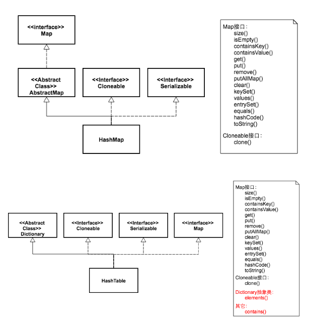

1. 继承的父类不同，对外提供的接口不同，但二者都实现了Map接口，都是实现了Serializable接口，支持序列化，实现了Cloneable，能被克隆

2. HashMap初始容量是16，Hashtable初始容量是11，两者填充因子默认都是0.75

3. HashMap扩容时是当前容量翻倍即:capacity×2，Hashtable扩容时是容量翻倍+1即:capacity×2+1，也就是说Hashtable会尽量使用素数、奇数。而HashMap则总是使用2的幂作为哈希表的大小

   > 之所以会有这样的不同，是因为Hashtable和HashMap设计时的侧重点不同。Hashtable的侧重点是哈希的结果更加均匀，使得哈希冲突减少。当哈希表的大小为素数时，简单的取模哈希的结果会更加均匀。而HashMap则更加关注hash的计算效率问题。在取模计算时，如果模数是2的幂，那么我们可以直接使用位运算来得到结果，效率要大大高于做除法。HashMap为了加快hash的速度，将哈希表的大小固定为了2的幂。当然这引入了哈希分布不均匀的问题，所以HashMap为解决这问题，又对hash算法做了一些改动。这从而导致了Hashtable和HashMap的计算hash值的方法不同

4. HashMap是非线程安全的，HashTable是线程安全的

5. HashMap中key和value都允许为null（但要注意，null作为key，**这样的key只能有一**个，但可以有一个或多个键所对应的value为null）key为null的键值对永远都放在以table[0]为头结点的链表中。

   当get()方法返回null值时，可能是 HashMap中**没有该键**，也可能使**该键所对应的值为null**。因此，在HashMap中不能由get()方法来判断HashMap中是否存在某个键， 而应该用containsKey()方法来判断。

   HashTable在遇到null时，会抛出NullPointerException异常

6. HashMap仅支持Iterator的遍历方式，Hashtable支持Iterator和Enumeration两种遍历方式

7. 两者计算hash的方法不同

   ~~~java
   Hashtable计算hash是直接使用key的hashcode对table数组的长度直接进行取模： 除法运算是比较耗时
   int hash = key.hashCode();
   int index = (hash & 0x7FFFFFFF) % tab.length;
   
   
   HashMap计算hash对key的hashcode进行了二次hash，以获得更好的散列值，然后对table数组长度取摸： 只需要做位运算。位运算比除法的效率要高很多
   // jdk1.7 HashMap
   static int hash(int h) { 
        h ^= (h >>> 20) ^ (h >>> 12);
        return h ^ (h >>> 7) ^ (h >>> 4);
    }
   
   static int indexFor(int h, int length) {
        return h & (length-1);
    }
   ~~~

**Hashtable是如何实现线程安全的**

> 对数据进行操作的方法都被synchronized关键字修饰，
>
>  sychronized意味着在一次仅有一个线程能够更改Hashtable。就是说任何线程要更新Hashtable时要首先获得同步锁，其它线程要等到同步锁被释放之后才能再次获得同步锁更新Hashtable。

### TreeMap与HashMap区别以及底层实现，分别用在什么应用场景，TreeMap如何自定义排序

**区别以及底层实现，应用场景**

- 首先，两者都继承AbstractMap，**而TreeMap实现的是NavigableMap，HashMap实现的是Map**，都实现了Cloneable和Serializable
- HashMap:适用于在Map中插入、删除和定位元素
- Treemap:适用于按自然顺序或自定义顺序遍历键（key）
- Treemap不允许null，key不可以重复，value允许重复
- HashMap通常比TreeMap快一点（树和哈希表的数据结构使然），建议多使用HashMap,在需要排序的Map时候才用TreeMap.
- HashMap 非线程安全 TreeMap 非线程安全
- HashMap的结果是没有排序的，而TreeMap输出的结果是排好序的

**TreeMap排序**

TreeMap 默认排序规则：按照key的字典顺序来排序（升序）
当然，也可以自定义排序规则：**要实现Comparator接口**

~~~java
// 如果key值是java中的基本类型，TreeMap会自身帮我们排序
// 如果是自定义类型，如定义一个Student类作为key值，我们如果不告知排序规则的话，运行就会报错 解决方案有2个，二者选一即可
//1.在Student类中实现Comparable，重写compareTo方法
//2.在构造函数中new Comparator,匿名内部类，重写compare 方法
TreeMap<String,List<ZTreeDTO>> retultMap = new TreeMap<String,List<ZTreeDTO>>(new Comparator<String>(){
    @Override
    public int compare(String o1, String o2) {
        o1 = getTypeByProjectName(o1);
        o2 = getTypeByProjectName(o2);
        return  o1.compareTo(o2);
    }
});
~~~

### LinkedHashMap跟TreeMap有序性区别

> LinkedHashMap会**存储数据的插入顺序**，是**进入时有序**，输出的顺序和输入的相同
>
> TreeMap则是**默认key升序，是进入后有序**（hashMap 、hashTable无序），但是可以通过重写TreeMap的比较器修改默认排序

### HashSet和HashMap区别

|                  *HashMap*                  |                          *HashSet*                           |
| :-----------------------------------------: | :----------------------------------------------------------: |
|            HashMap实现了Map接口             |                     HashSet实现了Set接口                     |
|              HashMap储存键值对              | 不允许出现重复元素，不保证集合中元素的顺序，允许包含值为null的元素，但最多只能一个 |
|        使用put()方法将元素放入map中         |                 使用add()方法将元素放入set中                 |
|     HashMap中使用键对象来计算hashcode值     | HashSet使用成员对象来计算hashcode值，对于两个对象来说hashcode可能相同，所以equals()方法用来判断对象的相等性，如果两个对象不同的话，那么返回false |
| HashMap比较快，因为是使用唯一的键来获取对象 |                  HashSet较HashMap来说比较慢                  |

### 为什么使用HashMap，其优点好处，什么场景使用

> 优点： 随机访问，取值速度快
>
> 使用场景：可以保存kv形式的数据，key不可重复且无序，但是查找的效率很高。

### 为什么HashMap1.8改用尾插法

> 避免1.7头插出现逆序进而导致链表死循环问题
>
> JDK1.7中扩容时，每个元素的rehash之后，都会插入到新数组对应索引的链表头，所以这就导致原链表顺序为A->B->C，扩容之后，rehash之后的链表可能为C->B->A，元素的顺序发生了变化。在并发场景下，扩容时可能会出现循环链表的情况。而JDK1.8从头插入改成尾插入元素的**顺序不变**，避免出现循环链表的情况

### 为什么1.7之前一直用头插法

> 当初设计师在设计时，或许是出于这些考虑
>
> JDK7用头插是考虑到了一个所谓的热点数据的点(新插入的数据可能会更早用到)，但这其实是个伪命题,因为JDK7中rehash的时候，旧链表迁移新链表的时候，如果在新表的数组索引位置相同，则链表元素会倒置(就是因为头插) 所以最后的结果 还是打乱了插入的顺序 所以总的来看支撑JDK7使用头插的这点原因也不足以支撑下去了 所以就干脆换成尾插 一举多得
>
> 如果尾插法，在访问元素时要从第一个元素依次向后遍历，查询复杂度是O(n)，可能后插入的值往往伴随着更大被查找的可能性，也就是为了热点数据出现频率，故选择头插法

### HashMap初始容量为什么是2的n次幂及扩容为什么是2倍的形式

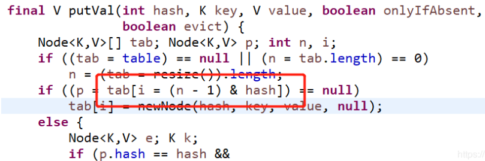

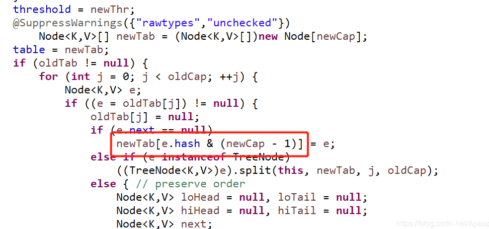

第一个截图是向HashMap中添加元素putVal()方法的部分源码，可以看出，向集合中添加元素时，会使用**(n - 1) & hash**的计算方法来得出**该元素在集合中的位置**

而第二个截图是HashMap扩容时调用resize()方法中的部分源码，可以看出会新建一个tab，然后遍历旧的tab，将旧的元素进过e.hash & (newCap - 1)的计算添加进新的tab中，也就是(n - 1) & hash的计算方法，其中n是集合的容量，hash是添加的元素进过hash函数计算出来的hash值

HashMap的容量为什么是2的n次幂，和这个(n - 1) & hash的计算方法有着千丝万缕的关系，符号&是按位与的计算，这是位运算，**计算机能直接运算**，特别高效，按位与&的计算方法是，**只有当对应位置的数据都为1时，运算结果也为1**，当HashMap的容量是2的n次幂时，(n-1)的2进制也就是1111111111这样形式的，这样**与添加元素的hash值进行位运算时**，**能够充分的散列**，使得添加的元素均匀分布在HashMap的每个位置上，**减少hash碰撞**，而且空间不浪费，

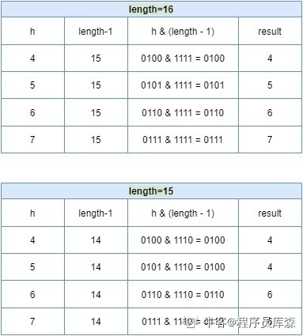

当n=15时（非2 的次幂），6 和 7 的结果一样，这样表示他们在 table 存储的位置是相同的，也就是产生了碰撞，6、7就会在一个位置形成链表，4和5的结果也是一样，这样就会导致查询速度降低。 

 如果我们进一步分析，还会发现空间浪费非常大，以 length=15 为例，在 1、3、5、7、9、11、13、15 这八处没有存放数据。因为hash值在与14（即 1110）进行&运算时，得到的结果最后一位永远都是0，即 0001、0011、0101、0111、1001、1011、1101、1111位置处是不可能存储数据的。

下面举例进行说明

当HashMap的容量是16时，它的二进制是10000，(n-1)的二进制是01111，与hash值得计算结果如下:

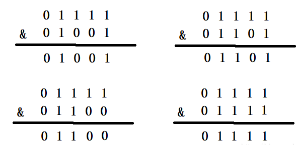

上面四种情况我们可以看出，不同的hash值，和(n-1)进行位运算后，能够得出不同的值，使得添加的元素能够均匀分布在集合中不同的位置上，避免hash碰撞

下面就来看一下HashMap的容量不是2的n次幂的情况，当容量为10时，二进制为01010，(n-1)的二进制是01001，向里面添加同样的元素，结果为：

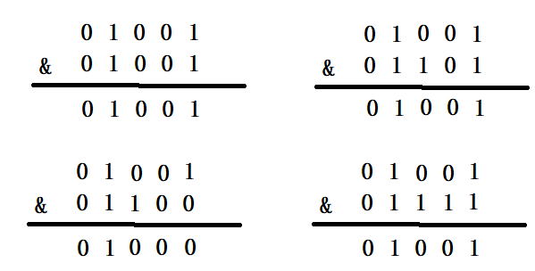

可以看出，有三个不同的元素进过&运算得出了同样的结果，严重的hash碰撞了。

终上所述，HashMap计算添加元素的位置时，使用的位运算，这是特别高效的运算；另外，HashMap的初始容量是2的n次幂，扩容也是2倍的形式进行扩容，是因为容量是2的n次幂，**可以使得添加的元素均匀分布在HashMap中的数组上，减少hash碰撞，避免形成链表的结构，使得查询效率降低**

### HashMap的链有的长，有的短，过长怎么解决

> 扩容判断，树化操作

再引申一个问题

如果拉链法导致链表过长，转红黑树代价太大，并且不需要数据有序时，有没有更优的解法

- 事实上，链表长度超过 8 就转为红黑树的设计，更多的是为了防止用户自己实现了不好的哈希算法时导致链表过长，从而导致查询效率低，而此时转为红黑树更多的是一种保底策略，用来保证极端情况下查询的效率。

  ~~~java
  @Override
  public int hashCode() {
      return 1;
  }
  ~~~

  

  通常如果 hash 算法正常的话，那么链表的长度也不会很长，那么红黑树也不会带来明显的查询时间上的优势，反而会增加空间负担。所以通常情况下，并没有必要转为红黑树，所以就选择了概率非常小，小于千万分之一概率，也就是长度为 8 的概率，把长度 8 作为转化的默认阈值。

  所以如果平时开发中发现 HashMap 或是 ConcurrentHashMap 内部出现了红黑树的结构，这个时候往往就说明我们的哈希算法出了问题，需要留意是不是我们实现了效果不好的 hashCode 方法，**并对此进行改进**，以便减少冲突。
  
- 可以在初始化的时候加大初始容量，减少冲突的发生

### 如何计算hash值

1.8中

~~~java
static final int hash(Object key) {
    int h;
    return (key == null) ? 0 : (h = key.hashCode()) ^ (h >>> 16);
}
~~~

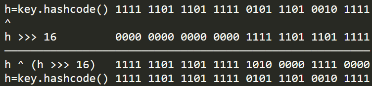

右移16位相当于将高16位移入到低16位，再与原hashcode做异或计算（位相同为0，不同为1）可以将**高低位二进制特征混合起来** => 高16位没有发生变化，但是低16位改变了

拿到的hash值会参与hashmap中数组槽位的计算，计算公式：(n - 1) & hash，假设数组初始槽位16个，那么槽位计算如下：

.png)

高区的16位很有可能会被数组槽位数的二进制码锁屏蔽，**如果我们不做刚才移位异或运算，那么在计算槽位时将丢失高区特征**

虽然丢失了高区特征，不同hashcode也可以计算出不同的槽位来，但是如果两个hashcode很接近时，高区的特征差异可能会导致一次哈希碰撞。

异或运算能更好的保留各部分的特征，如果采用 & 运算计算出来的值会向0靠拢，采用 | 运算计算出来的值会向1靠拢

### HashMap能够保证取出顺序和存入顺序一致吗

> hashmap是散列映射，也就是它不会记录数据存储时的顺序，也就无法保证你取出时的顺序，为了解决这个问题，很简单采用LinkedHashMap或者是TreeMap即可

### 为什么大于8才转红黑树，为什么1.8才加了红黑树

> 首先，链表转红黑树要达到两个条件：
>
> 1. 链表长度达到8
> 2. 数组长度达到64
>
> 当链表长度大于或等于阈值（默认为 8）的时候，如果同时还满足容量大于或等于 MIN_TREEIFY_CAPACITY（默认为 64）的要求，就会把链表转换为红黑树。同样，后续如果由于删除或者其他原因调整了大小，当红黑树的节点小于或等于 6 个以后，又会恢复为链表形态。

每次遍历一个链表，平均查找的时间复杂度是 O(n)，n 是链表的长度。红黑树有和链表不一样的查找性能，由于红黑树有自平衡的特点，可以防止不平衡情况的发生，所以可以始终将查找的时间复杂度控制在 **O(log(n))**。最初链表还不是很长，所以可能 O(n) 和 O(log(n)) 的区别不大，**但是如果链表越来越长，那么这种区别便会有所体现**。所以为了提升查找性能，需要把链表转化为红黑树的形式。

> 为什么不一开始就用红黑树，反而要经历一个转换的过程呢

**从三个角度分析，一是hash函数，二是数据结构的读写效率，三是内存资源使用情况**

第一点，hashMap的哈希函数能尽量减少哈希冲突发生的概率，一般情况下不会有太多的元素产生哈希冲突，这个原因导致桶上不会有太多的元素

第二点，
从读方面考虑：
链表查询的时间复杂度O（n），红黑树的复杂度为O（logn）；
从写方面考虑：
链表删除时间复杂度为O（n），红黑树的时间复杂度为O（n）；
**链表的添加为O（1）**，红黑树的添加为O（logn）；
从写方面考虑，**链表的添加性能是极其优异的**（得益于头插法与尾插法）
从内存资源使用情况考虑：
链表节点需要维护的属性少于红黑树节点，相对红黑树更轻便，占用的内存空间更小

红黑树需要进行左旋，右旋，变色这些操作来保持平衡，而单链表不需要，当元素小于8时，链表已经能够保证查询性能

单个 TreeNode 需要**占用的空间**大约是普通 Node 的两倍，所以只有当包含足够多的 Nodes 时才会转成 TreeNodes，而是否足够多就是由 TREEIFY_THRESHOLD 的值决定的。而当桶中节点数由于移除或者 resize 变少后，又会变回普通的链表的形式，以便节省空间

### HashMap扩容机制

**什么时候需要扩容**

- 在首次调用put方法的时候，初始化数组table
- 当HashMap中的元素个数超过数组大小(数组长度)*loadFactor(负载因子)时，就会进行数组扩容，loadFactor的默认值(DEFAULT_LOAD_FACTOR)是0.75,这是一个折中的取值。也就是说，默认情况下，数组大小为16，那么当HashMap中的元素个数超过16×0.75=**12**(这个值就是阈值或者边界值threshold值)的时候，就把数组的大小扩展为2×16=32，即**扩大一倍**，然后**重新计算每个元素在数组中的位置**，而这是一个非常耗性能的操作，所以如果我们已经预知HashMap中元素的个数，那么预知元素的个数能够有效的提高HashMap的性能。
- 当HashMap中的其中一个链表的对象个数如果达到了8个，此时如果数组长度没有达到64，那么HashMap会先扩容解决，如果已经达到了64，那么这个链表会变成红黑树，节点类型由Node变成TreeNode类型。当然，如果映射关系被移除后，下次执行resize方法时判断树的节点个数低于6，也会再把树转换为链表。

**扩容**

进行扩容，会伴随着一次重新hash分配，并且会遍历hash表中所有的元素，是非常耗时的。在编写程序中，要尽量避免resize。

HashMap在进行扩容时，使用的rehash方式非常巧妙，因为每次扩容都是翻倍，与原来计算的 (n-1)&hash 的结果相比，只是多了一个bit位，所以节点要么就在**原来的位置**，要么就被分配到"**原位置+旧容量**"这个位置。

怎么理解呢？例如我们从16扩展为32时，具体的变化如下所示：

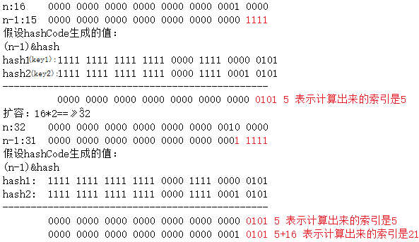

因此元素在重新计算hash之后，因为n变为2倍，那么n-1的标记范围在高位多1bit(红色)，因此新的index就会发生这样的变化：

说明：5是假设计算出来的原来的索引。这样就验证了上述所描述的：扩容之后所以节点要么就在原来的位置，要么就被分配到"**原位置+旧容量**"这个位置。

因此，我们在扩充HashMap的时候，不需要重新计算hash，只需要看看原来的hash值新增的那个bit是1还是0就可以了，**是0的话索引没变**，是1的话索引变成“原索引+oldCap(**原位置+旧容量**)”。可以看看下图为16扩充为32的resize示意图：

正是因为这样巧妙的rehash方式，既省去了重新计算hash值的时间，而且同时，由于新增的1bit是0还是1可以认为是随机的，在resize的过程中保证了**rehash之后每个桶上的节点数一定小于等于原来桶上的节点数**，保证了rehash之后不会出现更严重的hash冲突，均匀的把之前的冲突的节点分散到新的桶中了。

> 具体扩容方法详见HashMap详解

### HashMap构造方法有几种

public HashMap(int initialCapacity, float loadFactor)
public HashMap(int initialCapacity)
public HashMap()
public HashMap(Map<? extends K, ? extends V> m)

### 怎样合理确定其初始容量

> 实际预估容量 除 负载因子， 或除以一个比负载因子稍微小一点的数
>
> 要保证是2的次幂，尽量避免resize

- 确定装载1w条数据，构造时传10000，会触发扩容吗

  > 传10000进去，由于tableSizeFor，return 16384，16384*0.75 = 12288>10000，所以不会触发扩容

- 如果确定只装载100个元素，new HashMap(?)多少是最佳的

  > 重点还是tableSizeFor(initialCapacity)方法，结果是返回一个**不小于传入参数**并且**最近的一个2的n次方的值**，所以传100的话，返回1024
  >
  > 但是128*0.75=96，也即扩容阈值threshold = 96，当元素put到第96个时，就会再次进行resize()方法，而resize()方法是非常耗时间的
  >
  > 所以应初始化**256**

### HashMap中存储数据的结构

> 分7 & 8，对8来说，每个数据单元都是一个Node结构，其中有key、value、next、hash字段
>
> next字段就是发生hash冲突时，当前桶位中的node与冲突node连成一个链表要用的字段
>
> hash字段是key的hashcode二次加工所得，加工原则是该hashcode高16位异或（^）得到的新值，主要是为了加大散列程度，增大寻址的随机性，减少hash冲突

### 为什么引入红黑树，而不是其他树，红黑树性质

> 为什么不用avl树

红黑树和AVL树都是常见的平衡二叉树，它们的查找，删除，修改的时间复杂度都是 O(log n)

红黑树与AVLl树，在检索的时候效率差不多，都是通过平衡来二分查找。但红黑树不像avl树一样**追求绝对的平衡**，红黑树允许局部很少的不完全平衡，这样对于效率影响不大，**但省去了很多没有必要的调平衡操作**，avl树调平衡有时候代价较大，所以效率不如红黑树。

AVL树和红黑树相比有以下的区别

- AVL树是更加严格的平衡，因此可以提供更快的查找速度，**一般读取查找密集型任务**，适用AVL树
- 红黑树更适合**插入修改密集型任务**
- 通常，AVL树的旋转比红黑树的旋转**更加难以平衡和调试**

> 红黑树搜索时间复杂度是O(logn)，而链表是 O(n)
>
> 红黑树本质上是一棵二叉查找树，但它在二叉查找树的基础上增加了着色和相关的性质使得**红黑树相对平衡，从而保证了红黑树的查找、插入、删除的时间复杂度最坏为O(log n)。能够加快检索速率。**

- AVL以及红黑树都是高度平衡的树形结构，它们非常的相似，真正的区别在于任何添加、删除操作时完成的旋转操作次数
- 两种时间复杂度都是O(logN)，其中N是叶子的数量，但实际上AVL树在查找密集型任务上更快，利用更好的平衡，树遍历平均更短，另一方面，插入和删除上，AVL树较慢，因为需要更高的旋转次数才能在修改时正确地重新平衡数据结构
- 在AVL树中，从根到任何叶子节点的最短路径和最长路径之间的差异最多为1，在红黑树中，差异可以是2倍
- 两个都是O(logN)查找，但是平衡二叉树可能需要 O(logN)旋转，而红黑树需要最多两次旋转使其达到平衡（尽可能需要检查O(logN)节点以确定旋转的位置），旋转本身是O(1)操作，因为你只需要移动指针

> 为什么不用二叉查找树

二叉查找树在特殊情况下会变成一条线性结构（这就跟原来使用链表结构一样了，造成很深的问题），遍历查找会非常慢。

**红黑树性质**

① 每个节点都是红色或者黑色；
② 根节点必须始终是黑色；
③ 没有两个相邻的红色节点；
④ 对每个结点，从该结点到其子孙节点的所有路径上包含相同数目的黑结点。

### HashMap添加元素的时候，怎么判断是否相同

> HashMap集合判断两个元素相等的标准：两个对象的equals方法相等，并且hashCode方法返回值也相等。
>
> hashMap会先调用key对象当中的equals方法来和已存在的key进行比较，当值为false的时候则认为是两个不同的key值
>
> 当equals方法相同的时候，比较当前key和已经存在的key对象的hashCode值是否是相同的，当hashCode也相同的时候则认为当前所进行比较的两个key对象是完全相同的，当hashCode不同的时候则认为两个key是不同的，将会为当前key的value开辟新的空间来进行内容的存放操作

### HashMap在扩容的时候，对读写操作有什么特殊的处理

> 不影响读写，考虑Redis中的渐进式hash，也就是逐步迁移数据到新哈希表中

### HashMap 中 key 的存储索引是怎么计算的？

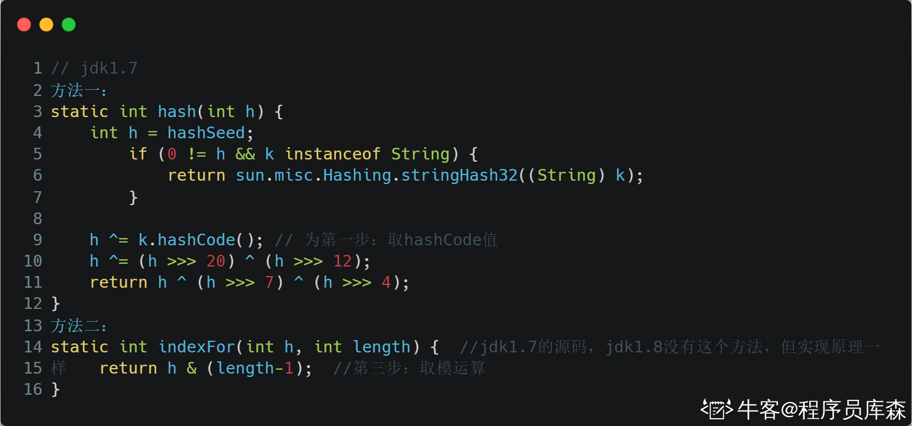

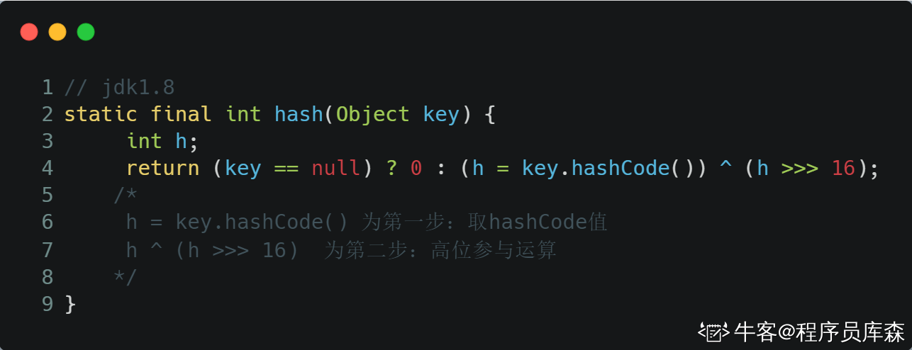

首先根据key的值计算出hashcode的值，然后根据hashcode计算出hash值，最后通过hash&（length-1）计算得到存储的位置

本质上就是三步：**取key的 hashCode 值、根据 hashcode 计算出hash值、通过取模计算下标**

JDK1.7和1.8的不同之处，就在于第二步

> JDK1.8 为什么要 hashcode 异或其右移十六位的值？

因为在JDK 1.7 中扰动了 4 次，计算 hash 值的性能会稍差一点点。 从速度、功效、质量来考虑，JDK1.8 优化了高位运算的算法，通过hashCode()的高16位异或低16位实现：(h = k.hashCode()) ^ (h >>> 16)。这么做可以在数组 table 的 length 比较小的时候，**也能保证考虑到高低Bit都参与到Hash的计算中**，同时不会有太大的开销。

> 为什么 hash 值要与length-1相与？

- 把 hash 值对数组长度取模运算，模运算的消耗很大，没有位运算快。
- 当 length 总是 2 的n次方时，h& (length-1) 运算**等价于对length取模**，也就是 h%length，但是 & 比 % 具有更高的效率。

### 为什么不是线程安全，多线程操作可能产生什么后果，并发下都有哪些问题，是怎么产生的，体现在哪里

> 为什么线程不安全，并发会出现的问题
>
> - 多线程下扩容死循环（JDK1.7中的 HashMap 使用头插法插入元素，在多线程的环境下，扩容的时候有可能导致环形链表的出现，形成**死循环**。因此，JDK1.8使用尾插法插入元素，在扩容时会保持链表元素原本的顺序，不会出现环形链表的问题）
> - 多线程的put可能导致元素的丢失（如果计算出来的索引位置是相同的，那会造成前一个 key 被后一个 key 覆盖，从而导致元素的丢失）
> - put和get并发时，可能导致get为null（因为元素个数超出threshold而导致rehash，线程2此时执行get，有可能导致这个问题）

> 什么情况下会出现并发问题：
>
> - 对象丢失
> - 死链

> 要实现线程安全，三种办法
>
> 1. 手动进行同步，加synch
> 2. 采用Hashtable
> 3. concurrenthashmap

### 拷贝过程

### 链表环是怎么形成的，什么时候死循环

### put过程，key是如何找到对应的桶，hash值转数组下标

> 调用 hash(key.hashCode()) 方法计算 key 的 hash 值(其中JDK1.7用了9次扰动处理=4次位运算+5次异或；JDK1.8只用了2次扰动处理=1次位运算+1次异或)，然后和(数组长度-1)做异或运算，得出数组下标；
>
> 当table中的元素个数大于阈值(capacity * loadfactor)时，容器会进行扩容resize操作，将table数组大小扩充为2倍；
>
> 进入if流程，分为以下四种情况：
>
> 1. tab == null
>
>    `如果key的hash值对应的table下标元素为空，说明还没有元素，则直接插入，把当前put方法传进来的key和value包装成一个node对象，放入tab中`
>
> 2. tab != null 并且node没有链化
>
>    `先对比两个key是否一样，完全相等的话，更新替换原来的value`，`不一样的话，就是hash冲突了，1.8尾插法在原来的node后面追加一个node`
>
> 3. node已经链化
>
>    `同样还是先判断两个key是否完全一致，一致则替换，否则说明迭代到链表尾节点也没有匹配到完全一致的node，则直接在链表尾部插入数据，即尾插法，插完还需判断当前binCount是否大于树化阈值，达到的话调用treeifyBin树化操作`
>
> 4. 链转化为红黑树

简要流程如下：

1. 首先根据 key 的值计算 hash 值，找到该元素在数组中存储的下标；
2. 如果数组是空的，则调用 resize 进行初始化；
3. 如果没有哈希冲突直接放在对应的数组下标里；
4. 如果冲突了，且 key 已经存在，就覆盖掉 value；
5. 如果冲突后，发现该节点是红黑树，就将这个节点挂在树上；
6. 如果冲突后是链表，判断该链表是否大于 8 ，如果大于 8 并且数组容量小于 64，就进行扩容；
7. 如果链表长度大于 8 并且数组的容量大于等于 64，则将这个结构转换为红黑树；
8. 否则，链表插入键值对，若 key 存在，就覆盖掉 value。

### get过程

> get和put类似，只不过需要判断是否为空，为空则key=0，另一方面采用equals进行判断

### resize及1.7和1.8的区别

>  JDK1.7扩容 先 new(扩容) 后插入 JDK1.8扩容 先插入 后 new(扩容)

JDK1.8做了两处优化： 

1.  resize 之后，元素的位置在原来的位置，或者原来的位置 +oldCap (原来哈希表的长度）。不需要像 JDK1.7 的实现那样**重新计算hash** ，只需要看看原来的 hash 值新增的那个bit是1还是0就好了，是0的话索引没变，是1的话索引变成“原索引 + oldCap ”。这个设计非常的巧妙，**省去了重新计算 hash 值的时间**。 
2. JDK1.7 中 rehash 的时候，旧链表迁移新链表的时候，如果在新表的数组索引位置相同，则链表元素会倒置（头插法）。JDK1.8 不会倒置，使用尾插法。

### 一般用什么作为HashMap的key

一般用Integer、String 这种不可变类当 HashMap 当 key，而且 String 最为常用。 

-  因为字符串是不可变的，所以在它创建的时候 hashcode 就被缓存了，不需要重新计算。这就是 HashMap 中的键往往都使用字符串的原因。 
-  因为获取对象的时候要用到 equals() 和 hashCode() 方法，那么键对象正确的重写这两个方法是非常重要的,这些类已经很规范的重写了 hashCode() 以及 equals() 方法。

> 用可变类当 HashMap 的 key 有什么问题

hashcode 可能发生改变，导致 put 进去的值，无法 get 出

### rehash过程，非常大的HashMap在rehash时会有什么问题

> 首先rehash是极大的开销，其次，由于HashMap不是线程安全，如果在rehash时，又有put操作，数据受污染

### HashMap非常大时，如何删除它

> 考虑线程安全

### 时间复杂度

> 查找 理想情况下O(1)

### 1.8的优化除了红黑树之外

- resize优化

- hash计算优化

- 尾插法

  

### 各常量为什么是它现在的这个值

~~~java
static final int DEFAULT_INITIAL_CAPACITY = 1 << 4; // aka 16
static final int MAXIMUM_CAPACITY = 1 << 30;
static final float DEFAULT_LOAD_FACTOR = 0.75f;
static final int TREEIFY_THRESHOLD = 8;
static final int UNTREEIFY_THRESHOLD = 6;
static final int MIN_TREEIFY_CAPACITY = 64;
~~~

1. 默认负载因子是0.75，作用是计算扩容阈值，如无参构造方法常见的HashMap对象，默认情况下扩容阈值就是16*0.75=12，注意，除了长度超过临界值，还要对下一次输入要在不是空的位置上判断才可以进行扩容

   - 如果内存空间很多而又对时间效率要求很高，可以降低负载因子Load factor的值 。
   - 相反，如果内存空间紧张而对时间效率要求不高，可以增加负载因子loadFactor的值，这个值可以大于1

2. 当hashCode离散性很好的时候，树型bin用到的概率非常小，因为数据均匀分布在每个bin中，几乎不会有bin中链表长度会达到阈值。但是在随机hashCode下，离散性可能会变差，然而JDK又不能阻止用户实现这种不好的hash算法，因此就可能导致不均匀的数据分布。不过理想情况下随机hashCode算法下所有bin中节点的分布频率会遵循泊松分布，而一个bin中链表长度达到8个元素的概率为0.00000006，几乎是不可能事件。

   同理，少于6就从红黑树转回单链表是为了节省维护一个树的资源消耗，而选择6作为临界值，是因理想情况下一个bin中元素个数达到6的概率是0.00001316，达到7的概率为0.00000094，二者跨度较大，可以减小树和链表之间频繁转化的可能性。

   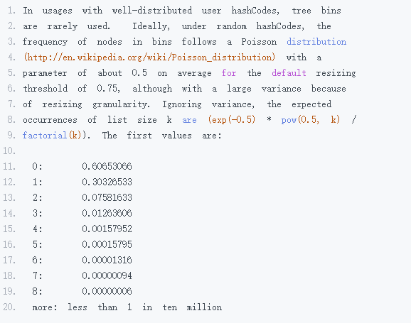

   **如果 hashCode 分布良好，也就是 hash 计算的结果离散好的话，那么红黑树这种形式是很少会被用到的，因为各个值都均匀分布，很少出现链表很长的情况。在理想情况下，链表长度符合泊松分布，各个长度的命中概率依次递减，当长度为 8 的时候，概率仅为 0.00000006。这是一个小于千万分之一的概率，通常我们的 Map 里面是不会存储这么多的数据的，所以通常情况下，并不会发生从链表向红黑树的转换。**

### 从HashMap的设计中，有什么是值得学习的

- 时间和空间的平衡，比如链表和红黑树的相互转换
- 通过key.hashCode()将普通的object对象转换为int值，从而可以将其视为数组下标，利用数组O(1)的查找性能。

### HashMap性能优化

> 负载因子，如果要查询快，负载因子小，冲突就少

 一是当预估出hashmap大小时，可以设置初始值。初始值遵循下面原则：2的整数次幂；初始值=预估值/0.75

 二是当hashmap查询效率要求高时，可以把加载因子设置小点。原因是加载因子小，空间充足，发生哈希冲突的几率小，那么就不会出现链表和红黑树；

三是当hashmap对空间要求比较节省时，就可以把加载因子设置大点。这样node数组空间利用比较充分。因为加载因子大，边界值就大，node数组就会更容易占满，空间利用比较充分；

### HashMap存在的问题

1. 死循环，在多线程环境下

2. 潜在的安全漏洞

   > 哈希碰撞可能会使哈希表退化为链表，String的哈希算法很容易就能产生多个哈希值相同字符串

   ~~~java
   public int hashCode() {
       int h = hash;
       if (h == 0 && value.length > 0) {
           char val[] = value;
   
           for (int i = 0; i < value.length; i++) {
               h = 31 * h + val[i];
           }
           hash = h;
       }
       return h;
   }
   ~~~

   黑客可以在url中携带多个哈希值一样的字符串，来访问我们的服务器，此时因为所有字符串的哈希值相同，所以都会被放到同一个桶中，使得哈希表退化为链表，大幅度降低我们的性能。为了避免这种攻击，**在 JDK 7 的哈希表中，重构了String类型计算哈希值的方法**