# LinkedList

[TOC]

## 简介

LinkedList底层由一个**拥有头、尾指针的双向链表构成**

实现了List接口和Deque接口的双端链表。 LinkedList底层的链表结构使它支持**高效的插入和删除操作**，另外它实现了Deque接口，使得LinkedList类也具有**队列的特性**; LinkedList不是线程安全的，如果想使LinkedList变成线程安全的，可以调用静态类Collections类中的synchronizedList方法：

~~~java
List list = Collections.synchronizedList(new LinkedList(...));
~~~

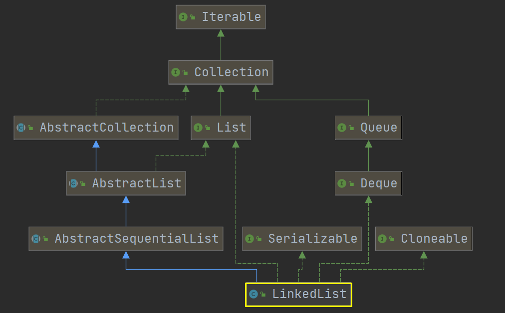

~~~java
public class LinkedList<E>
    extends AbstractSequentialList<E>
    implements List<E>, Deque<E>, Cloneable, java.io.Serializable
~~~

LinkedList也实现了Serializable和Clonealbe接口，但因为链表随机访问效率较低，所以未实现RandomAccess方法

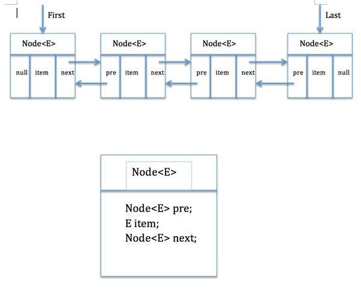

~~~java
private static class Node<E> {
    E item;
    Node<E> next;
    Node<E> prev;

    Node(Node<E> prev, E element, Node<E> next) {
        this.item = element;
        this.next = next;
        this.prev = prev;
    }
}
~~~

## 源码分析

### 构造方法

#### 无参构造方法

~~~java
// 链表的容量
transient int size = 0;

// 链表的头指针
transient Node<E> first;

// 链表的尾指针
transient Node<E> last;

// 无参构造函数
public LinkedList() {}
~~~

#### Collection构造方法

~~~java
public LinkedList(Collection<? extends E> c) {
    // 先调用无参构造函数， 初始化集合容积 size = 0， 并创建头尾指针
    this();

    // 调用方法，将传入的集合c添加到集合尾部
    // 该构造函数先创建了一个空链表，然后调用了addAll()方法将待插入集合插入链表中 懒加载
    addAll(c);
}

public boolean addAll(Collection<? extends E> c) {
    // 调用重载后的addAll()方法，并返回其结果
    return addAll(size, c);
}

public boolean addAll(int index, Collection<? extends E> c) {
    // 检查索引是否越界， 通过0和size来判断
    checkPositionIndex(index);

    // 将传入的集合转成Object类型的数组
    Object[] a = c.toArray();

    // 获得传入集合的长度，也就是需要插入的集合中元素的个数
    int numNew = a.length;

    // 如果其长度为0，则返回添加失败
    if (numNew == 0)
        return false;

    // 创建两个节点
    // pred保存插入位置的前驱节点， succ保存插入位置的节点
    Node<E> pred, succ;

    // 如果是在集合的末尾进行插入
    if (index == size) {
        // succ为空，pred为尾节点
        succ = null;
        pred = last;
    } else {
        // 如果不是在末尾进行插入, succ保存插入位置的节点，pred保存插入位置节点的前驱结点
        succ = node(index);
        pred = succ.prev;
    }

    // 使用增加for，通过迭代器顺序访问插入集合
    for (Object o : a) {
        // 将遍历的元素o赋值给变量e
        @SuppressWarnings("unchecked") E e = (E) o;

        // 创建Node对象，Node为LinkedList的内部类。
        // 传入的值依次为：插入节点的前驱节点，该节点存储的数据，后继节点为null
        Node<E> newNode = new Node<>(pred, e, null);

        // 如果没有前驱节点，也就是在链表头部进行插入
        if (pred == null)
            // 该节点就是头结点
            first = newNode;
        else
            // 如果有前驱结点，前驱结点就指向该节点
            pred.next = newNode;
        // 前驱节点后移，指向该节点
        pred = newNode;
    }

    // 如果是在尾部进行插入
    if (succ == null) {
        // pred节点就是尾节点
        last = pred;
    } else {
        // 否则 pred 与 succ 互相指向对方
        pred.next = succ;
        succ.prev = pred;
    }

    // size扩大
    size += numNew;

    // 修改次数+1
    modCount++;

    // 返回修改成功
    return true;
}

private static class Node<E> {
    E item;
    Node<E> next;
    Node<E> prev;

    Node(Node<E> prev, E element, Node<E> next) {
        this.item = element;
        this.next = next;
        this.prev = prev;
    }
}
~~~

### addAll

#### 在尾部插入

- pred指向尾部的节点，succ指向null

  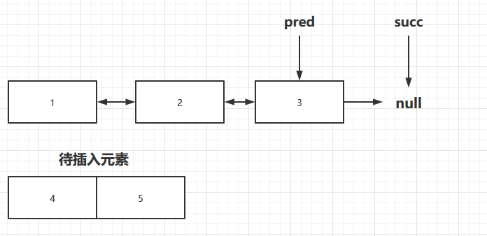

- 遍历待插入数组，取出第一个元素

  - 调用Node<>的构造方法，在初始化节点时，将其前驱结点赋值为pred节点
  - 放在pred节点的后面，pred.next指向newNode。**此时succ依然指向null**

  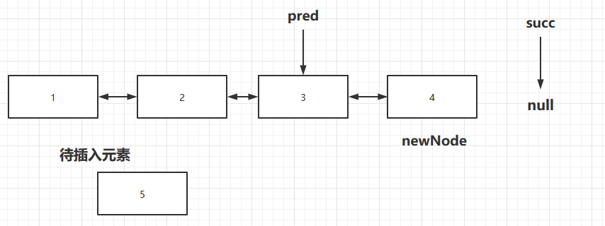

- pred后移，指向刚插入的节点

  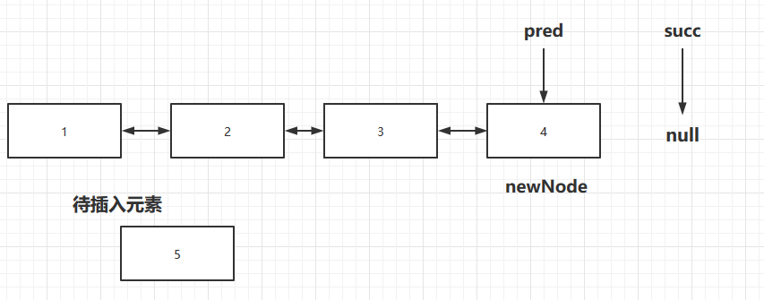

- 重复上面的步骤，直到待插入集合中所有元素都插入到链表当中

  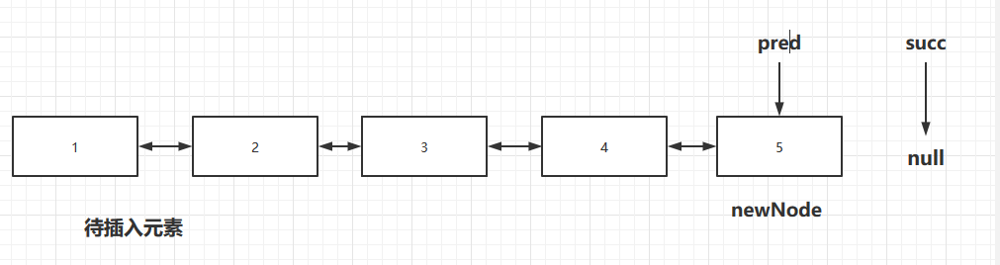

- 插入完毕后，因为succ为null，所以尾指针last变为pred

  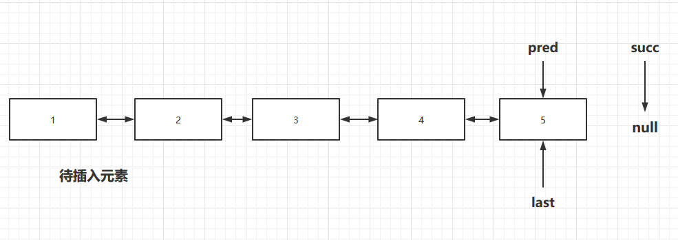

#### 在中间插入

- 在index=2处（第三个节点）处进行插入，succ保存了插入位置的节点，pred为其前驱节点

  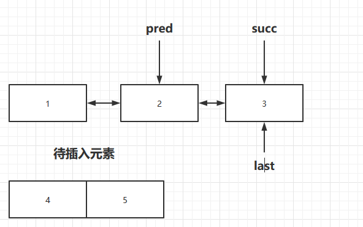

- 在pred后面插入元素

  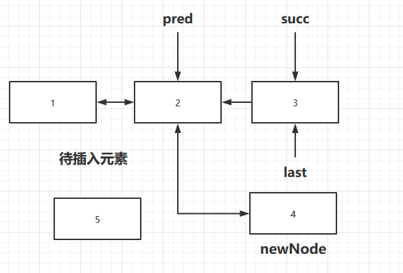

- 一直插入元素，直到插入完成

  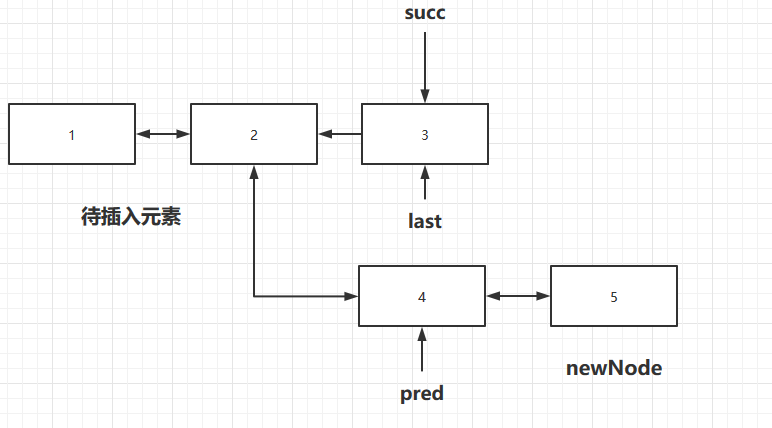

- 如果succ不为空（指向了插入位置处的节点），pred的后继节点为succ，succ的前驱为pred

  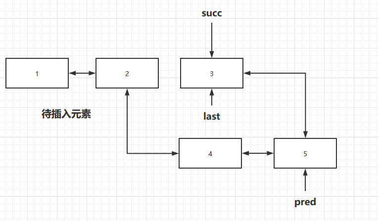

**可见，在LinkedList中间进行插入，是在index处节点之前进行插入操作的**

#### 在头部插入

先使用头插法插入**第一个元素**

- succ指向了头结点，pred指向其前驱，此时为null

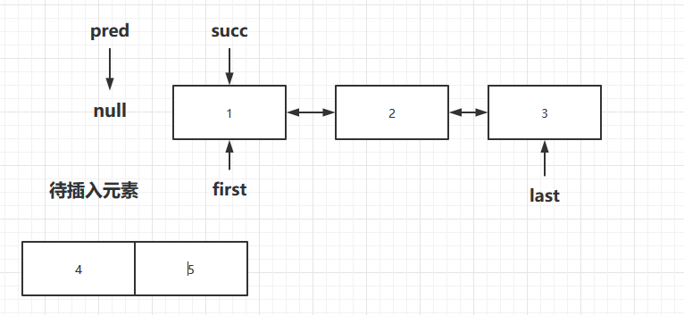

- 如果pred为空，则头指针 first 指向 newNode。**让pred指向newNode**

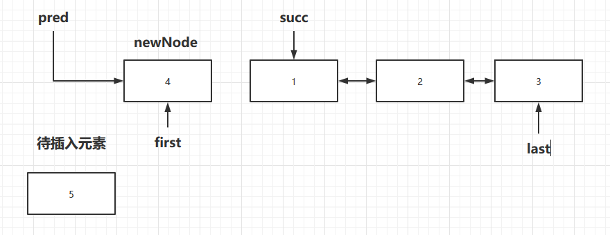

- 然后**在头结点之后插入剩余元素，因为此时的pred已经不为空了**

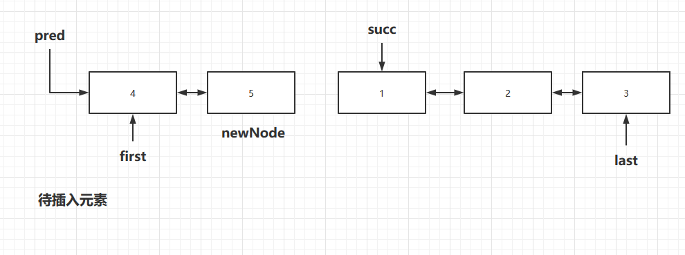

- pred指向新插入的节点，此时待插入集合为空。pred 与 succ 互相指向对方。插入完毕

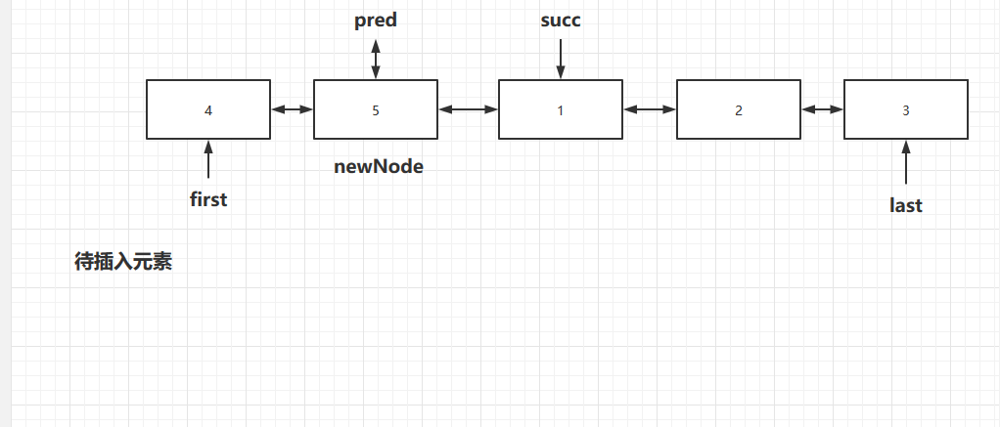

### 添加方法

#### addFirst(E e)

~~~java
public void addFirst(E e) {
    // 调用linkFirst()方法
    linkFirst(e);
}

// 私有方法，用头插法插入元素 把e设置为头结点
private void linkFirst(E e) {
    // 用 f 保存插入前链表中的头节点
    final Node<E> f = first;

    // 创建一个新节点，值为待插入元素的值(e)，后继节点为 f (插入前的头结点)
    final Node<E> newNode = new Node<>(null, e, f);

    // 头结点变为新插入的节点newNode
    first = newNode;

    // 如果 f 为空，也就是插入前链表为空
    if (f == null)
        // newNode同时也是尾节点
        last = newNode;
    else
        // 否则，newNode 为 f 的前驱结点
        f.prev = newNode;

    size++;
    modCount++;
}
~~~

addFirst进行头插法插入元素时，会**调用私有方法linkFirst来进行插入操作**

#### addLast(E e)

~~~java
public void addLast(E e) {
    // 调用linkLast()方法来进行尾部插入
    linkLast(e);
}

// 把e设置为尾结点
void linkLast(E e) {
    // 用 l 来保存链表的尾节点
    final Node<E> l = last;

    // 创建新节点，值为待插入节点的值（e），前驱节点为l，也就是插入前的尾节点
    final Node<E> newNode = new Node<>(l, e, null);

    // newNode变为尾节点（last）
    last = newNode;

    // 如果 l 为空，也就是插入前链表为空
    if (l == null)
        // newNode也是头结点
        first = newNode;
    else
        // l的后继节点为newNode
        l.next = newNode;
    size++;
    modCount++;
}
~~~

#### add(E e)

~~~java
public boolean add(E e) {
    // 调用linkLast在末尾进行插入
    linkLast(e);
    return true;
}
~~~

#### add(int index, E element)

~~~java
public void add(int index, E element) {
    // 检查index是否越界
    checkPositionIndex(index);

    // 如果 index == size，就在末尾进行插入
    if (index == size)
        linkLast(element);
    else
        // 否则就调用linkBefore()方法，在index处节点前进行插入
        // 调用了node()方法，来获取指定索引出的元素
        linkBefore(element, node(index));
}

Node<E> node(int index) {
    // assert isElementIndex(index);
    // 看index是在链表的前半段还是后半段
    if (index < (size >> 1)) {
        // 如果是前半段，就通过first节点从前向后扫描
        Node<E> x = first;

        // 找到index处的元素并返回。0->index-1
        for (int i = 0; i < index; i++)
            x = x.next;
        return x;
    } else {
        // 否则，就通过last从后往前找
        Node<E> x = last;

        // 找到index的元素并返回。size-1 -> index；
        for (int i = size - 1; i > index; i--)
            x = x.prev;
        return x;
    }
}

// e: 待插入节点
// succ: index位置上的节点
void linkBefore(E e, Node<E> succ) {
    // assert succ != null;
    // 用pred为插入位置节点的前驱结点
    final Node<E> pred = succ.prev;

    // 创建新节点，值为插入节点e，前驱结点为pred，后继为succ
    final Node<E> newNode = new Node<>(pred, e, succ);

    // succ的前驱改为newNode，不再是pred
    succ.prev = newNode;

    // 如果pred为空，就是插入位置为链表头结点
    if (pred == null)
        // newNode就是头结点
        first = newNode;
    else
        // 否则，pred的后继为newNode
        pred.next = newNode;

    size++;
    modCount++;
}
~~~

#### addAll(Collection<? extends E> c)

~~~java
public boolean addAll(Collection<? extends E> c) {
    // 调用addAll(index, e)方法，也就是Collection构造函数时使用的那个方法
    return addAll(size, c);
}
~~~

### 移除方法

#### remove

remove()方法就是调用的removeFirst()方法，实际上是**对removeFirst()及unlinkFirst()**的解析

~~~java
public E remove() {
    // 调用removeFirst()方法，移除链表首个元素
    return removeFirst();
}

public E removeFirst() {
    // 创建新节点f用于保存头结点
    final Node<E> f = first;
    // 如果头结点为空，也就是链表为空，抛出异常
    if (f == null)
        throw new NoSuchElementException();
    // 调用unlinkFirst()方法，并返回结果
    return unlinkFirst(f);
}

private E unlinkFirst(Node<E> f) {
    // assert f == first && f != null;
    // 创建element保存头结点的值，用于最后的返回
    final E element = f.item;

    // next保存头结点后面的一个节点
    final Node<E> next = f.next;

    // 头结点的属性置空，方便回收
    f.item = null;
    f.next = null; // help GC

    // 头指针first后移
    first = next;

    // 如果链表只有一个节点
    if (next == null)
        // 尾指针为空
        last = null;
    else
        //否则，next的前驱结点为null（next现在是头结点）
        next.prev = null;
    size--;
    modCount++;

    // 返回被移除的节点的值
    return element;
}
~~~

#### removeLast()

~~~java
public E removeLast() {
    // 创建新节点l保存尾节点
    final Node<E> l = last;

    // 如果尾节点为空(链表为空)，就抛出异常
    if (l == null)
        throw new NoSuchElementException();

    // 返回unlinkLast()方法的返回结果
    return unlinkLast(l);
}

// 该方法和unlinkFirst方法类似，只不过是对尾节点进行删除操作
private E unlinkLast(Node<E> l) {
    // assert l == last && l != null;
    final E element = l.item;
    final Node<E> prev = l.prev;
    l.item = null;
    l.prev = null; // help GC
    last = prev;
    if (prev == null)
        first = null;
    else
        prev.next = null;
    size--;
    modCount++;
    return element;
}
~~~

#### remove(Object o)

移除**首个**遇到的指定元素

~~~java
public boolean remove(Object o) {
    // 如果要删除的元素为null
    if (o == null) {
        // 从头开始遍历链表
        for (Node<E> x = first; x != null; x = x.next) {
            // 遇到节点值为null的，就调用unlink()方法执行删除操作
            if (x.item == null) {
                unlink(x);
                return true;
            }
        }
    } else {
        // 从头开始遍历链表 
        for (Node<E> x = first; x != null; x = x.next) {
            // 如果是要删除的元素，就调用unlink()方法执行删除操作
            if (o.equals(x.item)) {
                unlink(x);
                return true;
            }
        }
    }
    return false;
}

E unlink(Node<E> x) {
    // assert x != null;
    // 保存被删除节点的值，用于返回
    final E element = x.item;

    // next节点用于保存被删除节点的后继节点
    final Node<E> next = x.next;

    // prev节点用于保存被删除节点的前驱结点
    final Node<E> prev = x.prev;

    // 如果前驱节点为null，即被删除的节点是头结点
    if (prev == null) {
        // 头指针指向被删除节点的下一个节点（next）
        first = next;
    } else {
        // 否则，被删除节点的前驱结点指向其后继节点
        prev.next = next;
        // 被删除节点的前驱结点为null
        x.prev = null;
    }

    // 如果没有后继节点，即被删除元素是链表的尾节点
    if (next == null) {
        // 尾指针指向被删除节点的前一个节点
        last = prev;
    } else {
        // 否则，被删除节点的后继节点指向其前驱结点
        next.prev = prev;

        // 被删除节点的后继节点为null
        x.next = null;
    }

    // 被删除节点的属性为null
    x.item = null;
    size--;
    modCount++;
    return element;
}
~~~

**可以看到，unlinkFirst()、unlinkLast()和unlink()方法非常类似**，都用于让某个节点从链表中**移除**的操作。只不过unlinkFirst和unlinkLast删除的是头、尾节点，实现相对简单。而unlink则是一个更完整的实现，可以删除链表中的任一元素

#### remove(int index)

~~~java
public E remove(int index) {
    // 检查索引是否越界
    checkElementIndex(index);

    // 找到该位置的节点，调用unlink方法进行删除
    return unlink(node(index));
}
~~~

#### removeFirstOccurrence(Object o)

该方法用于移除链表中**第一次出现**该元素的节点

~~~java
public boolean removeFirstOccurrence(Object o) {
    return remove(o);
}
~~~

可以看出removeFirstOccurrence(Object o)方法其实就是调用的remove(Object o)方法，来进行链表首个指定元素的删除操作的

#### removeLastOccurrence(Object o)

该方法用于移除链表中**最后一次出现**该元素的节点

~~~java
public boolean removeLastOccurrence(Object o) {
    // 从链表尾部进行查询，找到指定元素，删除后返回
    if (o == null) {
        for (Node<E> x = last; x != null; x = x.prev) {
            if (x.item == null) {
                unlink(x);
                return true;
            }
        }
    } else {
        for (Node<E> x = last; x != null; x = x.prev) {
            if (o.equals(x.item)) {
                unlink(x);
                return true;
            }
        }
    }
    return false;
}
~~~

### 迭代器

~~~java
private class ListItr implements ListIterator<E> {
    private Node<E> lastReturned;
    private Node<E> next;
    private int nextIndex;
    private int expectedModCount = modCount;

    // 构造方法，如果不传入index参数，则默认传入0
    ListItr(int index) {
        // assert isPositionIndex(index);
        // 给next和nextIndex赋值
        next = (index == size) ? null : node(index);
        nextIndex = index;
    }

    // 是否还有下一个元素
    public boolean hasNext() {
        // 索引小于size则返回true
        return nextIndex < size;
    }

    public E next() {
        // 检查是否有并发问题，modeCount与expectedModCount是否相等
        checkForComodification();

        // 如果没有下一个元素了，就抛出异常
        if (!hasNext())
            throw new NoSuchElementException();

        // 用于返回的元素
        lastReturned = next;

        // 后移一位
        next = next.next;

        // 索引+1
        nextIndex++;

        // 返回元素的值
        return lastReturned.item;
    }

    public boolean hasPrevious() {
        return nextIndex > 0;
    }

    final void checkForComodification() {
        if (modCount != expectedModCount)
            throw new ConcurrentModificationException();
    }
}
~~~

**注意**：使用迭代器遍历时，如果要删除，请**使用迭代器中的remove()方法**，而不要使用LinkedList实现的remove()方法

### 清空方法

#### clear

~~~java
public void clear() {
    // Clearing all of the links between nodes is "unnecessary", but:
    // - helps a generational GC if the discarded nodes inhabit
    //   more than one generation
    // - is sure to free memory even if there is a reachable Iterator

    // 从头节点开始遍历链表，将每个节点的每个属性都设置为null，以便于GC更彻底的清理
    for (Node<E> x = first; x != null; ) {
        Node<E> next = x.next;
        x.item = null;
        x.next = null;
        x.prev = null;
        x = next;
    }

    first = last = null;
    size = 0;
    modCount++;
}
~~~

### 包含方法

#### contains(Object o)

从头遍历，遇到需要查找的元素就**返回其索引**，然后**根据其索引来判断是否有该元素**

~~~java
public boolean contains(Object o) {
    return indexOf(o) != -1;
}

public int indexOf(Object o) {
    int index = 0;
    if (o == null) {
        for (Node<E> x = first; x != null; x = x.next) {
            if (x.item == null)
                return index;
            index++;
        }
    } else {
        for (Node<E> x = first; x != null; x = x.next) {
            if (o.equals(x.item))
                return index;
            index++;
        }
    }
    return -1;
}
~~~

#### 区分node(), indexOf()和lastIndexOf()方法

相同点

- 这三个方法都用于查找

不同点

- node(index)方法是用来**返回指定索引处的节点的**
- indexOf(o)是用来返回**第一次**遇到o时，**节点的索引**（从前往后找）
- lastIndexOf(o)是用来返回**最后一次**遇到o时，**节点的索引**（从后往前找）

