# ConsistentHashing

[TOC]

## 背景

要解决的问题

> 一致性哈希算法在1997年由麻省理工学院提出，是一种特殊的哈希算法，目的是解决**分布式缓存**的问题。在移除或者添加一个服务器时，能够尽可能小地改变**已存在的服务请求与处理请求服务器之间的映射关系**。一致性哈希解决了简单哈希算法在分布式哈希表( Distributed Hash Table，DHT) 中存在的动态伸缩等问题

一致性哈希是一种哈希算法，简单地说在移除或者添加一个服务器时，此算法能够尽可能小地改变已存在的服务请求与处理请求服务器之间的映射关系，尽可能满足单调性的要求。在普通分布式集群中，服务请求与处理请求服务器之间可以一一对应，也就是说固定服务请求与处理服务器之间的映射关系，某个请求由固定的服务器去处理。这种方式无法对整个系统进行负载均衡，可能会造成某些服务器过于繁忙以至于无法处理新来的请求。而另一些服务器则过于空闲，整体系统的资源利用率低，并且当分布式集群中的某个服务器宕机，会直接导致某些服务请求无法处理。

进一步的改进可以利用hash算法对服务请求与处理服务器之间的关系进行映射，以达到**动态分配**的目的。通过hash算法对服务请求进行转换，转换后的结果对服务器节点值进行取模运算，取模后的值就是服务请求对应的请求处理服务器。这种方法可以应对节点失效的情况，当某个分布式集群节点宕机，服务请求可以通过hash算法**重新分配到其他可用的服务器上。避免了无法处理请求的状况出现**。

但这种方法的缺陷也很明显，如果服务器中保存有服务请求对应的数据，那么如果重新计算请求的hash值，会造成大量的请求被重定位到不同的服务器而造成请求所要使用的数据失效，这种情况在分布式系统中是非常糟糕的。一个设计良好的分布式系统应该具有良好的**单调性**，即**服务器的添加与移除不会造成大量的哈希重定位**，而**一致性哈希恰好可以解决这个问题** 。**一致性哈希算法并不能杜绝数据迁移的问题，但是可以有效避免数据的全量迁移。**

一致性哈希算法将整个哈希值空间映射成一个虚拟的圆环，整个哈希空间的取值范围为0 ~ [(2^32)-1]。整个空间按**顺时针**方向组织。0~232-1在零点中方向重合。接下来使用如下算法对服务请求进行映射，将服务请求使用哈希算法算出对应的hash值，然后根据hash值的位置沿圆环顺时针查找，**第一台遇到的服务器**就是所对应的处理请求服务器。当增加一台新的服务器，受影响的数据**仅仅是新添加的服务器到其环空间中前一台的服务器（**也就是顺着逆时针方向遇到的第一台服务器）之间的数据，其他都不会受到影响。综上所述，一致性哈希算法对于节点的增减都只需重定位环空间中的一小部分数据，具有较好的容错性和可扩展性。

良好的分布式缓存系统中的一致性hash算法应该满足以下几个方面：

- **平衡性(Balance)**

平衡性是指哈希的结果能够尽可能分布到所有的缓冲中去，这样可以使得所有的缓冲空间都得到利用。很多哈希算法都能够满足这一条件。

- **单调性(Monotonicity)**

单调性是指如果已经有一些内容通过哈希分派到了相应的缓冲中，又有新的缓冲区加入到系统中，那么哈希的结果应能够保证原有已分配的内容可以被映射到新的缓冲区中去，而不会被映射到旧的缓冲集合中的其他缓冲区。简单的哈希算法往往不能满足单调性的要求，如最简单的线性哈希：x = (ax + b) mod (P)，在上式中，P表示全部缓冲的大小。不难看出，当缓冲大小发生变化时(从P1到P2)，原来所有的哈希结果均会发生变化，从而不满足单调性的要求。哈希结果的变化意味着当缓冲空间发生变化时，所有的映射关系需要在系统内全部更新。而在P2P系统内，缓冲的变化等价于Peer加入或退出系统，这一情况在P2P系统中会频繁发生，因此会带来极大计算和传输负荷。单调性就是要求哈希算法能够应对这种情况。

- **分散性(Spread)**

在分布式环境中，终端有可能看不到所有的缓冲，而是只能看到其中的一部分。当终端希望通过哈希过程将内容映射到缓冲上时，由于不同终端所见的缓冲范围有可能不同，从而导致哈希的结果不一致，最终的结果是相同的内容被不同的终端映射到不同的缓冲区中。这种情况显然是应该避免的，因为它导致相同内容被存储到不同缓冲中去，降低了系统存储的效率。分散性的定义就是上述情况发生的严重程度。好的哈希算法应能够尽量避免不一致的情况发生，也就是尽量降低分散性。

- **负载(Load)**

负载问题实际上是从另一个角度看待分散性问题。既然不同的终端可能将相同的内容映射到不同的缓冲区中，那么对于一个特定的缓冲区而言，也可能被不同的用户映射为不同的内容。与分散性一样，这种情况也是应当避免的，因此好的哈希算法应能够尽量降低缓冲的负荷。

- **平滑性(Smoothness)**

平滑性是指缓存服务器的数目平滑改变和缓存对象的平滑改变是一致的。

## 简介

哈希一般都是将一个大数字取模然后分散到不同的桶里，假设我们只有两个桶，有 2、3、4、5 四个数字，那么模 2 分桶的结果就是：

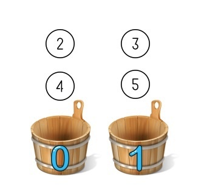

这时我们嫌桶太少要给哈希表扩容加了一个新桶，这时候所有的数字就需要模 3 来确定分在哪个桶里，结果就变成了：

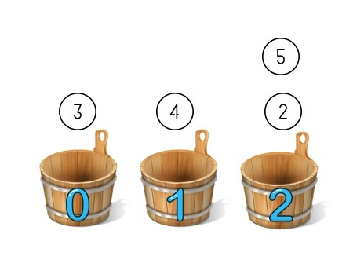

可以看到新加了一个桶后**所有数字的分布都变了**，这就意味着哈希表的每次扩展和收缩都会导致所有条目分布的**重新计算**，这个特性在某些场景下是不可接受的。比如分布式的存储系统，每个桶就相当于一个机器，文件分布在哪台机器由哈希算法来决定，这个系统想要加一台机器时就需要停下来等所有文件重新分布一次才能对外提供服务，而当一台机器掉线的时候尽管只掉了一部分数据，但所有数据访问路由都会出问题。这样整个服务就无法平滑的扩缩容，成为了有状态的服务。

要想实现无状态化，就要用到一致性哈希了，一致性哈希中假想我们有很多个桶，先定一个小目标比如 7 个，但一开始真实还是只有两个桶，编号是 3 和 6。哈希算法还是同样的取模，只不过现在分桶分到的很可能是不存在的桶，那么就往下找找到第一个真实存在的桶放进去。这样 2 和 3 都被分到了编号为 3 的桶， 4 和 5 被分到了编号为 6 的桶。

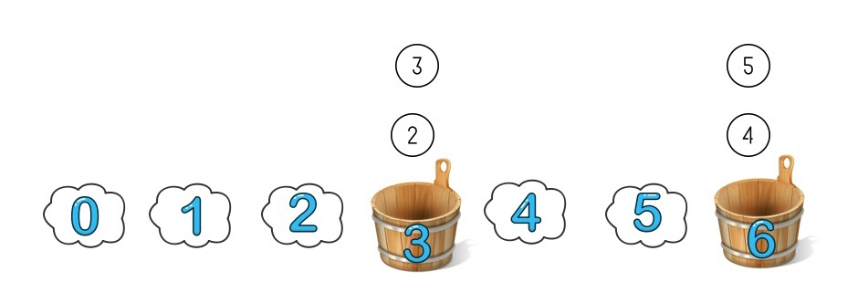

这时候再添加一个新的桶，编号是 4，取模方法不变还是模 7：

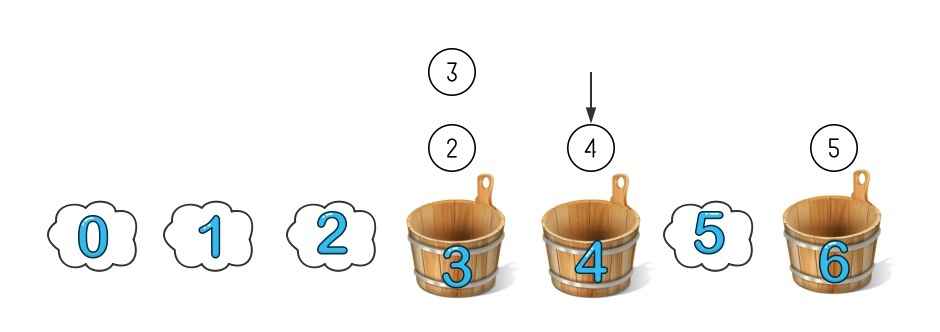

因为 3 号桶里都是取模小于等于 3 的，**4 号桶只需要从 6 号桶里拿走属于它的数字就可以了**，这种情况下只需要调整一个桶的数字就可分成了重新分布。可以想象下即使有 1 亿个桶，增加减少一个桶也**只会影响一个桶的数据分布**。

这样增加一个机器只需要和他后面的机器同步一下数据就可以开始工作了，下线一个机器需要先把他的数据同步到后面一台机器再下线。如果突然掉了一台机器也只会影响这台机器上的数据。实现中可以让每台机器同步一份自己前面机器的数据，这样即使掉线也不会影响这一部分的数据服务。

这里还有个小问题要是编号为 6 的机桶下线了，它没有后一个桶了，数据该咋办？为了解决这个问题，实现上通常把哈希空间做成**环状**，这样 3 就成了 6 的下一桶，数据给 3 就好了：

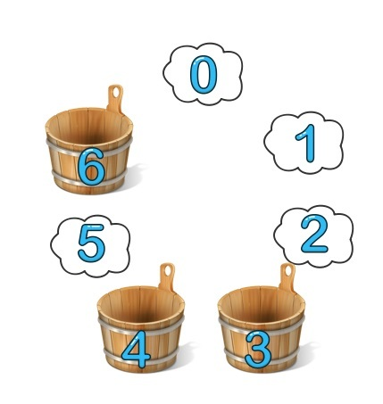

用一致性哈希还能实现部分的分布式系统无锁化，每个任务有自己的编号，由于哈希算法的确定性，分到哪个桶也是确定的就不存在争抢，也就不需要分布式锁了。

既然一致性哈希有这么多好的特性，那为啥主流的哈希都是非一致的呢？主要一个原因在于**查找效率**上，普通的哈希**查询一次哈希计算**就可以找到对应的桶了，算法时间复杂度是 O(1)，而一致性哈希需要将排好序的桶**组成一个链表，然后一路找下去**，**k 个桶查询时间复杂度是 O(k)**，所以通常情况下的哈希还是用不一致的实现。

当然 O(k) 的时间复杂度对于哈希来说还是不能忍的，想一下都是O(k) 这个量级了用哈希的意义在哪里？既然是在排好序的桶里查询，很自然的想法就是二分了，能把时间复杂度降到 O(logk)，然而桶的组合需要不断的增减，所以是个链表的实现，二分肯定就不行了，**可以用跳转表进行一个快速的跳转也能实现 O(logk) 的时间复杂度**。

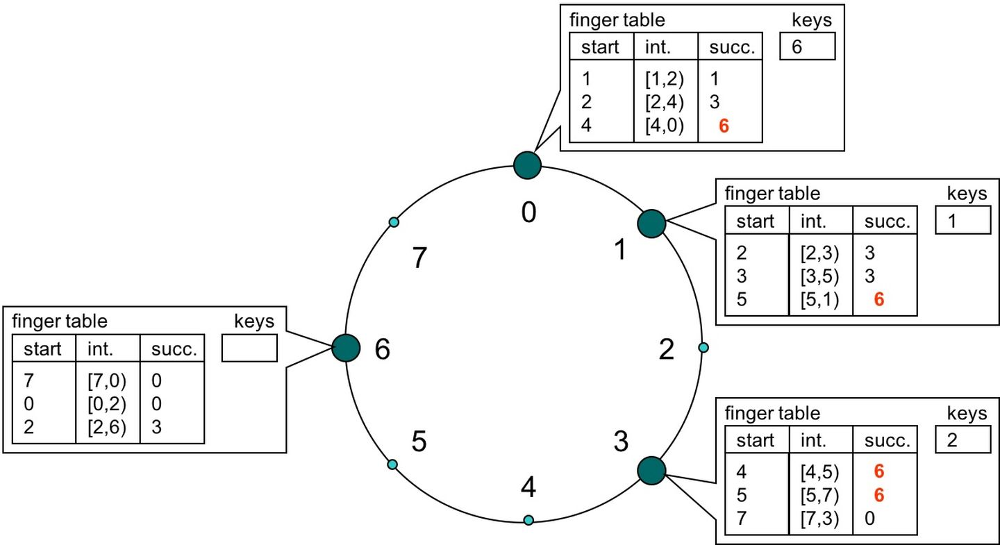

在这个跳转表中，每个桶记录距离自己 1，2，4 距离的数字所存的桶，这样不管查询落在哪个节点上，对整个哈希环上任意的查询一次都可以至少跳过一半的查询空间，这样递归下去很快就可以定位到数据是存在哪个桶上。

当然这都只是一致性哈希实现方式中的**一种**，还有很多实现上的变体。比如选择数字放在哪个桶，上面的介绍里是选择顺着数字下去出现的第一个桶，其实也可以选择距离这个数字最近的桶，这样实现和后面的跳转表规则也会有变化。同样跳转表也有多种不同的算法实现，比如 CAN，Chord，Tapestry，Pastry 这四种 DHT 的实现。

## 优缺点

优点:在分布式缓存中

- 冗余少
- 负载均衡
- 过渡平滑
- 存储均衡
- 关键词单调

缺点：

- 可能存在Hash**偏斜**，也就是如果节点的数量很少，而hash环空间很大，直接进行一致性hash上去，大部分情况下节点在环上的位置会很不均匀，挤在某个很小的区域，造成分布式缓存集群的每个实例存储的缓存数据不一致，eg：

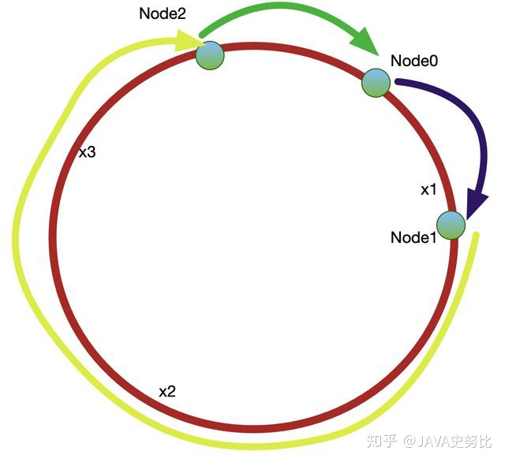

- 缓存雪崩

  如果每个节点在环上只有一个节点，那么可以想象，当某一集群从环中消失时，它原本所负责的任务将全部交由顺时针方向的下一个集群处理。例如，当group0退出时，它原本所负责的缓存将全部交给group1处理。这就意味着group1的访问压力会瞬间增大。设想一下，如果group1因为压力过大而崩溃，那么更大的压力又会向group2压过去，最终服务压力就像滚雪球一样越滚越大，最终导致雪崩。

### 解决

解决上述两个问题比较好的办法就是扩展整个换上的节点数量，也即引入虚拟节点（**对每一个服务节点计算多个哈希，每个计算结果位置都放置一个此服务节点，称为虚拟节点**，同时数据定位算法不变，只是多了一步虚拟节点到实际节点的映射，例如定位到“Node A#1”、“Node A#2”、“Node A#3”三个虚拟节点的数据均定位到Node A上。），一个实例节点映射多个虚拟节点，这样hash环上的空间分割就会变的均匀，同时，引入虚拟节点还会使得节点在Hash环上的顺序随机化，这意味着当一个真实节点失效退出后，它原来所承载的压力将会均匀地分散到其他节点上去
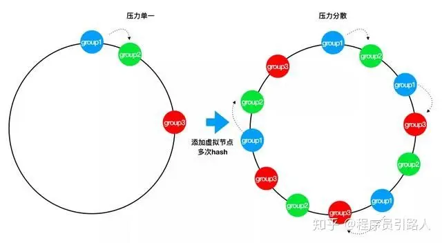

## 简单实现

~~~java
import java.util.SortedMap;
import java.util.TreeMap;

/**
 * 一致性hash算法(包含虚拟节点)
 */
public class ConsistentHashWithVirtual {
public static void main(String[] args) {
    //step1：定义server服务器的ip值映射到哈希环上
    String[] tomcatServers = new String[]{"123.111.0.0","123.101.3.1","111.20.35.2","123.98.26.3"};

    //使用sortedMap模拟哈希环
    SortedMap<Integer,String> serverMap = new TreeMap<Integer, String>();

    //定义虚拟节点的数量
    int virtualCount = 3;

    for(String tomcatServer:tomcatServers){
        //计算每个服务器id的哈希值
        int serverHash = Math.abs(tomcatServer.hashCode());

        //将服务端哈希值以及其ip地址的对应关系存储到sortedMap中
        serverMap.put(serverHash,tomcatServer);

        //配置虚拟节点
        for(int i = 0;i<virtualCount;i++){
            //计算虚拟节点的哈希值
            int virtualHash = Math.abs((tomcatServer+"#"+i).hashCode());

            //将虚拟节点哈希值与服务器关系存储到
            serverMap.put(virtualHash,"由虚拟节点"+i+"映射过来的请求:"+tomcatServer);
        }
    }

    //step2:针对客户端的ip计算出对应的哈希值
    String[] clientServers = new String[]{"10.78.12.3","113.25.63.1","126.12.3.8"};

    for(String clientServer:clientServers){
        int clientHash = Math.abs(clientServer.hashCode());

        //step3:看客户端的ip能够被哪个服务器所处理
        //顺时针获取比这个客户端ip的hash值大的服务
        SortedMap<Integer, String> integerStringSortedMap = serverMap.tailMap(clientHash);
        if(integerStringSortedMap.isEmpty()){
            //如果查询出来为空的，那么取哈希环上的第一个值
            Integer integer = serverMap.firstKey();

            System.out.println("客户端:"+clientServer+"路由到的tomcat服务器ip为"+serverMap.get(integer));
        }else{
            Integer integer = integerStringSortedMap.firstKey();

            System.out.println("客户端:"+clientServer+"路由到的tomcat服务器ip为"+serverMap.get(integer));
        }
    }
}
}
~~~

## Redis与一致性哈希

Redis Cluster 里并没有使用一致性哈希算法，而是用了哈希槽的概念，

Redis单`Master`实例提供读写服务，仍然有容量和压力问题，因此需要数据分区，构建多个`Master`实例同时提供读写服务（不仅限于从`replica`节点提供读服务）。

那么就需要一定的机制保证**数据分区**。这样能充分把容量分摊到多台计算机，或能充分利用多核计算机的性能。

并且数据在各个主Master节点间不能混乱，当然最好还能支持在线数据热迁移的特性

### 数据分区方案

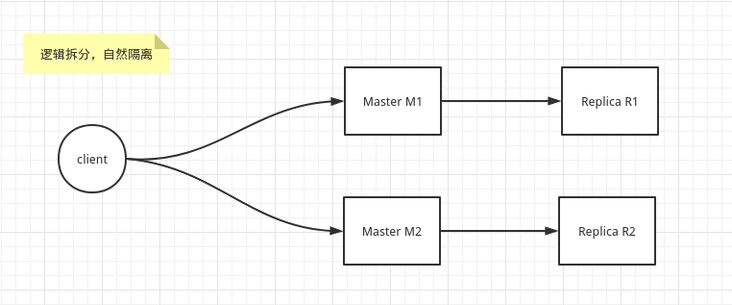

针对数据分区，一般来说，分为两个大类：

- 逻辑拆分：

逻辑上能拆分，比如 Redis 中的 M1 节点 存储 A服务需要的业务数据，而 Redis 中的 M2 节点存储 B服务需要的业务数据。

- 数据分区：

当逻辑上不能拆分，那么只能按数据来拆分，需要保证客户端读和写数据一致。
因此需要一个高效快速的数据结构来路由对应的`Master`节点。
最容易想到的就是类比 Java 中的 `HashMap`， 采用 哈希算法，快速找到，快速设置。
这里有四种方式，分别是固定取模，随机，哈希一致性，哈希槽。

**固定取模**

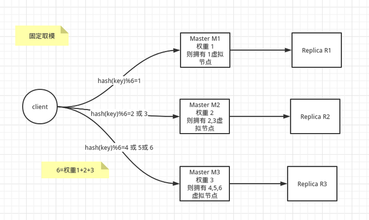

因为取模的模数是固定的，当新增或删除 master节点时，所有的数据几乎要全部洗牌，几乎需要重新迁移数据（而且相当麻烦），无法做到在线数据热迁移。
意味着Redis在此种用法下，只能当缓存，不能当存储数据库！

**随机**

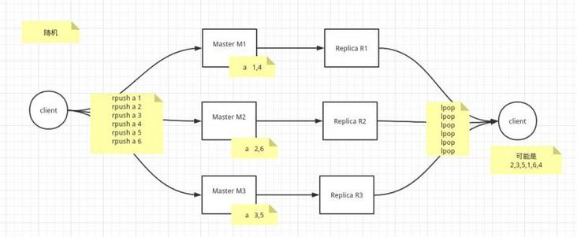

随机选取一个存储和访问。
一般结合 `list`，用于非顺序性要求的消息队列场景。

- 缺点：

使用场景比较单一。
并且由于随机性问题，导致持久化存在不可靠性。Redis在此种用法下，也只能当缓存，不能当存储数据库！

**一致性哈希**

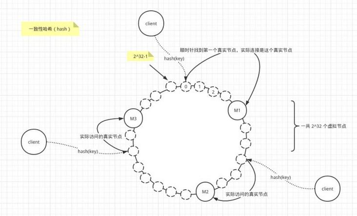

- 1.有一个HASH环，环上每个节点都是一个自然数，从0开始顺时针递增，直到2^32-1，最后回到0
- 2.真实节点 M1 M2 M3 通过 hash（IP 或主机名）确定在哈希环上的位置
- 3.当客户端请求时，首先 hash(key) 确定在哈希环上的位置，然后顺时针往后找，找到的第一个真实节点，就是客户端需要请求访问的真实主机
- 优点：

哈希一致性其实是对固定取模的一种优化。
（1）扩展性：当增加节点时，只会影响顺时针的真实节点（此部分数据比较难迁移），而不是影响全部的节点。
（2）容错性：当节点宕机或删除节点时，只会影响逆时针的真实节点，而不是影响全部的节点。
（3）平衡性：当哈希算法的节点过少时，会可能造成某些服务器的数据存储较多，而另外一些存储较少，造成数据倾斜，当节点足够多时，这种现象得以缓解。
因此虚拟节点个数较大的时候，数据的平衡性得以保证。

- 缺点：

因为当增删节点时，需要重新计算受影响部分的节点中的key全部找出来，才能迁移，这个很麻烦！
Redis在此种用法下，也只能当缓存，不能当存储数据库！

**哈希槽**

与一致性哈希区别在于，它预先分配好真实节点管理的哈希槽（`slot`），并存储管理起来，我们可以预先知道哪个master主机拥有哪些哈希槽（`slot`）,这里总数是16384。

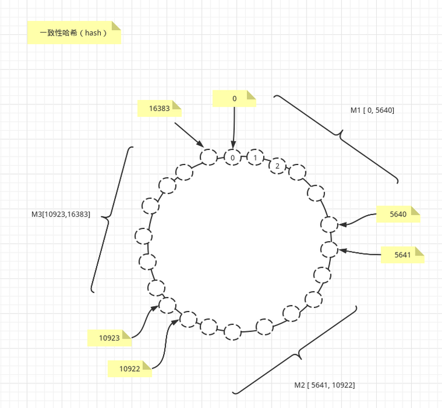

~~~shell
127.0.0.1:7001> cluster nodes
2aaf59558f1b9f493a946a695e51711eb03d15f9 127.0.0.1:7002@17002 master - 0 1590126183862 2 connected 5461-10922
6439c3e9468fd2c545a63b3b9bfe658c5fc14287 127.0.0.1:7003@17003 master - 0 1590126181856 3 connected 10923-16383
340d985880c23de9816226dff5fd903322e44313 127.0.0.1:7001@17001 myself,master - 0 1590126182000 1 connected 0-5460
~~~

可以清晰看到Redis Cluster中的每一个master节点管理的哈希槽。
比如 127.0.0.1:7001 拥有哈希槽 0-5460， 127.0.0.1:7002 拥有哈希槽 5461-10922， 127.0.0.1:7003 拥有哈希槽 10923-16383。

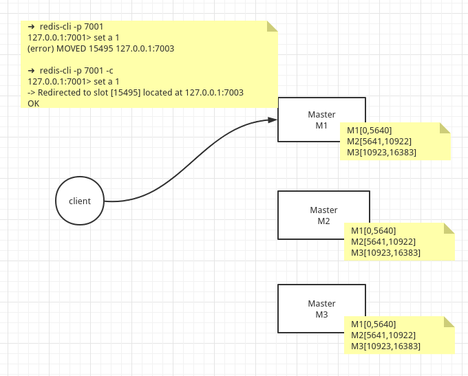

~~~shell
➜  redis-cli -p 7001         
127.0.0.1:7001> set a 1
(error) MOVED 15495 127.0.0.1:7003

➜  redis-cli -p 7001 -c
127.0.0.1:7001> set a 1
-> Redirected to slot [15495] located at 127.0.0.1:7003
OK
~~~

我们看到的是master节点在 Redis Cluster中的实现时，都存有所有的路由信息。
当客户端的key 经过hash运算，发送`slot` 槽位不在本节点的时候。
（1）如果是非集群方式连接，则直接报告错误给client，告诉它应该访问集群中那个IP的master主机。
（2）如果是集群方式连接，则将客户端重定向到正确的节点上。
注意这里并不是127.0.0.1:7001 帮client去连接127.0.0.1:7003获取数据的，而是将客户端请求重定向了。

- 优点：

继承并增强一致性哈希的容错性，扩展性，以及平衡性。
Redis在此种用法下，可以当缓存，也能当存储数据库！

Redis Cluster 是Redis的集群实现，内置数据自动分片机制，集群内部将所有的key映射到16384个Slot中，集群中的每个Redis Instance负责其中的一部分的Slot的读写。集群客户端连接集群中任一Redis Instance即可发送命令，当Redis Instance收到自己不负责的Slot的请求时，会将负责请求Key所在Slot的Redis Instance地址返回给客户端，客户端收到后自动将原请求重新发往这个地址，对外部透明。一个Key到底属于哪个Slot由crc16(key) % 16384 决定。

> 当你往Redis Cluster中加入一个Key时，会根据crc16(key) mod 16384计算这个key应该分布到哪个hash slot中，一个hash slot中会有很多key和value。你可以理解成表的分区，使用单节点时的redis时只有一个表，所有的key都放在这个表里；改用Redis Cluster以后会自动为你生成16384个分区表，你insert数据时会根据上面的简单算法来决定你的key应该存在哪个分区，每个分区里有很多key。

**为什么RedisCluster会设计成16384个槽呢**

- Normal heartbeat packets carry the full configuration of a node, that can be replaced in an idempotent way with the old in order to update an old config. This means they contain the slots configuration for a node, in raw form, that uses 2k of space with16k slots, but would use a prohibitive 8k of space using 65k slots.
- At the same time it is unlikely that Redis Cluster would scale to more than 1000 mater nodes because of other design tradeoffs.

So 16k was in the right range to ensure enough slots per master with a max of 1000 maters, but a small enough number to propagate the slot configuration as a raw bitmap easily. Note that in small clusters the bitmap would be hard to compress because when N is small the bitmap would have slots/N bits set that is a large percentage of bits set.

**1.如果槽位为65536，发送心跳信息的消息头达8k，发送的心跳包过于庞大。**

如上所述，在消息头中，最占空间的是 `myslots[CLUSTER_SLOTS/8]`。 当槽位为65536时，这块的大小是: `65536÷8÷1024=8kb`因为每秒钟，redis节点需要发送一定数量的ping消息作为心跳包，如果槽位为65536，这个ping消息的消息头太大了，浪费带宽。

**2.redis的集群主节点数量基本不可能超过1000个。**

如上所述，集群节点越多，心跳包的消息体内携带的数据越多。如果节点过1000个，也会导致网络拥堵。因此redis作者，不建议redis cluster节点数量超过1000个。 那么，对于节点数在1000以内的redis cluster集群，16384个槽位够用了。没有必要拓展到65536个。

**3.槽位越小，节点少的情况下，压缩率高**

Redis主节点的配置信息中，它所负责的哈希槽是通过一张bitmap的形式来保存的，在传输过程中，会对bitmap进行压缩，但是如果bitmap的填充率slots / N很高的话(N表示节点数)，bitmap的压缩率就很低。 如果节点数很少，而哈希槽数量很多的话，bitmap的压缩率就很低。

而16384÷8÷1024=2kb

