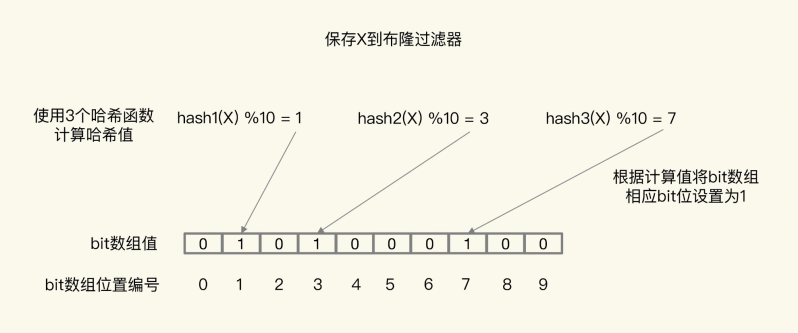
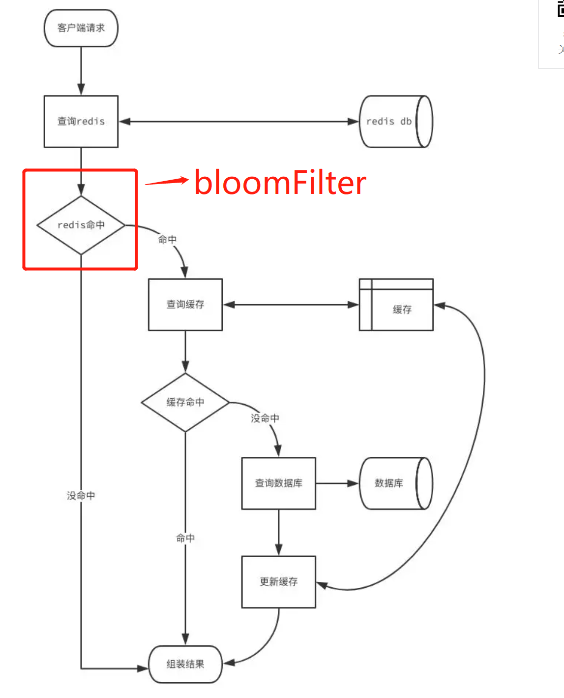
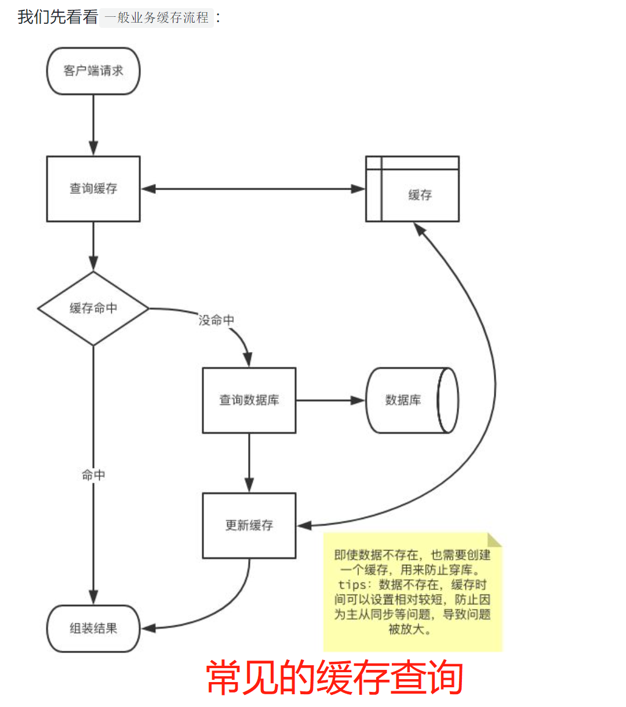

# 布隆过滤器

[TOC]

## 简介

用于查询类似于“**x是否在集合中？某样东西一定不存在或者可能存在**”这类问题，且非常节省空间的数据结构，但不支持删除。

相比于传统的 List、Set、Map 等数据结构，它更高效、占用空间更少，但是缺点是其返回的结果是**概率性的，而不是确切的**。

布隆过滤器 本质上 是由长度为 m 的位向量或位列表（仅包含 0 或 1 位值的列表）组成，最初所有的值均设置为 0

- 向布隆过滤器中添加数据时，会使用 多个 hash 函数对 key 进行运算，然后对位数组长度进行取模运算得到一个位置，每个 hash 函数都会算得一个不同的位置。再把位数组的这几个位置**都置为 1 就完成了 add 操作**。
- 判断数据是否存在时，同样使用多个hash函数计算key，只要有一个位为 0，说明key不存在。但是都是1，并不能说明key必定存在，可能位置都是其他元素添加导致的，因此说存在一定的误判率。
- 布隆过滤器有两关键的参数，一个是元素大小，一个是误差率。当误差率设置越小，布隆过滤器需要的空间越大。

- 数据结构： bitmap 比特位的集合。bitmap是一个以比特为基本单位的数组，如一个int类型32个比特，那我们使用比特来应用就可以节省很大的空间。

## 原理

### 标记

首先，使用N个哈希函数，分别计算这个数据的哈希值，得到N个哈希值

然后，把这N和哈希值对 bit 数组的长度取模，得到每个哈希值在数组中的对应位置

最后，把对应位置的 bit 位设置为1，完成标记数据的操作

### 计算比较

当需要查询某个数据时，执行上述过程，得到这个数据在 bit 数组中对应的N个位置，查看 bit 数组中这N个位置上的 bit 值，只要这 N 个 bit 值有⼀个不为 1，就表明布隆过滤器没有对该数据做过标记， 所以，查询的数据⼀定没有在数据库中保存

## 缺点

**存在误判**

由于采⽤固定bit的数组，使⽤多个哈希函数映射 到多个bit上，有可能会导致两个不同的值都映射 到相同的⼀组bit上。

误判本质是因为**哈希冲突**，降低误判的⽅法是增加哈希函数 + 扩⼤整个bit数组的⻓度，但增加哈希函数意味着影响性能，扩⼤数组⻓度意味着空间占⽤变⼤，所以使⽤布隆过滤器，需要在误判率和性能、空间作⼀个平衡。

布隆过滤器可以放在缓存和数据库的最前面，不存在就不再访问缓存和数据库

## 应用场景

- 大数据判断是否存在：这就可以实现出上述的去重功能，如果你的服务器内存足够大的话，那么使用 HashMap 可能是一个不错的解决方案，理论上时间复杂度可以达到 O(1 的级别，但是当数据量起来之后，还是只能考虑布隆过滤器。
- 解决缓存穿透：我们经常会把一些热点数据放在 Redis 中当作缓存，例如产品详情。通常一个请求过来之后我们会先查询缓存，而不用直接读取数据库，这是提升性能最简单也是最普遍的做法，但是 如果一直请求一个不存在的缓存，那么此时一定不存在缓存，那就会有 大量请求直接打到数据库 上，造成 缓存穿透，布隆过滤器也可以用来解决此类问题。
  - 布隆过滤器有一个可以预判误判率的公式，查询缓存可能误判的名单存在，进行正常的查询。
- 爬虫/ 邮箱等系统的过滤：平时不知道你有没有注意到有一些正常的邮件也会被放进垃圾邮件目录中，这就是使用布隆过滤器 误判 导致的。
- 应用介绍：在查询缓存的前面加一层布隆过滤器的过滤判断，判断缓存是否存在。

