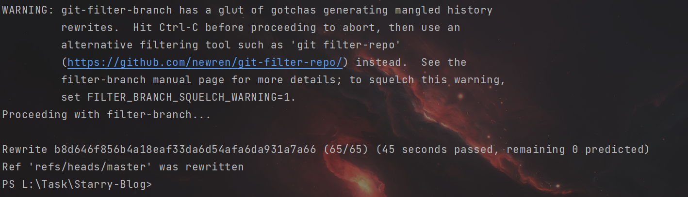

# 

Git

遇到一个小问题，记录一下解决的一个办法

> 怎么在Git提交历史里面把一个文件（包括上传，修改）的记录删除

~~~shell
git filter-branch --force --prune-empty --index-filter 'git rm -rf --cached --ignore-unmatch 文件路径' --tag-name-filter cat -- --all
~~~

`filter-branch`  是让git重写每一个分支，

`--force` 假如遇到冲突也让git强制执行，

`--index-filter` 选项指定重写的时候应该执行什么命令，要执行的命令紧跟在它的后面，在这里就是`git rm --cached --ignore-unmatch password.txt` ，让git删除掉缓存的文件，如果有匹配的话。

`--prune-empty` 选项告诉git，如果因为重写导致某些commit变成了空（比如修改的文件全部被删除），那么忽略掉这个commit。

`--tag-name-filter` 表示对每一个tag如何重命名，重命名的命令紧跟在后面，当前的tag名会从标注输入送给后面的命令，用cat就表示保持tag名不变。

紧跟着的`--` 表示分割符，

最后的`--all` 表示对所有的文件都考虑在内。

