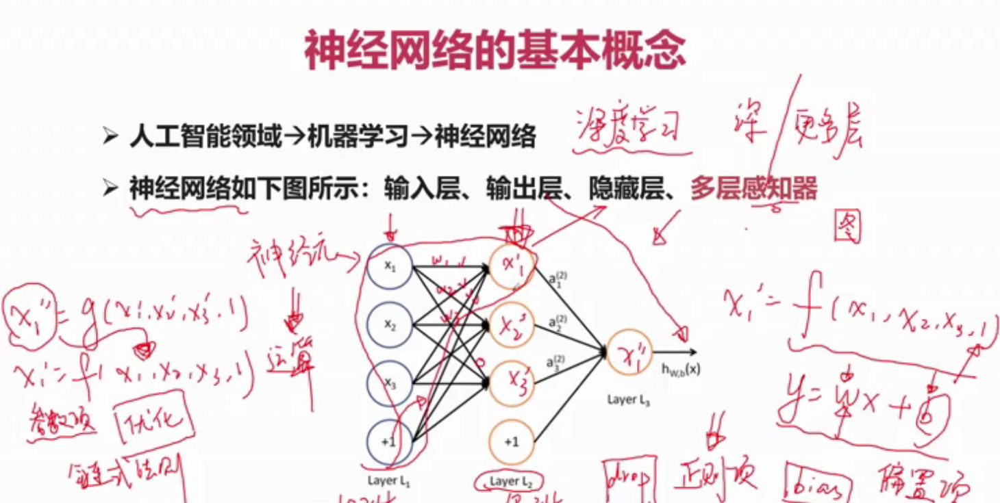
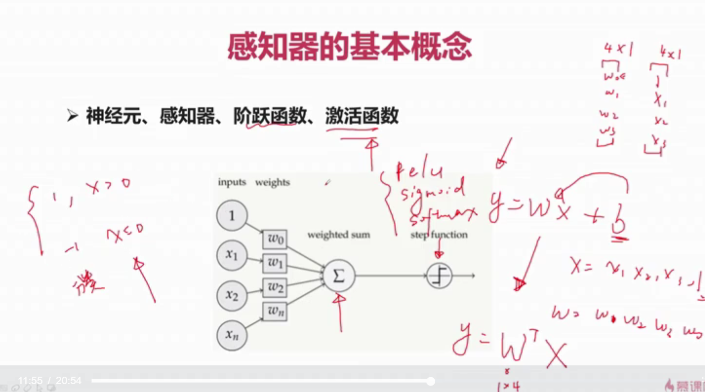
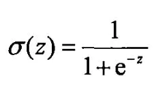
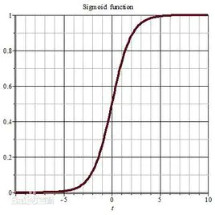
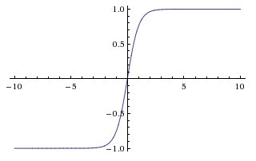
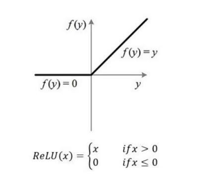

# 神经网络

[TOC]

## 基本概念

## 感知器

> 多层感知器 -> 神经网络
>
> 多隐层的多层感知器 -> 深度学习

## 偏置

**bias**，做模式识别，本质是要提取某种全局信息，所以提取的过程就是要抛弃局部信息保留整体信息，增加偏置这个参数，就是调整丢弃的局部信息的比例或者能量，没有这个参数，对信息的抛弃率的调整的灵活性就欠缺。

## 激活函数

**Activation Function**，负责将神经元的输入映射到输出端

如果不用激活函数，每一层输出都是上层输入的线性函数，无论神经网络有多少层，输出都是输入的线性组合，这种情况就是最原始的感知机（Perceptron）。

如果使用的话，激活函数给神经元引入了非线性因素，使得神经网络可以任意逼近任何非线性函数，这样神经网络就可以应用到众多的非线性模型中。

## sigmoid函数

可以看到在趋于正无穷或负无穷时，函数趋近平滑状态，sigmoid函数因为输出范围（0，1），所以二分类的概率常常用这个函数，事实上logisti回归采用这个函数很多教程也说了以下几个优点

  1 值域在0和1之间

  2  函数具有非常好的对称性

  函数对输入超过一定范围就会不敏感

sigmoid的输出在0和1之间，我们在二分类任务中，采用sigmoid的输出的是事件概率，也就是当输出满足满足某一概率条件我们将其划分正类，不同于svm。

> sigmoid的梯度最大是0.25，sigmoid 导数：f(x)' = f(x)*(1-f(x)) 看做是二次函数，
> f(x)的范围为(0,1)，取极值点是0.5，所以：f(x)'为(0,1/4]

### Tanh函数

Tanh是双曲函数中的一个，Tanh()为双曲正切。在数学中，双曲正切“Tanh”是由基本双曲函数双曲正弦和双曲余弦推导而来。公式如下

函数图像如下

## ReLU函数

Relu激活函数（The Rectified Linear Unit），用于隐层神经元输出。公式如下

函数图像如下

