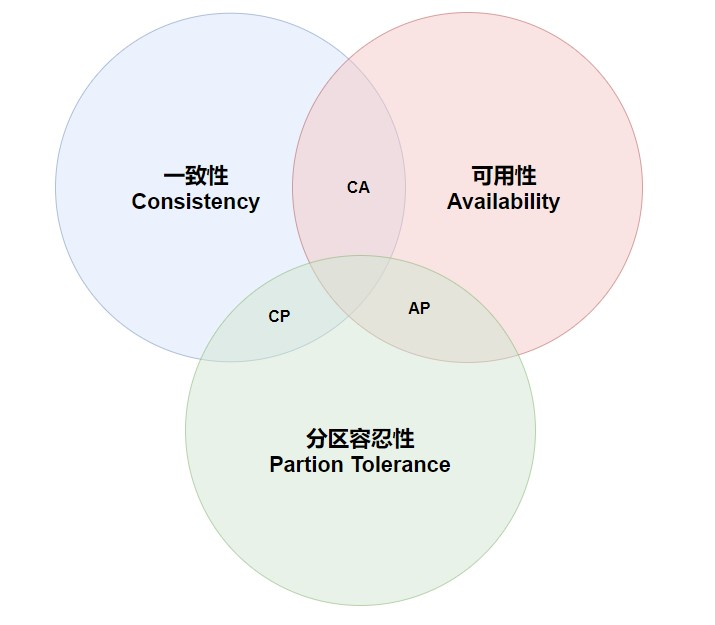

# CAP

网络本身就是不确定性的，所以P不可避免，如果放弃了P，意味着单体失去了可扩展性，一般分布式系统都应该要求P，在A和C中寻求平衡

C: 分布式系统中开始于写入完成之后的读操作必须返回写入的值或者结果，这里先后顺序通常是指逻辑时钟。 
A: 分布式系统中被一个未失效(non-failing) 的节点所接受到的请求必须返回一个响应结果。

也就是说，分区环境下，要么不响应，但响应必须是正确的数据

从定义上就可以证明，由于存在分区故障，所以CA无法共存

