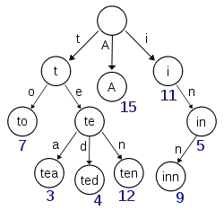
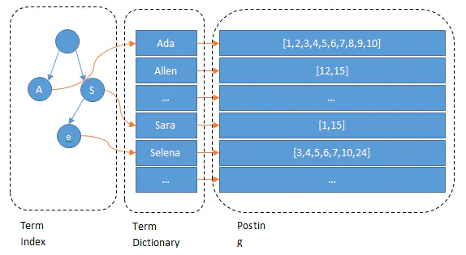
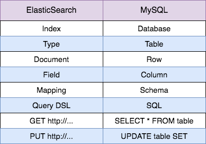

# ElasticSearch

[TOC]

| ID   | Name | Age  | Sex    |
| ---- | ---- | ---- | ------ |
| 1    | Kate | 24   | Female |
| 2    | John | 24   | Male   |
| 3    | Bill | 29   | Male   |

**Name:**

| Term | Posting List |
| ---- | ------------ |
| Kate | 1            |
| John | 2            |
| Bill | 3            |

**Age:**

| Term | Posting List |
| ---- | ------------ |
| 24   | [1,2]        |
| 29   | 3            |

**Sex:**

| Term   | Posting List |
| ------ | ------------ |
| Female | 1            |
| Male   | [2,3]        |

**Posting List**

Elasticsearch分别为每个field都建立了一个倒排索引，Kate, John, 24, Female这些叫term，而[1,2]就是**Posting List**。Posting list就是一个int的数组，存储了所有符合某个term的文档id

Elasticsearch为了能快速找到某个term，将所有的term排个序，二分法查找term，logN的查找效率

B-Tree通过减少磁盘寻道次数来提高查询性能，Elasticsearch也是采用同样的思路，直接通过内存查找term，不读磁盘，但是如果term太多，term dictionary也会很大，放内存不现实，于是有了**Term Index**，就像字典里的索引页一样，A开头的有哪些term，分别在哪页，可以理解term index是一颗树：

这棵树不会包含所有的term，它包含的是term的一些前缀。通过term index可以快速地定位到term dictionary的某个offset，然后从这个位置再往后顺序查找。

所以term index不需要存下所有的term，而仅仅是他们的一些**前缀**与Term Dictionary的block之间的**映射关系**，再结合FST(Finite State Transducers)的压缩技术，可以使term index缓存到内存中。从term index查到对应的term dictionary的block位置之后，再去磁盘上找term，大大减少了磁盘随机读的次数。

## 与MySQL比较

MySQL 有 B+ 树索引，而 ElasticSearch 则是倒排索引 (Inverted Index)，它通过倒排索引来实现比 MySQL 更快的过滤和复杂条件的查询，此外，全文搜索功能也是依赖倒排索引才能实现。

