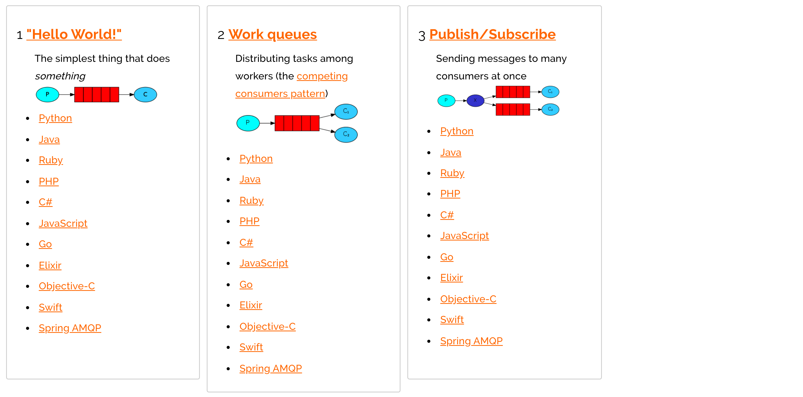
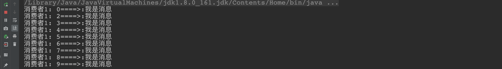
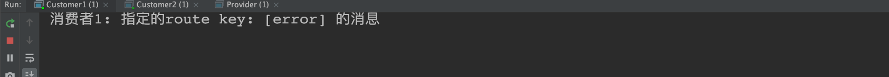
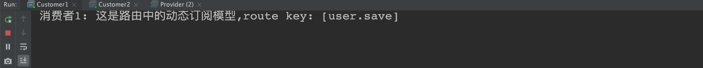
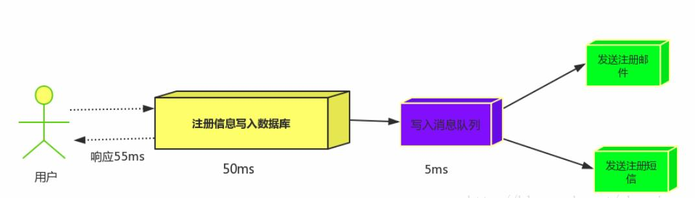

# RabbitMQ 基础

[TOC]

## 1.MQ引言

### 1.1 什么是MQ

`MQ`(Message Quene) :  翻译为 `消息队列`,通过典型的 `生产者`和`消费者`模型,生产者不断向消息队列中生产消息，消费者不断的从队列中获取消息。因为消息的生产和消费都是`异步的`，而且只关心消息的发送和接收，没有业务逻辑的侵入,轻松的实现系统间解耦。别名为 `消息中间件`	通过利用高效可靠的消息传递机制进行平台无关的数据交流，并基于数据通信来进行分布式系统的集成。

### 1.2 MQ有哪些

当今市面上有很多主流的消息中间件，如老牌的`ActiveMQ`、`RabbitMQ`，炙手可热的`Kafka`，阿里巴巴自主开发`RocketMQ`等。

### 1.3 不同MQ特点

```markdown
# 1.ActiveMQ
		ActiveMQ 是Apache出品，最流行的，能力强劲的开源消息总线。它是一个完全支持JMS规范的的消息中间件。丰富的API,多种集群架构模式让ActiveMQ在业界成为老牌的消息中间件,在中小型企业颇受欢迎!

# 2.Kafka
		Kafka是LinkedIn开源的分布式发布-订阅消息系统，目前归属于Apache顶级项目。Kafka主要特点是基于Pull的模式来处理消息消费，
		追求高吞吐量，一开始的目的就是用于日志收集和传输。0.8版本开始支持复制，不支持事务，对消息的重复、丢失、错误没有严格要求，
		适合产生大量数据的互联网服务的数据收集业务。

# 3.RocketMQ
		RocketMQ是阿里开源的消息中间件，它是纯Java开发，具有高吞吐量、高可用性、适合大规模分布式系统应用的特点。RocketMQ思路起
		源于Kafka，但并不是Kafka的一个Copy，它对消息的可靠传输及事务性做了优化，目前在阿里集团被广泛应用于交易、充值、流计算、消
		息推送、日志流式处理、binglog分发等场景。

# 4.RabbitMQ
		RabbitMQ是使用Erlang语言开发的开源消息队列系统，基于AMQP协议来实现。AMQP的主要特征是面向消息、队列、路由（包括点对点和
		发布/订阅）、可靠性、安全。AMQP协议更多用在企业系统内对数据一致性、稳定性和可靠性要求很高的场景，对性能和吞吐量的要求还在
		其次。
		
```

> RabbitMQ比Kafka可靠，Kafka更适合IO高吞吐的处理，一般应用在大数据日志处理或对实时性（少量延迟），可靠性（少量丢数据）要求稍低的场景使用，比如ELK日志收集。

---

## 2.RabbitMQ浅析

### 2.1 RabbitMQ架构


> 基于`AMQP`协议，erlang语言开发，是部署最广泛的开源消息中间件,是最受欢迎的开源消息中间件之一。

`官网`: https://www.rabbitmq.com/

`官方教程`: https://www.rabbitmq.com/#getstarted


### 2.2 AMQP协议

> 生产者产生消息，Routing Key可以看作是Message的信封，指定消息的路由转发，通过队列到Broker代理接收分发消息，Queue相当于快递驿站，等待消费者消费

> 发送者不能直接将消息发送给最终队列，必须发送给交换机
>
> 消息根据路由规则，消息由交换机转发给队列
>
> 消费者从队列将消息取走

> 交换机数量不能过多，一般来说同一个业务，或者同一类业务使用同一个交换机
>
> 合理设置队列数量，一般来说一个微服务监听一个队列，或者一个微服务的一个业务监听一个队列
>
> 合理配置交换机类型，使用Topic模式时仔细设置绑定键


> AMQP协议或者是在rabbitmq实现中，最核心的组件是**Exchange**
>
> Exchange承担RabbitMQ的核心功能 -> **路由转发** （根据**绑定关系**和**路由键**为消息提供路由，将消息转发至相应的队列）

> AMQP是一个异步消息传递所使用的**应用层协议规范**，AMQP客户端能够无视消息来源任意发送和接受消息，**Broker（中间人）提供消息的路由、队列等功能**。Broker主要由**Exchange和Queue组成**：Exchange负责接收消息、转发消息到绑定的队列；Queue存储消息，提供持久化、队列等功能。AMQP客户端通过Channel与Broker通信，Channel是多路复用连接中的一条独立的双向数据流通道。

```markdown
 # AMQP 协议
 		AMQP（advanced message queuing protocol）`在2003年时被提出，最早用于解决金融领不同平台之间的消息传递交互问题。顾名思义，AMQP是一种协议，更准确的说是一种binary wire-level protocol（链接协议）。这是其和JMS的本质差别，AMQP不从API层进行限定，而是直接定义网络交换的数据格式。这使得实现了AMQP的provider天然性就是跨平台的。以下是AMQP协议模型:
```


### 2.3 四种交换机（Exchange）

Exchange有四种类型 分别是：

1. Direct（RoutingKey=BindingKey，容易配置和使用）
2. Fanout（群发绑定的所有队列，适用于消息广播）
3. Topic（功能较为复杂，但能降级为Direct，建议优先使用，为日后拓展留余地）
4. Headers（较少使用）

#### Direct Exchange


比如路由键是奶茶，那么将会是


注意是找BindingKey和RoutingKey是否一致，而不是队列的名称，比如说，如果RoutingKey是coffee，那么将会被丢弃


#### Fanout Exchange


#### Topic Exchange


比如，把消息传递规则定义如下：


对应的：


匹配如下：


> AMQP协议直接决定了RabbitMQ的内部结构和外部行为
>
> 对于发送者来说，将消息发送给特定的Exchange
>
> 消息经过Exchange路由后，到达具体队列
>
> 消费者将消息从监听的队列中取走


### 2.4 六种工作模式

1. Simple简单模式：一个生产者，一个消费者。
2. Work工作模式（资源的竞争）：**一个生产者，多个消费者**，每个消费者获取到的消息唯一。
3. Publish/Subscribe发布订阅（共享资源）：一个生产者发送的消息会**被多个消费者获取**。
4. Routing模式（路由）：消息生产者将消息发送给交换机按照路由判断,路由是字符串(info) 当前产生的消息携带路由字符(对象的方法),交换机根据路由的key,只能匹配上路由key对应的消息队列,对应的消费者才能消费消息
5. Topic模式（路由模式的一种）：交换机根据key的规则模糊匹配到对应的队列，由队列的监听消费者接收消息消费
6. Rpc模式（不常用）


### 2.5 通过消息日志判断消息被消费了


### 2.6 RabbitMQ死信队列

说白了 就是 没有被消费的消息 换个地方重新被消费

(1) 死信队列就是消息进入另一个交换机，可以修改其routingKey进入另一个队列。发生的情况为：消息被拒绝（basic.reject/ basic.nack）并且不再重新投递 requeue=false、消息TTL过期、队列达到最大长度。

(2)队列和消息都有个TTL生存时间，队列的TTL到达后队列会自动删除，消息不会进入死信队列；消息的生存时间到达后会进入死信队列。消息的生存时间可以在队列设置所有消息的TTL，也可以对某个消息单独设置TTL

(3) 延迟队列就是利用死信队列，给消息设置TTL，到期后进入另一个死信队列，我们可以监听另一个死信队列。

---

死信队列：DLX，dead-letter-exchange。利用DLX，当消息在一个队列中变成死信 (dead message) 之后，它能被重新publish到另一个Exchange，**这个Exchange就是DLX**。DLX是一个正常的交换机，它们可以像普通的交换机一样使用。

 延迟队列：利用死信可以实现延迟队列。 比如设置队列有限期为60s，到期移动到另一个队列。比如订单30s，30s之后移动到另一个死信队列，我们可以监听另一个死信队列。

> 订单服务过期是怎么设计的
>
> 比如说一个场景我们在使用抖音抢购有时候五分钟未下单我们就可以再次抢单。简单的说，用户下单了，库存减一；5分钟未支付，获取到该订单，将商品库存加一。

~~~java
// 生产者：声明队列的消息生存时间、声明死信交换机和路由key
public class Producer {

    public static ConnectionFactory getConnectionFactory() {
        // 创建连接工程，下面给出的是默认的case
        ConnectionFactory factory = new ConnectionFactory();
        factory.setHost("192.168.99.100");
        factory.setPort(5672);
        factory.setUsername("guest");
        factory.setPassword("guest");
        factory.setVirtualHost("/");
        return factory;
    }

    public static void main(String[] args) throws IOException, TimeoutException {
        ConnectionFactory connectionFactory = getConnectionFactory();
        Connection newConnection = null;
        Channel createChannel = null;
        try {
            newConnection = connectionFactory.newConnection();
            createChannel = newConnection.createChannel();

            // 声明一个正常的direct类型的交换机
            createChannel.exchangeDeclare("order.exchange", BuiltinExchangeType.DIRECT);
            // 声明死信交换机为===order.dead.exchange
            String dlxName = "order.dead.exchange";
            createChannel.exchangeDeclare(dlxName, BuiltinExchangeType.DIRECT);
            // 声明队列并指定死信交换机为上面死信交换机
            Map<String, Object> arg = new HashMap<String, Object>();
            arg.put("x-dead-letter-exchange", dlxName);
            // 修改进入死信队列的routingkey，如果不修改会使用默认的routingKey
            arg.put("x-dead-letter-routing-key", "routing_key_myQueue_dead");
            // 设置消息的生存时间是1分钟，超时进入死信队列
            arg.put("x-message-ttl", 60000);
            createChannel.queueDeclare("myQueue", true, false, false, arg);

            // 绑定正常的queue
            createChannel.queueBind("myQueue", "order.exchange", "routing_key_myQueue");

            String message = "订单编号： 001, 订单生成时间： " + (new SimpleDateFormat("yyyy-MM-dd HH:mm:ss").format(new Date()));
            createChannel.basicPublish("order.exchange", "routing_key_myQueue", null, message.getBytes());
        } catch (Exception e) {
            e.printStackTrace();
        } finally {
            if (createChannel != null) {
                createChannel.close();
            }
            if (newConnection != null) {
                newConnection.close();
            }
        }

    }
}
~~~

~~~java
// 消费者： 监听死信交换机和路由key
public class Consumer2 {

    public static ConnectionFactory getConnectionFactory() {
        // 创建连接工程，下面给出的是默认的case
        ConnectionFactory factory = new ConnectionFactory();
        factory.setHost("192.168.99.100");
        factory.setPort(5672);
        factory.setUsername("guest");
        factory.setPassword("guest");
        factory.setVirtualHost("/");
        return factory;
    }

    public static void main(String[] args) throws IOException, TimeoutException {
        ConnectionFactory connectionFactory = getConnectionFactory();
        Connection newConnection = null;
        Channel createChannel = null;
        try {
            newConnection = connectionFactory.newConnection();
            createChannel = newConnection.createChannel();

            createChannel.queueDeclare("order.expiredQueue", true, false, false, null);
            // 队列绑定交换机-channel.queueBind(队列名, 交换机名, 路由key[广播消息设置为空串])
            createChannel.queueBind("order.expiredQueue", "order.dead.exchange", "routing_key_myQueue_dead");
            createChannel.basicConsume("order.expiredQueue", false, "", new DefaultConsumer(createChannel) {
                @Override
                public void handleDelivery(String consumerTag, Envelope envelope, BasicProperties properties,
                        byte[] body) throws IOException {

                    String msg = new String(body, "UTF-8");
                    System.out.println("当前时间： " + (new SimpleDateFormat("yyyy-MM-dd HH:mm:ss").format(new Date())));
                    System.out.println("死信队列中收到的订单信息： " + msg);
                    // 处理超时订单，库存加一
                    
                    // 应答
                    long deliveryTag = envelope.getDeliveryTag();
                    Channel channel = this.getChannel();
                    channel.basicAck(deliveryTag, true);
                }
            });

        } catch (Exception e) {
            e.printStackTrace();
        } finally {
        }

    }
}
~~~

~~~java
当前时间： 2020-11-07 12:52:48
死信队列中收到的订单信息： 订单编号： 001, 订单生成时间： 2020-11-07 12:51:48
~~~


## ３.RabbitMQ执行流程


## 4.RabbitMQ 应用


常用的交换机有以下三种，因为消费者是从队列获取信息的，队列是绑定交换机的（一般），所以对应的消息推送/接收模式也会有以下几种：

**Direct Exchange ：**

　　直连型交换机，根据消息携带的路由键将消息投递给对应队列。

　　大致流程，有一个队列绑定到一个直连交换机上，同时赋予一个路由键 routing key 。

　　然后当一个消息携带着路由值为X，这个消息通过生产者发送给交换机时，交换机就会根据这个路由值X去寻找绑定值也是X的队列。

**Fanout Exchange：**

　　扇型交换机，这个交换机**没有路由键**概念，就算你绑了路由键也是无视的。 这个交换机在接收到消息后，会直接转发到绑定到它上面的**所有队列**。

**Topic Exchange：**

　　主题交换机，这个交换机其实跟直连交换机流程差不多，但是它的特点就是在它的**路由键和绑定键**之间是有规则的。


### 4.0 AMQP协议的回顾


### 4.1 RabbitMQ支持的消息模型




### 4.2 引入依赖

```xml
<dependency>
    <groupId>com.rabbitmq</groupId>
    <artifactId>amqp-client</artifactId>
    <version>5.7.2</version>
</dependency>
```

### 4.3 第一种模型(Direct)


在上图的模型中，有以下概念：

- P：生产者，也就是要发送消息的程序
- C：消费者：消息的接受者，会一直等待消息到来。
- queue：消息队列，图中红色部分。类似一个邮箱，可以缓存消息；生产者向其中投递消息，消费者从其中取出消息。

> 默认的exchange:如果用空字符串去声明一个exchange，那么系统就会使用””AMQP default”这个exchange，我们创建一个queue时,默认的都会有一个和新建queue同名的routingKey绑定到这个默认的exchange上去

  **不会根据生产者去创建，而取决于消费者**

##### 1. 开发生产者

```java
  //创建连接工厂
  ConnectionFactory connectionFactory = new ConnectionFactory();
  connectionFactory.setHost("10.15.0.9");
  connectionFactory.setPort(5672);
  connectionFactory.setUsername("ems");
  connectionFactory.setPassword("123");
  connectionFactory.setVirtualHost("/ems");
  Connection connection = connectionFactory.newConnection();
  //创建通道
  Channel channel = connection.createChannel();
  //参数1: 是否持久化  参数2:是否独占队列 参数3:是否自动删除  参数4:其他属性
  channel.queueDeclare("hello",true,false,false,null);
  channel.basicPublish("","hello", null,"hello rabbitmq".getBytes());
  channel.close();
  connection.close();
```

##### 2. 开发消费者

```java
  //创建连接工厂
  ConnectionFactory connectionFactory = new ConnectionFactory();
  connectionFactory.setHost("10.15.0.9");
  connectionFactory.setPort(5672);
  connectionFactory.setUsername("ems");
  connectionFactory.setPassword("123");
  connectionFactory.setVirtualHost("/ems");
  Connection connection = connectionFactory.newConnection();
  Channel channel = connection.createChannel();
  channel.queueDeclare("hello", true, false, false, null);
  channel.basicConsume("hello",true,new DefaultConsumer(channel){
    @Override
    public void handleDelivery(String consumerTag, Envelope envelope, AMQP.BasicProperties properties, byte[] body) throws IOException {
      System.out.println(new String(body));
    }
  });
```

##### 3. 参数的说明

```java
  channel.queueDeclare("hello",true,false,false,null);
	'参数1':用来声明通道对应的队列
  '参数2':用来指定是否持久化队列
  '参数3':用来指定是否独占队列
  '参数4':用来指定是否自动删除队列
  '参数5':对队列的额外配置
```

---

### 4.4 第二种模型(work quene)

`Work queues`，也被称为（`Task queues`），任务模型。当消息处理比较耗时的时候，可能生产消息的速度会远远大于消息的消费速度。长此以往，消息就会堆积越来越多，无法及时处理。此时就可以使用work 模型：**让多个消费者绑定到一个队列，共同消费队列中的消息**。队列中的消息一旦消费，就会消失，因此任务是不会被重复执行的。


角色：

- P：生产者：任务的发布者
- C1：消费者-1，领取任务并且完成任务，假设完成速度较慢
- C2：消费者-2：领取任务并完成任务，假设完成速度快

##### 1. 开发生产者

```java
channel.queueDeclare("hello", true, false, false, null);
for (int i = 0; i < 10; i++) {
  channel.basicPublish("", "hello", null, (i+"====>:我是消息").getBytes());
}
```

##### 2.开发消费者-1

```java
channel.queueDeclare("hello",true,false,false,null);
channel.basicConsume("hello",true,new DefaultConsumer(channel){
  @Override
  public void handleDelivery(String consumerTag, Envelope envelope, AMQP.BasicProperties properties, byte[] body) throws IOException {
    System.out.println("消费者1: "+new String(body));
  }
});
```

##### 3.开发消费者-2

```java
channel.queueDeclare("hello",true,false,false,null);
channel.basicConsume("hello",true,new DefaultConsumer(channel){
  @Override
  public void handleDelivery(String consumerTag, Envelope envelope, AMQP.BasicProperties properties, byte[] body) throws IOException {
    try {
      Thread.sleep(1000);   //处理消息比较慢 一秒处理一个消息
    } catch (InterruptedException e) {
      e.printStackTrace();
    }
    System.out.println("消费者2: "+new String(body));  
  }
});
```

##### 4.测试结果


> `总结:默认情况下，RabbitMQ将按顺序将每个消息发送给下一个使用者。平均而言，每个消费者都会收到相同数量的消息。这种分发消息的方式称为循环。`

##### 5.消息自动确认机制

> Doing a task can take a few seconds. You may wonder what happens if one of the consumers starts a long task and dies with it only partly done. With our current code, once RabbitMQ delivers a message to the consumer it immediately marks it for deletion. In this case, if you kill a worker we will lose the message it was just processing. We'll also lose all the messages that were dispatched to this particular worker but were not yet handled.
>
> But we don't want to lose any tasks. If a worker dies, we'd like the task to be delivered to another worker.

```java
channel.basicQos(1);//一次只接受一条未确认的消息
//参数2:关闭自动确认消息
channel.basicConsume("hello",false,new DefaultConsumer(channel){
  @Override
  public void handleDelivery(String consumerTag, Envelope envelope, AMQP.BasicProperties properties, byte[] body) throws IOException {
    System.out.println("消费者1: "+new String(body));
    channel.basicAck(envelope.getDeliveryTag(),false);//手动确认消息
  }
});
```

- 设置通道一次只能消费一个消息

- 关闭消息的自动确认,开启手动确认消息

  

  

---

### 4.5 第三种模型(Fanout)

`fanout 扇出 也称为广播`

 

在广播模式下，消息发送流程是这样的：

-  可以有多个消费者
-  每个**消费者有自己的queue**（队列）
-  每个**队列都要绑定到Exchange**（交换机）
- **生产者发送的消息，只能发送到交换机**，交换机来决定要发给哪个队列，生产者无法决定。
-  交换机把消息`发送给绑定过的所有队列`
-  队列的消费者都能拿到消息。实现`一条消息被多个消费者消费`

##### 1. 开发生产者

```java
//声明交换机
channel.exchangeDeclare("logs","fanout");//广播 一条消息多个消费者同时消费
//发布消息
channel.basicPublish("logs","",null,"hello".getBytes());
```

##### 2. 开发消费者-1

```java
//绑定交换机
channel.exchangeDeclare("logs","fanout");
//创建临时队列
String queue = channel.queueDeclare().getQueue();
//将临时队列绑定exchange
channel.queueBind(queue,"logs","");
//处理消息
channel.basicConsume(queue,true,new DefaultConsumer(channel){
  @Override
  public void handleDelivery(String consumerTag, Envelope envelope, AMQP.BasicProperties properties, byte[] body) throws IOException {
    System.out.println("消费者1: "+new String(body));
  }
});
```

##### 3. 开发消费者-2

```java
//绑定交换机
channel.exchangeDeclare("logs","fanout");
//创建临时队列
String queue = channel.queueDeclare().getQueue();
//将临时队列绑定exchange
channel.queueBind(queue,"logs","");
//处理消息
channel.basicConsume(queue,true,new DefaultConsumer(channel){
  @Override
  public void handleDelivery(String consumerTag, Envelope envelope, AMQP.BasicProperties properties, byte[] body) throws IOException {
    System.out.println("消费者2: "+new String(body));
  }
});
```

##### 4.开发消费者-3

```java
//绑定交换机
channel.exchangeDeclare("logs","fanout");
//创建临时队列
String queue = channel.queueDeclare().getQueue();
//将临时队列绑定exchange
channel.queueBind(queue,"logs","");
//处理消息
channel.basicConsume(queue,true,new DefaultConsumer(channel){
  @Override
  public void handleDelivery(String consumerTag, Envelope envelope, AMQP.BasicProperties properties, byte[] body) throws IOException {
    System.out.println("消费者3: "+new String(body));
  }
});
```

##### 5. 测试结果


----

### 4.6 第四种模型(Routing)

#### 4.6.1 Routing 之订阅模型-Direct(直连)

`在Fanout模式中，一条消息，会被所有订阅的队列都消费。但是，在某些场景下，我们希望不同的消息被不同的队列消费。这时就要用到Direct类型的Exchange。`

 在Direct模型下：

- 队列与交换机的绑定，不能是任意绑定了，而是要指定一个`RoutingKey`（路由key）
- 消息的发送方在 向 Exchange发送消息时，也必须指定消息的 `RoutingKey`。
- Exchange不再把消息交给每一个绑定的队列，而是根据消息的`Routing Key`进行判断，只有队列的`Routingkey`与消息的 `Routing key`完全一致，才会接收到消息

流程:


图解：

- P：生产者，向Exchange发送消息，发送消息时，会指定一个routing key。
- X：Exchange（交换机），接收生产者的消息，然后把消息递交给 与routing key完全匹配的队列
- C1：消费者，其所在队列指定了需要routing key 为 error 的消息
- C2：消费者，其所在队列指定了需要routing key 为 info、error、warning 的消息

##### 1. 开发生产者

```java
//声明交换机  参数1:交换机名称 参数2:交换机类型 基于指令的Routing key转发
channel.exchangeDeclare("logs_direct","direct");
String key = "";
//发布消息
channel.basicPublish("logs_direct",key,null,("指定的route key"+key+"的消息").getBytes());
```

##### 2.开发消费者-1

```java
 //声明交换机
channel.exchangeDeclare("logs_direct","direct");
//创建临时队列
String queue = channel.queueDeclare().getQueue();
//绑定队列和交换机
channel.queueBind(queue,"logs_direct","error");
channel.queueBind(queue,"logs_direct","info");
channel.queueBind(queue,"logs_direct","warn");

//消费消息
channel.basicConsume(queue,true,new DefaultConsumer(channel){
  @Override
  public void handleDelivery(String consumerTag, Envelope envelope, AMQP.BasicProperties properties, byte[] body) throws IOException {
    System.out.println("消费者1: "+new String(body));
  }
});
```

##### 3.开发消费者-2

```java
//声明交换机
channel.exchangeDeclare("logs_direct","direct");
//创建临时队列
String queue = channel.queueDeclare().getQueue();
//绑定队列和交换机
channel.queueBind(queue,"logs_direct","error");
//消费消息
channel.basicConsume(queue,true,new DefaultConsumer(channel){
  @Override
  public void handleDelivery(String consumerTag, Envelope envelope, AMQP.BasicProperties properties, byte[] body) throws IOException {
    System.out.println("消费者2: "+new String(body));
  }
});
```

##### 4.测试生产者发送Route key为error的消息时




##### 5.测试生产者发送Route key为info的消息时


----

#### 4.6.2 Routing 之订阅模型-Topic

`Topic`类型的`Exchange`与`Direct`相比，都是可以根据`RoutingKey`把消息路由到不同的队列。只不过`Topic`类型`Exchange`可以让队列在绑定`Routing key` 的时候使用通配符！这种模型`Routingkey` 一般都是由一个或多个单词组成，多个单词之间以”.”分割，例如： `item.insert`


``` markdown
# 统配符
		* (star) can substitute for exactly one word.    匹配不多不少恰好1个词
		# (hash) can substitute for zero or more words.  匹配一个或多个词
# 如:
		audit.#    匹配audit.irs.corporate或者 audit.irs 等
    audit.*   只能匹配 audit.irs
```

##### 1.开发生产者

```java
//生命交换机和交换机类型 topic 使用动态路由(通配符方式)
channel.exchangeDeclare("topics","topic");
String routekey = "user.save";//动态路由key
//发布消息
channel.basicPublish("topics",routekey,null,("这是路由中的动态订阅模型,route key: ["+routekey+"]").getBytes());
```

##### 2.开发消费者-1 

`Routing Key中使用*通配符方式`

```java
 //声明交换机
channel.exchangeDeclare("topics","topic");
//创建临时队列
String queue = channel.queueDeclare().getQueue();
//绑定队列与交换机并设置获取交换机中动态路由
channel.queueBind(queue,"topics","user.*");

//消费消息
channel.basicConsume(queue,true,new DefaultConsumer(channel){
  @Override
  public void handleDelivery(String consumerTag, Envelope envelope, AMQP.BasicProperties properties, byte[] body) throws IOException {
    System.out.println("消费者1: "+new String(body));
  }
});
```

##### 3.开发消费者-2

`Routing Key中使用#通配符方式`

```java
//声明交换机
channel.exchangeDeclare("topics","topic");
//创建临时队列
String queue = channel.queueDeclare().getQueue();
//绑定队列与交换机并设置获取交换机中动态路由
channel.queueBind(queue,"topics","user.#");

//消费消息
channel.basicConsume(queue,true,new DefaultConsumer(channel){
  @Override
  public void handleDelivery(String consumerTag, Envelope envelope, AMQP.BasicProperties properties, byte[] body) throws IOException {
    System.out.println("消费者2: "+new String(body));
  }
});
```

##### 4.测试结果




## 5. SpringBoot中使用RabbitMQ

### 5.0 搭建初始环境

##### 	1. 引入依赖

```xml
<dependency>
  <groupId>org.springframework.boot</groupId>
  <artifactId>spring-boot-starter-amqp</artifactId>
</dependency>
```

##### 	2. 配置配置文件

```yml
spring:
  application:
    name: springboot_rabbitmq
  rabbitmq:
    host: 10.15.0.9
    port: 5672
    username: ems
    password: 123
    virtual-host: /ems
```

`RabbitTemplate`   用来简化操作     使用时候直接在项目中注入即可使用

### 5.1 第一种hello world模型使用

1. ##### 开发生产者

   ```java
   @Autowired
   private RabbitTemplate rabbitTemplate;
   
   @Test
   public void testHello(){
     rabbitTemplate.convertAndSend("hello","hello world");
   }
   ```

2. ##### 开发消费者

   ```java
   @Component
   @RabbitListener(queuesToDeclare = @Queue("hello"))
   public class HelloCustomer {
   
       @RabbitHandler
       public void receive1(String message){
           System.out.println("message = " + message);
       }
   }
   ```

### 5.2 第二种work模型使用

1. ##### 开发生产者

   ```java
   @Autowired
   private RabbitTemplate rabbitTemplate;
   
   @Test
   public void testWork(){
     for (int i = 0; i < 10; i++) {
       rabbitTemplate.convertAndSend("work","hello work!");
     }
   }
   ```

2. ##### 开发消费者

   ```java
   @Component
   public class WorkCustomer {
       @RabbitListener(queuesToDeclare = @Queue("work"))
       public void receive1(String message){
           System.out.println("work message1 = " + message);
       }
   
       @RabbitListener(queuesToDeclare = @Queue("work"))
       public void receive2(String message){
           System.out.println("work message2 = " + message);
       }
   }
   ```

   > `说明:默认在Spring AMQP实现中Work这种方式就是公平调度,如果需要实现能者多劳需要额外配置`

### 5.3 Fanout 广播模型

1. ##### 开发生产者

   ```java
   @Autowired
   private RabbitTemplate rabbitTemplate;
   
   @Test
   public void testFanout() throws InterruptedException {
     rabbitTemplate.convertAndSend("logs","","这是日志广播");
   }
   ```

   

2. ##### 开发消费者

   ```java
   @Component
   public class FanoutCustomer {
   
       @RabbitListener(bindings = @QueueBinding(
               value = @Queue,
               exchange = @Exchange(name="logs",type = "fanout")
       ))
       public void receive1(String message){
           System.out.println("message1 = " + message);
       }
   
       @RabbitListener(bindings = @QueueBinding(
               value = @Queue, //创建临时队列
               exchange = @Exchange(name="logs",type = "fanout")  //绑定交换机类型
       ))
       public void receive2(String message){
           System.out.println("message2 = " + message);
       }
   }
   ```

   

### 5.4 Route 路由模型

1. ##### 开发生产者

   ```java
   @Autowired
   private RabbitTemplate rabbitTemplate;
   
   @Test
   public void testDirect(){
     rabbitTemplate.convertAndSend("directs","error","error 的日志信息");
   }
   ```

2. ##### 开发消费者

   ```java
   @Component
   public class DirectCustomer {
   
       @RabbitListener(bindings ={
               @QueueBinding(
                       value = @Queue(),
                       key={"info","error"},
                       exchange = @Exchange(type = "direct",name="directs")
               )})
       public void receive1(String message){
           System.out.println("message1 = " + message);
       }
   
       @RabbitListener(bindings ={
               @QueueBinding(
                       value = @Queue(),
                       key={"error"},
                       exchange = @Exchange(type = "direct",name="directs")
               )})
       public void receive2(String message){
           System.out.println("message2 = " + message);
       }
   }
   
   ```

### 5.5 Topic 订阅模型(动态路由模型)

1. ##### 开发生产者

   ```java
   @Autowired
   private RabbitTemplate rabbitTemplate;
   
   //topic
   @Test
   public void testTopic(){
     rabbitTemplate.convertAndSend("topics","user.save.findAll","user.save.findAll 的消息");
   }
   ```

   

2. ##### 开发消费者

   ```java
   @Component
   public class TopCustomer {
       @RabbitListener(bindings = {
               @QueueBinding(
                       value = @Queue,
                       key = {"user.*"},
                       exchange = @Exchange(type = "topic",name = "topics")
               )
       })
       public void receive1(String message){
           System.out.println("message1 = " + message);
       }
   
       @RabbitListener(bindings = {
               @QueueBinding(
                       value = @Queue,
                       key = {"user.#"},
                       exchange = @Exchange(type = "topic",name = "topics")
               )
       })
       public void receive2(String message){
           System.out.println("message2 = " + message);
       }
   }
   ```

   ----

## 6. MQ的应用场景

### 6.1 异步处理

`场景说明：用户注册后，需要发注册邮件和注册短信,传统的做法有两种 1.串行的方式 2.并行的方式`

- `串行方式:` 将注册信息写入数据库后,发送注册邮件,再发送注册短信,以上三个任务全部完成后才返回给客户端。 这有一个问题是,邮件,短信并不是必须的,它只是一个通知,而这种做法让客户端等待没有必要等待的东西. 

 

- `并行方式: `将注册信息写入数据库后,发送邮件的同时,发送短信,以上三个任务完成后,返回给客户端,并行的方式能提高处理的时间。 


- `消息队列:`假设三个业务节点分别使用50ms,串行方式使用时间150ms,并行使用时间100ms。虽然并行已经提高的处理时间,但是,前面说过,邮件和短信对我正常的使用网站没有任何影响，客户端没有必要等着其发送完成才显示注册成功,应该是写入数据库后就返回.  `消息队列`: 引入消息队列后，把发送邮件,短信不是必须的业务逻辑异步处理 

  

由此可以看出,引入消息队列后，用户的响应时间就等于写入数据库的时间+写入消息队列的时间(可以忽略不计),引入消息队列后处理后,响应时间是串行的3倍,是并行的2倍。


### 6.2 应用解耦

`场景：双11是购物狂节,用户下单后,订单系统需要通知库存系统,传统的做法就是订单系统调用库存系统的接口. `


这种做法有一个缺点:

当库存系统出现故障时,订单就会失败。 订单系统和库存系统高耦合.  引入消息队列 


- `订单系统:`用户下单后,订单系统完成持久化处理,将消息写入消息队列,返回用户订单下单成功。

- `库存系统:`订阅下单的消息,获取下单消息,进行库操作。  就算库存系统出现故障,消息队列也能保证消息的可靠投递,不会导致消息丢失.

  

### 6.3 流量削峰

 `场景:` 秒杀活动，一般会因为流量过大，导致应用挂掉,为了解决这个问题，一般在应用前端加入消息队列。  

  `作用:` 

​			1.可以控制活动人数，超过此一定阀值的订单直接丢弃

​			2.可以缓解短时间的高流量压垮应用(应用程序按自己的最大处理能力获取订单) 


1.用户的请求,服务器收到之后,首先写入消息队列,加入消息队列长度超过最大值,则直接抛弃用户请求或跳转到错误页面.  

2.秒杀业务根据消息队列中的请求信息，再做后续处理.

-----

## 7. RabbitMQ的集群(Clustering)

### 7.1 集群架构

#### 7.1.1 普通集群(副本集群)

> All data/state required for the operation of a RabbitMQ broker is replicated across all nodes. An exception to this are message queues, which by default reside on one node, though they are visible and reachable from all nodes. To replicate queues across nodes in a cluster   --摘自官网

`默认情况下:RabbitMQ代理操作所需的所有数据/状态都将跨所有节点复制。这方面的一个例外是消息队列，默认情况下，消息队列位于一个节点上，尽管它们可以从所有节点看到和访问`

1. ##### 架构图


​	核心解决问题:  `当集群中某一时刻master节点宕机,可以对Quene中信息,进行备份`

也即所谓的主备模式


默认的集群模式。需要创建多个 RabbitMQ 节点。但对于 Queue 和消息来说，只存在于其中一个节点，其他节点**仅同步元数据**，即队列的**结构信息**。
当消息进入Queue后，如果 Consumer 从创建Queue的这个节点消费消息时，可以直接取出来；但如果 consumer 连接的是其他节点，那 rabbitmq 会把 queue 中的消息从创建它的节点中取出并经过连接节点转发后再发送给consumer。
所以 consumer 应尽量连接每一个节点。并针对同一个逻辑队列，要在多个节点建立物理 Queue。否则无论 consumer 连接哪个节点，都会从创建 queue 的节点获取消息，会产生瓶颈。

特点：
（1）Exchange 的元数据信息在所有节点上是一致的，而 Queue（存放消息的队列）的完整数据则只会存在于**创建它的那个节点上**。其他节点只知道这个 queue 的 metadata 信息和一个指向 queue 的 owner node 的指针；

（2）RabbitMQ 集群会始终同步四种类型的内部元数据（类似索引）：
　　a.队列元数据：队列名称和它的属性；
　　b.交换器元数据：交换器名称、类型和属性；
　　c.绑定元数据：一张简单的表格展示了如何将消息路由到队列；
　　d.vhost元数据：为 vhost 内的队列、交换器和绑定提供命名空间和安全属性；
　　因此，当用户访问其中任何一个 RabbitMQ 节点时，通过 rabbitmqctl 查询到的元数据信息都是相同的。

（3）无法实现高可用性，当创建 queue 的节点故障后，其他节点是无法取到**消息实体**的。如果做了消息持久化，那么得等创建 queue 的节点恢复后，才可以被消费。如果没有持久化的话，就会产生消息丢失的现象。

---

#### 7.1.2 镜像集群

> This guide covers mirroring (queue contents replication) of classic queues  --摘自官网
>
> By default, contents of a queue within a RabbitMQ cluster are located on a single node (the node on which the queue was declared). This is in contrast to exchanges and bindings, which can always be considered to be on all nodes. Queues can optionally be made *mirrored* across multiple nodes. --摘自官网

`镜像队列机制就是将队列在三个节点之间设置主从关系，消息会在三个节点之间进行自动同步，且如果其中一个节点不可用，并不会导致消息丢失或服务不可用的情况，提升MQ集群的整体高可用性。`

概念：
把队列做成镜像队列，让各队列存在于多个节点中，属于 RabbitMQ 的高可用性方案。镜像模式和普通模式的不同在于，queue和 message 会在集群各节点之间同步，而不是在 consumer 获取数据时临时拉取。

特点：
（1）实现了高可用性。部分节点挂掉后，不会影响 rabbitmq 的使用。
（2）降低了系统性能。镜像队列数量过多，大量的消息同步也会加大网络带宽开销。
（3）适合对可用性要求较高的业务场景。


1. ##### 集群架构图

   

   

2. ##### 配置集群架构

   ```markdown
   # 0.策略说明
   	rabbitmqctl set_policy [-p <vhost>] [--priority <priority>] [--apply-to <apply-to>] <name> <pattern>  <definition>
   	-p Vhost： 可选参数，针对指定vhost下的queue进行设置
   	Name:     policy的名称
   	Pattern: queue的匹配模式(正则表达式)
   	Definition：镜像定义，包括三个部分ha-mode, ha-params, ha-sync-mode
              		ha-mode:指明镜像队列的模式，有效值为 all/exactly/nodes
                           all：表示在集群中所有的节点上进行镜像
                           exactly：表示在指定个数的节点上进行镜像，节点的个数由ha-params指定
                           nodes：表示在指定的节点上进行镜像，节点名称通过ha-params指定
               	 ha-params：ha-mode模式需要用到的参数
                   ha-sync-mode：进行队列中消息的同步方式，有效值为automatic和manual
                   priority：可选参数，policy的优先级
                   
                    
   # 1.查看当前策略
   	rabbitmqctl list_policies
   
   # 2.添加策略
   	rabbitmqctl set_policy ha-all '^hello' '{"ha-mode":"all","ha-sync-mode":"automatic"}' 
   	说明:策略正则表达式为 “^” 表示所有匹配所有队列名称  ^hello:匹配hello开头队列
   
   # 3.删除策略
   	rabbitmqctl clear_policy ha-all
   
   # 4.测试集群
   ```

   

   ##### 配置操作具体说明
   
   拉取镜像
   
   ```
   docker pull rabbitmq:management
   root@iZ282zj76jqZ:~# docker images|grep rabbitmq
   rabbitmq            management          30e33de9be86        3 days ago          184MB
   ```
   
    
   
   2、创建容器
   
   ```
   docker run -d --hostname host0 --name mq0 -e RABBITMQ_ERLANG_COOKIE='tomkluas' -p 5672:5672 -p 80:15672 rabbitmq:management
   docker run -d --hostname host1 --name mq1 -e RABBITMQ_ERLANG_COOKIE='tomkluas' -p 5673:5672 --link mq0:host0 rabbitmq:management
   docker run -d --hostname host2 --name mq2 -e RABBITMQ_ERLANG_COOKIE='tomkluas' -p 5674:5672 --link mq0:host0 --link mq1:host1 rabbitmq:management
   root@iZ282zj76jqZ:~# docker ps 
   CONTAINER ID        IMAGE                 COMMAND                  CREATED              STATUS              PORTS                                                                                     NAMES
   ec64e363924b        rabbitmq:management   "docker-entrypoint.s…"   7 seconds ago        Up 5 seconds        4369/tcp, 5671/tcp, 15671-15672/tcp, 25672/tcp, 0.0.0.0:5674->5672/tcp                    mq2
   8ae49e19d609        rabbitmq:management   "docker-entrypoint.s…"   20 seconds ago       Up 18 seconds       4369/tcp, 5671/tcp, 15671-15672/tcp, 25672/tcp, 0.0.0.0:5673->5672/tcp                    mq1
   8c5f2220f14a        rabbitmq:management   "docker-entrypoint.s…"   About a minute ago   Up About a minute   4369/tcp, 5671/tcp, 15671/tcp, 25672/tcp, 0.0.0.0:5672->5672/tcp, 0.0.0.0:80->15672/tcp   mq0
   ```
   
    
   
   3、配置容器
   
   配置mq0
   
   [](javascript:void(0);)
   
   ```
   root@iZ282zj76jqZ:~# docker exec -it mq0 bash
   root@host0:/# rabbitmqctl stop_app
   Stopping rabbit application on node rabbit@host0 ...
   root@host0:/# rabbitmqctl reset
   Resetting node rabbit@host0 ...
   root@host0:/# rabbitmqctl start_app
   Starting node rabbit@host0 ...
    completed with 3 plugins.
   root@host0:/# exit
   exit
   ```
   
   [](javascript:void(0);)
   
   配置mq1
   
   [](javascript:void(0);)
   
   ```
   root@iZ282zj76jqZ:~# docker exec -it mq1 bash
   root@host1:/# rabbitmqctl stop_app
   Stopping rabbit application on node rabbit@host1 ...
   root@host1:/# rabbitmqctl reset
   Resetting node rabbit@host1 ...
   root@host1:/# rabbitmqctl join_cluster --ram rabbit@host0
   Clustering node rabbit@host1 with rabbit@host0
   root@host1:/# rabbitmqctl start_app
   Starting node rabbit@host1 ...
    completed with 3 plugins.
   root@host1:/# exit
   exit
   ```
   
   [](javascript:void(0);)
   
   配置mq2
   
   [](javascript:void(0);)
   
   ```
   root@iZ282zj76jqZ:~# docker exec -it mq2 bash
   root@host2:/# rabbitmqctl stop_app
   Stopping rabbit application on node rabbit@host2 ...
   root@host2:/# rabbitmqctl reset
   Resetting node rabbit@host2 ...
   root@host2:/# rabbitmqctl join_cluster --ram rabbit@host0
   Clustering node rabbit@host2 with rabbit@host0
   root@host2:/# rabbitmqctl start_app
   Starting node rabbit@host2 ...
    completed with 3 plugins.
   root@host2:/# exit
   exit
   ```
   
   [](javascript:void(0);)
   
   效果图如下：
   

**1）策略policy概念**

使用RabbitMQ镜像功能，需要基于RabbitMQ策略来实现，策略policy是用来控制和修改群集范围的某个vhost队列行为和Exchange行为。策略policy就是要设置哪些Exchange或者queue的数据需要复制、同步，以及如何复制同步。

为了使队列成为镜像队列，需要创建一个策略来匹配队列，设置策略有两个键“ha-mode和 ha-params（可选）”。ha-params根据ha-mode设置不同的值，下表说明这些key的选项。


**2) 添加策略**

方法一：界面操作，登录rabbitmq管理页面 ——> Admin ——> Policies ——> Add / update a policy


 

方法二：进入mq0执行如下命令

```
rabbitmqctl set_policy-p/ha-all"^"'{"ha-mode":"all"}'
```

 