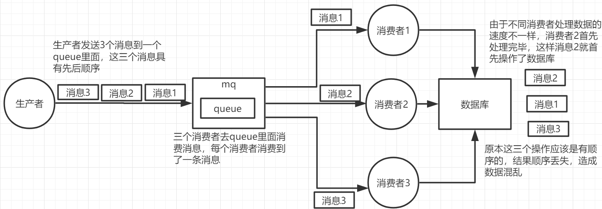
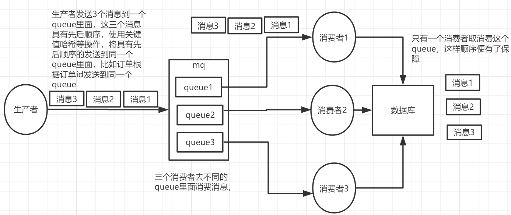

# RabbitMQ深入

## RabbitMQ高性能的原因

> 主要谈erlang的优点

- Erlang有着和原生socket一样的延迟（一门为交换机软件开发诞生的编程语言）
- 通用的面向并发的编程语言，适用于分布式系统
- 基于虚拟机解释运行，跨平台部署
- 进程间上下文切换效率远高于C语言

## MQ使用场景

## RabbitMQ 发送失败怎么办？

## RabbitMQ 发送重复怎么处理？

## RabbitMQ和其他消息队列的区别

> 为什么RabbitMQ吞吐量小而kafka吞吐量大
>
> 4.为什么RabbitMQ是实时的，怎么实现的

## redis 列队消费和mq区别

## RabbitMQ 消息堆积如何处理

## 保证消息顺序性

> RabbitMQ消息不被顺序消费的情况

- 一个queue，有多个consumer去消费，这样就会造成顺序的错误，consumer从MQ里面读取数据是有序的，但是每个consumer的执行时间是不固定的，无法保证先读到消息的consumer一定先完成操作，这样就会出现消息并没有按照顺序执行，造成数据顺序错误。

  

- 一个queue对应一个consumer，但是consumer里面进行了多线程消费，这样也会造成消息消费顺序错误

  

**措施**

1. 拆分多个 queue，每个 queue 一个 consumer，多一些 queue，样也会造成吞吐量下降，可以在消费者内部采用多线程的方式去消费

   

2. 一个 queue 但是对应一个 consumer，然后这个 consumer 内部用内存队列做排队，然后分发给底层不同的 worker 来处理

## 同步时high water RabbitMQ 如何实现容灾

## RabbitMQ 发生脑裂怎么处理？

## 保证消息不被重复消费（避免重复消费，消息幂等性保证）

> 　 rabbitmq重复消费怎么解决，除了数据库里查记录还有其他什么方法

## 保证消息的可靠性（准确性）

> - 事物下，假设最后一个commit操作丢失了，此时怎么办

## 保证消息一致性（幂等）

基于本地消息的最终一致性方案的最核心做法就是在执行业务操作的时候，记录一条消息数据到DB，并且消息数据的记录与业务数据的记录必须在同一个事务内完成，这是该方案的前提核心保障。
在记录完成后消息数据后，后面我们就可以通过一个定时任务到DB中去轮训状态为待发送的消息，然后将消息投递给MQ。这个过程中可能存在消息投递失败的可能，此时就依靠重试机制来保证，直到成功收到MQ的ACK确认之后，再将消息状态更新或者消息清除；
而后面消息的消费失败的话，则依赖MQ本身的重试来完成，其最后做到两边系统数据的最终一致性。

开启事务，开启confirm(推荐)，开启RabbitMQ持久化(交换机、队列、消息)，关闭RabbitMQ自动ack(改成手动)

## 保证消息不丢失（防止消息丢失）

## 保证消息的可靠性投递（保证消息送达）

## 解决RabbitMQ消息丢失

> RabbitMQ在生产者确认消息到达后，如果还没把消息写入磁盘就挂了，怎么解决这种情况的消息丢失？

## RabbitMQ如何实现削峰

## 消息队列包含的设计模式

## MQ处理阻塞问题

## RabbitMQ保证生产者、消费者消息可达

## RabbitMQ持久化

## RabbitMQ高可用

### 镜像集群

### Confirm机制

### 事务机制

## RabbitMQ 如何保证消息已到达

## 镜像队列

