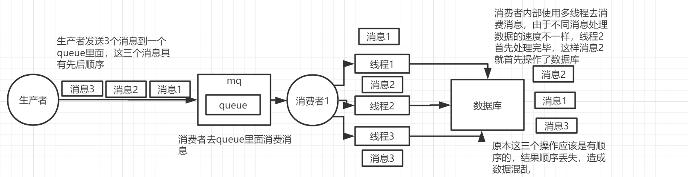

# RabbitMQ问与答

[TOC]


## RabbitMQ高性能的原因

> 主要谈erlang的优点

- Erlang有着和原生socket一样的延迟（一门为交换机软件开发诞生的编程语言）
- 通用的面向并发的编程语言，适用于分布式系统
- 基于虚拟机解释运行，跨平台部署
- 进程间上下文切换效率远高于C语言


## MQ使用场景

- 异步处理
- 应用解耦
- 流量削锋
- 日志处理 
- 消息通讯


## RabbitMQ 发送失败怎么办？

rabbitmq为确保消息发送和接收成功，采用ack机制。
 （1）生产者producter发送消息到mq时，mq会发送ack给producter告知消息是否投递成功；
 （2）消费者consumer接收处理消息后，consumer会发送ack给mq告知消息是否处理成功；
 通过ack机制，确保消息能够被producter成功发送和consumer成功接收处理，保证消息不丢失。


**消息发送**

rabbitmq消息发送分为两个阶段：
 （1）producter将消息发送到broker，即发送到exchage交换机；
 （2）消息通过交换机exchange被路由到队列queue;
 消息只有被正确投递到队列queue中，才算发送成功。

~~~java
public boolean send(String queueName, String json, String msgId){
    Message message = MessageBuilder.withBody(json.getBytes()).setCorrelationId(msgId).build();
    message.getMessageProperties().setDeliveryMode(MessageDeliveryMode.PERSISTENT);//设置消息持久化
    CorrelationDataExt correlationData = new CorrelationDataExt();
    correlationData.setId(msgId);
    correlationData.setData(json);
    rabbitTemplate.setEncoding("UTF-8");
    rabbitTemplate.setMandatory(true);//设置手工ack确认
    rabbitTemplate.setConfirmCallback(this);//ack回调，设置消息发送到exchange结果回调；
    rabbitTemplate.setReturnCallback(this);//回退回调，设置消息投递到queue失败回退时回调；
    rabbitTemplate.convertAndSend(queueName, message, correlationData);
    return true;
}
~~~

**通过上述两个回调方法，我们能够对发送失败的消息进行重发处理，确保消息不丢失。**


**首先失败的原因**

- **producter连接mq失败，消息没有发送到mq**

  这种情况下，在发送消息时可以通过捕捉AmqpException异常，将消息保存db中后续进行重发处理。

  ~~~java
  try{
      rabbitTemplate.convertAndSend(queueName, message, correlationData);
  }catch (Exception e){
      logger.error("连接MQ失败", e);
      //todo 存储到db中进行重发
  }
  ~~~

  

- **producter连接mq成功，但是发送到exchange失败**

  通过实现ConfirmCallback接口，对发送结果进行处理。
  
  ~~~java
  // 通过实现ConfirmCallback接口，对发送结果进行处理。
  @Override
  public void confirm(CorrelationData correlationData, boolean ack, String cause) {
      String msgId = correlationData.getId();
      if(ack){
          // 发送成功
          logger.debug("ack,消息投递到exchange成功,msgId:{}",msgId);
      }else{
          // 发送失败，重试
          logger.error("ack,消息投递exchange失败，msgId:{},原因{}" ,msgId, cause);
      }
  }
  ~~~
  
  confirm方法有3个参数，correlationData是消息发送时携带的数据对象，ack消息是否成功发送到exchange，cause是发送失败时的原因。
   通过ack我们可以判断发送到exchange是否成功，如果ack=false，则我们进行失败处理。
   **但是这里存在一个问题，correlationData里面只有一个id属性，没有关于消息内容的属性，对于数据失败处理非常不方便。**
   为解决此问题，**我们可以自定义一个CorrelationData扩展对象，继承CorrelationData，并添加自己想要保存数据的属性，在消息发送时，携带相关数据在该对象上即可**。
  
  ~~~java
  /**
   * CorrelationData的自定义实现，用于拿到消息内容
   */
  public class CorrelationDataExt extends CorrelationData {
      // 数据
      private volatile Object data;
      // 队列
      private String queueName;
  
      public Object getData() {
          return data;
      }
  
      public void setData(Object data) {
          this.data = data;
      }
  
      public String getQueueName() {
          return queueName;
      }
      
      public void setQueueName(String queueName) {
          this.queueName = queueName;
      }
  }
  ~~~
  
  重写发送方法，使用CorrelationDataExt对象携带数据：
  
  ~~~java
  public boolean send(String queueName, String json, String msgId){
      Message message = MessageBuilder.withBody(json.getBytes()).setCorrelationId(msgId).build();
      message.getMessageProperties().setDeliveryMode(MessageDeliveryMode.PERSISTENT);// 设置消息持久化
  
      // 使用自定义的数据对象
      CorrelationDataExt correlationData = new CorrelationDataExt();
      correlationData.setId(msgId);
      correlationData.setData(json);
      correlationData.setQueueName(queueName);
  
      rabbitTemplate.setEncoding("UTF-8");
      rabbitTemplate.setMandatory(true);// 设置手工ack确认
      rabbitTemplate.setConfirmCallback(this);// 设置发送成功回调
      rabbitTemplate.setReturnCallback(this);// 设置消息回退回调
      try{
          rabbitTemplate.convertAndSend(queueName, message, correlationData);// 使用amqp default exchange direct
      }catch (Exception e){
          logger.error("MQ连接失败，请联系管理员处理!!!!");
          // 保存到db重发
          saveToDB(msgId, json, queueName, "90");
      }
      return true;
  }
  ~~~
  
  重写confirm方法，对CorrelationData进行处理：
  
  ~~~java
  @Override
  public void confirm(CorrelationData correlationData, boolean ack, String cause) {
      String msgId = correlationData.getId();
      if(ack){
          // 发送成功
          logger.debug("ack,消息投递到exchange成功,msgId:{}",msgId);
      }else{
          // 发送失败，重试
          logger.error("ack,消息投递exchange失败，msgId:{},原因{}" ,msgId, cause);
          if(correlationData instanceof CorrelationDataExt){
              CorrelationDataExt correlationDataExt = (CorrelationDataExt) correlationData;
              String message = (String) correlationDataExt.getData();
              String queueName = ((CorrelationDataExt) correlationData).getQueueName();
              saveToDB(msgId, message, queueName, "91");
          }else{
              logger.info("correlationData对象不包含数据");
          }
      }
  }
  ~~~
  
  


- **消息发送到exchange成功，但是路由到queue失败**

  通过实现ReturnCallback接口，对回退消息进行重发处理。

  ~~~java
  @Override
  public void returnedMessage(Message message, int replyCode, String replyText, String exchange, String routingKey) {
      logger.error("消息发送失败-消息回退，应答码：{}，原因：{}，交换机：{}，路由键：{}", replyCode, replyText, exchange, routingKey);
      String msgId = message.getMessageProperties().getCorrelationId();
      String data = new String(message.getBody());
      saveToDB(msgId, data, routingKey, "92");
  }
  ~~~

  


## RabbitMQ和其他消息队列的区别


> 为什么RabbitMQ吞吐量小而kafka吞吐量大

- rabbitMQ在吞吐量方面稍逊于kafka，他们的出发点不一样，rabbitMQ支持对消息的可靠的传递，支持事务，不支持批量的操作；基于存储的可靠性的要求存储可以采用内存或者硬盘。

- kafka具有高的吞吐量，内部采用消息的批量处理，zero-copy机制，数据的存储和获取是本地磁盘顺序批量操作，具有O(1)的复杂度，消息处理的效率很高。


## redis 列队消费和mq区别


 redis：    轻量级，低延迟，高并发，低可靠性；
 rabbitmq：重量级，高可靠，异步，不保证实时；


-  **可靠性**   

  redis ：没有相应的机制保证消息的可靠消费，如果发布者发布一条消息，而没有对应的订阅者的话，这条消息将丢失，不会存在内存中；
  rabbitmq：具有消息消费确认机制，如果发布一条消息，还没有消费者消费该队列，那么这条消息将一直存放在队列中，直到有消费者消费了该条消息，以此可以保证消息的可靠消费；

  

- **实时性**

  redis:实时性高，redis作为高效的缓存服务器，所有数据都存在在服务器中，所以它具有更高的实时性


- **消费者负载均衡**

  rabbitmq队列可以被多个消费者同时监控消费，但是每一条消息**只能被消费一次**，由于rabbitmq的消费确认机制，因此它能够根据消费者的消费能力而调整它的负载；
  redis发布订阅模式，一个队列可以**被多个消费者同时订阅**，当有消息到达时，会将该消息依次发送给每个订阅者；


-  **持久性**

  redis：redis的持久化是针对于整个redis缓存的内容，它有RDB和AOF两种持久化方式（redis持久化方式，后续更新），可以将整个redis实例持久化到磁盘，以此来做数据备份，防止异常情况下导致数据丢失。
  rabbitmq：队列，消息都可以选择性持久化，持久化粒度更小，更灵活；


- **队列监控**

  rabbitmq实现了后台监控平台，可以在该平台上看到所有创建的队列的详细情况，良好的后台管理平台可以方面我们更好的使用；
  redis没有所谓的监控平台。


## RabbitMQ 消息堆积如何处理

**可能导致的原因**

1. 消费者消费消息的速度赶不上生产速度，这总问题主要是业务逻辑没设计好消费者和生产者之间的平衡，需要改业务流程或逻辑已保证消费度跟上生产消息的速，譬如增加消费者的数量等。
2. 消费者出现异常，导致一直无法接收新的消息，这种问题需要排查消费的逻辑是不是又问题，需要优化程序。


**解决方案**

 1.**增加消费者的处理能力**(例如优化代码)，或减少发布频率
2.考虑使用队列最大长度限制.
3.给消息设置年龄，**超时就丢弃**
4.默认情况下，rabbitmq消费者为单线程串行消费，设置并发消费两个关键属性concurrentConsumers和prefetchCountoncurrentConsumers设置的是对每个listener在初始化的时候设置的并发消费者的个数，prefetchCount是每次一次性从broker里面取的待消费的消息的个数.

5.建立新的queue，消费者**同时订阅新旧queue**，采用订阅模式。
6.生产者端缓存数据，在mq被消费完后再发送到mq，打破发送循环条件，设置合适的qos值，当qos值被用光，而新的ack没有被mq接收时，就可以跳出发送循环，去接收新的消息；消费者主动block接收进程，消费者感受到接收消息过快时主动block，利用block和unblock方法调节接收速率，当接收线程被block时，跳出发送循环。


## 保证消息顺序性

消息队列中的若干消息如果是对同一个数据进行操作，这些操作具有前后的关系，必须要按前后的顺序执行，否则就会造成数据异常。

> RabbitMQ消息不被顺序消费的情况

- 一个queue，有多个consumer去消费，这样就会造成顺序的错误，consumer从MQ里面读取数据是有序的，但是每个consumer的执行时间是不固定的，无法保证先读到消息的consumer一定先完成操作，这样就会出现消息并没有按照顺序执行，造成数据顺序错误。

  

- 一个queue对应一个consumer，但是consumer里面进行了多线程消费，这样也会造成消息消费顺序错误

  

**措施**

1. 拆分多个 queue，每个 queue 一个 consumer，多一些 queue，这样也会造成吞吐量下降，可以在消费者内部采用多线程的方式去消费

   

2. 一个 queue 但是对应一个 consumer，然后这个 consumer 内部用内存队列做排队，然后分发给底层不同的 worker 来处理


**队列保证消息顺序性**

可以采用标志位，类似于offset偏移位；

统一消费端，A消费完后，通过ack或者consummer-success通知B进行消费，但会降低吞吐量，需要通过更多的因此


## 消息重试机制

@EnableRetry注解：表示启用重试机制(value表示哪些异常需要触发重试，maxAttempts设置最大重试次数，delay表示重试的延迟时间，multiplier表示上一次延时时间是这一次的倍数)
eg、@Retryable(value = Exception.class, maxAttempts = 3, backoff = @Backoff(delay = 2000, multiplier = 1.5))

@Recover注解：当重试次数达到设置的最大次数的时候，程序还是执行异常，调用的回调函数。


## RabbitMQ 发生脑裂怎么处理？

RabbitMQ 集群的网络分区容错性并不高，在网络质量较差的环境中会比较容易出现问题，其中最明显的就是脑裂问题

所谓的脑裂问题，就是在多机热备的高可用 HA 系统中，当两个节点心跳突然断开，就分裂为了两个独立的个体，由于互相失去联系，都认为对方出现了故障，因此都会去争抢对方的资源，争抢启动，由此就会发生严重的后果

举个形象的例子，A 和 B 作为一个双机热备集群的两个节点，各自持有集群的一部分数据 -- a 和 b，这时，两机器之间突然无法通信，A 认为 B 已经挂掉，B 认为 A 已经宕机，于是会出现：

1. 如果 A 拥有 b 数据的备份，则 A 将以完整数据运行，B 也同样以完整数据运行，这将很可能导致两个节点同时读写共享数据造成数据损坏
2. 如果 A、B 各自仅拥有 a、b 数据，那么两个节点要么均无法启动，要么以瓜分完整共享数据的方式启动

总之，无论是哪一种，都不是我们希望见到的

因此，在 RabbitMQ 官方文档中，明确建议了，不要在广域网环境下使用，否则，应该使用 federation 或者 shovel 插件

**解决**

~~~shell
[
 
{rabbit,
 
[{tcp_listeners,[5672]},
 
{cluster_partition_handling, ignore}]
 
}
 
]
~~~

RabbitMQ 提供了三种配置：

1. ignore：默认配置，发生网络分区时不作处理，当认为网络是可靠时选用该配置
2. autoheal：各分区协商后重启客户端连接最少的分区节点，恢复集群（CAP 中保证 AP，有状态丢失）
3. pause_minority：分区发生后判断自己所在分区内节点是否超过集群总节点数一半，如果没有超过则暂停这些节点（保证 CP，总节点数为奇数个）

使用 pause_minority 可以有效解决脑裂问题，但是会让集群在出现问题后无法使用


## 保证消息不被重复消费（避免重复消费，消息幂等性保证）

生产者方面：可以对每条消息生成一个msgID，以控制消息重复投递

```java
 AMQP.BasicProperties properties = new AMQP.BasicProperties.Builder()
	porperties.messageId(String.valueOF(UUID.randomUUID()))
```


消费者方面：消息体中必须携带一个业务ID，如银行流水号，消费者可以根据业务ID去重，避免重复消费


> rabbitmq重复消费怎么解决

- 数据库里记录
- 分布式自增id，redis里可以存放一个消息序号的断点，把该断点之前的消息丢弃


## 保证消息的可靠性（准确性）

发送方确认模式：
将信道设置成confirm模式（发送方确认模式），则所有在信道上发布的消息都会被指派一个唯一的ID。
一旦消息被投递到目的队列后，或者消息被写入磁盘后（可持久化的消息），信道会发送一个确认给生产者（包含消息唯一ID）。
如果RabbitMQ发生内部错误从而导致消息丢失，会发送一条nack（not acknowledged，未确认）消息。
发送方确认模式是异步的，生产者应用程序在等待确认的同时，可以继续发送消息。当确认消息到达生产者应用程序，生产者应用程序的回调方法就会被触发来处理确认消息。

接收方确认机制
接收方消息确认机制：消费者接收每一条消息后都必须进行确认（消息接收和消息确认是两个不同操作）。只有消费者确认了消息，RabbitMQ才能安全地把消息从队列中删除。
这里并没有用到超时机制，RabbitMQ仅通过Consumer的连接中断来确认是否需要重新发送消息。也就是说，只要连接不中断，RabbitMQ给了Consumer足够长的时间来处理消息。保证数据的最终一致性；
下面罗列几种特殊情况：
如果消费者接收到消息，在确认之前断开了连接或取消订阅，RabbitMQ会认为消息没有被分发，然后重新分发给下一个订阅的消费者。（可能存在消息重复消费的隐患，需要去重）
如果消费者接收到消息却没有确认消息，连接也未断开，则RabbitMQ认为该消费者繁忙，将不会给该消费者分发更多的消息。


## 保证消息一致性

基于本地消息的最终一致性方案的最核心做法就是在执行业务操作的时候，记录一条消息数据到DB，并且**消息数据的记录与业务数据的记录必须在同一个事务内完成**，这是该方案的前提核心保障。

在记录完成后消息数据后，后面我们就可以通过一个**定时任务到DB中去轮训状态为待发送的消息，然后将消息投递给MQ**。这个过程中可能存在消息投递失败的可能，此时就依靠重试机制来保证，直到成功收到MQ的ACK确认之后，再将消息状态更新或者消息清除；

而后面消息的消费失败的话，则依赖MQ本身的重试来完成，其最后做到两边系统数据的最终一致性。

开启事务，开启confirm(推荐)，开启RabbitMQ持久化(交换机、队列、消息)，关闭RabbitMQ自动ack(改成手动)


## 消息幂等性

> 分布式场景下，多个节点去消费一个mq，并发下同一个消息发在a机器，a由于某些原因卡顿，mq投递到b机器，两台机器都在处理该消息，如何规避重复投递

- **使用唯一标识**：如订单号+业务场景这样的唯一标识。执行操作前先根据这个全局唯一ID是否存在，判断是否执行。如果不存在则把全局ID，存储到存储系统中，比如数据库、redis等。如果**存在则表示该方法已经执行**。存储的时候**加入过期时间**，防止机器宕机后，全局ID锁死导致操作无法继续
- **去重表**：适用于在业务中有唯一标识的插入场景中。如支付场景中，如果一个订单只会支付一次，所以订单ID可以作为唯一标识。这时，我们就可以建一张去重表（流水表），并且把**唯一标识作为唯一索引**（或者主键），在我们实现时，把创建支付单据和写入去去重表，放在一个事务中，**如果重复创建，数据库会抛出唯一约束异常，操作就会回滚。**
- **多版本控制**：适合在更新的场景中，比如我们要更新商品的名字，这时我们就可以在更新的接口中增加一个版本号，来做幂等。
- 借助zookeeper同一路径下节点名称不能重复的特性，**创建节点**，重复消费消息，**创建失败**


## 保证消息不丢失（防止消息丢失，保证可靠性）

> 发送方采取发送者确认模式
>
> MQ进行队列及消息的持久化
>
> 消费者消费成功后手动确认消息
>
>  
>
> 开启confirm
> 开启RabbitMQ持久化(交换机、队列、消息)
> 关闭RabbitMQ自动ack(改成手动)


1.**消息在生产者丢失**

**原因**：生产者发送消息成功，但MQ没收到该消息，消息在从生产者传输到MQ的过程中丢失，一般由**网络不稳定**造成。

**解决方案**：

- **将channel开启confirm机制**，发送方**采用消息确认机制**，当消息成功被MQ接收到后，**会给生产者发送一个确认消息，表示接收成功**，如果没能处理，则回调nack接口，重试。RabbitMQ发送方确认模式有三种，普通确认、批量确认、异步确认。Spring整合RabbitMQ后只使用了**异步监听确认模式**
- 由于rabbitmq提供**事务支持**，在生产者发送之前开启事务，然后发送消息，如果没有被rabbitmq收到，则生产者异常报错，**回滚事务**，尝试重新发送根据具体的业务逻辑；但是这样会阻塞生产者，吞吐量下降


2.**消息在MQ中丢失**

**原因**：消息发送到MQ后，消息还没被消费却在MQ中丢失了。比如MQ服务器**宕机或者未进行持久化进行了重启**。

**解决方案**：**持久化交换机、队列、消息**。确保MQ服务器重启时仍然能从磁盘恢复对应的交换机，队列和消息。然后我们把MQ做多台分布式集群，防止出现所有的MQ服务器挂掉，Exchange 设置持久化：durable:true；Queue 设置持久化；Message持久化发送。

注意持久化queue的是queue里的元数据，不会持久化queue里面的数据，

发送消息的时候将消息的deliveryMode设置为2，表示将消息持久化。


3.**消息在消费者丢失**

**原因**：默认消费者消费消息时，设置的是自动恢复MQ收到了消息。MQ会立刻删除自身保存的这条消息，如果消息已经在MQ中被删除，但消费者的**业务处理出现异常或消费者服务宕机，那么就会导致该消息没有处理成功从而导致消息丢失**。

**解决方案**：消费者向MQ的回复设置成手动回复，**也即关闭自动ack**。当消费者出现异常或者服务宕机时，MQ服务器不会删除该消息，而是会把消息**重发**给绑定该队列的消费者，如果该队列只绑定了一个消费者，则该消息会一直保持在MQ服务器，直到消费者能正常消费为止。具体做法是**设置手动ACK** `setAcknowledgeMode(AcknowledgeMode.MANUAL)`

---


~~~java
channel.basicNack(deliveryTag, false, true); 
// deliveryTag:该消息的index
// multiple：是否批量.true:将一次性拒绝所有小于deliveryTag的消息。
// requeue：被拒绝的是否重新入队列

channel.basicAck(deliveryTag, false);
// deliveryTag:该消息的index
// multiple：是否批量.true:将一次性ack所有小于deliveryTag的消息。
~~~


## 保证消息的可靠性投递（保证消息送达）

- 数据库持久化方案 
- 消息延迟投递方案


**数据库持久化方案 **


> 1.将业务订单数据和生成的Message进行持久化操作（一般情况下插入数据库，这里如果分库的话可能涉及到分布式事务）
> 2.将Message发送到Broker服务器中
> 3.通过RabbitMQ的Confirm机制，在producer端，监听服务器是否ACK。
> 4.如果ACK了，就将Message这条数据状态更新为已发送。如果失败，修改为失败状态。
> 5.分布式定时任务查询数据库3分钟（这个具体时间应该根据的时效性来定）之前的发送失败的消息
> 6.重新发送消息，记录发送次数
> 7.如果发送次数过多仍然失败，那么就需要人工排查之类的操作。
>
> 分布式事务一点会降低时效性，但能够保证消息百分百不丢失


**消息延迟投递方案**


> 流程图中，颜色不同的代表不同的message
> 1.将业务订单持久化
> 2.发送一条Message到broker(称之为主Message)，再发送相同的一条到**不同的队列或者交换机**(这条称为确认Message)中。
> 3.主Message由实际业务处理端消费后，生成一条响应Message。之前的确认Message由Message Service应用处理入库。
> 4~6.实际业务处理端发送的确认Message由Message Service接收后，将原Message状态修改。
> 7.如果该条Message没有被确认，则通过rpc调用重新由producer进行全过程。
>
> 系统复杂性有点高，万一两条消息都失败了，消息存在丢失情况，仍需Confirm机制做补偿


## 解决RabbitMQ消息丢失

消息丢失处理同上面三点处理

> RabbitMQ在生产者确认消息到达后，如果还没把消息写入磁盘就挂了，怎么解决这种情况的消息丢失？

生产者收不到Ack信号，生产者自动重发

也可以引入mirrored-queue即镜像队列，但也不能保证消息百分百不丢失（整个集群都挂掉）


## RabbitMQ如何实现削峰

~~~java
//指定消息队列的长度
map.put("x-max-length", 100);		

//当队列满时，多余的消息直接拒绝接收，多余的消息被丢弃
map.put("x-overflow", "reject-publish");	
~~~


## 消息队列包含的设计模式

观察者模式：定义对象间一对多的依赖关系，当一个对象的状态发生改变时，所有依赖于它的对象都得到通知自动更新。

发布订阅


## MQ处理阻塞问题

**手动Ack如果处理方式不对会发生一些问题。**
1.没有及时ack，或者程序出现bug，所有的消息将被存在unacked中，消耗内存
如果忘记了ack，那么后果很严重。当Consumer退出时，Message会重新分发。然后RabbitMQ会占用越来越多的内存，由于 RabbitMQ会长时间运行，因此这个“内存泄漏”是致命的。
2.如果使用BasicNack，将消费失败的消息重新塞进队列的头部，则会造成死循环。
（解决basicNack造成的消息循环循环消费的办法是为队列设置“回退队列”，设置回退队列和阀值，如设置队列为q1，阀值为2，则在rollback两次后将消息转入q1）

手动ack需要注意的是：
1.在消费者端一定要进行ack，或者是nack，可以放在try方法块的finally中执行
2.可以对消费者的异常状态进行捕捉，根据异常类型选择ack，或者nack抛弃消息，nack再次尝试
3.对于nack的再次尝试，是进入到队列头的，如果一直是失败的状态，将会造成阻塞。所以最好是专门投递到“死信队列”，

当`ack`模式为`manual`，并且线上出现了`unacked`消息，这个时候不用慌。由于QOS是限制信道`channel`上的消费者所能保持的最大未确认的数量。所以允许出现`unacked`的数量可以通过`channelCount * prefetchCount * 节点数量` 得出。

- `unacked_msg_count` < `min` 队列不会阻塞。但需要及时处理`unacked`的消息。
- `unacked_msg_count` >= `min` 可能会出现堵塞。
- `unacked_msg_count` >= `max` 队列一定阻塞。


## RabbitMQ保证生产者、消费者消息可达

**RabbitMQ**使用发送方确认模式，确保消息正确地发送到**RabbitMQ**。
发送方确认模式：将信道设置成`confirm`模式（发送方确认模式），则所有在信道上发布的消息都会被指派一个唯一的ID。一旦消息被投递到目的队列后，或者消息被写入磁盘后（可持久化的消息），信道会发送一个确认给生产者（包含消息唯一ID）。如果`RabbitMQ`发生内部错误从而导致消息丢失，会发送一条`nack`（not acknowledged，未确认）消息。发送方确认模式是异步的，生产者应用程序在等待确认的同时，可以继续发送消息。当确认消息到达生产者应用程序，生产者应用程序的回调方法就会被触发来处理确认消息。


接收方消息确认机制：消费者接收每一条消息后都必须进行确认（消息接收和消息确认是两个不同操作）。只有消费者确认了消息，`RabbitMQ`才能安全地把消息从队列中删除。这里并没有用到超时机制，`RabbitMQ`仅通过`Consumer`的连接中断来确认是否需要重新发送消息。也就是说，只要连接不中断，`RabbitMQ`给了`Consumer`足够长的时间来处理消息。

下面罗列几种特殊情况：

- 如果消费者接收到消息，在确认之前断开了连接或取消订阅，RabbitMQ会认为消息没有被分发，然后重新分发给下一个订阅的消费者。（可能存在消息重复消费的隐患，需要根据bizId去重）
- 如果消费者接收到消息却没有确认消息，连接也未断开，则RabbitMQ认为该消费者繁忙，将不会给该消费者分发更多的消息。


## RabbitMQ高可用

### 普通集群

普通集群 就是在多个联通的服务器上安装不同的RabbitMQ的服务，这些服务器上的RabbitMQ服务组成一个个节点，通过RabbitMQ内部提供的命令或者配置来构建集群，形成了RabbitMQ的普通集群模式


- 当用户向服务注册一个队列，该队列会随机保存到某一个服务节点上，然后将对应的元数据同步到各个不同的服务节点上
- RabbitMQ的普通集群模式中，每个RabbitMQ都保存有相同的元数据
- 用户只需要链接到任一一个服务节点中，就可以监听消费到对应队列上的消息数据
- 但是RabbitMQ的实际数据却不是保存在每个RabbitMQ的服务节点中，这就意味着用户可能联系的是RabbitMQ服务节点C，但是C上并没有对应的实际数据，也就是说RabbitMQ服务节点C，并不能提供消息供用户来消费，那么RabbitMQ的普通集群模式如何解决这个问题呢？
- RabbitMQ服务节点C发现自己本服务节点并没有对应的实际数据后，因为每个服务节点上都会保存相同的元数据，所以服务节点C会根据元数据，向服务节点B（该服务节点上有实际数据可供消费）请求实际数据，然后提供给用户进行消费
- 这样给用户的感觉就是，在RabbitMQ的普通集群模式中，用户连接任一服务节点都可以消费到消息
  -普通集群模式的优点：提高消费的吞吐量


普通集群模式的原理比较简单，但是并不能真正意义上的实现高可用，他也存在以下的以下缺点：

1. 为了请求RabbitMQ的实际数据以提供给用户，可能会在RabbitMQ内部服务节点之间进行频繁的进行数据交互，这样的交互比较耗费资源
2. 当其中一个RabbitMQ的服务节点宕机了，那么该节点上的实际数据就会丢失，用户再次请求时，就会请求不到数据，系统的功能就会出现异常


### 镜像集群


虽然镜像集群模式能够解决普通集群模式的缺点，当任一节点宕机了，不能正常提供服务了，也不影响该消息的正常消费，但是其本身也有相应的缺点：

1. 性能开销非常大，因为要同步消息到对应的节点，这个会造成网络之间的数据量的频繁交互，对于网络带宽的消耗和压力都是比较重的
2. 没有扩展可言，rabbitMQ是集群，不是分布式的，所以当某个Queue负载过重，我们并不能通过新增节点来缓解压力，因为所以节点上的数据都是相同的，这样就没办法进行扩展了

对于镜像集群而言，当某个queue负载过重，可能会导致集群雪崩，那么如何来减少集群雪崩呢？我们可以通过HA的同步策略来实现

HA的同步策略如下：

| HA-mode | HA-params |                             说明                             |
| :-----: | :-------: | :----------------------------------------------------------: |
|   all   |    空     | 镜像队列将会在整个集群中复制。当一个新的节点加入后，也会在这个节点上复制一份。 |
| exactly |   count   | 镜像队列将会在集群上复制count份。如果集群数量少于count时候，队列会复制到所有节点上。 如果大于Count集群，有一个节点crash后，新进入节点也不会做新的镜像。（可以阻止集群雪崩） |
|  nodes  | node name | 镜像队列会在node name中复制。如果这个名称不是集群中的一个，这不会触发错误。 如果在这个node list中没有一个节点在线，那么这个queue会被声明在client连接的节点。 |


## Confirm机制

消息的确认，是指生产者投递消息后，如果Broker收到消息，则会给我们生产者一个应答，生产者进行接收应答，用来**确定这条消息是否正常的发送到Broker**，这种方式也是消息的可靠性投递的核心保障


  1.在channel上开启确认模式：channel.confirmSelect()

​    2.在channel上添加监听：addConfirmListener，监听成功和失败的返回结果，根据具体的结果对消息进行重新发送，或记录日志等后续处理。

~~~java
public class Producer {
    public static void main(String[] args) throws IOException, TimeoutException {
        ConnectionFactory connectionFactory = new ConnectionFactory();
        connectionFactory.setHost("localhost");
        connectionFactory.setPort(5672);
        connectionFactory.setVirtualHost("/");
        Connection connection = connectionFactory.newConnection();
        Channel channel = connection.createChannel();
        //指定消息投递模式，消息的确认模式
        channel.confirmSelect();
        String exchangeName = "confirm_exchange";
        String routingKey = "confirm.save";
        //发送消息
        String msg = "Hello World";
        channel.basicPublish(exchangeName,routingKey,null,msg.getBytes());
        //添加一个确认监听
        channel.addConfirmListener(new ConfirmListener() {
            @Override
            //返回成功ACK
            public void handleAck(long deliveryTag, boolean multiple) throws IOException {
                System.err.println("----no ack!");
            }

            @Override
            //返回失败ACK
            public void handleNack(long deliveryTag, boolean multiple) throws IOException {
                System.err.println("----ack!");
            }
        });
    }
}
~~~


## 事务机制


## 镜像队列

